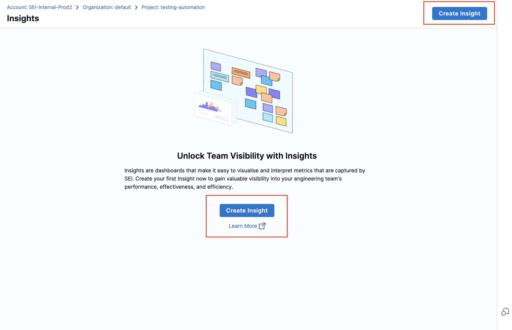

Insights are dashboards that make it easy to visualize and interpret metrics that are captured by SEI. With a variety of out-of-the-box widgets, you can create Insights that show the data you care about most and help you understand your engineering team's effectiveness and efficiency.

This topic explains how to create and view Insights. For information about configuring specific widgets and the metrics that are presented on widgets, go to [Metrics and widgets](/docs/category/metrics-and-reports).

## View Insights

The primary way to access Insights is through the **Insights** page.

1. Log in to the Harness Platform and go to the SEI module.
2. Go the **Project** scope and select your project.
3. Click on the **Insights** page on the navigation menu.

You will be directed to the first Collection and its associated Insight. For logged-in users, SEI maintains your latest state and automatically redirects you to the most recently viewed Collection and Insight.

* The Insights available for each Collection are determined by the [Insight associations](#manage-insights-associations).
* A Default label indicates the default Insight for a Collection.

### Navigation options

* To switch projects or Collections, use the Project and Collection dropdown menus in the navigation menu.

* Use the collection navigation in the Insights header to navigate through the [Collection hierarchy](/docs/software-engineering-insights/sei-projects-and-collections/manage-collections).

* If [Integration Monitoring](/docs/software-engineering-insights/sei-integrations/sei-integrations-overview#integration-monitoring) is enabled, the integration status will be displayed in the Insights header.

### Explore data

Once you're viewing an Insight, you can explore the widgets and interact with the data.

:::info Where does the data come from?

Widgets get data from [integrations](/docs/category/sei-integrations), which are inherited from the [Collections associated with Insights](#manage-insights-associations). In turn, Collections inherit integrations from their associated Harness project, because integrations are configured at the project level. For more information about this hierarchy and configuring Collections, go to [Collections](/docs/category/projects-and-collections).

You can also configure individual metrics and widgets to specify what data is used in calculations, how data is presented, and other criteria. For more information, go to [Metrics and widgets](/docs/category/metrics-and-reports).

:::

#### Set the Insight time

_Insight time_ is the time range selected by the user viewing an Insight. Widgets must be configured to **Use Insight Time** in order for their data to update when you change the Insight time range.

If a widget or report uses a specific time range, changing the Insight time has no impact on the data shown by that widget or report.

#### Drill down into data

Some widgets allow you to drill down into data. For example, you can select a segment of a bar on a bar chart to examine the data for that segment.

### Insight management

The Insight Management tab provides an overview of all available Insights, including details such as who created them. From here, you can edit Insight settings, delete Insights, or clone them for reuse.

#### Steps to manage insights

1. Log in to the **Harness platform** and select the SEI module.
2. Choose your project from the available list.
3. Select the **Insight Management** tab on the navigation menu.
4. View, edit, delete, or clone existing Insights directly from this tab.

## Create Insights

Follow these steps to create a new Insight.

* Log in to the **Harness platform** and select the SEI module.
* Choose your project from the available list.
* If no Insights exist, click Create Insight on the landing page.

* If Insights already exist, navigate to Insight Management in the left navigation menu and click Create Insight at the top-right corner.

* Enter a **Name** for the Insight.
* Modify the following parameters under the **Parameters** section:

   * **Insight Time Range:** Allows users to select a custom date range when viewing the Insight.
   * **Integration Monitoring:** Enable to display integration health status on the dashboard.

* Select at least one Collection category to associate with the Insight.
  * All [Collections](/docs/software-engineering-insights/sei-projects-and-collections/manage-collections) and child Collections within the selected category will be automatically linked.
  * To review Collections within a category, click **View Collections** in the Collections categories dropdown menu.
* Click **Create** to save the Insight.
* After saving, add widgets or modify settings such as [Insight associations](#manage-insights-associations).

### Add widgets

Widgets (also known as *reports*) are the parts of your Insights that contain data. Widgets can present a single statistic or they can present charts, graphs, and tables that compare or combine multiple statistics.

To add widgets to Insights:

1. Go to the Insight where you want to add the widget.
2. Select **Settings**, and then select **Add Widget**.
3. Select the widget that you want to add.
4. Configure the widget settings. For information about configuring specific widget go to [Metrics and widget](/docs/category/metrics-and-reports).
5. Select **Next: Place Widget** and arrange the report on the Insight.
6. Select **Save Layout**.

:::info Where does the data in widgets come from?

Widgets get data from [integrations](/docs/category/sei-integrations), which are inherited from the [Collections associated with Insights](#manage-insights-associations). In turn, Collections inherit integrations from their associated Harness project, because integrations are mapped at the project level. For more information about this hierarchy and configuring Collections, go to [Collections](/docs/category/projects-and-collections).

You can also configure individual metrics and widgets to specify what data is used in calculations, how data is presented, and other criteria. For more information, go to [Metrics and reports](/docs/category/metrics-and-reports).

:::

### Manage Insights associations

You can manage the Collections associated with Insights from the **Edit Collection** page, edit the **Insights** settings. For more information about this option, go to **Managing Insights associations** in [Manage Collections](/docs/software-engineering-insights/sei-projects-and-collections/manage-collections#manage-insights-associations).

### Visibility and sharing

Authentication, access, and user management are part of the Harness Platform. Permissions granted to users and user groups depends on their associations with resources and resource groups, which are controlled at the account and project level in Harness.

Harness SEI has three built-in user roles:

* SEI Admin
* SEI Collection Admin
* SEI Viewer

For more information about authentication, access, and user management, go to the following:

* [RBAC in Harness SEI](/docs/software-engineering-insights/access-control/sei-roles-and-permissions)
* [Manage Access Control for SEI Insights](/docs/software-engineering-insights/access-control/manage-access-control-for-insights)
* [Harness Platform authentication (including 2FA and SSO)](/docs/category/authentication)
* [Harness RBAC overview](/docs/platform/role-based-access-control/rbac-in-harness)

## Popular Insights

The following five Insights are the most frequently used on SEI:

* DORA Metrics
* Dev Insights
* Business Alignment
* Trellis
* Planning Insights

### DORA Metrics

Use the DORA Metrics Insight to examine your organization's [DORA (DevOps Research Assessment) metrics](/docs/software-engineering-insights/sei-metrics-and-reports/dora-metrics).

If you want to create a DORA Metrics Insight refer to the below resoures.

* [Tutorial: Create a DORA Metrics Insight](/docs/software-engineering-insights/insights/insight-tutorials/dora-insight)
* [DORA widgets](/docs/software-engineering-insights/sei-metrics-and-reports/dora-metrics)

### Dev Insights

Dev Insights examines development efforts, particularly in relation to SCM metrics, such as PR creation, merging, and review collaboration.

For more information about SCM metrics and widgets, go to [velocity metrics](/docs/software-engineering-insights/sei-metrics-and-reports/velocity-metrics-reports/velocity-metrics-overview) and [SCM reports](/docs/software-engineering-insights/sei-metrics-and-reports/velocity-metrics-reports/scm-reports).

If you want to create a Developer i.e. SCM Metrics Insight refer to the below resources.

* [Tutorial: Create a Developer / SCM Metrics Insight](/docs/software-engineering-insights/insights/insight-tutorials/developer-insight)
* [SCM widgets](/docs/software-engineering-insights/sei-metrics-and-reports/velocity-metrics-reports/scm-reports) 

### Business Alignment

The Business Alignment Insight can help visualize where your teams expend the most effort and help your teams prioritize their time. Implementing this requires you to create a Business Alignment profile and then use the profile to generate the Business Alignment report.

For more information about these report, go to [Business Alignment](/docs/software-engineering-insights/sei-metrics-and-reports/planning/sei-business-alignment-reports).

<!-- image /.gitbook/assets/image (4).png - Create dashboard with Effort Investment Profile selected -->

### Trellis

Use the Trellis Insight to examine [Trellis Scores](/docs/category/trellis-scores).

If you want to create a Trellis Insight refer to the below resources.

* [Tutorial: Create a Trellis Metrics Insight](/docs/software-engineering-insights/insights/insight-tutorials/trellis-insight)
* [Trellis widgets](/docs/category/trellis-scores)

### Planning Insights

Use the Planning Insight to examine [sprint metrics](/docs/category/sprint-metrics).

If you want to create a Sprints Metrics Insight refer to the below resources.

* [Tutorial: Create a Sprint Metrics Insight](/docs/software-engineering-insights/insights/insight-tutorials/agile-insights)
* [Sprint metric widgets](/docs/category/sprint-metrics)