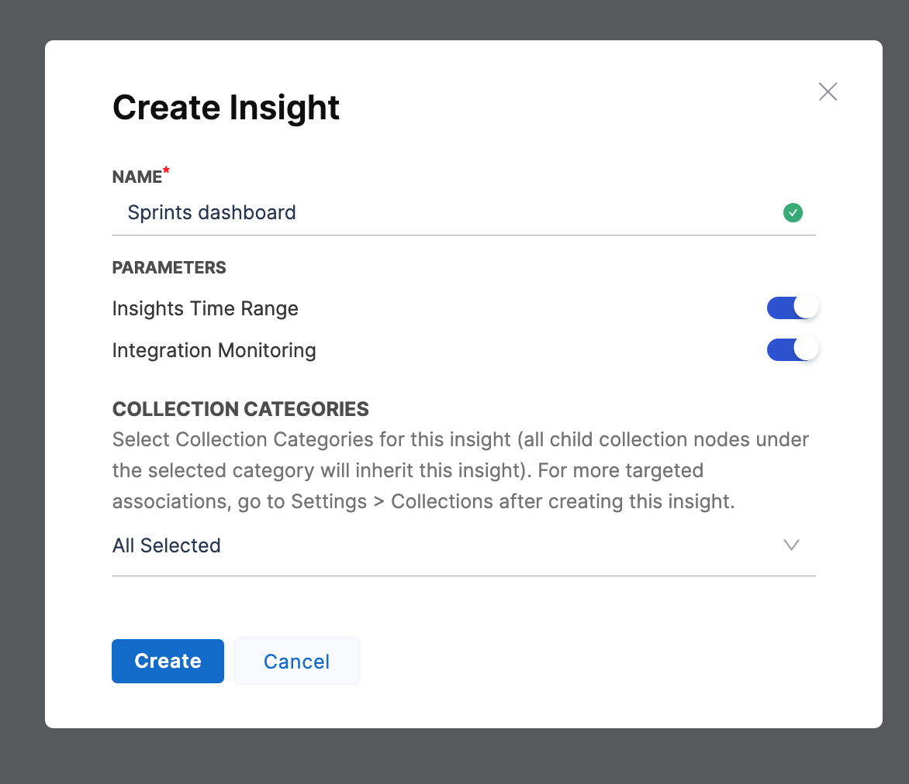

Insights are dashboards that make it easy to visualize and interpret metrics that are captured by SEI. With a variety of out-of-the-box widgets, you can create Insights that show the data you care about most and help you understand your engineering team's effectiveness and efficiency.

This topic explains how to create and view Insights. For information about configuring specific reports and the metrics that are presented on widgets, go to [Metrics and reports](/docs/category/metrics-and-reports).

## View Insights

The primary way to access Insights is through the **Insights** tab.

1. Log in to the Harness Platform and go to the SEI module.
2. Go the **Project** scope and select your project.
3. Select the **Insights** tab on the navigation menu.    You will be automatically directed to the first Collection and the associated Insight. Note that for the existing logged-in users, SEI maintains the latest state and automatically redirects you to the most recently viewed Collection and Insight.

   Select **Manage Insights** to view all the Insights. The Insights available for each Collection depend on the [Insight associations](#manage-insights-associations). The **Default** label indicates the Collection's default Insight.

   To switch projects or Collections, use the **Project** and **Collection** options on the navigation menu. You can also use the breadcrumbs in the Insights header to navigate up through the [Collection hierarchy](/docs/software-engineering-insights/sei-projects-and-collections/manage-collections).

   If integration monitoring is enabled, you can view the integration status in the Insights header.

### Explore data

Once you're viewing an Insight, you can explore the widgets and interact with the data.

:::info Where does the data come from?

Widgets get data from [integrations](/docs/category/sei-integrations), which are inherited from the [Collections associated with Insights](#manage-insights-associations). In turn, Collections inherit integrations from their associated Harness project, because integrations are configured at the project level. For more information about this hierarchy and configuring Collections, go to [Collections](/docs/category/projects-and-collections).

You can also configure individual metrics and widgets to specify what data is used in calculations, how data is presented, and other criteria. For more information, go to [Metrics and reports](/docs/category/metrics-and-reports).

:::

#### Set the Insight time

_Insight time_ is the time range selected by the user viewing an Insight. Widgets and reports must be configured to **Use Insight Time** in order for their data to update when you change the Insight time range.

If a widget or report uses a specific time range, changing the Insight time has no impact on the data shown by that widget or report.

#### Drill down into data

Some widgets allow you to drill down into data. For example, you can select a segment of a bar on a bar chart to examine the data for that segment.

### Access Insights from the Insights list

1. While viewing an Insight, select **All Insights** in the header, and then select **Manage Insights** to go to the **Insights** list.
2. Select the Insight you want to view from the **Insights** list.

3. You can change the Collection using the Collection navigation header at the top of the Insight.
4. Select a **Collection**. Upon selecting a Collection, the current Insight opens up under the selected Collection heirarchy.

## Create Insights

1. Log in to the **Harness Platform** and go to the SEI module.
2. Go the **Project** scope and select your **Project**.
3. If you don't have any existing Insight, then click on the **Create Insight** button on the landing page to create a new Insight.

4. If you already have existing Insights in your selected Project, then go to any Insight. For instructions, go to [View Insights](#view-insights).
5. In the header, select **All Insights**, and then select **Manage Insights**.
6. Select **Create Insight**.

7. Enter a **Name** for the Insight.
8. Under **Parameters**, you can modify the following settings:

   * **Insight Time Range:** You can enable Insight time, which is the time range selected by the user when viewing an Insight.
   * **Effort Investment Profile** and **Effort Investment Units** are used for [Business Alignment Insights](#business-alignment) and [DORA Metrics Insights](#dora-metrics).

9.  Select at least one Collection category to associate with this Insight.     All [Collections](/docs/software-engineering-insights/sei-projects-and-collections/manage-collections) and child Collections under the selected category are automatically associated with the Insight. You can refine the [Insight associations](#manage-insights-associations) after initial Insight creation.    If you want to examine Collections under a certain Collection category, select **View Collections** on the **Collections Categories** dropdown menu.

10. Select **Create** to save the Insight metadata. From here, you can [add reports](#add-reports) or modify the Insight settings, such as [Insights associations](#manage-insights-associations).

### Add reports

Reports (also known as *widgets*) are the parts of your Insights that contain data. Reports can present a single statistic or they can present charts, graphs, and tables that compare or combine multiple statistics.

To add reports to Insights:

1. Go to the Insight where you want to add the widget. Make sure you are in the correct project.
2. Select **Settings**, and then select **Add Widget**.
3. Select the widget that you want to add.
4. Configure the widget settings. For information about configuring specific widgets go to [Metrics and reports](/docs/category/metrics-and-reports).
5. Select **Next: Place Widget** and arrange the widget on the Insight.
6. Select **Save Layout**.

:::info Where does the data in reports come from?

Reports get data from [integrations](/docs/category/sei-integrations), which are inherited from the [Collections associated with Insights](#manage-insights-associations). In turn, Collections inherit integrations from their associated Harness project, because integrations are configured at the project level. For more information about this hierarchy and configuring Collections, go to [Collections](/docs/category/projects-and-collections).

You can also configure individual metrics and reports to specify what data is used in calculations, how data is presented, and other criteria. For more information, go to [Metrics and reports](/docs/category/metrics-and-reports).

:::

### Manage Insights associations

You can manage the Collections associated with Insights from the **Edit Collection** page, edit the **Insights** settings. For more information about this option, go to **Managing Insights associations** in [Manage Collections](/docs/software-engineering-insights/sei-projects-and-collections/manage-collections#manage-insights-associations).

### Change the color scheme

You can change the colors for values on bar charts and pie charts. The color scheme applies to all Insights.

1. In your Harness project, go to the SEI module.
2. Select **Account**.
3. Select **Customize**.
4. Select the desired color for the highest and lowest values on bar charts and pie charts.
5. Select **Add Label** to configure colors for other values.
6. Select **Save**.

### Visibility and sharing

Authentication, access, and user management are part of the Harness Platform. Permissions granted to users and user groups depends on their associations with resources and resource groups, which are controlled at the account and project level in Harness.

Harness SEI has three built-in user roles:

* SEI Admin
* SEI Collection Admin
* SEI Viewer

For more information about authentication, access, and user management, go to the following:

* [RBAC in Harness SEI](/docs/software-engineering-insights/access-control/sei-roles-and-permissions)
* [Manage Access Control for SEI Insights](/docs/software-engineering-insights/access-control/manage-access-control-for-insights)
* [Harness Platform authentication (including 2FA and SSO)](/docs/category/authentication)
* [Harness RBAC overview](/docs/platform/role-based-access-control/rbac-in-harness)

## Popular Insights

The following five Insights are the most frequently used on SEI:

* DORA Metrics
* Dev Insights
* Business Alignment
* Trellis
* Planning Insights

### DORA Metrics

Use the DORA Metrics Insight to examine your organization's [DORA (DevOps Research Assessment) metrics](/docs/software-engineering-insights/sei-metrics-and-reports/dora-metrics).

If you want to create a DORA Metrics Insight refer to the below resoures.

* [Tutorial: Create a DORA Metrics Insight](/docs/software-engineering-insights/insights/dora-insight)
* [DORA Metrics Reports](/docs/software-engineering-insights/sei-metrics-and-reports/dora-metrics)

### Dev Insights

Dev Insights examines development efforts, particularly in relation to SCM metrics, such as PR creation, merging, and review collaboration.

For more information about SCM metrics and reports, go to [velocity metrics](/docs/software-engineering-insights/sei-metrics-and-reports/velocity-metrics-reports/velocity-metrics-overview) and [SCM reports](/docs/software-engineering-insights/sei-metrics-and-reports/velocity-metrics-reports/scm-reports).

If you want to create a Developer i.e. SCM Metrics Insight refer to the below resources.

* [Tutorial: Create a Developer / SCM Metrics Insight](/docs/software-engineering-insights/insights/developer-insight)
* [SCM Reports](/docs/software-engineering-insights/sei-metrics-and-reports/velocity-metrics-reports/scm-reports) 

### Business Alignment

The Business Alignment Insight can help visualize where your teams expend the most effort and help your teams prioritize their time. This Insight includes the following three widgets, which provide an overview of the categories or projects where engineers are allocating the most time:

* **Effort Investment Single Stat**
* **Effort Investment Trend Report**
* **Effort Investment By Engineer**

For more information about these reports and metrics, go to [effort investment metrics](/docs/software-engineering-insights/sei-metrics-and-reports/planning/sei-business-alignment-reports).

If you want to create additional Business Alignment Insights, select the **Effort Investment Profile** option under **Parameters** when [creating Insights](#create-insights).

<!-- image /.gitbook/assets/image (4).png - Create dashboard with Effort Investment Profile selected -->

### Trellis

Use the Trellis Insight to examine [Trellis Scores](/docs/category/trellis-scores).

If you want to create a Trellis Insight refer to the below resources.

* [Tutorial: Create a Trellis Metrics Insight](/docs/software-engineering-insights/insights/trellis-insight)
* [Trellis Reports](/docs/category/trellis-scores)

### Planning Insights

Use the Planning Insight to examine [sprint metrics](/docs/category/sprint-metrics).

If you want to create a Sprints Metrics Insight refer to the below resources.

* [Tutorial: Create a Sprint Metrics Insight](/docs/software-engineering-insights/insights/sprint-metrics-insight)
* [Sprint Metric Reports](/docs/category/sprint-metrics)
