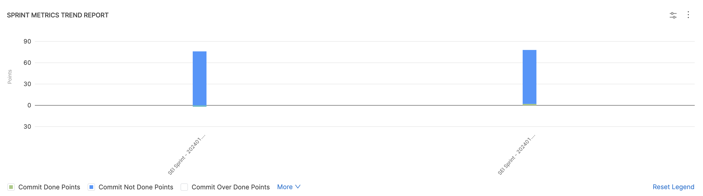
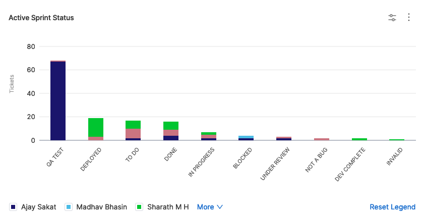

Effective sprint planning and delivery are crucial for Agile teams to meet project goals and deliver value to stakeholders. Sprint metrics play a pivotal role in assessing and improving the team's performance.

In this tutorial, we will explore how sprint metrics can help address common business problems and enhance the overall sprint planning and delivery process. You'll learn how to create an Insight (i.e. Dashboard) with the most frequently used Sprint metrics report configurations to measure your team's contribution and activity across various sprint cycles.

## Sprint Metrics Overview

Sprint metrics provide you with the analysis of tasks and tickets within a sprint.

It allows you to look at what was planned to do (committed), what was actually completed (done/delivered), what was not completed (missed), and any new tasks added after the sprint started (creep).

## Prerequisites

* Ensure that Harness SEI is enabled for your Account.
* Complete setting up your [Projects and Collection](/docs/software-engineering-insights/get-started/sei-onboarding-guide)
* Setup and configure the Integrations for your Issue Management tool.

## Set up your project, integration and collection

Begin by creating a project and collection.

1. In the sidebar of the Harness application, select the **SEI module** from the module selection.
2. Select **Projects** and choose an existing project or create a new one. For information about creating a project, go to [Create organizations and projects](/docs/platform/organizations-and-projects/projects-and-organizations).

:::info
A user can create multiple projects and be part of multiple projects.
:::

Once your project is created, you can set up and map integrations as an admin and set up the collection hierarchy.

## Integration Mapping

**Integration Mapping** is the process of associating available or new integrations with your current project. As an admin, you can set up and map integrations in your project. For more information, go to [Integrations](/docs/software-engineering-insights/sei-integrations/sei-integrations-overview).

1. Go to the **Integration Mapping** tab within the SEI module.
2. Click **Map Integrations** and select existing integrations or create new ones as needed.
3. Ensure you associate the integrations with your current project.
4. Now for configuring a Sprint Metrics insight, you'll need to map the [Jira integration](/docs/software-engineering-insights/sei-integrations/automated-integrations/sei-jira-integration) (Issue Management Tool).

:::info
You can also use [Azure DevOps integration](/docs/software-engineering-insights/sei-integrations/automated-integrations/sei-integration-azure-devops) as the Issue Management tool.
:::

You can also create new integrations and associate the integration with the current project by mapping them.

* To create a new Jira integration, go to [Jira integration](/docs/software-engineering-insights/sei-integrations/automated-integrations/sei-jira-integration).
* To create a new Azure DevOps integration, go to [Azure DevOps integration](/docs/software-engineering-insights/sei-integrations/automated-integrations/sei-integration-azure-devops).

## Create the Insight

1. Log in to the **Harness Platform** and go to the SEI module.
2. Go the **Project** scope and select your **Project**.
3. If you don't have any existing Insight, then click on the **Create Insight** button on the landing page to create a new Insight.

4. If you already have existing Insights in your selected Project, then go to any Insight. For instructions, go to [View Insights](#view-insights).
5. In the header, select **All Insights**, and then select **Manage Insights**.
6. Select **Create Insight**.

### Insight settings

1. Enter a **Name** for the Insight.
2. Select at least one **Collection category** to associate with this Insight.
3. Select **Create** to save the Insight metadata. From here, you can add reports to this Insight.

## Add Sprint Metrics reports

Use these sprint metric reports to analyze sprint and planning metrics allowing you to measure your team's performance each sprint.

### Sprint Metrics Trend Report

Engineering managers usually use these three key sprint metrics to get a holistic picture of the sprint productiviy:

1. [Commit Points](/docs/category/sprint-metrics#commit-points) (The number of story points you plan to complete during the sprint)
2. [Commit Done Points](/docs/category/sprint-metrics#commit-done-points) (The number of story points actually finished at the end of the sprint)
3. [Creep Points](/docs/category/sprint-metrics#creep-points) (The difference between the initially planned story points and those actually delivered).

The **Sprint Metrics Trend Report** is recommended for visualizing a time series trend of these metrics to help engineering managers understand how the respective sprint metrics has evolved throughout various sprint cycles.

To add the **Sprint Metrics Trend Report** widget to Insights:

1. Select **Settings**, then **Add Widget**.
2. Choose the **Sprint Metrics Trend Report** widget.
3. Configure filters to refine conditions (e.g., `Issue Resolved In` for the last quarter) that may impact overall metric calculations.
4. Define the **Sprint Completed Date** as either a `relative` or `absolute` time frame. You can also enable the **Use Insight Time** option to define the data as the configured Insight date.
5. In the **Metrics** tab, choose how you want to calculate sprint metrics, such as by `Story Points` or `Tickets`.
6. Select all the metrics you want to calculate for this report.
7. Under the **Aggregations** tab, select `Sprint` as the **X-Axis** value.
8. On the **Settings** tab, customize the report configuration:
   1. **Sprint Creep Grace Period:** Define a grace period within which any additional work or changes introduced during the sprint are still considered part of the original commitment.
   2. **Additional Done Statuses:** Specify additional ticket statuses that should be considered as Done for metrics calculation purposes.
   3. **Issue Management System:** Select the integration for your Issue Management System.
9. Select **Next: Place Widget**, place the widget on the Insight, and then save the layout.

For more information,go to [Sprint Metric Trend Report](/docs/category/sprint-metrics).

### Issue Hygiene Report

The Issue Hygiene Report provides valuable insights into how well your team is following issue management best practices. It assigns a scorecard to each issue, grading it against a set of hygiene categories. These categories include things like accurate labeling, prompt responses, and proper assignment. The report then calculates an overall hygiene score, giving you a snapshot of your team's performance.

But what happens when there are issues with the issues? That's where the hygiene misses come in. A hygiene miss occurs when a ticket lacks essential information, hasn't been updated in a while, or has been assigned to someone who isn't actively working on it. By identifying these hygiene misses, you can quickly address any underlying problems and improve your team's workflow.

You can use this report to measure and track the hygiene score for the previous sprint or the active sprints.

To add the **Issue Hygiene Report** widget to Insights:

1. Select **Settings**, then **Add Widget**.
2. Choose the **Issue Hygiene Report** widget.
3. Configure filters to refine conditions (e.g., `Issue Resolved In` for the last quarter) that may impact overall metric calculations.
4. Choose which sprints to consider for the calculation i.e `Includes active sprints only` or `Filter by last sprint`. You can also choose specific sprints for the calculation.
5. Under the **Weights** tab define the number that should be contributed for all the Issue Hygiene categories on a scale of 1-100.
6. On the **Settings** tab, customize the report configuration:
   1. **Hide Score:** You can enable / disable the field to hide the overall Hygiene score on the report.
   2. **Issue Management System:** Select the integration for your Issue Management System.
7. Select **Next: Place Widget**, place the widget on the Insight, and then save the layout.

### Issues Report

The Issues Report is used to examine metrics related to issues in your issue management system. The report aggregates data based on selected attributes, such as priority, status, labels, components, or any other field. This report helps you create comparisons based on various fields and draw conclusions to make decisions.

To add the **Issues Report** widget to Insights:

1. Select **Settings**, and then select **Add Widget**.
2. Select the **Issues Report** widget.
3. Select attributes that you want to use to filter the data, and then select filter values and operators. Depending on the selected attribute, you can select one or more filter values, select values to exclude, or use pattern matching rather than strict values. If you add multiple filters, they are inherently combined by `AND` operators.
   1. **Dependency Analysis:** Use this option to include dependent or linked issues in the data.
   2. **Status:** Select specific issue statuses to include in the data
   3. **Projects:** Select specific projects to include in the data
4. Choose which sprints to consider for the calculation i.e. **Includes active sprints only** or **Filter by last sprint**. Note that you can choose specific sprints for the calculation
5. Select a metric to use for the Y-axis. You can select either `Number of Tickets` or `Sum of Story Points`.
6. Configure the settings under the **Aggregation** tab:
   1. Select the attribute to use for the X-axis. For example, if you selected the `Number of Tickets` metric for the Y-axis, you could select `Issues Resolved by week` for the X-axis. Additional examples of X-axis dimensional attributes include `Project`, `Assignee`, `Labels`, `Priority`, and so on.
   2. Select how you want to group data in each X-axis dimension. For example, if you select `Priority` for the X-axis and stack by `Status` Category, then data in each X-axis column are grouped by `Status`.
7. Define the widget-level settings:
   1. Select the **Issue Management System** to use for this widget. Available options are based on your SEI integrations.
   2. Select how you want to sort X-axis data, such as `ascending` or `descending`.
   3. Select the maximum number of values to show on the X-axis.
   4. Select the visualization style for the widget, such as bar chart, donut chart, multi-line chart, or percentage-stacked bar chart.
   5. Select the date format.
8. Select **Next: Place Widget**, place the widget on the Insight, and then save the layout.

To configure the widget for various other use cases, go to [Issues Report Use Cases](/docs/software-engineering-insights/sei-metrics-and-reports/velocity-metrics-reports/issues-reports).

### Issue Resolution Time Report

The Issue Resolution Time Report is a customizable bar graph that displays the number of tickets that were closed and the average time it took to close them based on their creation time.

To add the **Issue Resolution Time Report** widget to Insights:

1. Select **Settings**, and then select **Add Widget**.
2. Select the **Issue Resolution Time Report** widget.
3. By default, the report filters issues closed (`Last Closed Date`) within a selected time range. Usually, the time range is set to `Use Insight time`, which allows you to select a specific time range when viewing Insights.
4. On the **Aggregations** tab, you can select the dimension you want to use for the X-axis, such as `Assignee`, `Story Points`, `Ticket Category`, `Issue Closed Last Time Period`, and more. This will determine what you want the graph to focus on. For example, if you focus on `Category` or `Component`, you can see the issue resolution time for different work areas. If you focus on `Assignee`, you can see issue resolution time by developer.
5. On the **Settings** tab, you can select the **Issue Management System** to use for this report. Available options are based on your configured SEI integrations. You can also select how you want to sort X-axis data, such as ascending or descending, and choose the maximum number of unique values to show on the X-axis.
6. Select **Next: Place Widget**, place the widget on the Insight, and then save the layout.

To configure the widget for various other use cases, go to [Issue Resolution Time Report Use Cases](/docs/software-engineering-insights/sei-metrics-and-reports/velocity-metrics-reports/issues-reports).

### Sprint Metrics Single Stat

The **Sprint Metrics Single Stat** widget presents a single sprint metric averaged over the selected time interval.

For example, the Sprint Metrics Single Stat widget can help you use historical metrics for sprint prediction and performance assessment.

To add the **Sprint Metrics Single Stat Report** widget to Insights:

* Select **Settings**, and then select **Add Widget**.
* Select the **Sprint Metrics Single Stat Report** widget.
* Configure filters to refine conditions (e.g., `Issue Resolved In` for the last quarter) impacting overall metric calculations.
* Define the **Sprint Completed Date** as either relative or absolute timeranfe value. You can also enable the `Use Insight Time` option to define the data as the configured Insight date.
* **Metric Selection:** Select the sprint metric or sprint metrics ratio that you want to show on this widget. For example using the `Commit Tickets` metric will display the number of story points your team planned to deliver at the beginning of the sprint.
* **Ideal Range:** Define ideal ranges for metrics such as `velocity points`, `commit ratios`, and more. You can set upper and lower bounds to indicate acceptable performance ranges.
* **Sprint Creep Grace Period:** Define a grace period during which any additional work or changes introduced at the beginning of the sprint are considered part of the original commitment rather than creep.
* **Additional Done Statuses:** Specify additional ticket statuses that you want to consider equivalent to Done for the purpose of metrics calculation.
* **Issue Management System:** Select the issue management system from which to pull data for the widget. Available systems depend on your configured integrations.
* Select **Next: Place Widget**, place the widget on the Insight, and then select **Save Layout**.

### Other sprint metrics reports

* [Sprit Metrics Percentage Trend Report](/docs/category/sprint-metrics#sprint-metrics-percentage-trend-report)
* [Sprint Impact of Unestimated Tickets Report](/docs/category/sprint-metrics)
* [Sprint Goal Report](/docs/category/sprint-metrics)
* [Sprint Distribution Retrospective Report](/docs/category/sprint-metrics)
