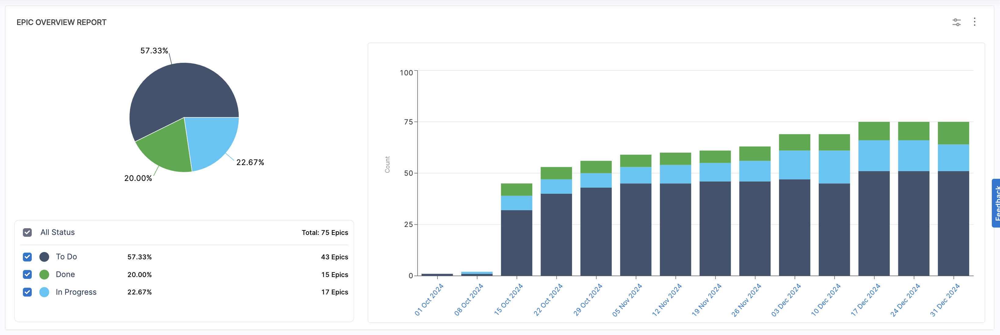
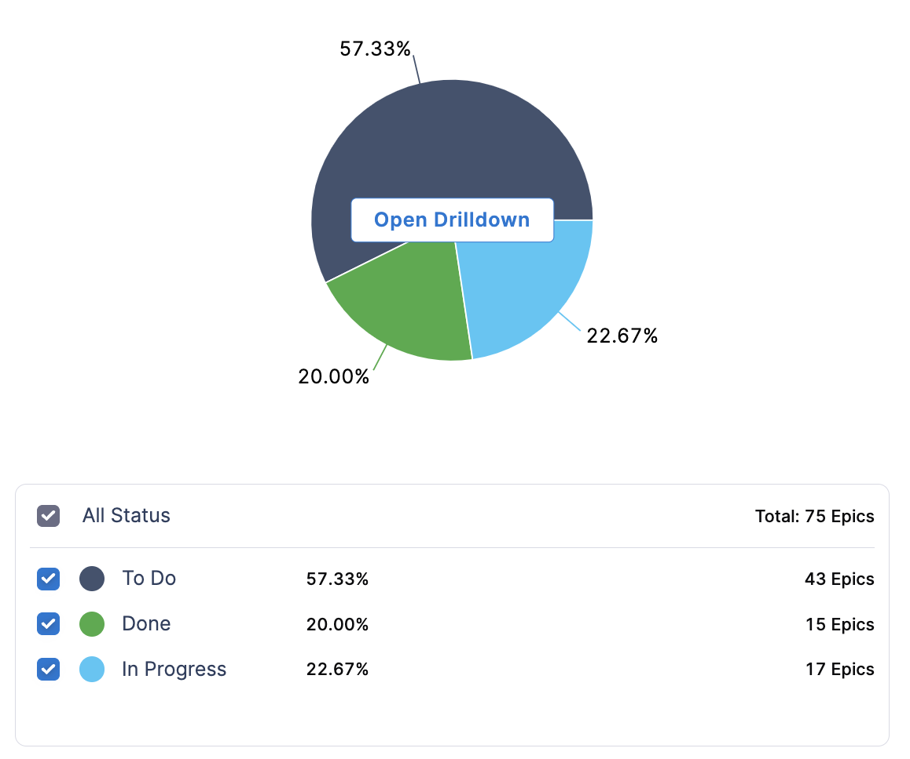
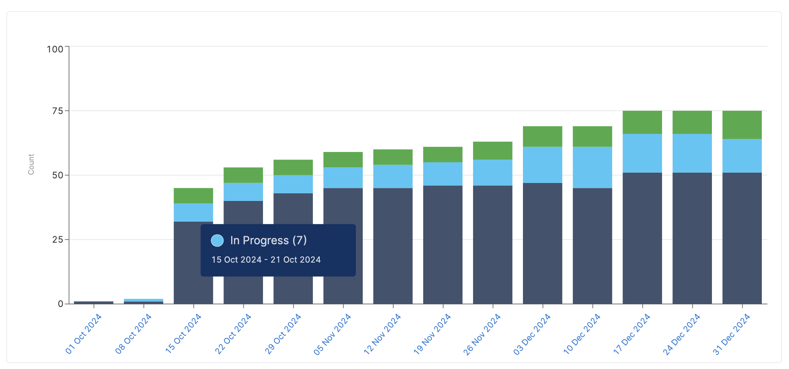
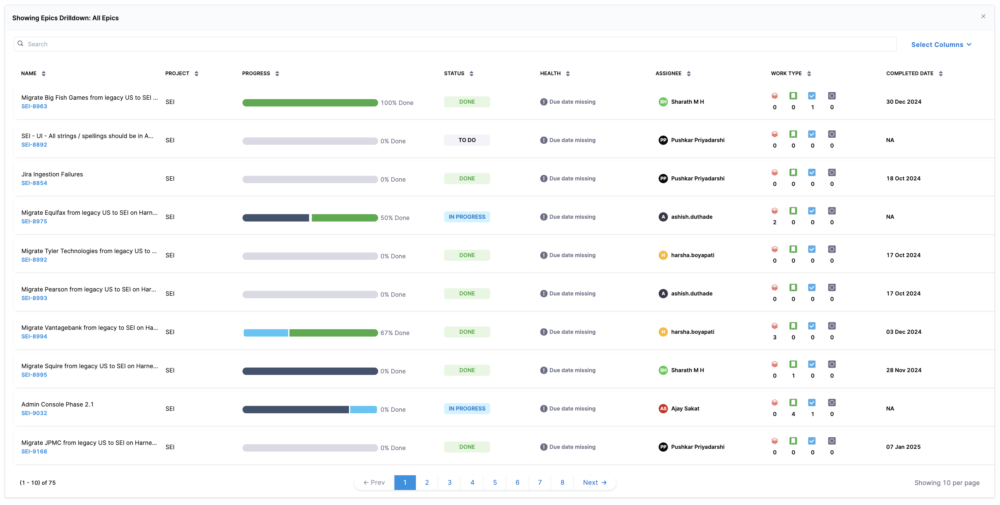
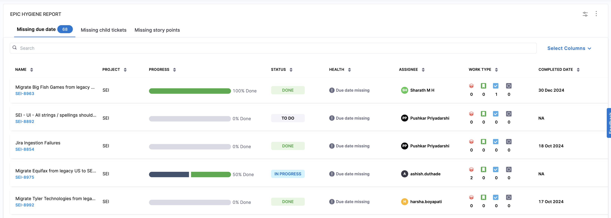

Engineering leadership is responsible for delivering critical major projects, often tracked as Epics. To effectively monitor project progress, they need visibility into:

* Which projects are progressing well and which are at risk?
* For at-risk projects (or all projects), what is the progress and where are the risks?
* What bottlenecks need to be addressed?
* Are projects resourced appropriately?
* Are all necessary tasks—functional development, security, testing, DevOps, and infrastructure—being actively tracked?

## Epic tracking widgets

The following Epic tracking widgets in Harness SEI help monitor epic health and track key projects:

* [Epic Overview widget](#epic-overview)
* [Epic Hygiene widget](#track-epic-hygiene)

## Epic overview

The Epic Overview widget provides a high-level view of epic progress, retrieving data from the issue management system. By default, it includes all epics created within the selected time frame or as defined in the widget settings. You can customize this selection using filters, such as tracking epics based on due dates or completion status within a specified period.



### Visualization

#### Pie chart view

The pie chart displays the distribution of epics by status category (*To Do*, *In Progress*, *Done*). This provides an at-a-glance view of backlog size, active work, and completed projects, helping teams analyze workload distribution and identify bottlenecks.



#### Bar chart view

The bar chart view shows the weekly trend of epics across the selected duration, categorized as the status categories allowing teams to observe progress over time.



#### Drill down view

The drill-down view provides a detailed breakdown of each epic, including:

* Status: The state of the epic in the selected time interval (*To Do*, *In Progress*, *Done*).
* [Epic health](#epic-health-statuses): Indicates whether the epic is on track, critical, or delayed.
* Assignee: The team member responsible for the epic.
* Work type: Represents the distribution of different issue types (e.g., stories, tasks, bugs) within the epic.
* Completion date: The date when the epic was marked as completed.

This view allows teams to deep-dive into epic progress, identify risks, and take action to maintain delivery efficiency.



### Configuration settings

#### Step 1: Add the widget

* Navigate to the Insight where you want to add the widget. Ensure you are in the correct project.
* Click **Settings** and select **Add Widget**.
* Choose the **Epic Overview widget**.

#### Step 2: Configure widget settings

* Apply filters to refine the epics displayed based on criteria such as issue resolution, creation date, or due date.
* Select the issue type as **Epics**, **Initiatives**, or both. Epics and Initiatives are issue types in issue management systems like [Jira](/docs/software-engineering-insights/propelo-sei/setup-sei/configure-integrations/jira/sei-jira-integration) and [Azure DevOps Boards](/docs/software-engineering-insights/propelo-sei/setup-sei/configure-integrations/azure-devops/sei-integration-azure-devops).

#### Step 3: Set the Health Buffer

The [health buffer](#step-3-set-the-health-buffer) is a percentage-based grace period applied to an epic’s due date. It accounts for minor overruns, preventing an epic from being immediately flagged as overdue.

**Example Calculation:**

* **Epic created:** January 1, 2025
* **Due date:** February 28, 2025
* **Health buffer:** 5%

```ssh
Total Epic Duration = (Due Date - Creation Date) = February 28 - January 1 = 59 days

Health Buffer Duration = (5% of 59 days) = ~3 days

Adjusted Due Date = February 28 + 3 days = March 2, 2025
```

In this scenario, the epic will not be flagged as overdue until March 2, 2025, providing a slight buffer before it is marked at risk.

#### Step 4: Save the widget

Once you have completed the setup, click on **Next: Place Widget** to place the widget on the dashboard layout. After positioning it, click on **Save Layout** to save the widget.

## Track epic hygiene

The term epic hygiene refers to the consistent management and maintenance of epics in the issue management system to ensure that all key components — such as due dates, effort estimations (story points), and linked child tickets — are properly defined and managed. Just as good code hygiene ensures a clean, maintainable codebase, epic hygiene ensures that issues are well-tracked, properly estimated, and deliverable within the defined timelines, reducing friction between stakeholders involved in project delivery.

#### Why epic hygiene matters

Maintaining good epic hygiene is crucial for ensuring smooth project execution, visibility, and accountability. Poorly maintained epics can lead to:

* **Lack of clarity:** Missing due dates make it hard to track deadlines.
* **Poor planning:** Missing story points indicate unaccounted effort.
* **Disorganizaed work:** Epics without child tickets make it difficult to measure work breakdown.

#### What the Epic Hygiene widget tracks

The Epic Hygiene widget provides an overview of epics that may have hygiene issues, helping teams identify potential gaps in epic management. It categorizes epics into the following types:

* **Missing due dates:** Epics that do not have an assigned deadline.
* **Missing child tickets:** Epics without linked issues or tasks.
* **Missing story points:** Epics where effort estimation has not been defined.

Each of these factors helps teams proactively identify and address gaps in epic management.



### Visualization

The widget displays a tabular view of epics, highlighting key details:

| **Field**         | **Description** |
|------------------|---------------|
| Epic name & ID | The title and identifier of the epic. |
| Project | The associated project name. |
| Progress | A progress bar indicating completion percentage. |
| Status | The current state of the epic (e.g., *To Do, In Progress, Done*). |
| Health | Displays warnings such as “Due date missing.” |
| Assignee | The team member responsible for the epic. |
| Work type | Icons representing different work types associated with the epic. |
| Completion date | The date when the epic was marked as complete. |

### Configuration settings

#### Step 1: Add the widget

* Navigate to the Insight where you want to add the widget. Ensure you are in the correct project.
* Click **Settings** and select **Add Widget**.
* Choose the **Epic Hygiene widget**.

#### Step 2: Configure widget settings

* Apply filters to refine the epics displayed based on criteria such as *issue resolution*, *creation date*, or *due date*.
* Select the issue type as **Epics**, **Initiatives**, or both. Epics and Initiatives are issue types in issue management systems like [Jira](/docs/software-engineering-insights/propelo-sei/setup-sei/configure-integrations/jira/sei-jira-integration) and [Azure DevOps Boards](/docs/software-engineering-insights/propelo-sei/setup-sei/configure-integrations/azure-devops/sei-integration-azure-devops).

#### Step 3: Set the Health Buffer

The health buffer is a percentage-based grace period applied to an epic’s due date. It accounts for minor overruns, preventing an epic from being immediately flagged as overdue.

**Example Calculation:**

* **Epic created:** January 1, 2025
* **Due date:** February 28, 2025
* **Health buffer:** 5%

```ssh
Total Epic Duration = (Due Date - Creation Date) = February 28 - January 1 = 59 days

Health Buffer Duration = (5% of 59 days) = ~3 days

Adjusted Due Date = February 28 + 3 days = March 2, 2025
```

In this scenario, the epic will not be flagged as overdue until March 2, 2025, providing a slight buffer before it is marked at risk.

#### Step 4: Save the widget

Once you have completed the setup, click on **Next: Place Widget** to place the widget on the dashboard layout. After positioning it, click on **Save Layout** to save the widget.

### Using the epic hygiene widget effectively

* **Set due dates:** Ensure every epic has a deadline to avoid ambiguity.
* **Break down work:** Add child tickets to clearly define tasks under each epic.
* **Estimate effort:** Assign story points to avoid effort underestimation.
* **Monitor regularly:** Use this widget as part of your sprint planning or backlog grooming sessions.

## Epic health statuses

Epic health status is determined based on progress tracking against the due date. Each epic is categorized based on its progress relative to the expected completion rate. This helps teams identify risks early and take corrective actions to stay on track.

### Health status categories

| **Health Status**                  | **Description** |
|-------------------------------------|----------------|
| Healthy ✅                      | The epic is progressing as expected, with completed tasks meeting or exceeding the [ideal completion rate](#health-status-calculation). |
| Critical 🚨                     | The epic is significantly behind the [expected progress rate](#health-status-calculation) and requires immediate attention. This also includes epics marked as resolved while child items remain open. |
| Due Date Missing ⚠️             | The epic does not have a defined due date. |
| Start Date Missing ⚠️           | The epic does not have a start date defined. |
| Start Date & Due Date Missing ⚠️ | The epic has neither a start nor a due date. |
| Delivered Late ❌              | The epic was completed but past the due date. |
| Delivered On Time 🎯            | The epic was completed within the planned timeline. |


### Health status calculation

The health status for the epics is calculated using the following formulas:

```ssh
Ideal progress= (Elapsed days / Total days) × Total child tickets
Actual progress = Count of completed child tickets
```

* If **Actual progress** is less than the **Ideal progress → Critical**
* If **Actual progress** is greater than or equal to **Ideal progress → Healthy**

### Health status calculation in action

Let's consider an epic tracking a migration project.

#### Epic Details

* **Epic created:** January 1st 2025
* **Due date:** January 31st 2025
* **Total duration:** 31 days (January 1 - January 31)
* **Total child tickets:** 10
* **Current date:** January 20th 2025
* **Completed child tickets (as of January 20):** 5

```ssh
Elapsed days = 20 days
Ideal progress = Elapsed days / Total duration × Total child tickets 
Ideal progress = 20 / 31 × 10 = 6.45 (rounded to 6)

Actual progress = Count of completed child tickets
Actual progress = 5
```
Since actual progress (5) is less than ideal progress (6), the epic is marked as **Critical 🚨.** This indicates that the team is behind schedule and needs to accelerate their progress to avoid delays.

#### What if the team had completed 7 child tickets?

If instead of 5, the team had completed 7 tickets, the calculation would look like this:

```ssh
Ideal progress = 20 / 31 × 10 = 6.45 (rounded to 6)
Actual progress = 7
```

Since actual progress (7) is equal to ideal progress (6), the epic is on track and marked as **Healthy ✅**
