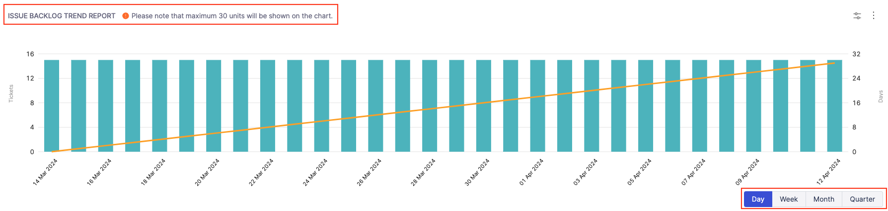
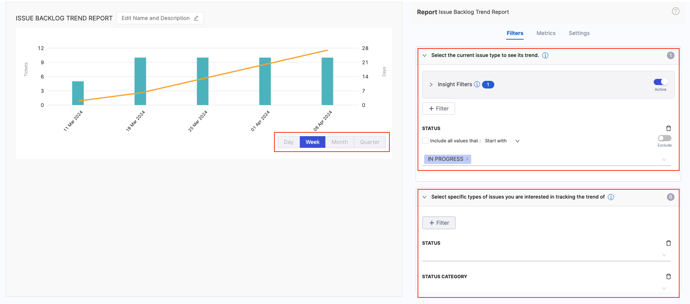

The **Issue Backlog Trend report** allows you to analyze the historical data of your current issues. This report can help you answer questions about your backlog, such as:

- Is the backlog growing or under control?
- How quickly are issues being resolved?
- Are there any patterns or trends in the age of the issues?

By understanding these trends, you can make informed decisions to optimize your issue management processes and ensure the overall health of your backlog.

## Add the report

To add the **Issue Backlog Trend report** widget to the Insight:

* Select **Settings**, then **Add Widget**.
* Choose the **Issue Backlog Trend Report** widget.

The following settings are available to configure the Issues Report:

#### Filters

Select attributes that you want to use to filter the data, and then select filter values and operators. Configure the widget filter settings under the Filters tab.

   1. Define the **Time Range** and the **Sample Interval** for the data to be displayed in the widget
   2. Add the **Filters** to select the current issue type to see its trend.
   3. Add the **Historical Filters** to select specific types of issues you are interested in tracking the trend of.

#### Metrics

Select the metrics to be used for the Left Y-axis and Right Y-axis. 

* For the **Left Y-axis** You can select either **Number of Tickets** or **Sum of Story Points**
* Similarly for the **Right Y-axis**, the available options are **Median Age of Tickets**, **Average Age of Tickets** and **90th Percentile Age of Tickets**.

#### Settings

* Select the **Issue Management Platform** to use for this widget. Available options are based on your SEI integrations.
* Select how you want to sort **X-Axis Data**, such as ascending or descending.

After you have finished configuring the widget, click on the **Save Widget** button to save the widget on the Insight.

## Recommendations

* When configuring the widget, it's recommended to set the **Status Category** filter to **To Do**. This ensures that you only track open, unstarted issues, providing a clear picture of your active backlog.
* You can use a **Project** filter to limit the report to the backlog of a specific project.
* You can define the settings for the current issue type using the existing filters. Additionally, you can set preferences for tracking trends related to specific issue types using historical data filters i.e. **Status** and **Category**.
* The widget allows you to choose between the following time intervals: **Day**, **Week**, **Month**, and **Quarter**. You can configure the time interval for the Daily option within the widget settings.

