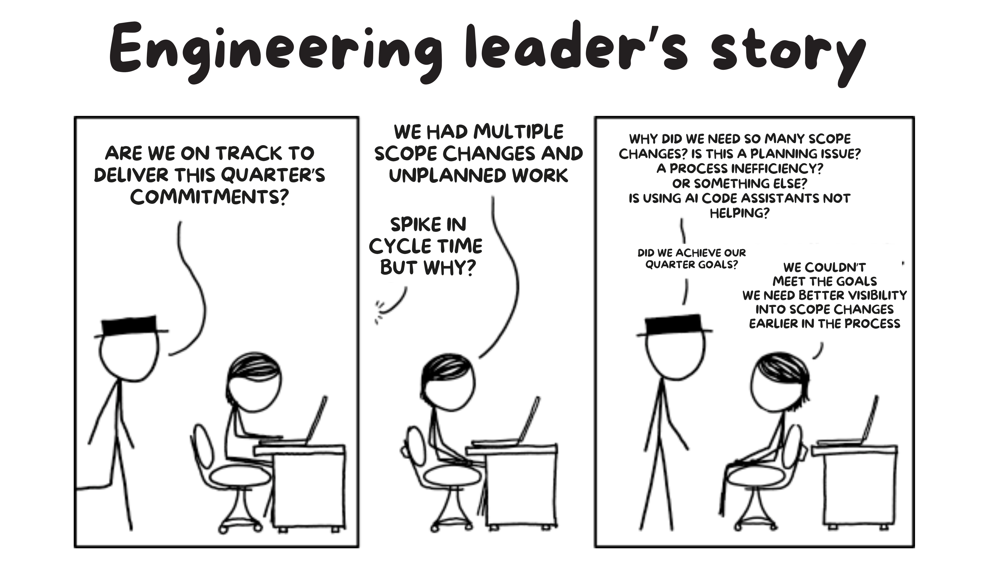
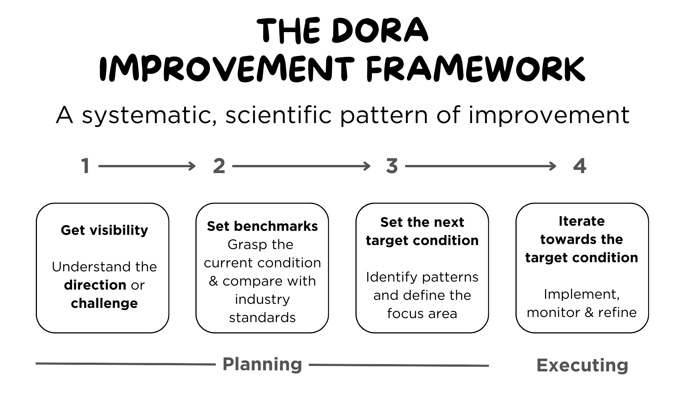
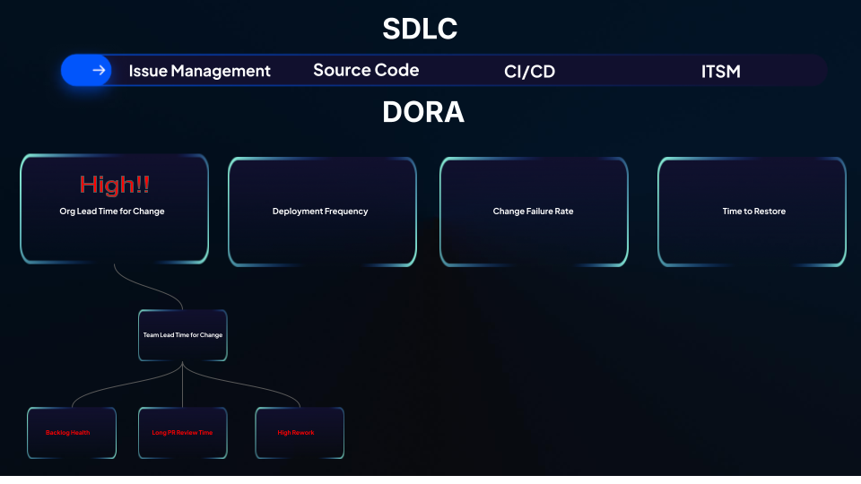

Measuring software engineering excellence poses a significant challenge for most engineering organizations. 
While there is a growing need to assess productivity to unlock efficiencies and enhance the developer experience, there is also a critical need to ensure that metrics are not weaponized or manipulated. Striking this balance requires careful consideration of which engineering metrics are collected and how they are used.

## The big picture view

Imagine a software team working to release a product. On the surface, everything seems fine, but behind the scenes, things are messy.

import Tabs from '@theme/Tabs';
import TabItem from '@theme/TabItem';

<Tabs>
  <TabItem value="engg-leader" label="Engineering leader" default>

  Releases are always late—even though sprint velocity looks good.
  
  You’re constantly fighting fires to find out what’s slowing the process down. Without the right data, it’s nearly impossible to justify further investments or convincingly explain these setbacks to stakeholders and the board

</TabItem>
<TabItem value="engg-managaer" label="Engineering manager">

Every day is a balancing act. Code reviews take too long, feedback comes late, and rework is common. The team’s effort is judged by deadlines instead of real results, which leads to frustration and lower quality work.

</TabItem>
<TabItem value="product-manager" label="Product manager">

Customers want new features, but you can’t give clear timelines because deadlines keep slipping.

A simple question like “When will it ship?” turns into guessing games. This gap between product goals and engineering work makes planning a challenge.

</TabItem>
</Tabs>

## Why an engineering metrics program? Transforming data into actionable OKRs & KPIs

> “You can’t improve what you can’t measure.”  
> — *Peter Drucker*

Engineering organizations often aim for engineering excellence—the process of continuously improving people, processes, and tools to maximize impact. But how do you know what to improve? How do you understand if the change made an impact? That’s where an engineering metrics program comes in.

### What is engineering excellence?

At its core, engineering excellence means optimizing three areas:

#### People

* **Have the right team:** Skilled people in the right roles.
* **Have the right size:** Not too many, not too few.

#### Processes

* **Frictionless workflows:** Minimize repetitive, low-value tasks.
* **Cognitive load:** Free up mental bandwidth for creative, high-impact work.

#### Tools

* **Right tools for the job:** Ensure the tech stack supports efficiency and scalability.

### The big question

How do you optimize people, processes, and tools to create outsized impact?
The answer lies in measuring what’s happening in your engineering organization. Metrics can help you identify bottlenecks, understand what’s working, and focus efforts where they matter most.

Here’s a framework — that you can use to align workforce, processes, and tooling to drive continuous improvement.

There are two main reasons to measure an engineering organization:

#### Understanding efficiency

* How is the team delivering results?
* Where are the bottlenecks slowing things down?

#### Understanding Business impact

* What’s the business value of the engineering output?
* How do engineering results align with business goals?

Both are equally important, but they require different metrics to address their unique goals. Based on this we can categorize engineering metrics into two broad categories:

* **Engineering Excellence metrics:** Focus on team productivity, efficiency, and technical execution.
* **Business Alignment metrics:** Focus on how engineering outcomes drive business results.

Not all metrics contribute equally to both categories because the goals are different. The chart below shows how various metrics align with each initiative.

### People, process & tooling

The first step to measuring metrics is gaining visibility. While focusing on people and their activities might seem enough, research shows it doesn't give the full picture. Bottlenecks often come from processes and tools as well.

To get meaningful insights, you need visibility across people, processes, and tools, and how they work together.

| People Bottlenecks                | Process Bottlenecks                        | Tooling Bottlenecks                                      |
|------------------------------------|--------------------------------------------|----------------------------------------------------------|
| Allocation of people              | People working on low-value repetitive work | Tools that require manual effort resulting in slower processes |
| People with mismatched capability or output | Lack of planning and frequent context switching | Security, reliability & governance                      |
| Team reorganization               | Poor communication                         | Tooling framework that does not work well together       |

## The DORA improvement framework

## Step 1 - Get visibility

#### Understand the direction & challenge

The good news? The data you need is already there. Every commit, pull request, comment, and pipeline run generates data points that can help you map your improvement journey.

### Correlate data to complete the story

The challenge is that this data is spread across different tools, built for different purposes, and consumed by different teams. Individually, these tools can’t show the whole picture.

Take DORA metrics as an example. They combine data from:

* Issue management systems (e.g., [Jira](/docs/software-engineering-insights/setup-sei/configure-integrations/jira/sei-jira-integration), [Azure DevOps Boards](/docs/software-engineering-insights/setup-sei/configure-integrations/azure-devops/sei-integration-azure-devops)).
* Source code managers (e.g., [GitHub](/docs/software-engineering-insights/setup-sei/configure-integrations/github/sei-github-integration), [GitLab](/docs/software-engineering-insights/setup-sei/configure-integrations/gitlab/sei-integration-gitlab), [Bitbucket](/docs/software-engineering-insights/setup-sei/configure-integrations/bitbucket/sei-integration-bitbucket)).
* CI/CD tools (e.g., [Jenkins](/docs/software-engineering-insights/setup-sei/configure-integrations/jenkins/jenkins-plugin), [Harness](/docs/software-engineering-insights/setup-sei/configure-integrations/harness-cicd/sei-integration-harnesscicd)).
* Incident management tools (e.g., [ServiceNow](/docs/software-engineering-insights/setup-sei/configure-integrations/beta-integrations/servicenow/sei-servicenow)).

By correlating data across these sources, you can connect activities, processes, and tooling to find bottlenecks faster.

:::note What is DORA?
[DORA (DevOps Research & Assessment)](https://dora.dev/) metrics are widely recognized as the gold standard for measuring an engineering team’s health, performance, and productivity. They focus on velocity and stability, helping teams of all sizes track progress and identify areas for improvement:
* Lead Time for Changes: The amount of time it takes for an item (change request) from ideation, code to get in production.
* Deployment frequency: How often engineer teams successfully releases to production?
* Mean time to restore: How long it takes for an organization to recover from an incident in production.
* Change failure rate: The percentage of deployments causing a failure in production.
:::

### Breaking down the analysis

While DORA metrics are a great starting point for measuring your team’s performance, they don’t tell the whole story. DORA highlights issues like long lead times or high failure rates, but it doesn’t reveal the root causes behind these results.

To get the full picture, you need to measure engineering activity holistically. This requires connecting all your data sources, analyzing the data in meaningful ways, and understanding how the factors behind the scenes—people, processes, and tools—impact your metrics.

Harness Software Engineering Insights (SEI) helps you do just that.

* SEI fetches data from multiple sources like issue trackers, source code managers, CI/CD pipelines, and incident management tools.
* The correlation engine intelligently links this data across workflows to present insights that are easy to understand.
* With historical data, you can track trends over time. For example, SEI shows how different metrics—like efficiency, quality, and hygiene—contribute to your overall DORA scores.

### Visualizing engineering health

The goal is to create a dashboard that categorizes metrics alongside DORA into key areas:

* **Efficiency:** Lead time, cycle time, deployment frequency.
* **Quality:** Change failure rate, incident frequency.
* **Hygiene:** PR size, review time, backlog health.

This breakdown helps you pinpoint exactly what’s working and what’s not.

## Step 2 - Set benchmarks

#### Grasp the current condition and set contextual benchmarks

### Benchmarking

Once you’ve achieved visibility, the next step is to set benchmarks for your metrics.
Every organization is different, so “good,” “average,” or “elite” performance varies. For example:

* Is a 12-day lead time acceptable for your team?
* Is a 250-line PR size manageable for reviewers?

### Questions to ask

Visibility is just the beginning. To drive improvement, ask:

#### Where does my team stand now?

Use current metrics to establish a baseline.

#### Where should we be?

Determine realistic thresholds for success based on your team’s needs.

#### Where do we want to be?

Set long-term goals for improvement.

### Set contextual thresholds

Refer to industry benchmarks, like those published in the latest [DORA report](https://cloud.google.com/devops/state-of-devops), as a guide. But don’t rely on them blindly—adjust them to fit your team’s structure and objectives.

## Step 3 - Set the next target condition

#### Identify patterns and determine the focus area

Measuring engineering metrics is the first step toward building an engineering excellence program. However, it’s crucial not to get overly focused on numbers alone. At first glance, the issue may appear to be people-related, but in most cases, the root causes lie in processes or the tooling framework, which often remain hidden.

To get real value from engineering metrics, focus on identifying patterns in your team’s activities. Patterns reveal insights, but spotting them requires the right approach and tools.

### How to identify patterns

#### Chaining metrics together

Correlate metrics to trace patterns in your team’s workflows. For instance, lead time combined with PR review time and deployment frequency can highlight bottlenecks in your CI/CD pipeline.

#### Track trends over time

The best insights often come from reviewing historical trends—e.g., data from the last 6 months. This helps you understand what’s improving, what’s stagnating, and what needs urgent attention.

Once you’ve achieved visibility and understand the context behind your metrics, the next step is to build dashboards with:

* Metrics you want to improve.
* Positive and negative indicators for each metric.

Focus on one metric at a time within a specific metric category (e.g., lead time for changes under efficiency). Avoid getting overwhelmed by tackling too many metrics at once. The goal is to take a targeted approach—improve one area before moving to the next.

### Don’t overlook tooling

Sometimes, bad metrics can’t be fixed by improving people or processes alone. Engineering decisions around tooling play a significant role.
For example:

* Using Jenkins as your CI tool often requires substantial resources for maintenance and managing slow builds. This can significantly impact lead time.
* In such cases, fixing your PR review process won’t solve the problem unless you also migrate to a faster, more reliable CI tool like Harness CI.

In general the tooling framework as a whole matters. Even if individual tools are great, they may not integrate well with each other, creating bottlenecks in your workflows.

## Step 4 - Iterate towards the target condition

#### Implement, monitor & refine

As we’ve discussed, measuring an engineering team’s performance falls into two main categories: engineering excellence and business alignment. To achieve meaningful progress, you need a clear improvement plan that targets both areas.

### Improvement plan

An ideal improvement plan should include the following:

#### End-to-end coverage

Chain data across all tools to capture the entire software delivery lifecycle. This will help you track activities from development to deployment.

#### Customizability and granularity

Ensure you can drill down to the right level of detail to pinpoint bottlenecks and process inefficiencies.

#### Clarity

Make sure you clearly understand what you are measuring and what you aim to improve.

#### Team and individual tracking

Measure performance at both the team level and the individual developer level for a full understanding.

#### Example

For example, if you identify an issue with lead time, the next step is to break it down into stages to see where the delays are happening.

Let’s say PR approval time is where most time is being spent. Next, you should explore ways to improve this stage, possibly by introducing better tooling or automation. This is where granularity becomes important—knowing the specifics of PR distribution, PR size, and lines of code can provide deeper insights.

The key point is: not all PRs are the same. Each one has a unique complexity and skill requirement for reviews. Understanding the distribution of these factors helps you set the right benchmarks and allocate resources effectively.

Improvement is not instant—it takes time. The investments you make in improving processes and tooling will yield results down the road, not overnight.

### Example improvement plan

We have drafted a few example improvement plans that you can take inspiration from and build your own engineering metrics program.

#### Decide your roadmap

Start by identifying the key objectives your team should focus on each quarter. Improving engineering excellence is a long-term journey, so it’s important to focus on a few specific areas at a time. 

If you're unsure where to begin, consider a baseline implementation for a few representative teams. This baseline will help you understand:

* **Execution:** Where are the hidden bottlenecks in your software delivery process
* **Alignment:** How does engineering impact business outcomes?
* **Planning:** Why are teams not delivering on their commitments?

Use the baseline insights to define specific improvement objectives for each team or product group. Focus on one mandatory objective per team per quarter. For each objective, understand what the key results will look like.		

| Objective | Key outcomes |
|------|-----------|
| Improve DORA lead time | Reduce time spent across all stages in your SDLC |
| Improve quality | Reduction in customer found defects |
| Better planning | The key metric should be to see improvements in <ul><li>Increase in delivered vs planned story</li><li>Decrease in scope creep (tickets + story creep)</li><li>Decrease in predictability score.</li><li>Low churn rate</li></ul> |
| | Decrease in scope creep (tickets + story creep) |
| Scale velocity | The key metric to measure in this case should be increase in new feature velocity |
| Optimize resource allocation | Review if the invested resources / effort align with the allocation goals that was assigned. |

#### Create your roadmap

<Tabs>
<TabItem value="team-roadmap" label="Team roadmap" default>

Every team is different in terms of the proceses and tooling thus the same roadmap might now tell the entire story. It is recommended to create team or section specific roadmaps.

| Team Level | Quarter 1 | Quarter 2 | Quarter 3 | Quarter 4 |
|------------|-----------|-----------|-----------|-----------|
| Org-wide | Improving quality | Improving quality | Improving quality | Improving quality |
| Team A | Scale velocity | Better lead time | Improve deployment frequency | Improve dev productivity |
| Team B | Improve planning | Healthy sprint results | Improve lead time | Better business alignment |

</TabItem>
<TabItem value="persona-roadmap" label="Persona-based roadmap">

| Persona             | Quarter 1 Metrics                                                                                                              | Quarter 2 Metrics                                                                                                                | Quarter 3 Metrics                                                                                                                | Quarter 4 Metrics                                                                                                               |
|---------------------|--------------------------------------------------------------------------------------------------------------------------------|----------------------------------------------------------------------------------------------------------------------------------|----------------------------------------------------------------------------------------------------------------------------------|---------------------------------------------------------------------------------------------------------------------------------|
| **Engineering Manager** | <ul><li>Lead time</li><li>Deployment frequency</li><li>Defect rates</li><li>Resource allocation Efficiency</li></ul>  | <ul><li>Cycle time</li><li>Code review efficiency</li><li>Team velocity</li><li>Resource allocation efficiency</li></ul>         | <ul><li>MTTR</li><li>Change failure rate</li><li>Team morale</li><li>Resource allocation efficiency</li></ul>             | <ul><li>Customer-reported defects</li><li>Predictability score</li><li>Resource allocation efficiency</li></ul>  |
| **Product Manager**     | <ul><li>Delivered vs. Planned stories</li><li>Scope creep</li><li>Customer satisfaction</li></ul>                             | <ul><li>Feature adoption rate</li><li>Customer feedback</li><li>Predictability score</li></ul>                                     | <ul><li>Time to production</li><li>Customer satisfaction</li><li>Projects delivery status</li></ul>                                     | <ul><li>Business value delivered</li><li>Roadmap alignment</li><li>Stakeholder feedback</li></ul>                              |
| **Developer**           | <ul><li>Code quality</li><li>Pull request review time</li><li>Commit frequency</li></ul>                                    | <ul><li>Test coverage</li><li>Refactoring efforts</li></ul>                                            | <ul><li>Bug fix rate</li><li>Feature completion rate</li><li>Peer reviews</li></ul>                                            | <ul><li>Technical debt reduction</li><li>Code rework</li><li>Productivity growth</li></ul>                     |
| **QA Engineer**         | <ul><li>Defect detection efficiency</li><li>Test case coverage</li><li>Automation coverage</li></ul>                          | <ul><li>Regression defects</li><li>Test execution time</li><li>Bug reopen rate</li></ul>                                        | <ul><li>User acceptance testing feedback</li><li>Performance testing metrics</li></ul>                                         | <ul><li>Post-release defects / failures</li><li>Incident count</li><li>Code rework</li></ul>                  |
| **DevOps Engineer**     | <ul><li>Application stability</li><li>Deployment frequency</li><li>Incident recovery time</li></ul>                  | <ul><li>Incident recovery time</li><li>Resource utilization</li></ul>                         | <ul><li>CI/CD pipeline efficiency</li><li>Security compliance</li></ul>                                                      | <ul><li>Downtime reduction</li><li>Infrastructure cost optimization</li></ul>                      |
| **Executive/CTO**       | <ul><li>ROI</li><li>Strategic / Business Alignment</li><li>Time to ship features</li></ul>                                                     | <ul><li>Distribution of resources</li><li>Risk management</li></ul>                                | <ul><li>Operational efficiency</li></ul>                                | Better business alignment                             |

</TabItem>
</Tabs>

#### Track improvements

We recommend managers file tickets for improving their engineering excellence. That will ensure transparency and accountability. This plans should be reviewed by every manager monthly with the team. They should also be reviewed at the monthly Engineering Excellence QBR by the leadership.
					
You may use the following template with an example for your action plans.
					
The plan must have 

1. What actions will you take
2. Who is responsible and 
3. When it will be done

| Opportunity / Challenge  | Resolution                                                                                                                                                   | Owner          | Due by      | Completed on            |
|--------------------------|---------------------------------------------------------------------------------------------------------------------------------------------------------------|----------------|-------------|-------------------------|
| PR missing Jira tickets  | Introduced automation to check if PR has a linked Jira ticket; if not, automatically adds a label “DO-NOT-MERGE”                                               | Tech lead name | Review date | When was it completed   |

It is important to meet and review the metrics and insights to drive the continuous improvement process. We recommend settings up scheduled meetings with the correct stakeholders to review the status of improvement and have very transparent and clear communications across your engineering team. 

Congratulations! You’ve just built your first engineering metrics program and are well on your way to engineering excellence and better business outcomes!		
		

