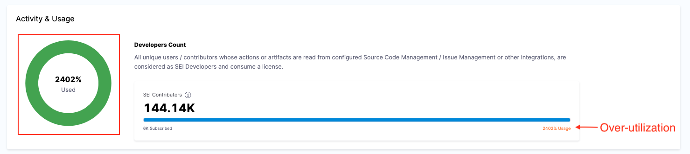
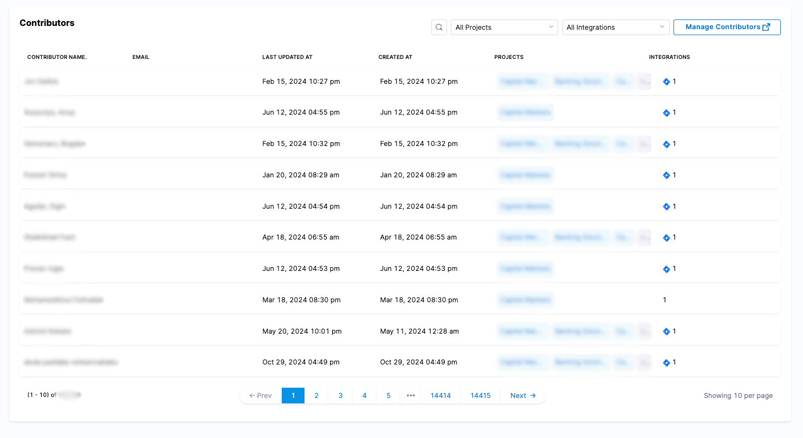

You can quickly and securely manage your SEI subscription directly through your account at any time, including:

* Upgrading your plan.
* Managing payment details and billing admins.
* Viewing license usage data.

## License overview

Your SEI subscription includes a specific number of **Contributor licenses**, which track the number of **Contributors** identified across all integrated SDLC tools.

### Who is a contributor?

A **Contributor** is a user record that SEI tracks and analyzes based on activity in SDLC tools.  All users whose actions or artifacts are read from configured **Source Code Management** or **Issue / Project Management tool(s)** are considered as SEI Developers and consume a license.

### View license usage

You can view and manage your Harness SEI subscription in your **Harness Account Settings**.

In your Harness account, go to **Account Settings** to view which Harness modules you are currently subscribed to. Subscriptions are shown in the **Subscribed Modules** section on the **Overview** page. You can select Manage to go to the **Subscriptions** page.

### Activity & usage

On the Subscriptions page, you will find a detailed summary of your license activity and usage metrics.

* **Total licenses purchased:** Displays the number of contributor licenses included in your plan.
* **Subscription period:** Shows the start and end dates of your current plan.
* **Usage insights:** The **Activity & usage** section highlights the total number of contributor licenses consumed.

The **Activity & usage** section provides real-time data on how many contributor licenses are being utilized. An unexpectedly high number of active contributors compared to the allocated licenses might indicate issues like duplicate records. 

If your usage exceeds the purchased licenses, it is recommended to review the contributor records to ensure that each license is being used for a unique contributor. Duplicate records can lead to inflated usage numbers, causing your account to appear over-utilized.

### Reduce the over usage by merging contributors

When integrating SEI with multiple SDLC tools, different user records may be created for the same individual. SEI attempts to unify records based on email addresses, but discrepancies can occur due to the following reasons:

* **Different email addresses:** The same developer uses multiple email addresses across different tools.
  * jane.doe@company.com in GitHub
  * jane@company.com in Jira
* **Varied usernames:** Variations in usernames across platforms lead to multiple records being created.
* **Bot/Service accounts:** Non-human accounts (e.g., ci-cd-bot@company.com) mistakenly counted as contributors.

#### Why merge duplicate contributor records?

The un-merged duplicate records may inflate license consumption. To ensure accurate license usage, [merge duplicate records](/docs/software-engineering-insights/propelo-sei/setup-sei/sei-contributors/manage-user-profiles#merge-contributors) and maintain a unified contributor record. 

* Unified records ensure accurate license counts and holistic activity tracking.
* Avoid paying for "ghost" users.

### See also

* [Merge duplicate contributors](/docs/software-engineering-insights/propelo-sei/setup-sei/sei-contributors/manage-user-profiles#merge-contributors)
* [Modify contributor data via CSV Export & Import](/docs/software-engineering-insights/propelo-sei/setup-sei/sei-contributors/manage-contributors#modify-contributors-export-and-import)
