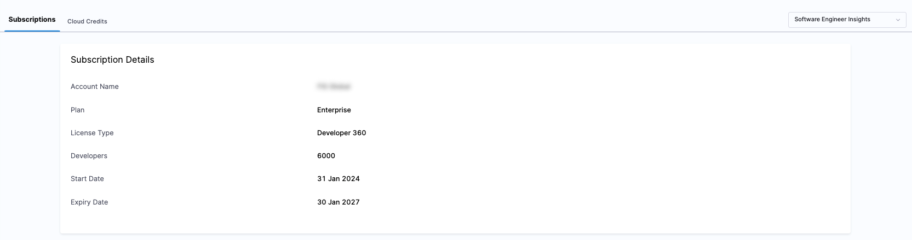

You can quickly and securely manage your SEI subscription directly through your account at any time. See clear details on your subscription, and associated usage details.
Note: This page details the new Developer Licensing model. The old Contributor model has been deprecated. The new model continues to be aligned with the goal of building analytics for Developers in your Engineering organization, and does so effectively.

## License overview

Your SEI subscription includes a specific number of **Developer licenses**, which track the number of **Developers** for which SEI is generating insights, and consuming a Developer license.

### Who is a Developer?

SEI allows admins to explicitly define (import) the list of Developers for whom Insights must be generated. All Developers in this list explicitly consume a Developer license. These Developers may never login to the Harness Platform, but they still consume a license by virtue of having Insights generated for their engineering-related work. Insights are often be accessed by management or engineering leadership instead.

Harness recommends bringing all Developers and Engineers who contribute to your software delivery lifecycle (SDLC) into SEI. This may span several roles within your organization such as Developers, QA, Security, DevOps, SecOps, and more. That said, the largest and most important developer population typically consists of engineers actively writing and shipping code. SEI excels at delivering deep insights into this user segment, and to maximize its value, Harness recommends including the entire population segment in SEI.

### View license usage

You can view and manage your Harness SEI subscription in your **Harness Account Settings**.

In your Harness account, go to **Account Settings** to view which Harness modules you are currently subscribed to. Subscriptions are shown in the **Subscribed Modules** section on the **Overview** page. You can select Manage to go to the **Subscriptions** page.

### Activity & usage

On the Subscriptions page, you will find a detailed summary of your license activity and usage metrics.

* **Total licenses purchased:** Displays the number of contributor licenses included in your plan.
* **Subscription period:** Shows the start and end dates of your current plan.
* **Usage insights:** The **Activity & usage** section highlights the total number of Developer licenses consumed.

The **Activity & usage** section provides real-time data on how many Developer licenses are being utilized. An unexpectedly high number of active contributors compared to the allocated licenses might indicate issues like duplicate records. 

If your usage exceeds the purchased licenses, it is recommended to review the Developer records and assess if there are Developers you don't need Insights for. You can always update the Developer table to only have the right intended Developers, and hence control license consumption. Note that doing so, ensures that no Insights are generated for the Developers that are removed from the Developer table.

### See also

* [Manage developers](/docs/software-engineering-insights/harness-sei/setup-sei/upload-developer-records)
