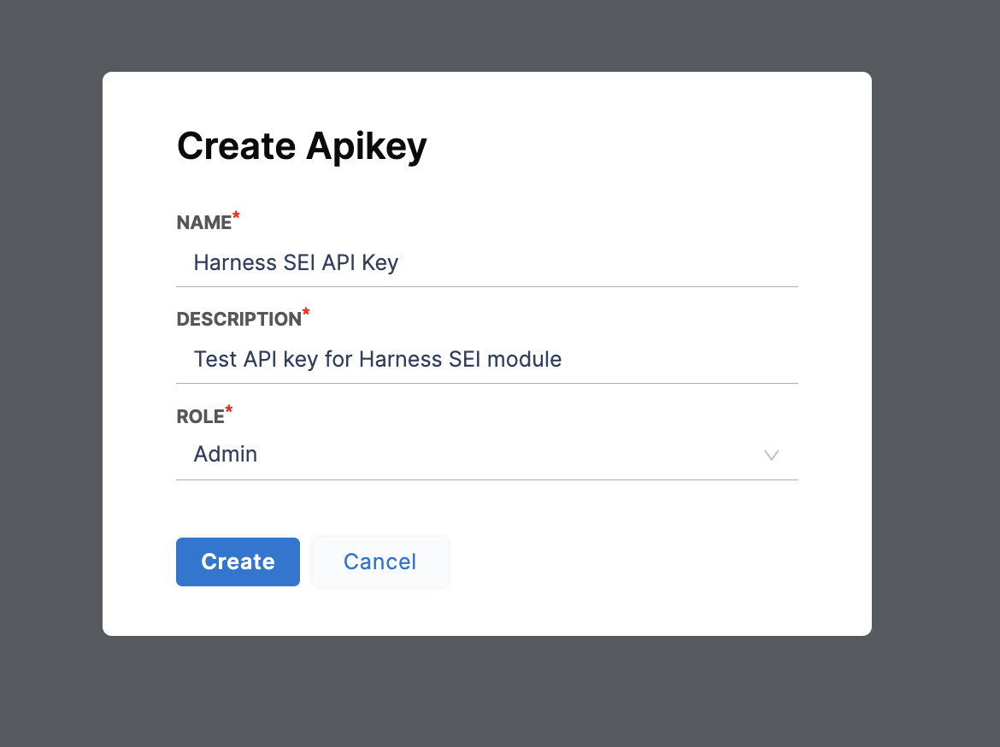
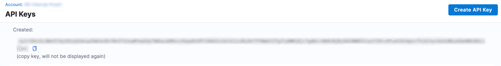

Harness SEI APIs use module-specific API keys to authenticate requests. Currently, you can only create API keys for your personal account.

### Create Harness API keys

Use these steps to create an SEI API key for your personal Harness account.

* Log in to your **Harness SEI Account** and navigate to the **API Keys** section under **SEI Settings**.
* Click on the **Create API Key** button to create a new API key.
* Add a name & description to the API key
* Select the role as either **Admin** or **Ingestion**. If you plan to use the API key with the ingestion satellite use the Admin role.

* Click the **Create** button to generate your new API key.

