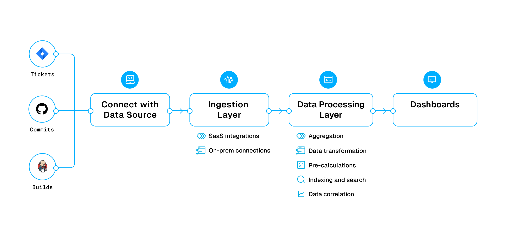

This topic outlines the simplified architecture for the Harness Software Engineering Insights module, including its ingestion process and data flow across the various stages.

## Harness SEI data processing workflow

The SEI data processing workflow is composed of the following stages:

* [Connection with third party services](#connection-with-third-party-services)
* [Ingestion layer](#ingestion-layer)
* [Data processing layer](#data-processing-layer)

## Connection with third party services

Harness SEI integrates with Software Development Lifecycle (SDLC) tools—such as [JIRA Cloud](/docs/software-engineering-insights/setup-sei/configure-integrations/jira/sei-jira-integration) and [GitHub Cloud](/docs/software-engineering-insights/setup-sei/configure-integrations/github/sei-github-integration) — using secure API connections. Depending on your environment, you can use one of two integration methods:

### Direct SaaS integration

The Harness SaaS application connects directly to cloud-based SDLC tools using their public APIs. This approach is used by all cloud based integrations on Harness SEI.

### Satellite based integration for on-prem integrations

When integrating with on-premise systems, Harness SEI uses the [ingestion satellite](/docs/software-engineering-insights/setup-sei/sei-ingestion-satellite/satellite-overview) to maintain security and control.

* The ingestion satellite creates outbound connections from your network to on-premise services (e.g., JIRA, GitHub) to fetch the required metadata.
* Authentication tokens and secrets remain within your environment, ensuring they are not transmitted externally.
* Once data is collected, the satellite sends the metadata securely to the SEI SaaS API endpoints.

## Ingestion layer

The SEI ingestion layer acts as a data magnet, collecting information from every tool you use across your software development lifecycle. This process occurs through two primary methods:

### Out-of-the-box integrations

Harness SEI connects directly to various cloud-based tools via their native APIs. For example:

* [Jira](/docs/software-engineering-insights/setup-sei/configure-integrations/jira/sei-jira-integration): Retrieves ticketing and hygiene data.
* [GitHub](/docs/software-engineering-insights/setup-sei/configure-integrations/github/sei-github-integration): Collects information on code changes and pull requests.
* [ServiceNow](/docs/software-engineering-insights/setup-sei/configure-integrations/beta-integrations/servicenow/sei-servicenow): Gathers incident data and change requests.

### Data collection agents

In some environments, SEI deploys lightweight agents that reside within your network. These agents securely collect data and forward it to SEI. An example is the [Harness SEI Jenkins Plugin](/docs/software-engineering-insights/setup-sei/configure-integrations/jenkins/jenkins-plugin) that is installed on your Jenkins server, it securely gathers build and job data.

All data—whether pulled via API or collected by an agent—is stored securely in its raw format. This "raw integration data" serves as the foundation for subsequent analysis.

## Data processing layer

Once the raw data is collected, the SEI data processing layer transforms it into actionable insights through a series of steps:

### Aggregation

Instead of displaying individual data points, SEI aggregates data to compute key metrics. For example, it calculates average cycle times and lead times to provide a comprehensive view of your development process.

### Data transformation

The raw data is cleaned and standardized by:

* Normalizing date formats.
* Handling missing or incomplete values.
* Converting data into consistent units.

### Pre-calculations

To ensure rapid dashboard response times, SEI performs key [calculations in advance](/docs/software-engineering-insights/analytics-and-reporting/precalculated-widgets). This pre-processing means that when you view your dashboard, the insights are instantly available.

### Indexing and search

The processed data is indexed, making it easy to search and filter. Whether you need information by project, team, or time period, you can quickly find the data you need.

### Correlation of data across different tools

Harness SEI analyzes data relationships to uncover deeper insights. For example, it can correlate code changes with build failures to help pinpoint root causes of issues.

Through these processes, the data processing layer transforms raw data into valuable, ready-to-use insights

After the ingestion and processing steps, all refined data is seamlessly presented on your SEI dashboards.

Here, you receive a clear and visual representation of your software engineering performance. Data typically appears on your dashboard within 48-72 hours after ingestion, ensuring that the latest insights are always at your fingertips.

