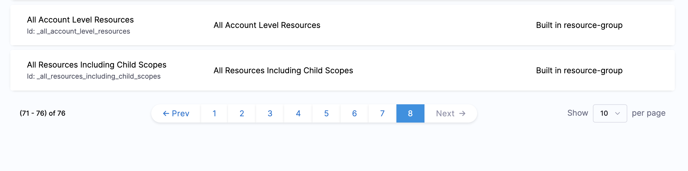
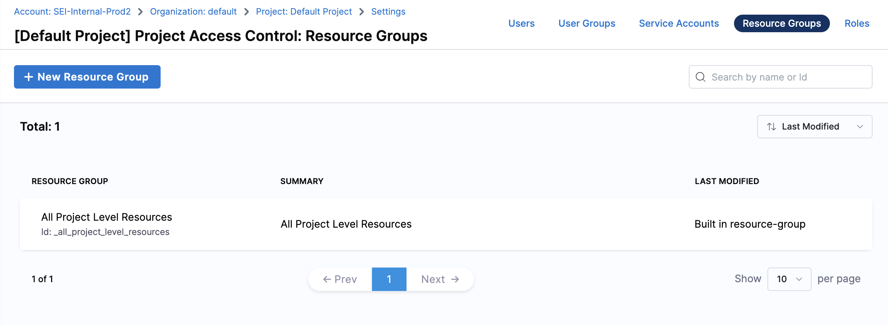

# Manage access control for SEI Insights

Harness provides Role-Based Access Control (RBAC) that enables you to control user and group access to Harness Resources according to their role assignment.

This topic describes how to add and manage access control for SEI Insights.

## Before You Begin

* [RBAC in SEI](/docs/software-engineering-insights/propelo-sei/setup-sei/access-control/sei-roles-and-permissions)
* [RBAC in Harnesss](/docs/platform/role-based-access-control/add-manage-roles)

## SEI Insights Roles and Permissions

The following roles are supported for SEI Insights:

* **SEI Admin:** To view, add, edit, and delete SEI Insights with the capability to add widgets to Insights. The access can be given to all Insights or specific Insights.
* **SEI Collection Admin:** To view all Insights or user-associated Insights with the capability to edit the user-associated Collections.
* **SEI Viewer:** To view all Insights or user-associated Insights.

:::info
Note that the specific Insight or Collection selection option is supported only in the project-level scope.
:::

| Role | Scope | Permission |
| - | - | - |
| SEI Admin | Account | <ul><li>Add Insight</li> <li>Add Widgets / Reports</li> <li>Edit Insights</li> <li>Delete Insights</li></ul> |
| SEI Collection Admin | Account | View |
| SEI Collection Admin | Project | View |
| SEI Viewer | Account | View|
| SEI Viewer | Project | View|

It is important to note that the permissions mentioned in the table above are entirely dependent on the resource group that is mapped to the role. Therefore, it is crucial to define the role binding accurately between the role and the associated resource group for the user to ensure that the permissions are correctly applied.

## Add and Manage Access Control for Resource Groups

In this section, we will walk through the process of defining and managing access controls for resource groups within an account and project-level scope.

We will cover how to set up permissions for Insights at the account level, as well as limiting access to specific Insights at the project level.

### Account Level

At the account level scope, the resource group allows you to define permissions for the following SEI entities:

* Configuration Settings (All account level resources i.e. Integrations, Contributors, Profiles etc)
* Insights
* Collections

In this section, we cover how you can use the existing [built-in resource group](/docs/software-engineering-insights/propelo-sei/setup-sei/access-control/sei-roles-and-permissions#built-in-resource-groups) or [create a new resource group](/docs/platform/role-based-access-control/add-resource-groups) for managing access to Insights.

At the account level, there are two built-in resource groups available:

* **All Resources Including Child Scopes:** This group defines permissions for all resources within the account's scope, including those within the scope of orgs and projects under the account.
* **All Account Level Resources:** This group only defines permissions for the resources in the account's scope.

For example, if we want to set up a user with CRUD access to all Insights, which is a project-level resource, we will use the **All Resources Including Child Scopes** resource group in the **Role Binding** to that user.

For more information on adding and managing resource groups, go to [Manage Resource Groups](/docs/platform/role-based-access-control/add-resource-groups).

:::info
Note that you cannot restrict access to a specific group of entities such as specific Insights or Collection under the account scope. This is possible at the project level.
:::

Perform the following steps to **create a new Resource Group** to define CRUD access to all Insights.

1. In **Harness**, click **Account Settings**, and then click **Access Control**.
2. In **Resource Groups**, click on the **+New Resource Group**. For more information on adding and managing resource groups, see [Manage Resource Groups](/docs/platform/role-based-access-control/add-resource-groups).
3. Choose the scope of the resource group: 
   1. **Account Only:** Insights access is unavailable when selecting the scope as `Account Only` as they are a **Project Level** resource entity.
   2. **All (including all Organizations and Projects):** Applies permissions across all organizations and their respective projects.
   3. **Specified Organizations (and their Projects):** Sets permissions for a particular organization and its associated projects.
4. Under the settings for the SEI module’s shared resources, select **Insights**. At the project level scope by default, **All Insights** is selected.
5. Click **Apply Changes**.

:::info
Note that while creating a custom resource group ensure that you have added the required **Administrative Functions** permissions to enable the user to access and operate over the respective entities. For example: In this scenario, the resource group must have permissions for `orgs`, `projects` etc.
:::

### Project Level

At the project level scope, the resource group enables you to set permissions for two SEI resources:

* Insights
* Collections

You have the option to define the resource group to allow access to all entities, such as **All Insights** and **All Collections**, or to specify a group of resource entities, such as **specific Insights** and **specific Collections**.

In this section, we cover how you can use the existing [built-in resource group](/docs/software-engineering-insights/propelo-sei/setup-sei/access-control/sei-roles-and-permissions#built-in-resource-groups) or define a [new resource group](/docs/platform/role-based-access-control/add-resource-groups) for managing access to the Insights. To configure the permissions for **Collections**, go to [Manage Access Control for SEI Collections](/docs/software-engineering-insights/propelo-sei/setup-sei/access-control/manage-access-control-for-insights).

At the project level, there is one built-in resource group available:

* **Project Viewer - All Project Level Resources:** This resource group defines the permissions for all resources in the project's scope. This is set for each project. If you have multiple projects, you have an **All Project Level Resources** for each project.

For example, if we want to set up view access to all Insights, which is a project-level resource, we will use this resource group. 

For more information on adding and managing resource groups, see [Manage Resource Groups](/docs/platform/role-based-access-control/add-resource-groups).

To limit access to specific Insights you can create a new custom resource group.

Perform the following steps to limit access to specific Insights:

1. In **Harness**, click **Account Settings**, and then click **Access Control**.
2. Go to the **Resource Groups** tab and click on **+New Resource Group**. For more information on adding and managing resource groups, see [Manage Resource Groups](/docs/platform/role-based-access-control/add-resource-groups).
3. Under the settings for the SEI module’s shared resources, select **Insights**. By default, **All Insights** is selected.
4. Select the **Specified** option and click on **+Add**.
5. Select the **Insights** for which you want to limit the access.
6. Click **Apply Changes**.

## Add and Manage Access Control for Users​

Perform the following steps to define access to Insights for different users.

1. In **Harness**, click **Access Control**.
2. In **User**, in **New User**, add or select the **User** for which you want to add or modify the access control. For more information on adding and managing resource groups, see [Manage users](/docs/platform/role-based-access-control/add-users).
3. In **Assign Roles**, select the **Role** from the drop-down list. 
   1. **Account Level:** You can select either `SEI ADMIN`, `SEI COLLECTION ADMIN` or the `SEI VIEWER` as the role.
   2. **Project Level:** You can select either the `SEI COLLECTION ADMIN` or the `SEI VIEWER` as the role.
4. In **Resource Groups**, select the resource group for which you want to add or modify the access control.
5. Click **Save**.

The difference between adding a **User** at the **Account level** and **Project level** is related to the scope of the resources they have access to and the related resource group associated with them i.e. When a **User** or a **User Group** is associated with a **Role** and a **Resource Group**, it provides them with the permission as defined in the role to the resources as grouped together in the resource group.

## Use cases

### Add User with All Insights Edit Access at the Account Level

In this scenario, we will configure a user with edit permissions to all Insights.

#### Step 1: Selecting the Resource Group

In this scenario, we will use the default built-in resource group **All Resources Including Child Scopes**. This resource group includes all resources within the account's scope, as well as those within the scope of orgs and projects under the account. This is the most inclusive resource group possible.

To view all the permissions associated with the Resource Group:

1. In **Harness**, click **Account Settings**, and then click **Access Control**.
2. In **Resource Groups**, click on the **All Resources Including Child Scopes** Resource Group. The permissions will be displayed. For more information on adding and managing resource groups, see [Manage Resource Groups](/docs/platform/role-based-access-control/add-resource-groups).

#### Step 2: Add the role-binding to the required user

1. In **Harness**, click **Access Control**.
2. In **User**, in **New User**, add or select the **User** for which you want to add or modify the access control. For more information on adding and managing users, see [Manage users](/docs/platform/role-based-access-control/add-user-groups).
3. In **Assign Roles**, select the `SEI ADMIN` role from the dropdown.
4. In **Resource Groups**, select the **All Resources Including Child Scopes** resource group to define the access control.
5. Click **Save**.

After adding a user to an account, the **Account Viewer - All Account Level Resources** resource group is automatically included in the user's role binding, along with the additional **Role Bindings** that have been configured. 

This will enable the user to view all account-level resources and seamlessly access the application.

:::warning
Note that if you are creating a custom resource group ensure that you have added the required **Administrative Functions** permissions to enable the user to access and operate over the respective resource entities. For example: In this scenario, the resource group must have permissions for `orgs`, `projects` etc.
:::

### Add User with specific Insights View Access at the Project Level

In this scenario, we will configure a user with view permissions to specific Insights at the Project Level.

#### Step 1: Configure the resource group

In this scenario, we will use two resource groups and associate them with the user.

1. **Built-in project-level resource group:** Project Viewer - All Project Level Resources.
2. **Custom Resource group:** Newly created resource group with permissions to specific Insights under the project. 

To create the custom **Resource Group**:

1. In **Harness**, click **Project Settings**, and then click **Access Control**.
2. In **Resource Groups**, click on **+New Resource Group**. For more information on adding and managing resource groups, see [Manage Resource Groups](/docs/platform/role-based-access-control/add-resource-groups).
3. Add a **Name** to the resource group.
4. The resource group scope in the scenario is by default set to the **Project Level**.
5. Under the settings for the SEI module’s shared resources, select **Insights**. At the project level scope by default, **All Insights** is selected. 
6. Select the **Specified** option and click on **+Add**.
7. Select the **Insights** for which you want to limit the access.
8. Click **Apply Changes**.

#### Step 2: Add the role-binding to the required user

1. In **Harness**, click **Access Control**.
2. In **User**, in **New User**, select the **User** for which you want to add or modify the access control. For more information on adding and managing resource groups, see [Manage users](/docs/platform/role-based-access-control/add-users).
3. In **Assign Roles**, select the `SEI VIEWER` role from the dropdown.
4. In **Resource Groups**, select the resource group you created earlier to define the access control.
5. Click **Save**.

After adding a user to a project, the **Project Viewer - All Project Level Resources** resource group is automatically included in the user's role binding, along with any custom resource group that has been configured. This helps maintain consistency in access control for the specified resources as part of the resource group at the project level.

