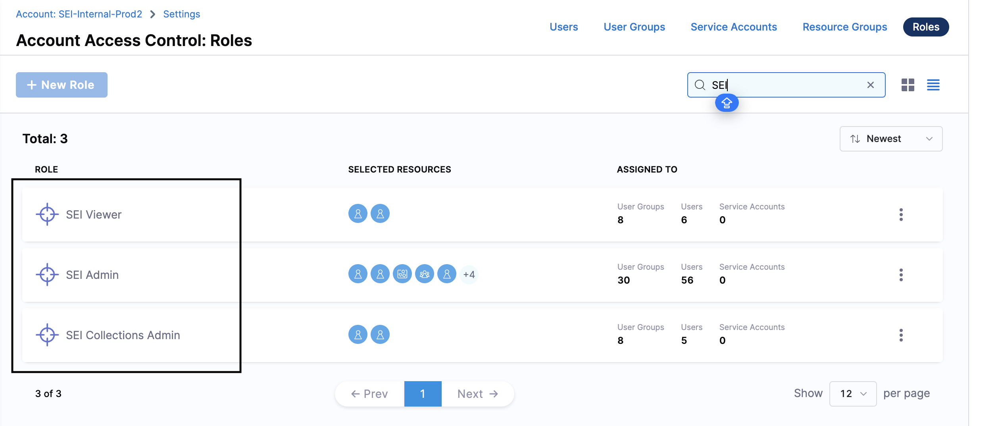
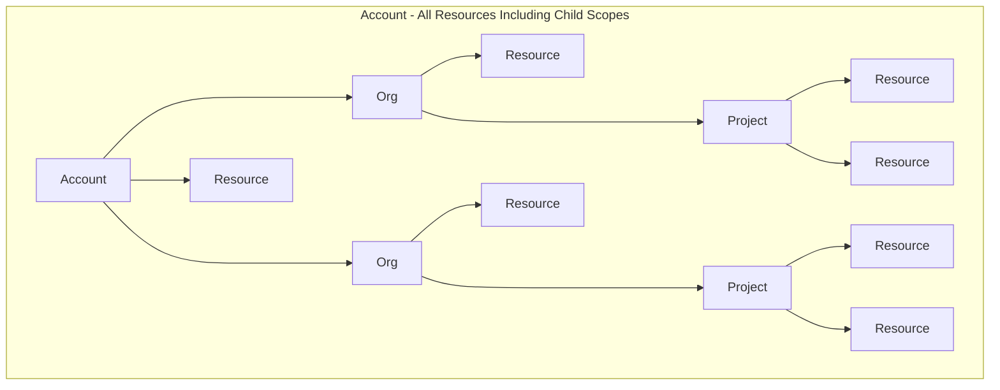
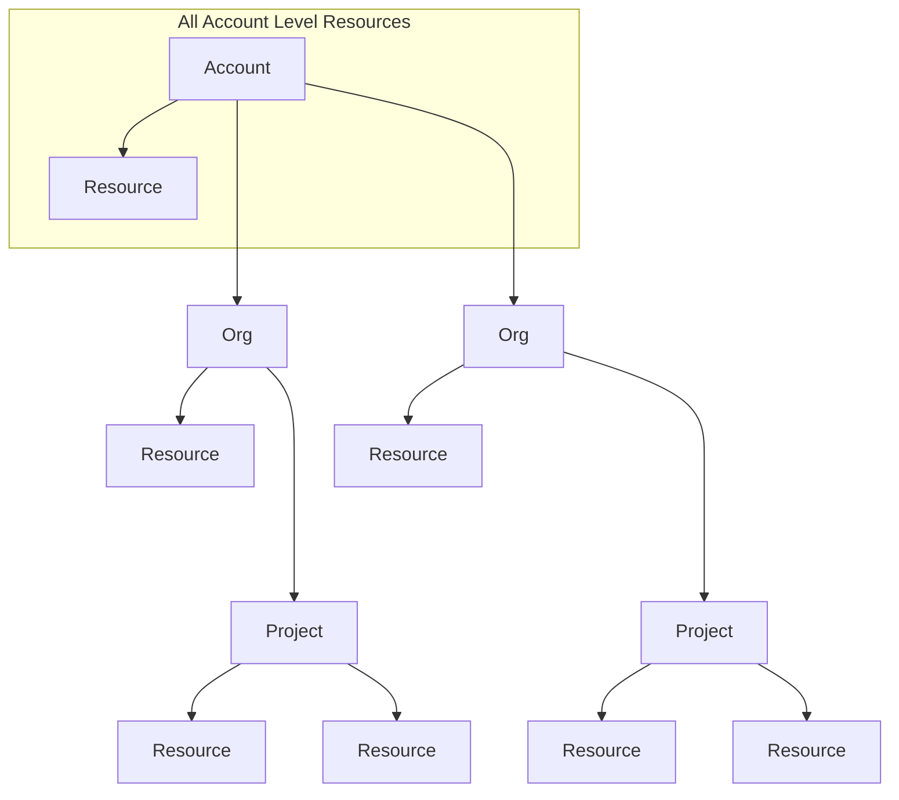
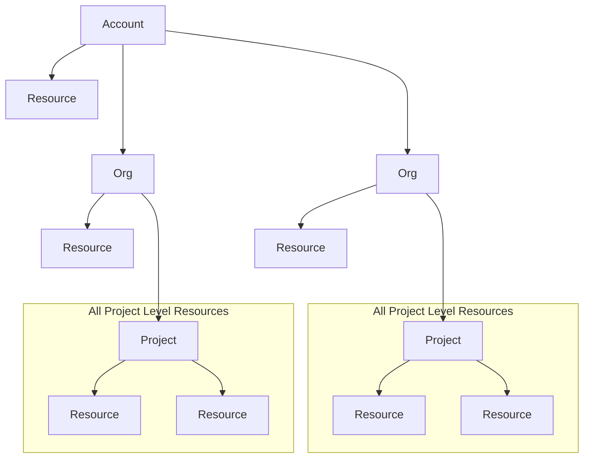

# SEI Roles and Permissions

Harness Role-Based Access Control (RBAC) includes **Roles** and **Permissions** that allow you to regulate access to the SEI module resources within your Harness account.

The Harness Platform has a three-level hierarchical structure. The three levels, or scopes, are **Account**, **Organization (Org)**, and **Project**. An Account contains Organizations and Projects. An Organization contains Projects.

To learn more about access control in Harness, go to [RBAC in Harness](/docs/platform/role-based-access-control/rbac-in-harness).

## Roles

Roles are sets of [permissions](/docs/platform/role-based-access-control/permissions-reference) that allow or deny specific operations on objects (resources). Roles are applied together with resource groups to create a complete set of permissions and access.

Harness SEI comes with three predefined user roles, and you can [create your own custom roles](/docs/platform/role-based-access-control/add-manage-roles), which are useful for limited and fine-grained access control.

Roles are scope-specific and can be created at either project or account [scope](/docs/platform/role-based-access-control/rbac-in-harness#permissions-hierarchy-scopes) in Harness SEI.

* **Project Level:** When you add a user with the role binding at the project level, it only applies to that specific project. This means that users will have the defined permissions only within that project. The two built-in roles available at the Project Level are:
  * SEI Collection Admin
  * SEI Viewer

* **Account Level:** When you add a user with the role binding at the account level, it applies across all projects under that account. Users with an account-scoped role will have the corresponding permissions throughout the entire account based on the resource group bindings. The three built-in roles available at the Account Level are:
  * SEI ADMIN
  * SEI Collection Admin
  * SEI Viewer

## Resource Group

A Resource Group is a grouping of resources that are managed by the same set of users using the same set of access control policies. 

Resource Groups can be of two types:
* **All Resources** – Groups all resources of a given type.
* **Named Resources** – Groups together a specific set of individual resources.

### Built-in resource groups

Harness includes several built-in resource groups.

Built-in resource groups at the Account scope

* **All Resources Including Child Scopes:** Includes all resources within the account's scope, as well as those within the scope of orgs and projects under the account. This is the most inclusive resource group possible.

* **All Account Level Resources:** Includes all resources in the account's scope, and excludes resources within the scope of orgs or projects under the account.

Built-in resource groups at the Project scope

**All Project Level Resources** includes all resources in the project's scope. This is set for each project. If you have multiple projects, you have an **All Project Level Resources** for each project.

To learn more, go to [Built-in resource groups](/docs/platform/role-based-access-control/add-resource-groups#built-in-resource-groups).

When a **User** or a **User Group** is associated with a **Role** and a **Resource Group**, it provides them with permission as defined in the role to the resources as grouped together in the resource group. 

You need these [permissions](/docs/platform/role-based-access-control/rbac-in-harness#required-permissions) to set up RBAC in SEI.

## Default Roles

You can configure SEI Permissions for any Role, but there are three default Roles related to SEI as mentioned earlier that you can assign without having to set anything up.

### SEI Admin

This role has the highest level of access and is responsible for administrative functions within the SEI module. Additionally, this user role also has the ability to perform `Create`, `Read`, `Update`, and `Delete` (CRUD) operations for users, resource groups, and user groups at the platform level. 

This role exists at the **Account level** and has **CRUD-level** permissions to all SEI resources (For ex: **Configuration settings**, **Insights**, and **Collections**) and entities. However, this level of access is granted only when the role is associated with a resource group that contains permission for all SEI resources.

### SEI Collection Admin

This role allows users to manage and view collections. The scope of the collections accessible depends on their assigned user role and resource group bindings (Role Bindings). The role does not provide access to administrative functions.

It operates at both the **Project level** and **Account level** and can manage collections within specific projects or all projects based on the user's role and resource group bindings.

### SEI Viewer

This role has read-only access and is meant for users who need to view Collections or Insights but do not require administrative or management capabilities. Users with this role have viewing access to SEI insights within projects.

Users can be granted these roles individually or as part of user groups.

## Scope of Roles & Permissions

SEI supports RBAC at both the **Account level** and **Project level** scopes.

### Project Level

At the project level scope, SEI provides two default roles - **SEI Collection Admin** and **SEI Viewer**.

The resources related to these roles apply only to the project-level scope and depend on the associated Resource Group. You can manage permissions for the following SEI resources at the project level:

* Insights
* [Collections](/docs/software-engineering-insights/propelo-sei/setup-sei/sei-projects-and-collections/project-and-collection-overview#collections)

### Account Level

At account level scope SEI alongside the **SEI Viewer** and **SEI Collection Admin** additionally supports another default role i.e the **SEI Admin**.  SEI supports different resource scopes at the resource group level

* Account Scope
* All (including all projects and organizations)
* Specific organizations and their respective projects. 

The resources associated are dependent on the Resource Group defined. You can manage permissions for the following SEI resources at the account level:

* Configuration Settings (All account level resources)
* Insights
* [Collections](/docs/software-engineering-insights/propelo-sei/setup-sei/sei-projects-and-collections/project-and-collection-overview#collections)

:::info
Note that the **Configuration Settings** resource will only be accessible when the Resource Group's scope is set to **Account Only**.
:::

To view the permissions associated with resources for the SEI module:

1. In your **Harness Account**, click **Account Settings** **> Access Control > Roles**.
2. Open any of the **SEI Roles**.
3. In the sidebar, select **Software Engineering Insights**. The SEI Permissions are displayed.

## Permissions

The following table describes the Permissions enabled in the default Harness Roles, including the three SEI default Roles.

| Resources | SEI Admin | SEI Collection Admin | SEI Viewer | Account Admin | Account Viewer |
| - | - | - | - | - | - |
| Projects | CRUD | View | No access | CRUD | View |
| Collections | CRUD | View/Update | No access | CRUD | View |
| Connector Mapping | CRUD | No access | View | CRUD | View |
| Insights | CRUD | View | View | CRUD | View |
| Integrations | CRUD | No access | No access | CRUD | View |
| Contributors | CRUD | No access | No access | CRUD | View |
| Profiles | CRUD | No access | No access | CRUD | View |
| Tables and Propels | CRUD | No access | No access | CRUD | View |
| Customize | Manage/Update | No access | No access |  CRUD | View |
| Activity Logs | View | No access | No access |  CRUD | View |
| API Keys | Create/Update/Delete | No access | No access |  CRUD | View |
| Roles | Manage/Assign | View | View | CRUD | View |

## See also

The following topics can help you understand how to implement access control in Harness:

* [Manage users](/docs/platform/role-based-access-control/add-users)
* [Manage user groups](/docs/platform/role-based-access-control/add-user-groups)
* [Manage resource groups](/docs/platform/role-based-access-control/add-resource-groups)
* [Manage roles](/docs/platform/role-based-access-control/add-manage-roles)
