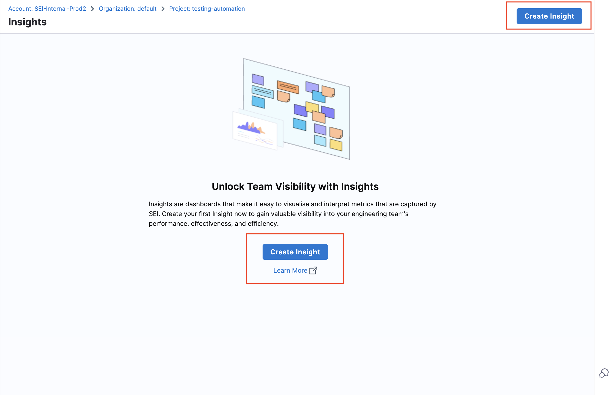
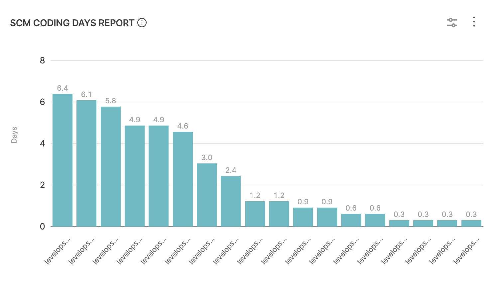

Understanding the health and productivity of your team is essential for any engineering organization. To achieve this, Developer Insights can be used as a collection of metrics that effectively showcase your team's value and performance.

A Developer Insight can essentially be defined as a dashboard with a combination of reports i.e. widgets displaying essential information on various metrics such as Lines of Code, Coding Days etc configured on the widget level related to your developer's contribution to the source code management platform.

In this tutorial, you'll learn how to create an Insight (i.e. Dashboard) with the most frequently used SCM metrics report configurations to provide valuable insights into the health and productivity of your engineering organization by collecting key metrics related to developers' contributions to the source code management platform.

## Prerequisites

* Ensure that Harness SEI is enabled for your Account.
* Complete setting up your [Projects and Collection](/docs/software-engineering-insights/propelo-sei/get-started/sei-onboarding-guide)
* Setup and configure the Integration for your Source Code Manager.

## Set up your project, integration and collection

Begin by creating a project and collection.

1. In the sidebar of the Harness application, select the **SEI module** from the module selection.
2. Select **Projects** and choose an existing project or create a new one. For information about creating a project, go to [Create organizations and projects](/docs/platform/organizations-and-projects/projects-and-organizations).

:::info
A user can create multiple projects and be part of multiple projects.
:::

Once your project is created, you can set up and map integrations as an admin and set up the collection hierarchy.

## Integration Mapping

**Integration Mapping** is the process of associating available or new integrations with your current project. As an admin, you can set up and map integrations in your project. For more information, go to [Integrations](/docs/software-engineering-insights/propelo-sei/setup-sei/configure-integrations/sei-integrations-overview).

1. Go to the **Integration Mapping** tab within the SEI module.
2. Click **Map Integrations** and select existing integrations or create new ones as needed.
3. Ensure you associate the integrations with your current project.
4. Now for configuring a Developer Metrics insight, you'll need to map the integration for your source code manager. For this tutorial we will map the [GitHub integration](/docs/software-engineering-insights/propelo-sei/setup-sei/configure-integrations/jira/sei-jira-integration) (Source Code Manager).

:::info
Find a list of all the supported integrations for SCM on Harness SEI [here](/docs/software-engineering-insights/sei-supported-platforms)
:::

You can also create new integrations and associate the integration with the current project by mapping them.

* To create a new GitHub integration, go to [GitHub integration](/docs/software-engineering-insights/propelo-sei/setup-sei/configure-integrations/github/sei-github-integration).

## Create the Insight

1. Log in to the **Harness Platform** and go to the SEI module.
2. Go the **Project** scope and select your **Project**.
3. If you don't have any existing Insight, then click on the **Create Insight** button on the landing page to create a new Insight.

4. If you already have existing Insights in your selected Project, then go to any Insight. For instructions, go to [View Insights](#view-insights).
5. In the header, select **All Insights**, and then select **Manage Insights**.
6. Select **Create Insight**.

### Insight settings

1. Enter a **Name** for the Insight.
2. Select at least one **Collection category** to associate with this Insight.
3. Select **Create** to save the Insight metadata. From here, you can add reports to this Insight.

## Add SCM reports

You can use these widgets in your Insights to analyze activity in your SCM tools, including:

* Individual developer contributions.
* Volume of rework and other code changes.
* Lead time and activities related to PRs and SCM issues.
* Review collaboration.
* Most active repositories and files.

Reports can be filtered by project, repository, time range, and other data points, depending on your SCM integrations.

### SCM PRs Report

The SCM PRs Report shows a high-level view of PRs moving through your SCM tool. This is a versatile report that analyzes different attributes in the development process through your SCM tool. You can configure this report to inspect data by assignee, destination branch, reviewer, repository, and more. For example, you can use this report to:

* Analyze how many PRs each developer raises.
* Analyze PR comments and categorize them based on a threshold.
* Better understanding of the overall contribution of the team.

To add the **SCM PRs Report** widget to Insights:

1. Select **Settings**, and then select **Add Widget**.
2. Select the **SCM PRs Report** widget.
3. Configure filters to refine conditions (e.g., `Repo ID` for a specific repository) impacting overall metric calculations.
4. Under the **Aggregations** tab, choose the value for **X-Axis** and **Stack**. In this tutorial we will set the value for **X-Axis** as `Repo Id` (Repository) and keep the value for Stack as is.
5. Under the **Visualization** tab, set the report visualization type. In this case we will set this as a `Bar Chart`.
6. Select the number of items that is to be displayed in the **X-Axis**.
7. Define the settings for **Code Change Size**. Here you'll customize the settings to define how you want to calculate the data i.e wrt `Files` or `Lines of Code` and also set the ideal range for the metric (`Large`, `Medium` and `Small`).
8. Define the settings for **PR Code Density** and set the ideal range for the metric i.e. `Shallow`, `Good` and `Heavy`.
9. Define how the items displayed in the **X-Axis** should be sorted.
10. Select **Next: Place Widget**, place the widget on the Insight, and then select **Save Layout**.

For information, go to [SCM PRs Report](/docs/software-engineering-insights/propelo-sei/analytics-and-reporting/productivity/developer-insights).

### SCM Coding Days Report

The SCM Coding Days Report displays the number of days in a given time period that a user or team has committed code to their SCM repository. This report can be used to track how active a user or team is in terms of code development and to identify trends in coding activity over time.

To add the **SCM Coding Days Report** widget to Insights:

1. Select **Settings**, and then select **Add Widget**.
2. Select the **SCM Coding Days Report** widget.
3. Configure **Filters** to refine conditions (e.g., `Repo ID` for a specific repository) impacting overall metric calculations.
4. Define the duration for **Commit Time** i.e either in `Absolute` or `Relative` mode. You can also choose to enable the **Use Insight Time** option which will automatically consider the active configured Insight Time settings.
5. Under the **Metrics** Tab, set the value as `Average Coding Days per Week`.
6. Under the **Aggregations** Tab, set the value for **X-Axis** as `Repo Id`.
7. Define how the items displayed in the X-Axis should be sorted.
8. Select **Next: Place Widget**, place the widget on the Insight, and then select **Save Layout**.

For information, go to SCM [Coding Days Report](/docs/software-engineering-insights/propelo-sei/analytics-and-reporting/productivity/developer-insights).

### SCM PR Lead Time by Stage Report

Use the SCM PR Lead Time by Stage Report to examine PR velocity based on time spent in various PR lifecycle stages. By default, this report shows the average time for all PRs. You can drill down to explore data for individual PRs. You can also configure this report to show the median, 90th percentile, or 95th percentile, instead of the average time.

To add the **SCM PR Lead Time by Stage Report** widget to Insights:

1. Select **Settings**, and then select **Add Widget**.
2. Select the **SCM PR Lead Time by Stage Report** widget.
3. Configure the **Filters** for the widget, such as `source/destination branch`, `reviewer`, `label`, and so on. This defines the types of commits or PRs that are considered in the lead time calculation.
4. On the **Settings** tab, select the relevant [Workflow profile](/docs/software-engineering-insights/propelo-sei/setup-sei/sei-profiles/workflow-profiles/workflow-profile-overview), and then select **Next: Place Widget**.
5. Select where you want to place the widget on the Insight, and then select **Save Layout**.

### Single Stat Reports

You can use the Single Stats reports to calculate various SCM related metrics supported by SEI. The single stat reports data display the data as a numeric value. The available SCM Single Stat reports are:

* SCM Coding Days Single Stat
* SCM Commits Single Stat
* SCM PRs Merge Single Stat
* SCM PRs Single Stat

To add the **SCM Coding Days Single Stat Report** widget to Insights:

1. Select **Settings**, and then select **Add Widget**.
2. Select the **SCM Coding Days Single Stat Report** widget.
3. Configure **Filters** to refine conditions (e.g., `Repo Id` or `Committer`) impacting overall metric calculations.
4. Define the duration for **Commit Time** i.e either in `Absolute` or `Relative` mode. You can also choose to enable the **Use Insight Time** option which will automatically consider the active configured Insight Time settings.
5. Under the **Metrics** Tab, set the value as `Average Coding Days per Week`
6. Select where you want to place the widget on the Insight, and then select **Save Layout**.

To add the **SCM Commits Single Stat Report** widget to Insights:

1. Select **Settings**, and then select **Add Widget**.
2. Select the **SCM Commits Single Stat Report** widget.
3. Configure **Filters** to refine conditions (e.g., `Repo Id` or `Committer`) impacting overall metric calculations.
4. Define the **Time Period** and **Aggregation** type. For this tutorial set the value as `Last Day` and `Average`.
5. Define the settings for **Code Change Size**. Here you'll customize the settings to define how you want to calculate the data i.e wrt `Files` or `Lines of Code` and also set the ideal range for the metric (`Large`, `Medium` and `Small`).
6. Select where you want to place the widget on the Insight, and then select **Save Layout**.

Similarly you can also configure the other Single Stat reports.
Some other SCM related reports which are frequently used are

* [SCM Rework Report](/docs/software-engineering-insights/propelo-sei/sei-administration/sei-calculations/scm/scm-reports-calculation/scm-rework-report ): The Rework report measures the refactoring of code, which involves making modifications to the existing codebase or rewriting it entirely.
* [SCM Committers Report](/docs/software-engineering-insights/propelo-sei/analytics-and-reporting/productivity/developer-insights#scm-committers-report): This report analyzes the volume of code changes by committer.
* [SCM Issues Report](/docs/software-engineering-insights/propelo-sei/analytics-and-reporting/productivity/developer-insights#scm-issues-reports): This report analyzes the number of issues in your SCM tool by time, label, or other categories.
* [SCM Issues Count Single Stat](/docs/software-engineering-insights/propelo-sei/analytics-and-reporting/productivity/developer-insights#scm-issues-reports): This report displays a single stat related to the number of issues in your SCM tool.
* [SCM Issues Trends Report](/docs/software-engineering-insights/propelo-sei/analytics-and-reporting/productivity/developer-insights#scm-issues-reports): This report analyzes changes over time in the volume of SCM issues.

## Best Practices

* Encourage open communication among team members regarding insights gained from Developer Insights analysis. Share findings across departments if applicable.
* Leverage historical data to recognize patterns and predict future trends.
* Make informed decisions backed by reliable data rather than assumptions or intuition alone. Balance quantitative analysis with qualitative feedback from developers and stakeholders alike.
* Establish periodic reviews of KPIs and OKRs tied to Developer Insights. Adjust targets as needed to maintain continuous growth and learning.
