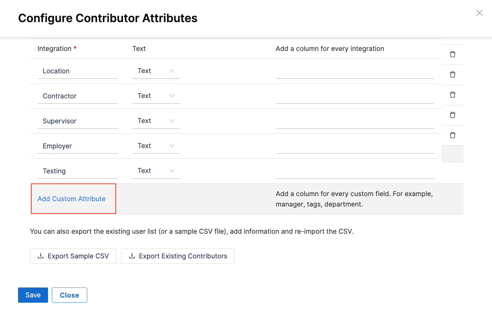

Contributors are developers and other team members that complete actions and activities that contribute to your SEI metrics and insights. Contributors are represented by contributor records in SEI. SEI contributor records serve two primary functions: Account association and Collection association.

Account associations connect related user accounts across your SDLC tools. For example, you can associate a contributor's Jira, GitHub, and Harness accounts so the data from those accounts are correlated to the same record in SEI, rather than three "instances" of a user. This makes it easier to track individual contributor activity across tools.

You can use any attributes as dynamic filters for contributor-based [Collections](/docs/software-engineering-insights/propelo-sei/setup-sei/sei-projects-and-collections/manage-collections). Some attributes are included by default, such as **Name**, **Email**, and **Integration**. You can add custom attributes to further refine contributor records and create dynamic filters unique to your organization or teams.

:::info

SEI contributor records don't control access to SEI or the Harness Platform; these records are for data management only.

:::

## Configure attributes

To view and modify contributors:

1. In your Harness project, go to the SEI module.
2. Select **Account**.
3. Select **Contributors** under **Data Settings**.

<!-- img .gitbook/assets/Screen Shot 2022-12-01 at 2.23.22 PM.png - Settings page with Users tile indicated -->

Select the **Settings** (wrench) icon to edit contributor attributes. By default, contributors only include a **Name** and **Email**. You can use attributes as dynamic filters for contributor-based [Collections](/docs/software-engineering-insights/propelo-sei/setup-sei/sei-projects-and-collections/manage-collections). Therefore, you might find it useful to add custom attributes, such as roles, team names, departments, supervisors, or other designations.

To add custom attributes:

1. Select the **Settings** (wrench) icon.
2. Select **Add Custom Attribute**.

3. Enter a **Title** for the custom attribute category.
4. Select the **Type**.
5. In the **Description** column, define where the attribute's values come from.
6. Click on Save to add the attribute to the contributor records.

<!-- image .gitbook/assets/Screen Shot 2022-12-01 at 2.26.31 PM.png - Configure User Attributes dialog -->

### The Integration attribute

For the **Integration** attribute, SEI uses the **Email** as the primary attribute to collate contributor identities across integrations.

For example, assume a user's email is `a.developer@myorg.com`, and you have [integrations](/docs/software-engineering-insights/propelo-sei/setup-sei/configure-integrations/sei-integrations-overview) with Jira, GitHub, and Slack. If SEI finds the same email address in Jira, GitHub, and Slack, then the data from those integrations are all correlated to the same contributor in SEI.

However, if the user is registered under `a.developer@myorg.com` in Jira and Slack, but they use a different email for GitHub, then the GitHub data is associated with a separate contributor record. This is because SEI does not know that the other email address also belongs to `a.developer@myorg.com` unless you [modify the contributor](#modify-contributors-export-and-import) to include the user's GitHub email address.

## Modify contributors (export and import)

SEI automatically detects user identities in your [integrations](/docs/software-engineering-insights/propelo-sei/setup-sei/configure-integrations/sei-integrations-overview) and creates contributors from those identities. However, there are several reasons you might need to modify contributors, such as:

* Users don't have the same email address for all accounts.
* A user's identity wasn't detected through the integration.
* You need to populate data for custom attributes that isn't otherwise populated.

To modify contributors, you must export a CSV file, edit it, and then import the edited file.

1. In your Harness project, go to the SEI module, and select **Account**.
2. Select **Contributors** under **Data Settings**.
3. Select **Import and Export Contributors**.
4. Select **Export Existing Contributors** or, if you don't yet have any contributors, select **Export Sample CSV**.
5. Open the CSV file and edit the data accordingly.

<!-- image .gitbook/assets/Screen Shot 2022-12-01 at 2.31.01 PM.png - sample user record csv-->

6. Go back to the **Contributors** page in SEI, and select **Import and Export Contributors**.
7. Select **Import Contributors**, and upload your modified CSV file.

### Manually add contributors

SEI automatically detects user identities in your [integrations](/docs/software-engineering-insights/propelo-sei/setup-sei/configure-integrations/sei-integrations-overview). If you need to manually add a contributor, follow the steps to [Modify contributors](#modify-contributors-export-and-import), and add a row for each new contributor. At minimum, you must provide a name and email for the contributor to be valid.

## Merge contributors

When you fetch data from multiple integrations, there can be a scenario where you create multiple contributor profiles for each integration. This can lead to missing tickets, commits, or pull request data in SEI reports. To avoid such incidents, it is recommended to merge any existing duplicate contributor profiles.

1. Identify the duplicate contributor profiles. For example: A contributor with the **Harness Code integration** and an associated email and the same contributor with the **Jira integration** but without an associated email.

2. Select both contributors for the merge operation. Once both contributors are selected, an option for **Merge Contributors** will appear in the top-right corner of the screen.

3. Click on the **Merge Contributors** option

4. After clicking **Merge Contributors** you will be redirected to a screen where you can review the merge details. Review the merge details, ensuring that the correct users are selected for merging.

5. Click on the **Merge button** to initiate the merge operation.

6. After clicking **Merge** you will be redirected to a screen showing the merged user. Click on the **Save** button to confirm the merge.

7. After clicking **Save** a pop-up confirmation window will appear. Click on the **Proceed** button to confirm the merge.