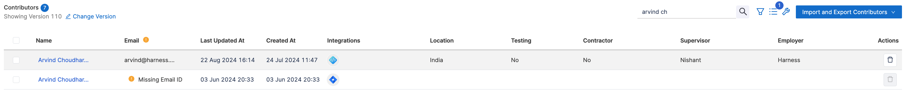
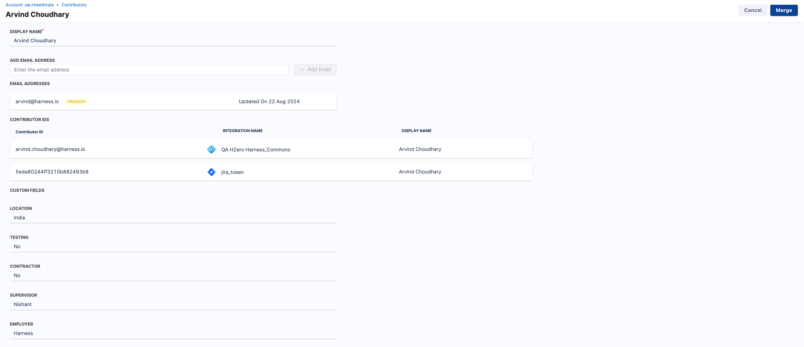
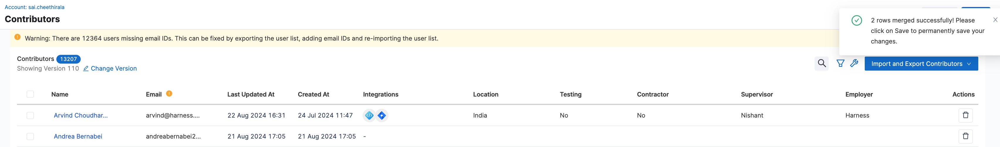

When setting up Software Engineering Insights with multiple integrations, the data ingested by each creates different integration-specific **user profiles**. SEI uses email addresses to unify these user profiles, but sometimes you might encounter multiple user profiles for the same user.

This happens when the same individual is linked to different accounts across integrations. Managing and merging these profiles ensures accurate data representation and prevents issues like:

* **Incomplete ticket tracking:** Missing links between contributors and associated tasks.
* **Missing commit information:** Difficulty tracking contributions accurately.
* **Fragmented pull request data:** Pull request history appears under multiple users.
* **Inaccurate contributor insights:** Skewed analytics and performance metrics.

### Merge contributors

When you fetch data from multiple integrations, there can be a scenario where you create multiple contributor profiles for each integration. This can lead to missing tickets, commits, or pull request data in SEI reports. To avoid such incidents, it is recommended to merge any existing duplicate contributor profiles.

1. Identify the duplicate contributor profiles. For example: A contributor with the **Harness Code integration** and an associated email and the same contributor with the **Jira integration** but without an associated email.

2. Select both contributors for the merge operation. Once both contributors are selected, an option for **Merge Contributors** will appear in the top-right corner of the screen.

3. Click on the **Merge Contributors** option

4. After clicking **Merge Contributors** you will be redirected to a screen where you can review the merge details. Review the merge details, ensuring that the correct users are selected for merging.

5. Click on the **Merge button** to initiate the merge operation.

6. After clicking **Merge** you will be redirected to a screen showing the merged user. Click on the **Save** button to confirm the merge.

7. After clicking **Save** a pop-up confirmation window will appear. Click on the **Proceed** button to confirm the merge.