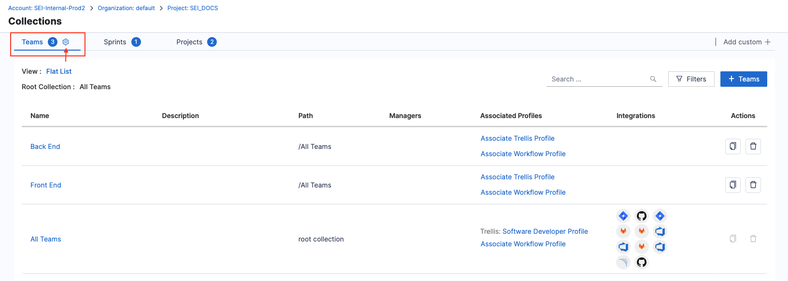
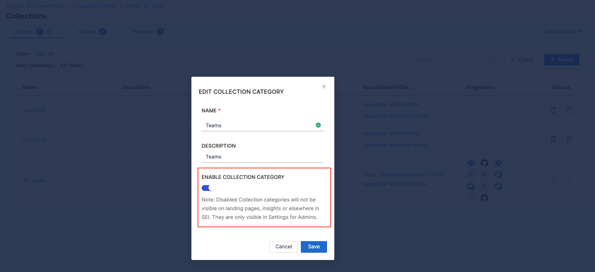
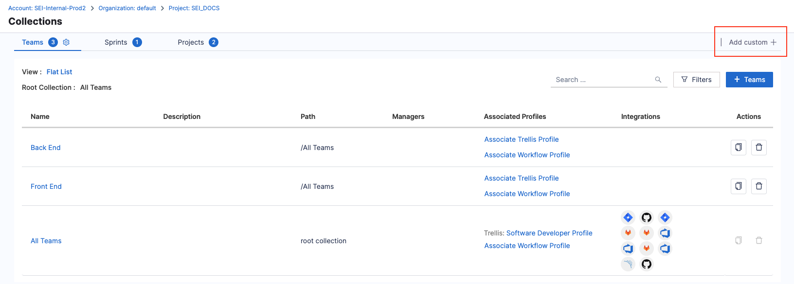
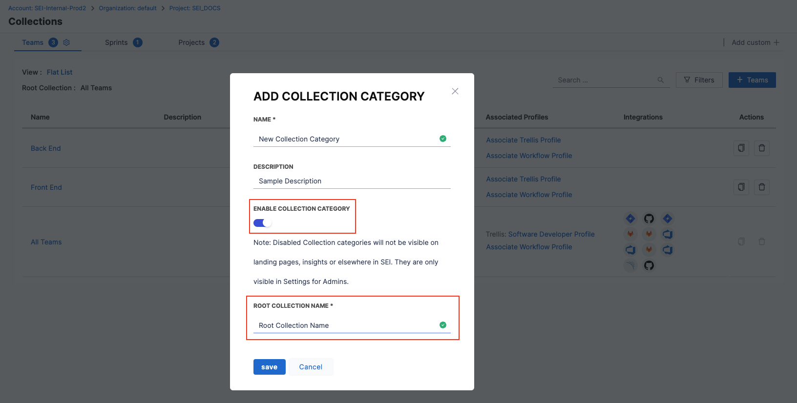
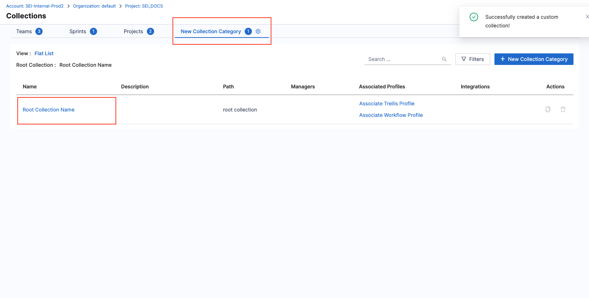

Collection categories are broad classifications that serve as containers for [Collections](/docs/software-engineering-insights/propelo-sei/setup-sei/sei-projects-and-collections/manage-collections) but are not, themselves, Collections. For example, **Teams** is an Collection category; whereas **Engineering Team** and **Docs Team** are Collections under the **Teams** category.

Each [Harness project](/docs/category/organizations-and-projects) has two default Collection categories: **Teams** and **Sprints**. You can modify the default categories and create custom categories.

For more information about the relationship between projects, Collection categories, and Collections, go to [Collection hierarchies](/docs/software-engineering-insights/propelo-sei/setup-sei/sei-projects-and-collections/manage-collection-cat).

## View, edit, and enable/disable Collection categories

1. In your Harness project, go to the SEI module, select your **Project**, and then select **Collections**.

   Collection categories are shown as tabs on the **Collections** page. This page shows only Collection categories and Collections relevant to the current project. Switch projects to view Collection categories and Collections for other projects.

2. Select the tab for the Collection category that you want to edit, and then select the **Settings** icon next to the Collection category name.

3. On the **Edit Collection Category** dialog, you can:

   * Edit the **Name** and **Description**.
   * Enable or disable the Collection category. Disabled categories are not visible on landing pages, Insights, or elsewhere in SEI, except on the Collection Settings page for SEI Admin users.

## Add Collection categories

:::tip Get Support

Adding custom Collection categories is considered an advanced feature. It is recommended to contact [Harness Support](mailto:support@harness.io) to ensure proper configuration.

:::

1. In your Harness project, go to the SEI module, select your **Project**, and then select **Collections**.

   Collection categories are shown as tabs on the **Collections** page. This page shows only Collection categories and Collections relevant to the current project. Make sure you are in the correct project before creating a Collection category.

2. Select **Add Custom**.

3. Enter a **Name** and **Description**.
4. Select **Enable Collection Category** to make the category available for Insights and elsewhere in SEI.
5. Enter the **Root Collection Name**.

   This is the name of the default, root Collection in this Collection category. It usually follows the format of `All + Collection category name`. For example, the root Collection for the Teams category is `All Teams`.

6. Select **Save**.

The new Collection category is added as a tab on the **Collection Setup** page. From here, [add Collections](/docs/software-engineering-insights/propelo-sei/setup-sei/sei-projects-and-collections/manage-collections) to your new Collection category.