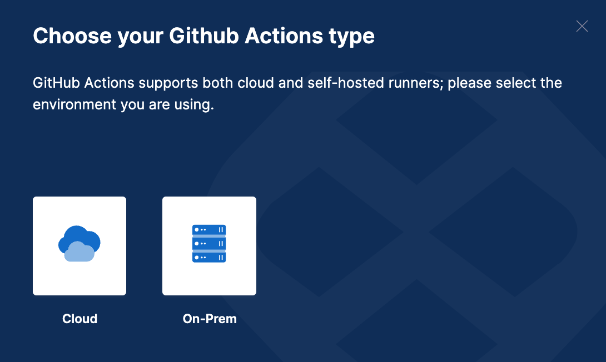
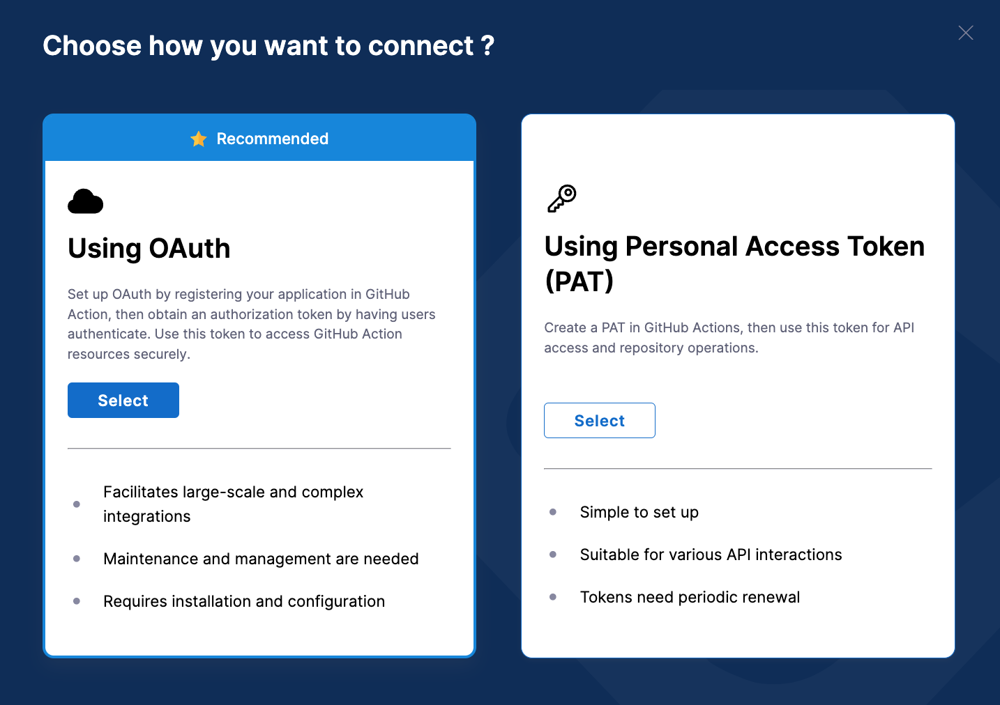
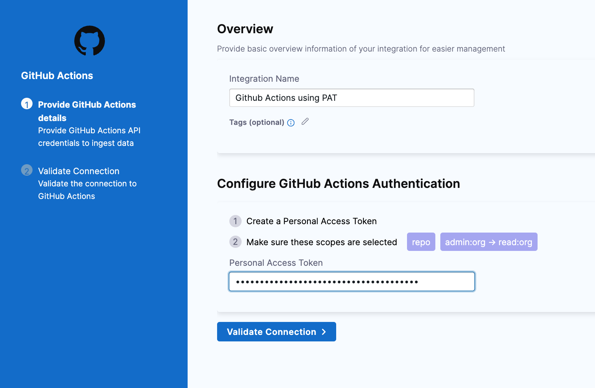
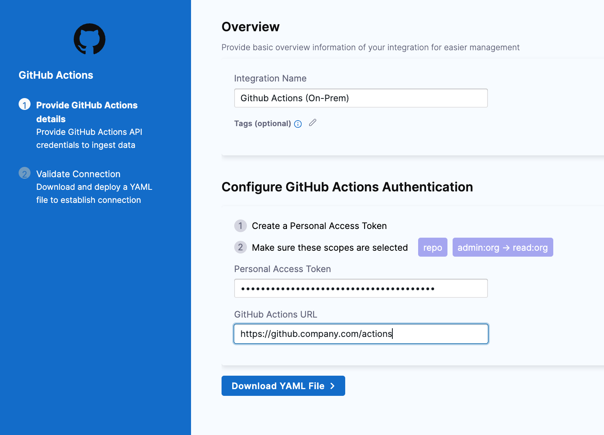

[GitHub Actions](https://docs.github.com/en/actions/learn-github-actions/understanding-github-actions) is a GitHub feature that enables you to automate various event-driven activities in GitHub, such as cloning a repository, generating Docker images, and testing scripts.

You can find over 10,000 GitHub Actions on the [GitHub Marketplace](https://github.com/marketplace?type=actions) or create your own Actions.

You can use the GitHub Action integration to integrate GitHub Actions with SEI.

## Requirements

You can either configure the integration using **Github OAuth** or use a **Github Personal Access Token (PAT)**. In case you’re using the integration using a PAT ensure to Copy the token somewhere that you can retrieve it when you configure the integration. For instructions, go to the Github documentation on Creating a personal API token.

If you can't use OAuth, you must create a GitHub personal access token to configure the SEI GitHub integration.

1. Log in to your GitHub account and create a personal access token. For instructions, go to the GitHub documentation on [Managing your personal access tokens](https://docs.github.com/en/authentication/keeping-your-account-and-data-secure/managing-your-personal-access-tokens).
2. Select the following permissions for your personal access token
   - All repo scopes, including the parent repo scope. The top-level repo scope is required for SEI to have the required visibility into your repos. (repoadmin:org -> read:org permission.)
   - If your GitHub organization uses SAML SSO, enable SSO for your personal access token. For instructions, go to the GitHub documentation on [Authorizing a personal access token for use with SAML SSO](https://docs.github.com/en/enterprise-cloud@latest/authentication/authenticating-with-saml-single-sign-on/authorizing-a-personal-access-token-for-use-with-saml-single-sign-on).

:::info
The `Triage Rule` and `Trend` custom fields are not supported as the Stacks and Aggregation option when using the Github Actions integration.
:::

import Tabs from '@theme/Tabs';
import TabItem from '@theme/TabItem';

## Connect with Github Actions (Cloud)

1. Select **Integrations** under **Data Settings**.
2. Select **Available Integrations**, locate the **Github Actions** integration.
3. Select **Install**.
4. Select the type of the Github Actions instance as **Cloud**.



<Tabs>
  <TabItem value="oauth" label="Using OAuth" default>

* Select an authentication method as **Using OAuth**.



* Follow the prompts to grant access to **GitHub**.
* In **Integration Name**, enter a name for the integration.
* Select repositories to associate with the integration or select **Ingest All Repos** to associate all current and future repos in your **GitHub organization**.
* Click on **Validate Connection** to run the pre-flight checks and validate the connection. Once successful, you'll have the integration set up under the **Your Integrations** tab.

</TabItem>
  <TabItem value="pat" label="Using Personal Accesss Token">

This authentication method is simple to set up and is suitable for various API interactions. Note that the access token needs periodic renewal based on the timeline of the generated token. 

* In **Integration Name**, enter a **Name** for the integration.
* Add a **Description** for the integration. (Optional)
* Enter the **Personal Access Token** that you generated earlier.
* Click on **Validate Connection** to run the pre-flight checks and validate the connection. Once successful, you'll have the integration set up under the **Your Integrations** tab.



</TabItem>
</Tabs>

## Connect with Github Actions (On-Prem)

To connect Harness SEI with on-prem instance of Github Actions, you'll need to use the [Ingestion Satellite](/docs/software-engineering-insights/sei-ingestion-satellite/run-the-satellite-container).

The steps for configuring the integration using the **Ingestion Satellite** is similar to configuring the integration on Cloud, with the exception of using satellite to communicate with the Github server.

1. In **Integration Name**, enter a **Name** for the integration.
2. Add a **Description** for the integration. (Optional)
3. Enter the **Personal Access Token** that you generated earlier.
4. In the **Github Actions URL** field, add the URL where your GitHub Actions instance is hosted.
5. Click on the **Download YAML File** button and save the `satellite.yml` file. Update it following the instructions [here](/docs/software-engineering-insights/sei-ingestion-satellite/run-the-satellite-container).



If you experience any issues while configuring the integration using the Ingestion Satellite, refer to the [Ingestion Satellite Troubleshooting and FAQs](/docs/software-engineering-insights/sei-ingestion-satellite/satellite-troubleshooting-and-faqs).

Here’s a sample `satellite.yml` file:

```yaml
satellite:
  tenant: <ACCOUNT_ID>
  api_key: <ACCOUNT_API_KEY>
  url: "https://app.harness.io/gratis/sei/api" 
  # Note that this URL is relative to the Environment of your Harness Account.
integrations:
  - id: "<INTEGRATION_ID>"
    application: github_actions
    url: "<GITHUB_INSTANCE_URL>"
    authentication: apikey
```

<details>
<summary>Supported Reports</summary>

Following reports are supported for the Github Action integration:

- CICD Job Count Report
- CICD Job Count Trend Report
- CICD Job Duration Report
- CICD Job Duration Single Stat
- CICD Job Duration Trend Report
- CICD Jobs Count Single Stat
- CICD Pipeline Jobs Count Report
- CICD Pipeline Jobs Count Trend Report
- CICD Pipeline Jobs Duration Report
- CICD Pipeline Jobs Duration Trend Report
- Deployment Frequency - Dora widget
- Change Failure Rate - Dora widget

</details>

## Send artifact information to Harness SEI

This section provides step-by-step instructions on how you can set up a GitHub Actions workflow to allow SEI to ingest the data for the artifacts and environment variables from GitHub Actions.

### Prerequisites

- A GitHub repository for your project
- SEI API Key & SEI Integration ID
- Access to GitHub Actions for the repository.
- Familiarity with environment variables and GitHub Actions configuration.

### Set up the workflow

Follow these steps to set up the workflow:

1. Create an **SEI API Key**
   1. Go to your **SEI account** and create an **API Key**.
   2. Give the API Key a **Name** and **Description**.
   3. Set the role as `Ingestion`.
2. Create **Organization/Repository Secret**
   1. To securely store the **SEI API Key**, you can create a **GitHub secret** in either your organization or your repository, depending on your preference.
   2. For **Organization Secret**, go to [creating secrets in an organization](https://docs.github.com/en/codespaces/managing-codespaces-for-your-organization/managing-secrets-for-your-repository-and-organization-for-github-codespaces#adding-secrets-for-an-organization) Give the secret a name (e.g., `SEI_API_KEY`) and store the SEI API Key value.
   3. For **Repository Secret**, go to [creating secrets in a repository](https://docs.github.com/en/codespaces/managing-codespaces-for-your-organization/managing-secrets-for-your-repository-and-organization-for-github-codespaces#adding-secrets-for-a-repository)Give the secret a name (e.g., `GITHUB_SECRETS`) and store the **SEI API Key** value.
3. Create the **GitHub Actions Integration** and make a note of the **Integration ID**, which you will need in the next steps. For more information, go to [configure the integration on the cloud](#configure-the-integration).

4. Append the following steps to your existing GitHub Actions workflow configuration:

```yaml
- name: Push artifacts to SEI Endpoint
  id: push_artifacts
  env:
    base_url: "https://app.harness.io/gateway/sei/api/v1" # Change the URL based on your environment (e.g., eu1, asia1, etc.)
    payload: '{"integration_id":"<INTEGRATION_ID>","repository":"${{ github.repository }}","job_run_number":"${{ github.run_number }}","job_name":"${{ github.workflow }}","artifacts":[{"name":"<ADD_IMAGE_NAME>", "location":"<ADD_LOCATION>", "tag":"<ADD_TAG>", "digest":"<ADD_DIGEST>","type":"<ADD_TYPE>", "artifact_created_at":"<ADD_ARTIFACT_CREATED_AT>"}]}'
  run: curl '${{ env.base_url }}/v1/cicd/push_artifacts' -H 'accept:application/json' -H 'authorization:Apikey ${{ secrets.SEI_API_KEY }}' -H 'content-type:application/json' --data-raw '${{ env.payload }}' --compressed --globoff

- name: Push params to SEI Endpoint
  id: push_params
  env:
    base_url: "https://app.harness.io/gateway/sei/api/v1" # Change the URL based on your environment (e.g., eu1, asia1, etc.)
    payload: '{"integration_id":"<INTEGRATION_ID>","repository":"${{ github.repository }}","job_run_number":"${{ github.run_number }}","job_name":"${{ github.workflow }}","params":[{"name":"<ADD_NAME>","type":"<ADD_TYPE>","value":"<ADD_VALUE>"}]}'
  run: curl '${{ env.base_url }}/v1/cicd/push_job_run_params' -H 'accept:application/json' -H 'authorization:Apikey ${{ secrets.SEI_API_KEY }}' -H 'content-type:application/json' --data-raw '${{ env.payload }}' --compressed --globoff
```

5. Make sure to update the `INTEGRATION_ID` in the workflow step with your actual SEI Integration ID. Also, update the `BASE_URL` according to your environment:
   - **Base URL (PROD2):** https://app.harness.io/gratis/sei/api/v1/
   - **Base URL (PROD1):** https://app.harness.io/prod1/sei/api/v1/

6. If there is an issue with the SEI endpoint (e.g., if the endpoint is down, 500 Internal Server Error), and you want the workflow run to fail if artifacts are not sent to SEI, use the -f flag in the curl command.

```bash
   curl -f <REQUEST>
```

1. Refer to the metadata below to request and ingest the artifact data from GitHub Actions into SEI.

|                     | Description                                                                                                      |
| ------------------- | ---------------------------------------------------------------------------------------------------------------- |
| name                | Image name of the artifact (e.g., ghcr.io/organization/repository:v0.1.1 where the repository is the image name) |
| location            | Location of the artifact (e.g., ghcr.io/organization)                                                            |
| tag                 | Tag of the image (e.g., ghcr.io/organization/repository:v0.1.1 where v0.1.1 is the tag/qualifier).               |
| digest              | Digest/Hash of the generated artifact (e.g., sha256.).                                                           |
| type                | Type of the generated artifact (optional). If CD is Harness, set type as "container" for correlation.            |
| artifact_created_at | Creation time of the artifact in UTC format (optional).                   |

- `name`, `location`, `tag`, and `digest` of the artifact are required fields.
- If `type`, `artifact_created_at`, or `digest` are not available you can remove those fields from the object.
- `type` and `artifact_created_at` are optional fields.

8. Refer to the metadata below to ingest the environment variables data from GHA into SEI. <br />Note that all the keys mentioned are required fields.

| Keys  | Description                                           |
| ----- | ----------------------------------------------------- |
| name  | The environment variable name                         |
| type  | The type of the environment variable (string/integer) |
| value | The associated value for the environment variable     |

Here's a sample Github Actions workflow:

```yaml
name: Creating artifacts
run-name: ${{ github.actor }} is creating artifacts
on:
  push:
    branches:
      - main
  workflow_dispatch:

jobs:
  check_env:
    runs-on: ubuntu-latest
    env:
      integration_id: 1
      sample: ${{ github.run_id }}
    steps:
      - name: Check artifacts
        run: echo 'Integration ID - ${{ env.integration_id }}'

  running-resuable-workflow:
    runs-on: ubuntu-latest
    env:
      check_run_id: 0
      modulo: 1
    steps:
      - name: Workflow Step 1
        run: echo 'Hello World';echo ${{ github.run_id }};echo ${{ env.modulo }}
      - name: Workflow Step 2 - If condition
        run: echo 'Exiting successfully'

  deploy-to-docker:
    runs-on: ubuntu-latest
    steps:
      - name: Configure Python in Ubuntu Environment
        run: |
          python3 -m pip install requests
          docker -v
      - uses: actions/checkout@v4
      - name: List files
        run: |
          pwd
          ls
      - name: Execute Python script
        run: |
          python3 sample_script.py
          ls /tmp/
        working-directory: ./temp/

      - name: Docker Login
        uses: docker/login-action@v1
        with:
          username: ${{ secrets.DOCKER_USERNAME }}
          password: ${{ secrets.DOCKER_PASSWORD }}
      - name: Build docker image
        run: |
          echo "Building image"
          docker system info | grep -E 'Username|Registry'
          docker build -t username/repo:tag .
        working-directory: ./temp/

      - name: Push Docker Image
        id: docker_deploy
        run: |
          docker push username/repo:tag
          echo "digest=$(docker inspect --format='{{index .RepoDigests 0}}' username/repo:tag | cut -d'@' -f2)" >> "$GITHUB_OUTPUT"
        working-directory: ./temp/
      - name: Logout Docker
        run: |
          echo "${{steps.docker_deploy.outputs.digest}}"
          docker logout
    outputs:
      docker_digest: ${{ steps.docker_deploy.outputs.digest }}

  push_artifacts_to_sei:
    runs-on: ubuntu-latest
    needs: deploy-to-docker
    steps:
      - name: Push artifacts to SEI Endpoint
        id: push_artifacts
        env:
          base_url: "https://app.harness.io/gateway/sei/api/v1" # change the URL based on environment e.g. eu1, asia1, etc.
          integration_id: 155
          docker_image: "username/repo"
          tag: v1.18.0
          type: "Test_repo2"
          payload: '{"integration_id":"155","repository":"${{ github.repository }}","job_run_number":"${{ github.run_number }}","job_name":"${{ github.workflow }}","artifacts":[{"name":"temp-test_rep01", "location":"registry.hub.docker.com/username", "tag":"v1.18.0", "type":"container", "digest": "${{needs.deploy-to-docker.outputs.docker_digest}}","artifacts_created_at": "2023-01-01T12:00:00.000+00:00"}]}'
        run: |
          curl '${{ env.base_url }}/v1/cicd/push_artifacts' -H 'accept:application/json' -H 'authorization:Apikey ${{ secrets.SEI_API_KEY }}' -H 'content-type:application/json' --data-raw '${{ env.payload }}' --compressed --globoff

      - name: Push params to SEI Endpoint
        id: push_params
        env:
          base_url: "https://app.harness.io/gateway/sei/api/v1" # change the URL based on environment e.g. eu1, asia1, etc.
          payload: '{"integration_id":"155","repository":"${{ github.repository }}","job_run_number":"${{ github.run_number }}","job_name":"${{ github.workflow }}","params":[{"name":"docker_image","type":"string","value":"username/repo"}, {"name":"tag","type":"string","value":"v1.18.0"}, {"name":"artifacts_created_at","type":"string","value":"2023-01-01T12:00:00.000+00:00"}]}'
        run: curl '${{ env.base_url }}/v1/cicd/push_job_run_params' -H 'accept:application/json' -H 'authorization:Apikey ${{ secrets.SEI_API_KEY }}' -H 'content-type:application/json' --data-raw '${{ env.payload }}' --compressed --globoff
```

:::tip

- If the SEI API fails, the workflow will not be able to send the artifacts or the job run parameters. In such cases, you will need to re-execute the Github Actions workflow.
- Artifacts data from existing/previous workflow executions cannot be ingested into SEI.
- Ensure that the tag names of images are unique to maintain the correct correlation between CI and CD processes.

:::
