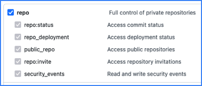

GitHub provides hosting for software development and version control using Git.

Use the SEI GitHub integration to integrate SEI with GitHub.

:::info Personal and organization repositories

SEI only ingests repositories from organizations. SEI doesn't ingest your personal repos or repos where you are a collaborator but not a member of the affiliated organization.

In other words, the owner of the [GitHub personal access token](https://docs.github.com/en/authentication/keeping-your-account-and-data-secure/managing-your-personal-access-tokens) that is associated with the integration must be a direct member of an organization for a repo to be ingested by SEI.

:::

## Configure authentication

The SEI GitHub integration can use either OAuth or personal access token authentication.

If you can't use OAuth, you must create a GitHub personal access token to configure the SEI GitHub integration.

1. Log in to your GitHub account and create a personal access token. For instructions, go to the GitHub documentation on [Managing your personal access tokens](https://docs.github.com/en/authentication/keeping-your-account-and-data-secure/managing-your-personal-access-tokens).
2. Select the following permissions for your personal access token:

   * All `repo` scopes, including the parent `repo` scope. The top-level `repo` scope is required for SEI to have the required visibility into your repos.

   

   * The `read:org` scope under `admin:org`.

   

   * The `admin:org_hook` scope is required to track issue cycle time (for the [SCM Issue Time Across Stages Report](/docs/software-engineering-insights/sei-metrics-and-reports/velocity-metrics-reports/scm-reports)). If you don't want to track issue cycle time, you don't need to select this permission.

   

3. Copy the token somewhere that you can retrieve it when you configure the integration.
4. If your GitHub organization uses SAML SSO, enable SSO for your personal access token. For instructions, go to the GitHub documentation on [Authorizing a personal access token for use with SAML SSO](https://docs.github.com/en/enterprise-cloud@latest/authentication/authenticating-with-saml-single-sign-on/authorizing-a-personal-access-token-for-use-with-saml-single-sign-on).

```mdx-code-block
import Tabs from '@theme/Tabs';
import TabItem from '@theme/TabItem';
```

## Configure the integration

```mdx-code-block
<Tabs>
  <TabItem value="cloud" label="Cloud" default>
```

1. In your Harness project, go to the SEI module, and select **Account**.
2. Select **SEI Integrations** under **Data Settings**.
3. Select **Available Integrations**, locate the **GitHub Enterprise** or **GitHub Cloud** integration, depending on your GitHub configuration.
4. Select **Install**.
5. Select an authentication method for the integration:

   * To use OAuth, select **Authorize** and follow the prompts to grant access to GitHub.
   * To use a personal access token, paste the token in **Enter the Access Token**.

6. In **Integration Name**, enter a name for the integration.
7. Select repositories to associate with the integration or select **Ingest All Repos** to associate all current and future repos in your GitHub organization.
8. If applicable, configure **Additional Options**:

   * **Fetch PRs:** Allow SEI to ingest PR data from GitHub.
   * **Fetch Issues:** Allow SEI to ingest data from GitHub Issues.
   * **Fetch Projects:** Allow SEI to ingest data from GitHub Projects.
   * **Fetch Commits:** Allow SEI to ingest commit metadata from GitHub.
   * **Fetch Commit Files:** Allow SEI to ingest data within commits from GitHub.
   * **Connect via GitHub webhook:** Select this option if you want GitHub to *push data to SEI* through a webhook, rather than SEI *pulling data from GitHub*. This is an advanced configuration and only recommended if you are confident about using this configuration.

9. Finish configuration and save the integration.

:::info Issue Cycle Time webhook

If you created a personal access token and allowed the `admin:org_hook` permission, SEI creates a user webhook to receive issue cycle time data for the [SCM Issue Time Across Stages Report](/docs/software-engineering-insights/sei-metrics-and-reports/velocity-metrics-reports/issues-reports.md).

If you used OAuth, SEI creates an organization webhook instead.

:::

```mdx-code-block
  </TabItem>
  <TabItem value="satellite" label="Satellite">
```

The steps for configuring the integration using satellite is similar to configuring the integration on cloud, with the exception of using **satellite to communicate** with the Github server.

Make sure to select the **satellite integration checkbox** while configuring the integration.

1. In Integration **Name**, enter a name for the integration.
2. Add a **description** for the integration. (Optional)
3. In the **URL** field, add the URL where your GitHub repository is deployed. 
   
   For example, if your GitHub is deployed on a **virtual machine (VM)**, add the **URL** in the format: `https://<IP_ADDRESS`>.
4. If applicable, configure **Additional Options**:
   1. **Fetch PRs**: Allow SEI to ingest PR data from GitHub.
   2. **Fetch Issues**: Allow SEI to ingest data from GitHub Issues.
   3. **Fetch Projects**: Allow SEI to ingest data from GitHub Projects.
   4. **Fetch Commits**: Allow SEI to ingest commit metadata from GitHub.
   5. **Fetch Commit Files**: Allow SEI to ingest data within commits from GitHub.
   6. **Connect via GitHub webhook**: Select this option if you want GitHub to push data to SEI through a webhook, rather than SEI pulling data from GitHub. This is an advanced configuration and only recommended if you are confident about using this configuration.
5. Select **Next** and click on **Download Config** and save the `satellite.yml` file. Update it following the instructions [here](/docs/software-engineering-insights/sei-ingestion-satellite/satellite-overview).

Here’s a sample `satellite.yml` file:

```
satellite:
  tenant: foo
  api_key: <api-key>
  url: 'https://testapi1.propelo.ai'
integrations:
  - id: '4688'
    application: github
    url: 'https://IP_ADDRESS/'
    metadata:
      fetch_prs: true
      fetch_issues: true
      fetch_commits: true
      fetch_commit_files: true
      is_push_based: true
      fetch_projects: true
    authentication: multiple_api_keys
    keys:
      - apikey: <github-pat>

```

If you encounter any issues during the integration process, go to the Satellite integration [Troubleshooting and FAQs](/docs/software-engineering-insights/sei-ingestion-satellite/satellite-troubleshooting-and-faqs).

```mdx-code-block
  </TabItem>
</Tabs>
```