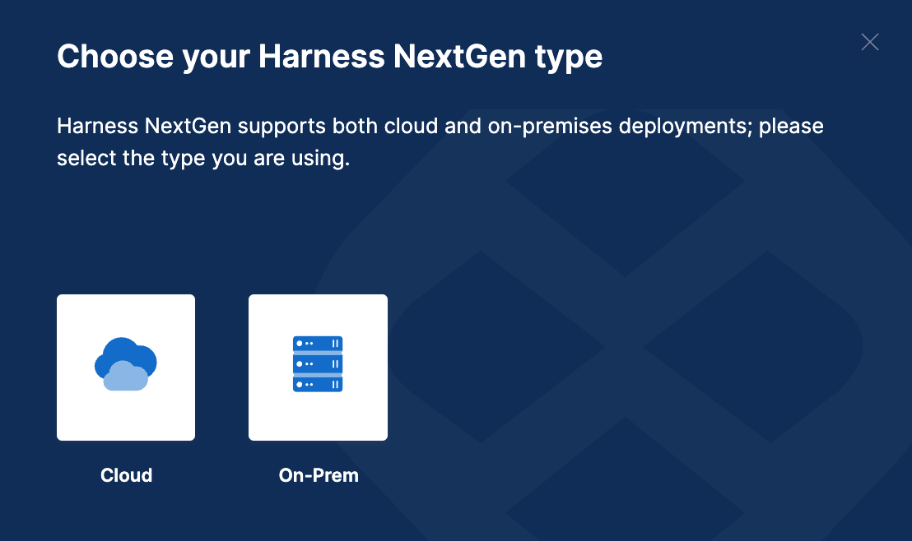
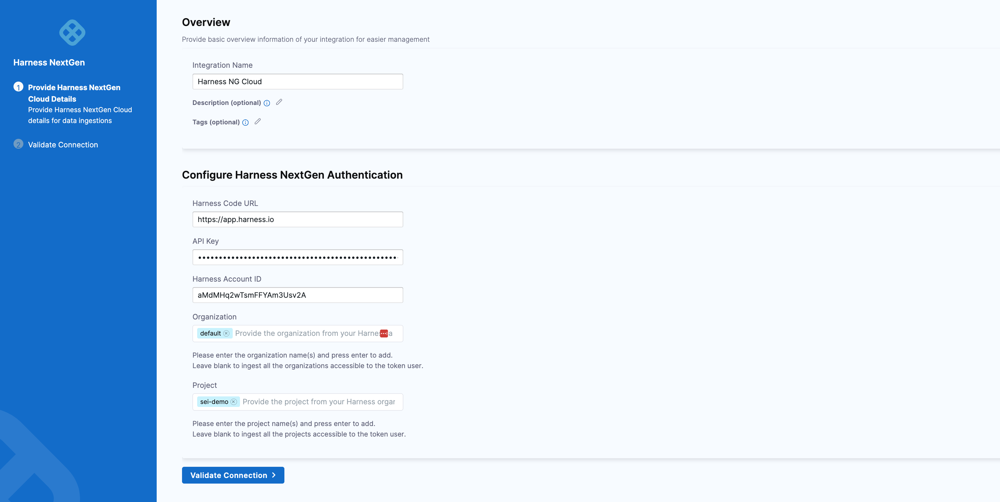
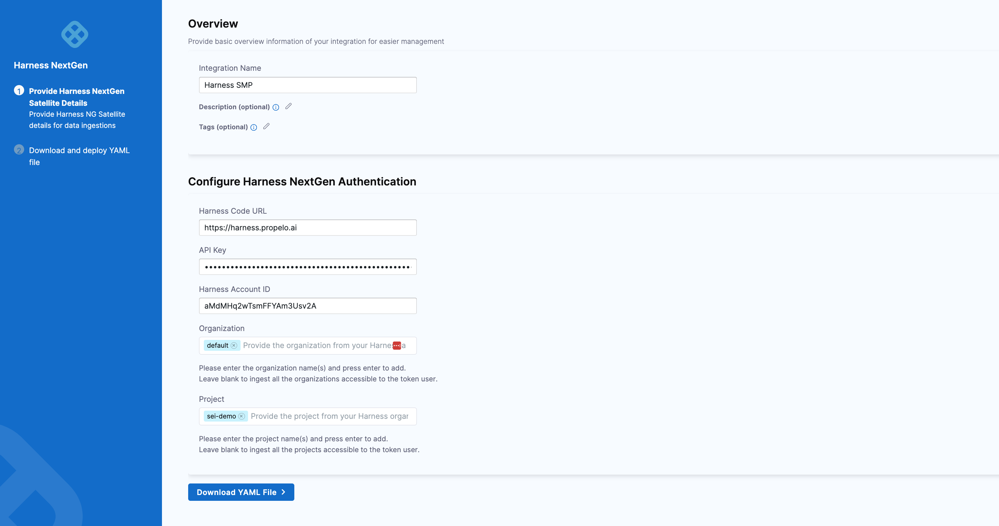

Harness is a modern software delivery platform that allows engineers and DevOps to build, test, deploy, and verify the software on demand.

Use the SEI Harness integration to integrate SEI with your Harness CI/CD modules.

## Requirements

To configure the SEI Harness integration, you need:

* Your Harness account ID. You can find this under **Account Settings**.
* A [Harness API key and token](/docs/platform/automation/api/add-and-manage-api-keys).

Copy the account ID and token somewhere that you can retrieve them when you configure the integration.

import Tabs from '@theme/Tabs';
import TabItem from '@theme/TabItem';

## Configure the integration

1. In your **Harness Project**, go to the **SEI Module**, and select **Account**.
2. Select **Integrations** under **Data Settings**.
3. Select **Available Integrations**, locate the **Harness NG integration**, and select **Install**.

<Tabs>
  <TabItem value="cloud" label="Cloud" default>

* Select the type of the **HarnessNG account** as **Cloud**.



* Configure and **Save** the integration.
   * **URL**: Enter `https://app.harness.io`.
   * **API key**: Enter your Harness personal access token.
   * **Account ID**: Enter your Harness account ID.
   * **Name**: Enter a name for the integration.
   * **Description** and **Tags** are optional.
   * **Organization**: Enter your organization name. If you have multiple organizations, you can use a comma-separated list.
     
     For example, "Youtube, YouTubeTV." Please note that organization names are case-sensitive. You can leave this field blank to include all organizations accessible to the token user.
   * **Project**: Enter your project name. Similarly, you can use a comma-separated list if you have multiple projects.
     
     For example, "`org/project`, `org2/project2`" Like organization names, project names are case-sensitive. Leaving this field blank will ingest all the projects from organizations accessible to the token user.
* Click on **Validate Connection** to run the pre-flight checks and validate the connection. Once successful, you'll have the integration set up under the **Your Integrations** tab.



</TabItem>

<TabItem value="harness-smp" label="Harness Self-Managed Enterprise Edition">

You can connect Harness SEI with Harness Self-Managed Enterprise Edition (Harness On-Prem), using the [Ingestion Satellite](/docs/software-engineering-insights/sei-ingestion-satellite/run-the-satellite-container)

The steps for configuring the integration using **Satellite** is similar to configuring the integration on cloud using the API key, with the exception of using satellite to communicate with the Harness NG server.

* Select the type of the **HarnessNG account** as **On-Prem**.


* Configure and **Save** the integration.
   * **URL**: Enter `https://app.harness.io`.
   * **API key**: Enter your Harness personal access token.
   * **Account ID**: Enter your Harness account ID.
   * **Name**: Enter a name for the integration.
   * **Description** and **Tags** are optional.
   * **Organization**: Enter your organization name. If you have multiple organizations, you can use a comma-separated list.
     
     For example, "Youtube, YouTubeTV." Please note that organization names are case-sensitive. You can leave this field blank to include all organizations accessible to the token user.
   * **Project**: Enter your project name. Similarly, you can use a comma-separated list if you have multiple projects.
     
     For example, "`org/project`, `org2/project2`" Like organization names, project names are case-sensitive. Leaving this field blank will ingest all the projects from organizations accessible to the token user.
* Click on **Download YAML File** and save the `satellite.yml` file. Update it following the instructions [here](/docs/software-engineering-insights/sei-ingestion-satellite/satellite-overview).



If you experience any issues while configuring the integration using the Ingestion Satellite, refer to the [Ingestion Satellite Troubleshooting and FAQs](/docs/software-engineering-insights/sei-ingestion-satellite/satellite-troubleshooting-and-faqs).

Here’s a sample `satellite.yml` file:

```yaml
satellite:
  tenant: <ACCOUNT_ID>
  api_key: <ACCOUNT_API_KEY>
  url: 'https://app.harness.io/gratis/sei/api'
  # Note that this URL is relative to the Environment of your Harness Account.
integrations:
  - id: '<INTEGRATION_ID>'
    application: harnessng
    url: '<HARNESS_URL>'
    api_key: <HARNESS_API_KEY>
    metadata:
      accountId: <HARNESS_NG_ACCOUNTID>
      organization: default
      project: default

```

</TabItem>
</Tabs>
