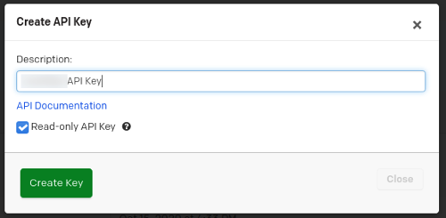

PagerDuty specializes in a SaaS incident response platform for IT departments.

Use the SEI PagerDuty integration to integrate SEI with any Cloud-based PagerDuty account/plan.

:::note
The 202403.2 release added the support to measure the incident recovery time using the DORA MTTR report for the PagerDuty integration. To learn more, go to [Measure incident recovery time](/docs/software-engineering-insights/early-access/metrics-reports/mttr-incident-recovery).
:::

## Requirements

To use the SEI PagerDuty integration, you need a **read-only PagerDuty API key**. Copy the key somewhere that you can retrieve it when you configure the integration. For instructions, go to the PagerDuty documentation on [API Access Keys](https://support.pagerduty.com/docs/api-access-keys).

:::info
If you have enabled an allow list in your PagerDuty account, certain Harness IP addresses must be added to it in order to allow communication between the Harness Platform and PagerDuty. If the necessary IPs are not whitelisted, the integration may fail to authenticate or sync data properly.

To ensure your integration can work correctly, please refer to the list of [Harness Platform IPs](/docs/platform/references/allowlist-harness-domains-and-ips) that may need to be whitelisted in your firewall.
:::

<figure>



<figcaption>Creating a read-only PagerDuty API key.</figcaption>
</figure>

import Tabs from '@theme/Tabs';
import TabItem from '@theme/TabItem';

:::info
Note that after the integration is configured, you can define the Collection definition using Filters for  Pagerduty fields such as PD Service, Incident Priority, Incident Urgency, Alert Severity and User ID.
:::

## Configure the integration

<Tabs>
  <TabItem value="cloud" label="Cloud" default>

1. In your **Harness Project**, select the **SEI Module**, and go to your **Account**.
2. Select **Integrations** under **Data Settings**.
3. Select **Available Integrations**, locate the **PagerDuty** integration, and select **Install**.
4. Configure and save the integration.

   * **URL:** Enter `https://api.pagerduty.com`, unless you have a special use case that requires a different URL.
   * **Username:** The email address of the user that created the API key in PagerDuty.
   * **API Key:** Enter your PagerDuty API key.
   * **Name:** Enter a name for the integration.
   * **Description** and **Tags** are optional.

To integrate with an on-premises PagerDuty offering, you must use an [Ingestion Satellite](/docs/category/ingestion-satellite).

</TabItem>
  <TabItem value="satellite" label="Satellite">

The steps for configuring the integration using **Satellite** is similar to configuring the integration on cloud, with the exception of using satellite to communicate with the Pagerduty server.

Make sure to select the satellite integration checkbox while configuring the integration. Once you save the integration a satellite.yml file will be automatically generated and downloaded to your computer. Update it following the instructions [here](/docs/software-engineering-insights/sei-ingestion-satellite/satellite-overview).

If you experience any issues while configuring the integration using the Ingestion Satellite, refer to the [Ingestion Satellite Troubleshooting and FAQs](/docs/software-engineering-insights/sei-ingestion-satellite/satellite-troubleshooting-and-faqs).

Here’s a sample `satellite.yml` file

```yaml
satellite:
  tenant: <ACCOUNT_ID>
  api_key: <ACCOUNT_API_KEY>
  url: 'https://app.harness.io/gratis/sei/api' 
  # Note that this URL is relative to the Environment of your Harness Account.

integrations:
  - id: '<INTEGRATION_ID>'
    application: pagerduty
    url: <PAGERDUTY_INSTANCE_URL>
    username: <PAGERDUTY_USERNAME>
    api_key: <PAGERDUTY_API_KEY>
```
    
</TabItem>
</Tabs>