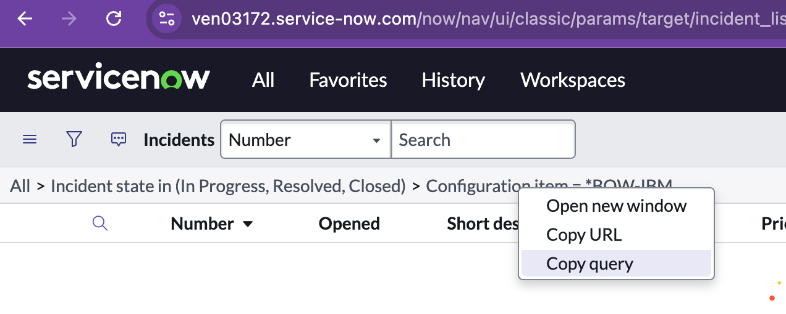
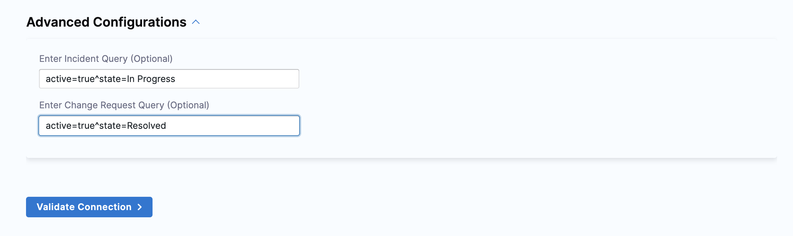
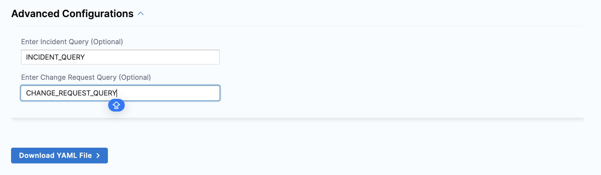

import Tabs from '@theme/Tabs';
import TabItem from '@theme/TabItem';

:::info
The SEI ServiceNow integration is currently in BETA and is accessible behind the Feature Flag `<SEI_SERVICENOW>`. Please contact [Harness Support](/docs/software-engineering-insights/sei-support) to enable this feature.
:::

ServiceNow is used to set up systems that define, manage, automate and structure IT services for companies. You can use the SEI ServiceNow integration to integrate SEI with ServiceNow Cloud and ServiceNow On-Prem accounts.

This integration allows you to track, manage, and analyze incidents, and change requests in real-time, leading to improved efficiency and enhanced productivity.

<DocVideo src="https://www.youtube.com/embed/wFWHAAIj3_o?si=mL8xNInFtNp4GwPG" />

## Requirements

To connect ServiceNow with Harness SEI, you can choose between two authentication methods:

* **Using Username and Password:** Use the service account credentials for direct authentication.
* **Using OAuth:** Use token-based authentication with OAuth credentials.

Ensure the service account has the required credentials and permissions to successfully configure the integration.

<Tabs>
<TabItem value="Using OAuth" default>

### OAuth Credentials

To configure the integration using OAuth-based authentication, you'll need to generate the following credentials in your ServiceNow instance:

* [ServiceNow Client ID](#create-a-client-id-and-client-secret-in-servicenow)
* [ServiceNow Client Secret](#create-a-client-id-and-client-secret-in-servicenow)

These credentials are essential for secure, token-based authentication between your application and the ServiceNow platform. To generate the credentials, go to [Create a Client ID and Client Secret in ServiceNow](#create-a-client-id-and-client-secret-in-servicenow)

### Required permissions

When configuring the ServiceNow integration, ensure the service account has the following roles:

* **itil:** Provides access to IT Service Management (ITSM) functionalities.
* **oauth_admin:** Required only if using the OAuth flow for creating integrations. This role allows management of OAuth applications.
* **personalize_choices:** Enables customization of choice lists.
* **personalize_dictionary:** Allows modification of dictionary entries.

To fetch data for all users within the ServiceNow instance, the following roles are required:

* **user:** Basic role assigned to all ServiceNow users.
* **user_admin:** Provides administrative capabilities over user accounts.

</TabItem>

<TabItem value="Using Username & Password">

When configuring the ServiceNow integration, ensure the service account has the following roles:

* **itil:** Provides access to IT Service Management (ITSM) functionalities.
* **personalize_choices:** Enables customization of choice lists.
* **personalize_dictionary:** Allows modification of dictionary entries.

To fetch data for all users within the ServiceNow instance, the following roles are required:

* **user:** Basic role assigned to all ServiceNow users.
* **user_admin:** Provides administrative capabilities over user accounts.

</TabItem>
</Tabs>


:::info
If you have enabled an allow list in your ServiceNow account, certain Harness IP addresses must be added to it in order to allow communication between the Harness Platform and ServiceNow. If the necessary IPs are not whitelisted, the integration may fail to authenticate or sync data properly.

To ensure your integration can work correctly, please refer to the list of [Harness Platform IPs](/docs/platform/references/allowlist-harness-domains-and-ips) that may need to be whitelisted in your firewall.
:::

### Create a Client ID and Client Secret in ServiceNow

To create a Client ID and Client Secret in ServiceNow, follow these steps:

<Tabs>
<TabItem value="Interactive Guide">
  <iframe 
    src="https://app.tango.us/app/embed/331fe2f1-c6bb-401d-a9af-c94cc87384c0" 
    title="Step-by-step instructions to create a ServiceNow Client ID and Client Secret" 
    style={{minHeight:'640px'}}
    width="100%" 
    height="100%" 
    referrerpolicy="strict-origin-when-cross-origin" 
    frameborder="0" 
    webkitallowfullscreen="webkitallowfullscreen" 
    mozallowfullscreen="mozallowfullscreen" 
    allowfullscreen="allowfullscreen"></iframe>
</TabItem>
<TabItem value="Step-by-step">

* Log in to the **ServiceNow** platform with an admin account.

* Navigate to **System OAuth > Application Registry**.

* Click the **New** button to create a new application registry.

* Select **Create an OAuth API endpoint for external clients**.

* Enter a descriptive name for the application registry, e.g., "SEI Connect".

* Locate the **Redirect URL** in the **SEI ServiceNow integration** configuration settings. Click the lock button and paste the Redirect URL copied from SEI.

* In the **Auth Scopes** section, add the table_read scope.

* Click **Submit** to create the application registry.

* After the successful creation of the application registry, open the newly created application.

* Click the lock button to display the **Client Secret**.

* Copy and save the **Client ID** and **Client Secret**, as they will be required during the integration configuration on the SEI platform.

Please note that the Client ID and Client Secret are sensitive credentials and should be handled with care.

</TabItem>
</Tabs>

## Connect with ServiceNow Cloud

### Step 1: Select the integration

* In your **Harness project**, go to the **SEI module**, and select **Account**.
* Select **Integrations** under **Integration and Data Settings**.
* Select **Available Integrations**, locate the **ServiceNow integration** under the **Others** **integration** tab and select **Install**.

### Step 2: Choose the Type of ServiceNow setup

Select the type of ServiceNow setup as ServiceNow Cloud.


### Step 3: Configure the integration

The ServiceNow integration can set up the authentication either by using Username and Password or by using OAuth mode of authentication.

<Tabs>
  <TabItem value="Username" label="Username/Password" default>

* Choose the authentication mode as Using Username and Password.


* Enter a name for this ServiceNow integration. You can add **Description** and **Tags** (Optional).
* Enter the base URL you use to access ServiceNow. For example: `https://example.service-now.com`.
* Add the **Username** and **Password**, of the **ServiceNow Service Account**.
* Set the timezone to UTC by default. If you use a different timezone, specify it here.


#### Advanced Configurations (Optional)

If you want to filter the incidents or change requests to be ingested, create a query in your ServiceNow account:

* In the ServiceNow app define a filter query for incidents or change requests.
* Right-click the query in ServiceNow to copy it.



* Paste the copied query into the integration configuration settings to apply the filter.



* Click on the **Next: Validate Connection**.
  
  It will establish a connection with the provided URL, perform authentication, and then run the preflight checks. If everything is successful, you will see a message confirming a successful connection.
* Click on the **Done** button and the integration will be successfully saved.


</TabItem>
  <TabItem value="Oauth" label="OAuth">


* Choose the **Authentication Method** as **Use ServiceNow OAuth**
* Enter a name for this ServiceNow integration. You can add **Description** and **Tags** (Optional).
* Enter the base URL you use to access ServiceNow. For example: `https://example.service-now.com`.
* Add the **ServiceNow Client ID** and **Client Secret** that you generated after creating the application registry in ServiceNow
* Set the timezone to UTC by default. If you use a different timezone, specify it here.
* Click on the **Connect ServiceNow** button. This will redirect you to the ServiceNow application.
* Allow the application and grant the required permissions, and it will redirect you back to SEI
* Click on the **Next: Validate Connection**.
  
  It will establish a connection with the provided URL, perform authentication, and then run the preflight checks. If everything is successful, you will see a message confirming a successful connection.
* Click on the **Done** button and the integration will be successfully saved.


</TabItem>
</Tabs>

## ServiceNow On-Prem

### Step 1: Select the integration

* In your **Harness project**, go to the **SEI module**, and select **Account**.
* Select **Integrations** under **Integration and Data Settings**.
* Select **Available Integrations**, locate the **ServiceNow integration** under the **Others** **integration** tab and select **Install**.

### Step 2: Choose the Type of ServiceNow setup

Select the type of ServiceNow setup as ServiceNow On-Prem.


### Step 3: Configure the integration

The ServiceNow on-prem integration can set up the authentication only using the ServiceNow account's Username and Password.

* Add the **Name** for the integration, which is mandatory. You can add **Description** and **Tags** (Optional).
* Add the **URL** of your **ServiceNow application instance**, for example, "`https://xyz.service-now.com`". Make sure it's a valid URL.
* Add the **Username** and **Password** for your **ServiceNow account**.


* Set the timezone to UTC by default. If you use a different timezone, specify it here.

#### Advanced Configurations (Optional)

If you want to filter the incidents or change requests to be ingested, create a query in your ServiceNow account:

* In the ServiceNow app define a filter query for incidents or change requests.
* Right-click the query in ServiceNow to copy it.


* Paste the copied query into the integration configuration settings to apply the filter.



* Click on **Download YAML File** to download the `satellite.yml` file.
* Click on the **Done** button and the integration will be successfully saved. Once you have downloaded the `satellite.yml` file update it following the instructions [here](/docs/software-engineering-insights/sei-ingestion-satellite/satellite-overview).

Here’s a sample `satellite.yml` file:

```yaml
satellite:
  tenant: <ACCOUNT_NAME>
  api_key: <SEI_API_KEY>
  url: <SEI_ENV_URL>
integrations:
  - id: <INTEGRATION_ID>
    url: <SERVICENOW_URL>
    username: <SERVICENOW_USERNAME>
    application: servicenow
    api_key: <SERVICENOW_PASSWORD>
    metadata:
      change_request_query: <CHANGE_REQUEST_QUERY>
      incident_query: '<INCIDENT_QUERY'
      timezone: <TIMEZONE> # Default value is considered as UTC

```

## ServiceNow Use Cases

The ServiceNow integration primarily is used for measuring the incident recovery time using the DORA Mean Time to Restore (MTTR) widget.

For detailed instructions on setting up and configuring the DORA profile to effectively measure MTTR using the ServiceNow integration, please refer to [Measure incident recovery time](/docs/software-engineering-insights/early-access/metrics-reports/mttr-incident-recovery).

## See also

* [Ingested data](/docs/software-engineering-insights/sei-integrations/beta-integrations/servicenow/sei-servicenow-datasheet)
* [Supported integrations](/docs/software-engineering-insights/sei-integrations/sei-integrations-overview)