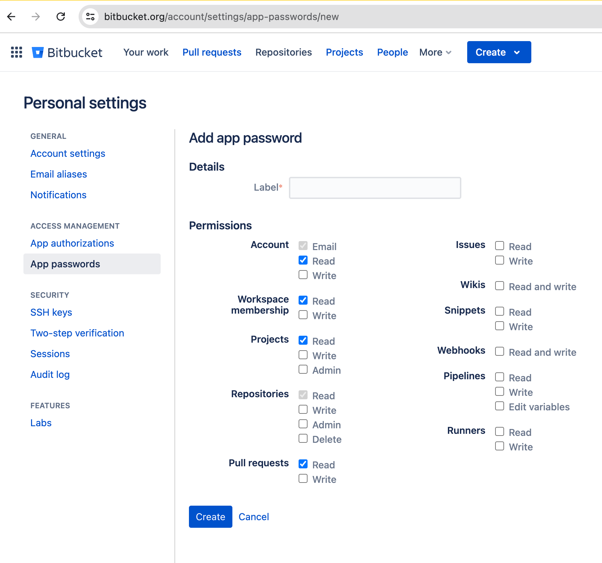
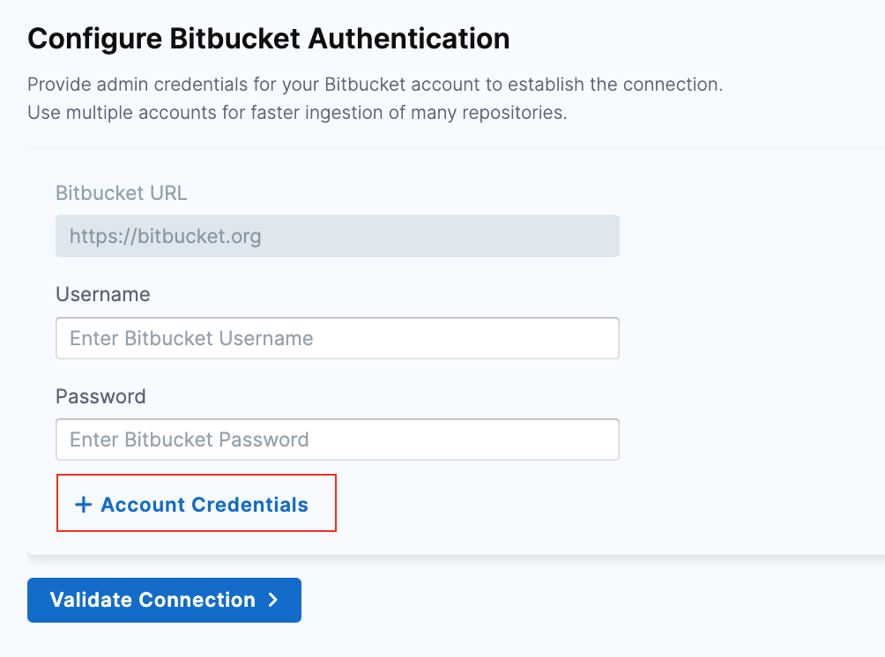

Bitbucket Cloud is a cloud-based platform for managing Git repositories. It's part of the Atlassian suite and is widely used for version control, collaboration, and DevOps workflows.

This topic describes the settings and permissions for the Bitbucket integration. Harness supports both [Cloud](/docs/software-engineering-insights/sei-integrations/bitbucket/sei-bitbucket-cloud) and [Data Center (On-Prem)](/docs/software-engineering-insights/sei-integrations/bitbucket/sei-integration-bitbucket) versions of Bitbucket. The following settings are applicable to Bitbucket Cloud.

### Requirements

The following permissions and settings are required to use the SEI Bitbucket integration:

* You have a Bitbucket account.
* Your role is **Member** or higher.

:::info
If you have enabled an allow list in your Bitbucket account, certain Harness IP addresses must be added to it in order to allow communication between the Harness Platform and Bitbucket. If the necessary IPs are not whitelisted, the integration may fail to authenticate or sync data properly.

To ensure your integration can work correctly, please refer to the list of [Harness Platform IPs](/docs/platform/references/allowlist-harness-domains-and-ips) that may need to be whitelisted in your firewall.
:::

### Add the integration

import Tabs from '@theme/Tabs';
import TabItem from '@theme/TabItem';

1. In your **Harness Project**, select the **SEI Module**, and go to your **Account**.
2. Select **Integrations** under **Data Settings**.
3. Select **Available Integrations**, and locate the **Bitbucket integration**, and select **Install**

4. Select the type of your Bitbucket account as Cloud.

5. Choose the authentication type for the integration. You can either use **OAuth** or **App Passwords** to set up the authentication with the Bitbucket platform.

<Tabs>
  <TabItem value="oauth" label="Using OAuth" default>

Choose **Using OAuth** as the authentication medium. OAuth simplifies the process by allowing you to log in directly to Bitbucket and grant access permissions without sharing tokens or passwords.

* You’ll be redirected to Bitbucket, where you can grant permissions for the integration. Bitbucket will confirm authorization, returning you to the integration setup page.
* Enter a **Name** for the integration.
* The **Description** and **Tags** are optional.
* Click on **Save** to save the integration.

</TabItem>
  <TabItem value="app-password" label="Using App Password">

If your Bitbucket account is tied to a Google login or uses two-factor authentication, you'll need to set up an App Password instead of OAuth.

#### Steps to Generate an App Password in Bitbucket

* Sign in to **Bitbucket Cloud** and log in to your account.
* Navigate to **Account Settings**:
  * Click on your profile picture in the bottom left corner.
  * Select **Personal settings**.
  * In the left-hand menu, click **App passwords** under the **Access management** section.
  * Click the **Create app password** button.
* Configure **App Password**:
  * Enter a label for your new app password. This helps you remember what it's used for.
  * Select the following permissions required.

* Copy the generated app password and save it securely. (Note that you won't be able to see it again.)

#### Steps to Complete the Integration Setup in Harness

In Harness, go to your integration configuration and click on **Next**.

* Enter a **Name** for the integration.
* The **Description** and **Tags** are optional.
* Provide the **Username** and **Password (App Password)** you generated in Bitbucket.

:::info
To avoid rate limiting issues, consider setting up multiple Account Credentials to distribute requests.

:::

* Click **Validate Connection** to run pre-flight checks and confirm the connection. Once validated, your Bitbucket integration will appear under **Your Integrations**.

</TabItem>
</Tabs>

### See also

* [Connect with Bitbucket Data Center](/docs/software-engineering-insights/sei-integrations/bitbucket/sei-integration-bitbucket)
* [Reauthenticate](/docs/software-engineering-insights/sei-integrations/reauthenticate-integration)
* [Ingested data](/docs/software-engineering-insights/sei-integrations/bitbucket/sei-bitbucket-datasheet)