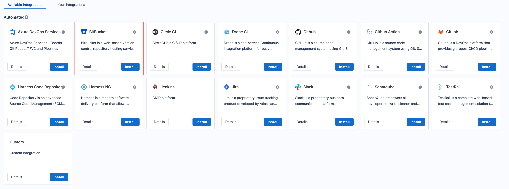
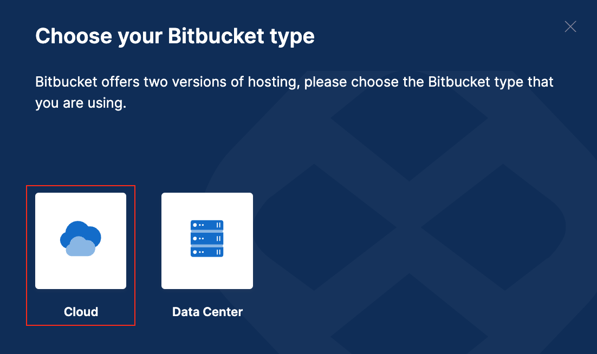
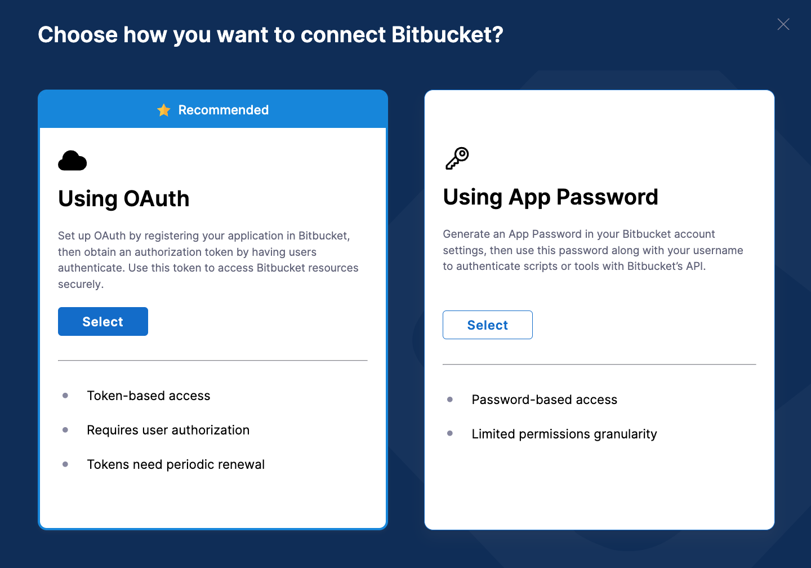
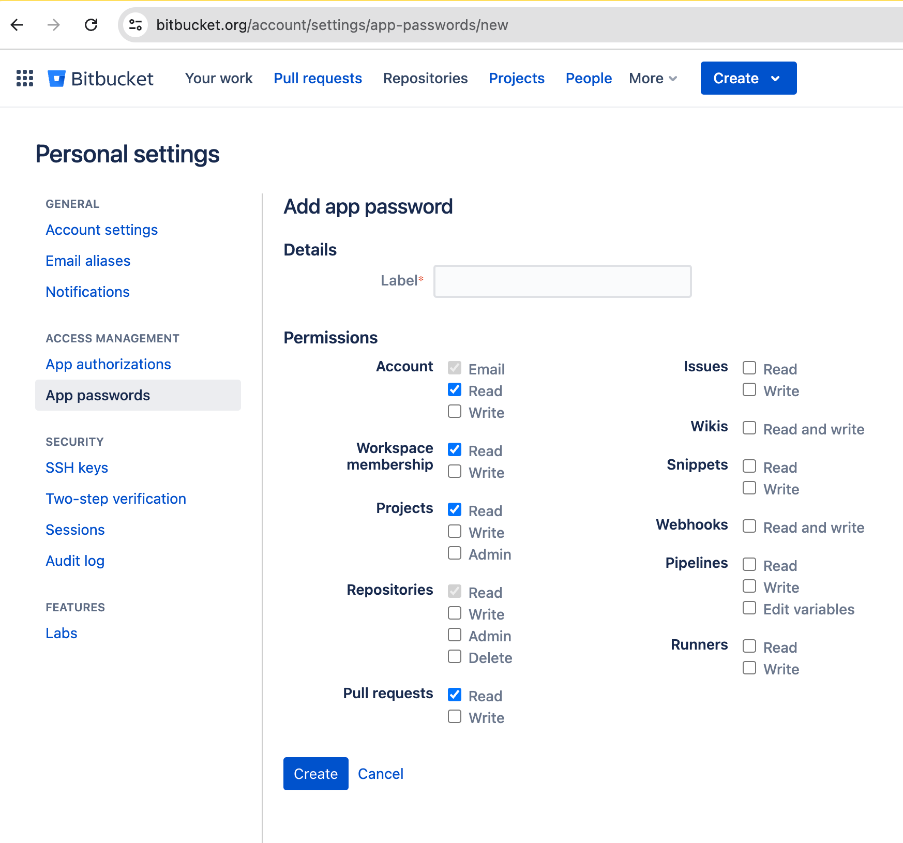
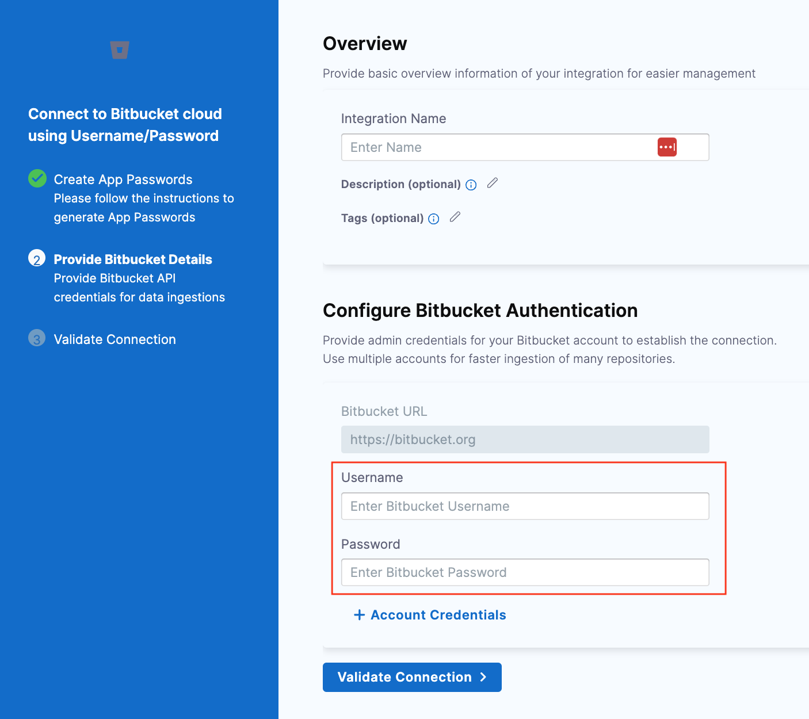
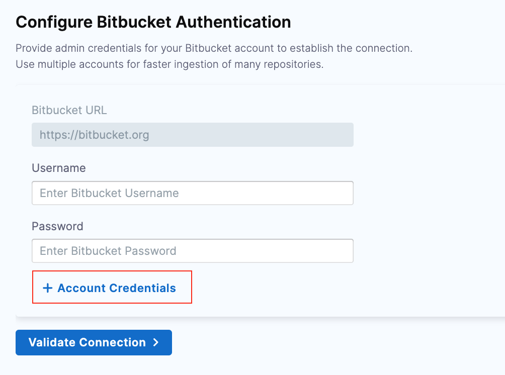
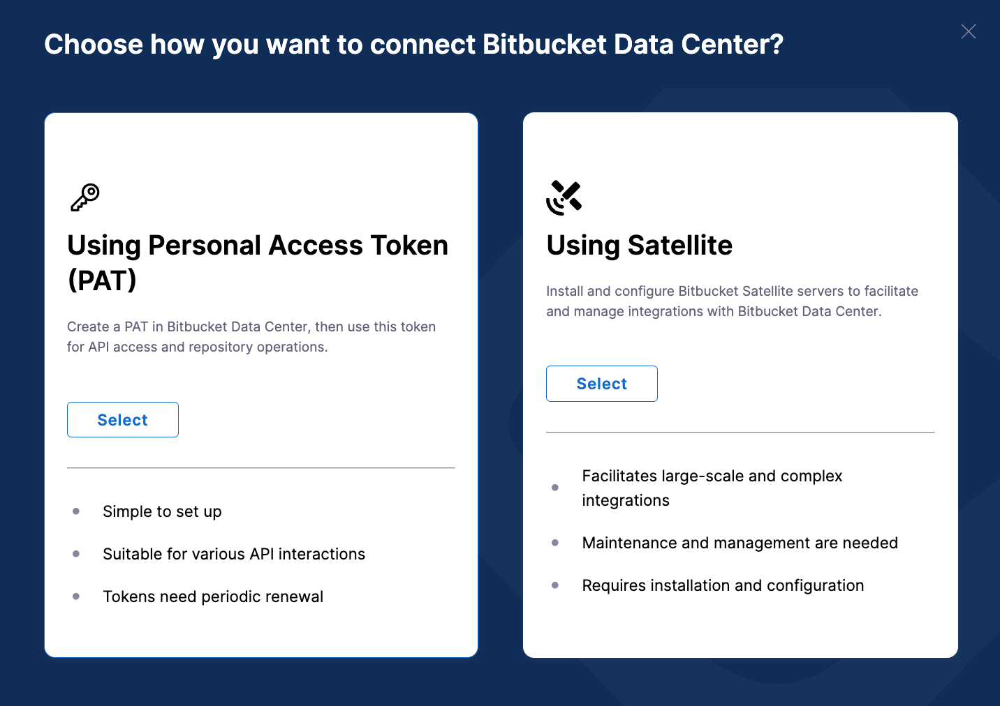
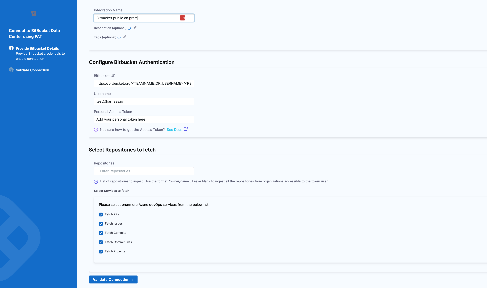

Bitbucket is a web-based version control repository hosting service, for source code and development projects that use either Mercurial or Git revision control systems.

Use the SEI Bitbucket integration to integrate SEI with Bitbucket Cloud or Bitbucket Data Center (Enterprise).

## Requirements

The following permissions and settings are required to use the SEI Bitbucket integration:

* You have a Bitbucket account.
* Your role is **Member** or higher.

## Connect with Bitbucket Cloud

import Tabs from '@theme/Tabs';
import TabItem from '@theme/TabItem';

1. In your **Harness Project**, select the **SEI Module**, and go to your **Account**.
2. Select **Integrations** under **Data Settings**.
3. Select **Available Integrations**, and locate the **Bitbucket integration**, and select **Install**



4. Select the type of your Bitbucket account as Cloud.



5. Choose the authentication type for the integration. You can either use **OAuth** or **App Passwords** to set up the authentication with the Bitbucket platform.



<Tabs>
  <TabItem value="oauth" label="Using OAuth" default>

Set up OAuth by registering your application in Bitbucket, then obtain an authorization token by having users authenticate. Use this token to access Bitbucket resources securely.

* If you are redirected to Bitbucket, select **Grant Access** to allow the integration. You might need to sign in. Bitbucket uses OAuth authentication.
* Enter a **Name** for the integration.
* The **Description** and **Tags** are optional.
* Click on **Save** to save the integration.

</TabItem>
  <TabItem value="app-password" label="Using App Password">

**App Passwords** in Bitbucket serve as an alternative to OAuth. They are generated in your Bitbucket account and are used to authenticate against the API without using your primary account credentials. Follow the instructions below to generate App Passwords in Bitbucket:

* Sign in to **Bitbucket Cloud** and log in to your account.
* Navigate to **Account Settings**:
  * Click on your profile picture in the bottom left corner.
  * Select **Personal settings**.
  * In the left-hand menu, click **App passwords** under the **Access management** section.
  * Click the **Create app password** button.
* Configure **App Password**:
  * Enter a label for your new app password. This helps you remember what it's used for.
  * Select the following permissions required.



* Copy the generated app password and save it securely. (Note that you won't be able to see it again.)

In Harness, go to your integration configuration and click on **Next**.

* Enter a **Name** for the integration.
* The **Description** and **Tags** are optional.
* Add the **Username** and **Password** that you previously generated.



:::info
Note that to prevent rate limiting issues, it is recommended to configure the integration with multiple Account Credentials.



:::

* Click on **Validate Connection** to run the pre-flight checks and validate the connection. Once successful, you'll have the integration set up under the **Your Integrations** tab.

</TabItem>
</Tabs>

## Connect with Bitbucket Data Center

[Bitbucket Data Center (also known as Bitbucket Enterprise)](https://www.atlassian.com/software/bitbucket/enterprise) is a self-managed solution for source code collaboration. Harness SEI supports connecting with both Private and Public Bitbucket On-Prem instances.

1. In your **Harness Project**, select the **SEI Module**, and go to your **Account**.
2. Select **Integrations** under **Data Settings**.
3. Select **Available Integrations**, and locate the **Bitbucket integration**, and select **Install**


4. Select the type of your Bitbucket account as **Data Center**.
5. Choose **Authentication Method**:
   1. Use **Personal Access Token (PAT)** to connect to a **Public On-Prem Bitbucket** server.
   2. Use **Ingestion Satellite** to connect to a **Private On-Prem Bitbucket** server




<Tabs>
  <TabItem value="pat" label="Using PAT" default>

* Enter a **Name** for the integration.
* The **Description** and **Tags** are optional.
* Enter the **URL** for the **Bitbucket Public On-Prem Instance** in the format `https://bitbucket.org/<TEAMNAME_OR_USERNAME>/<REPOSITORY_NAME>/src`
* Enter your **Username**
* Enter the **Bitbucket Personal Access Token**. To generate an PAT token for your Bitbucket account, go to [Managing PAT tokens for Bitbucket](https://support.atlassian.com/bitbucket-cloud/docs/create-a-repository-access-token/).
* Enter **Tags** and the **List of repositories** you want to ingest. You can leave this option blank if you want to ingest all the repositories from organizations accessible to the token user.
* You can select the **Filters** to define the type of data you want to ingest. The available options are **Fetch Commits**, **Fetch PRs**, **Fetch PRs Reviews**, **Fetch Commits Fields**.
* Click on **Validate Connection** to run the pre-flight checks and validate the connection. Once successful, you'll have the integration set up under the **Your Integrations** tab.



</TabItem>

  <TabItem value="satellite" label="Using Ingestion Satellite">

* Enter a **Name** for the integration.
* The **Description** and **Tags** are optional.
* Enter the **URL** for the **Bitbucket Public On-Prem Instance** in the format `https://bitbucket.org/<TEAMNAME_OR_USERNAME>/<REPOSITORY_NAME>/src`
* Enter your **Username**
* Enter the **Bitbucket Personal Access Token**. To generate an PAT token for your Bitbucket account, go to [Managing PAT tokens for Bitbucket](https://support.atlassian.com/bitbucket-cloud/docs/create-a-repository-access-token/).
* Enter **Tags** and the **List of repositories** you want to ingest. You can leave this option blank if you want to ingest all the repositories from organizations accessible to the token user.
* You can select the **Filters** to define the type of data you want to ingest. The available options are **Fetch Commits**, **Fetch PRs**, **Fetch PRs Reviews**, **Fetch Commits Fields**.
* Download the `satellite.yml` file and update it following the instructions [here](/docs/software-engineering-insights/sei-ingestion-satellite/satellite-overview).

If you experience any issues while configuring the integration using the Ingestion Satellite, refer to the [Ingestion Satellite Troubleshooting and FAQs](/docs/software-engineering-insights/sei-ingestion-satellite/satellite-troubleshooting-and-faqs).

Here’s a sample `satellite.yaml`:

```yaml
satellite:
  tenant: <ACCOUNT_ID>
  api_key: <ACCOUNT_API_KEY>
  url: 'https://app.harness.io/gratis/sei/api' 
  # Note that this URL is relative to the Environment of your Harness Account.
integrations:
  - id: '<INTEGRATION_ID>'
    application: bitbucket_server
    url: 'https://bitbucket.org/<TEAMNAME_or_USERNAME>/<REPO_NAME>/src'
    username: <BITBUCKET_USERNAME>
    api_key: <BITBUCKET_API_KEY>
    metadata:
      fetch_prs: true
      fetch_pr_reviews: true
      fetch_commits: true
      fetch_commit_files: true
      repos: <REPOSITORIES>
    satellite: true

```

</TabItem>
</Tabs>
