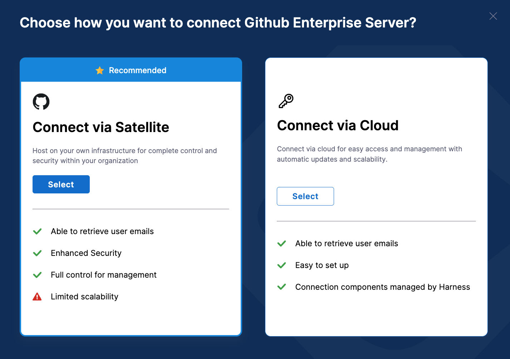

GitHub Enterprise Server is a self-hosted version of GitHub designed for organizations that need to manage their repositories, code, and collaboration tools on their own infrastructure. To integrate Harness SEI with GitHub Cloud, go to [Connect with GitHub Cloud](/docs/software-engineering-insights/sei-integrations/github/sei-github-integration).

### Authenticate with GitHub

To create a GitHub personal access token to configure the SEI GitHub integration.

1. Log in to your GitHub account and create a Personal Access Token. For instructions, go to the GitHub documentation on [Managing your personal access tokens](https://docs.github.com/en/authentication/keeping-your-account-and-data-secure/managing-your-personal-access-tokens).
2. Select the following permissions for your personal access token:

   * All `repo` scopes, including the parent `repo` scope. The top-level `repo` scope is required for SEI to have the required visibility into your repos.

   

   * The `read:org` scope under `admin:org`.

   

3. Copy the token somewhere that you can retrieve it when you configure the integration.
4. If your GitHub organization uses SAML SSO, enable SSO for your personal access token. For instructions, go to the GitHub documentation on [Authorizing a personal access token for use with SAML SSO](https://docs.github.com/en/enterprise-cloud@latest/authentication/authenticating-with-saml-single-sign-on/authorizing-a-personal-access-token-for-use-with-saml-single-sign-on).

:::info
If you have enabled an allow list in your GitHub account, certain Harness IP addresses must be added to it in order to allow communication between the Harness Platform and GitHub. If the necessary IPs are not whitelisted, the integration may fail to authenticate or sync data properly.

To ensure your integration can work correctly, please refer to the list of [Harness Platform IPs](/docs/platform/references/allowlist-harness-domains-and-ips) that may need to be whitelisted in your firewall.
:::

import Tabs from '@theme/Tabs';
import TabItem from '@theme/TabItem';

### Add the GitHub integration

<Tabs>
  <TabItem value="enterprise-cloud" label="Connect via Cloud" default>

To set up the integration for the GitHub Enterprise:

1. Select **Integrations** under **Data Settings**.
2. Select **Available Integrations**, locate the **GitHub integration**, and select **Install**.
3. Select **GitHub Enterprise** as the integration type.
4. Choose the **Connect via Cloud** option.



5. Define the integration settings:
   * **Integration Name:** Name for your integration.
   * **Description (optional):** Add a description for the integration.
   * **Tags (optional):** Add tags for the integration if required.
6. Configure the integration settings and authentication:
   * Add the **PAT Key** that you previously generated for your GitHub account.
     Note that you can add multiple PATs for the same integration.
   * Enter the URL of your GitHub Enterprise On-prem instance, for example, `<https://GITHUB.ORGANIZATION-DOMAIN>`. Ensure it's a valid URL.


6. If applicable, configure the **Additional Options**.
   * Specify the repositories for which you want to ingest the data on SEI. Use the format username/repository-name. Leave this field blank to ingest all the repositories.
   * Specifically, **s**elect the fields that you want to include in the data ingestion.
     * **Fetch PRs**: Allow SEI to ingest PR data from GitHub.
     * **Fetch Issues**: Allow SEI to ingest data from GitHub Issues.
     * **Fetch Projects**: Allow SEI to ingest data from GitHub Projects.
     * **Fetch Commits**: Allow SEI to ingest commit metadata from GitHub.
     * **Fetch Commit Files**: Allow SEI to ingest data within commits from GitHub.
7. Once you've configured the integration, click on **Download YAML File** to download the satellite.yml file.


</TabItem>

<TabItem value="enterprise-satellite" label="Connect via Satellite">

You can use the **Ingestion Satellite** to integrate with On-Prem GitHub Enterprise instances. The configuration process for the integration is similar to setting up the integration in the cloud but instead uses the satellite to communicate with the GitHub server.

To set up the integration for the GitHub Enterprise:

1. Select **Integrations** under **Data Settings**.
2. Select **Available Integrations**, locate the **GitHub integration**, and select **Install**.
3. Select **GitHub Enterprise** as the integration type.
4. Define the integration settings:
   * **Integration Name:** Name for your integration.
   * **Description (optional):** Add a description for the integration.
   * **Tags (optional):** Add tags for the integration if required.
5. Configure the integration settings and authentication:
   * Add the **PAT Key** that you previously generated for your GitHub account.
     Note that you can add multiple PATs for the same integration.
   * Enter the URL of your GitHub Enterprise On-prem instance, for example, `<https://GITHUB.ORGANIZATION-DOMAIN>`. Ensure it's a valid URL.


6. If applicable, configure the **Additional Options**.
   * Specify the repositories for which you want to ingest the data on SEI. Use the format username/repository-name. Leave this field blank to ingest all the repositories.
   * Specifically, **s**elect the fields that you want to include in the data ingestion.
     * **Fetch PRs**: Allow SEI to ingest PR data from GitHub.
     * **Fetch Issues**: Allow SEI to ingest data from GitHub Issues.
     * **Fetch Projects**: Allow SEI to ingest data from GitHub Projects.
     * **Fetch Commits**: Allow SEI to ingest commit metadata from GitHub.
     * **Fetch Commit Files**: Allow SEI to ingest data within commits from GitHub.
7. Once you've configured the integration, click on **Download YAML File** to download the satellite.yml file.


Once you have downloaded the `satellite.yml` file update it following the instructions [here](/docs/software-engineering-insights/sei-ingestion-satellite/run-the-satellite-container).

If you encounter any issues during the integration process, go to the Satellite integration [Troubleshooting and FAQs](/docs/software-engineering-insights/sei-ingestion-satellite/satellite-troubleshooting-and-faqs)

:::info
Please note that after adding an integration, it may take up to 24 hours for the data to be fully reflected on SEI. This means that any widgets you configure on Insights using this integration may not display data until the synchronization is completed.
:::

Here’s a sample `satellite.yml` file:

```yaml
satellite:
  tenant: <ACCOUNT_NAME>
  api_key: <SEI_API_KEY>
  url: 'https://app.harness.io/gratis/sei/api' 
  # Note that this URL is relative to the Environment of your Harness Account.

integrations:
  - id: '<INTEGRATION_ID>'
    application: github
    url: '<GITHUB_ENTERPRISE_INSTANCE_URL>'
    authentication: multiple_api_keys
    keys:
      - api_key: <GITHUB_PAT>
    metadata:
      fetch_prs: true
      fetch_issues: true
      fetch_projects: false
      fetch_commits: true
      fetch_commit_files: true
```

</TabItem>
</Tabs>

### See also

* [Connect with Github Cloud](/docs/software-engineering-insights/sei-integrations/github/sei-github-integration)
* [Reauthenticate](/docs/software-engineering-insights/sei-integrations/reauthenticate-integration)
* [Ingested data](/docs/software-engineering-insights/sei-integrations/jira/sei-jira-datasheet)
* [Recommendations](/docs/software-engineering-insights/sei-integrations/github/sei-github-recommendations)