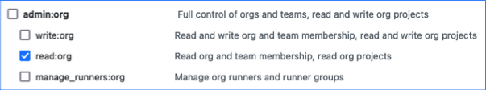

GitHub provides hosting for software development and version control using Git.

To integrate SEI with Github, you must choose the type of your Github account.

* [GitHub Organization (Cloud)](#add-the-github-integration)
* [GitHub Enterprise Server (On-Prem)](/docs/software-engineering-insights/sei-integrations/github/sei-github-enterprise-server)

To integrate with GitHub Enterprise Server, go to [Connect with GitHub Enterprise](/docs/software-engineering-insights/sei-integrations/github/sei-github-enterprise-server).

:::info **PERSONAL AND ORGANIZATION REPOSITORIES**

SEI only ingests repositories from organizations. SEI doesn't ingest your personal repos or repos where you are a collaborator but not a member of the affiliated organization.

In other words, the owner of the GitHub personal access token that is associated with the integration must be a direct member of an organization for a repo to be ingested by SEI.
:::

### Authenticate with GitHub

To create a GitHub personal access token to configure the SEI GitHub integration.

1. Log in to your GitHub account and create a Personal Access Token. For instructions, go to the GitHub documentation on [Managing your personal access tokens](https://docs.github.com/en/authentication/keeping-your-account-and-data-secure/managing-your-personal-access-tokens).
2. Select the following permissions for your personal access token:

   * All `repo` scopes, including the parent `repo` scope. The top-level `repo` scope is required for SEI to have the required visibility into your repos.

   

   * The `read:org` scope under `admin:org`.

   

3. Copy the token somewhere that you can retrieve it when you configure the integration.
4. If your GitHub organization uses SAML SSO, enable SSO for your personal access token. For instructions, go to the GitHub documentation on [Authorizing a personal access token for use with SAML SSO](https://docs.github.com/en/enterprise-cloud@latest/authentication/authenticating-with-saml-single-sign-on/authorizing-a-personal-access-token-for-use-with-saml-single-sign-on).

### Add the GitHub integration

For the integration type as Cloud, you can choose how you want to connect GitHub i.e.

* GitHub App
* GitHub Access Token i.e. Personal Access Token (classic)

import Tabs from '@theme/Tabs';
import TabItem from '@theme/TabItem';

<Tabs>
  <TabItem value="github-app" label="Using Github App" default>

The GitHub App facilitates a seamless connection to GitHub with minimal user intervention, requiring GitHub organization admin configuration for the app.
  Using the GitHub App allows you to retrieve all user emails from GitHub, making it faster and easier to connect and manage the integration.

The following permissions are required to configure the **Harness SEI Github App** integration:

* **Read access to administration, code, commit statuses, issues, metadata, and pull requests:** This allows the app to view and access information about your repositories, including code, commits, issues, and metadata.
* **Read access to email addresses:** This allows the app to view the email addresses of users who have authorized the app.

:::info
It is important to note that these permissions are requested by the Harness SEI Github App.
This means that the app will request these permissions from GitHub on its behalf, and not on behalf of the user who is installing the app.
:::

To set up the integration using the **GitHub App**:

1. Select **Integrations** under **Data Settings**.
2. Select **Available Integrations**, locate the **GitHub integration**, and select **Install**.
3. Select **GitHub Cloud** as the integration type.

4. Select the **GitHub App** tile to set up the connection with GitHub.

5. Verify that your account is an owner of the GitHub organization that you want to connect. To do this, go to your GitHub organization page and ensure that your account is listed as an owner.
6. If you've previously connected SEI to GitHub, you may need to remove the SEI app from GitHub before proceeding.
7. Click the **Connect GitHub** button to begin authentication.
8. Once authenticated, you'll be prompted to select the repositories that SEI will monitor. You can choose to monitor all repositories or select specific ones.
   
   Note that if you select **All Repositories**, SEI will automatically monitor all existing and future repositories. If you select **Only Selected Repositories**, SEI will only monitor the repositories you've chosen.
9.  Now on the GitHub App settings page add the basic overview information:
   * **Integration Name:** Name for your integration.
   * **Description (optional):** Add a description for the integration.
   * **Tags (optional):** Add tags for the integration if required.
10. Once you've configured the settings click on **Finalize Integration** to save the integration.

</TabItem>

<TabItem value="pat" label="Using Personal Access Token">

Before you configure the SEI GitHub integration, you must generate a GitHub Personal Access Token.

1. Select **Integrations** under **Data Settings**.
2. Select **Available Integrations**, locate the **GitHub integration**, and select **Install**.
3. Select **GitHub Cloud** as the integration type.
4. Select the **Using Access Token** tile to set up the connection with GitHub.

5.  Configure the integration settings and authentication: 

    * **Integration Name:** Name for your integration.
    * **Description (optional):** Add a description for the integration.
    * **Tags (optional):** Add tags for the integration if required.

6. Add the **PAT Key** that you previously generated for your GitHub account.
7. If applicable, configure the **Additional Options**. This allows you to specifically **s**elect the fields that you want to include in the data ingestion.
   * **Fetch PRs**: Allow SEI to ingest PR data from GitHub.
   * **Fetch Issues**: Allow SEI to ingest data from GitHub Issues.
   * **Fetch Projects**: Allow SEI to ingest data from GitHub Projects.
   * **Fetch Commits**: Allow SEI to ingest commit metadata from GitHub.
   * **Fetch Commit Files**: Allow SEI to ingest data within commits from GitHub.

8. Click on **Validate Connection** to validate the connection, and once successful, you'll have the integration set up under the **Your Integrations** tab.

</TabItem>
</Tabs>

### See also

* [Connect with Github Enterprise](/docs/software-engineering-insights/sei-integrations/github/sei-github-enterprise-server)
* [Reauthenticate](/docs/software-engineering-insights/sei-integrations/reauthenticate-integration)
* [Ingested data](/docs/software-engineering-insights/sei-integrations/github/sei-github-datasheet)
* [Recommendations](/docs/software-engineering-insights/sei-integrations/github/sei-github-recommendations)