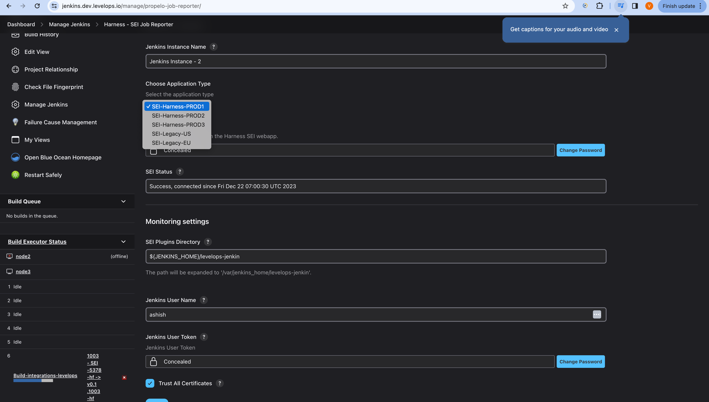

The **Harness - SEI Jenkins Plugin** is a tool, written in Java, to send reports about builds to Harness SEI.

## Configure the integration

1. Select **Integrations** under the **Data Settings**.
2. Select **Available Integrations**, and locate the **Jenkins integration**, and select **Install**
3. Add a **Name** for the integration.
4. The **Description** and **Tags** are optional.
5. Click on **Next: Create and Add Nodes**. This will display all the available Jenkins instances.
6. Click on **+Add Instance**. This will generate the **SEI API KEY** which will be used in the **Jenkins Plugin Configuration**.

:::note
Newly added instances will show up under the Available Instances Tab.
:::

## Install the Plugin

To install this plugin please follow the following steps.

* Sign-in to **Jenkins** and select **Manage Jenkins**
* Select **Manage Plugins**
* Select the **Available plugins** tab.
* In the **Search** plugin, type in **Harness - SEI Jenkins Plugin**
* Install the **Harness - SEI Job Reporter Plugin** and click on **Install without restart**
* Install the plugin called **SEI Job Reporter** by selecting it and clicking **Install without restart**
* Once the plugin installation is complete, the status will change to **Success**. If it doesn't change to Success, then a restart might be needed
* Set the **Instance Name** and use the **API KEY** you generated earlier as the value for the **Manage Jenkins >> Harness - SEI Job Reporter >> SEI API KEY** field.
* Set the **Application Type** to the environment where you are configuring the **Plugin**.



## SEI Job Reporter Plugin

The SEI Job Reporter Plugin, monitors all job runs. As soon as a job run completes it sends the info about job run and failed logs back to SEI SaaS.

It does not do any periodic push. It gathers info about job stages and steps. If a job run fails and does not have stages the plugin captures the failed job run logs, else if it has stages and no steps, the plugin captures logs for the failed steps, else if it has steps, the plugin captures logs for failed steps. It does not capture the logs for any successful job or stage or step. This plugin supports the failure triage feature.

| Dependency Name                        | Direct Dependency/Indirect Dependency | Version | URL                                                                                                              |
| - | - | - | - |
| Favorite                               | Indirect                              | 2.3.2   | [https://plugins.jenkins.io/favorite](https://plugins.jenkins.io/favorite)                                       |
| Variant                                | Indirect                              | 1.3     | [https://plugins.jenkins.io/variant](https://plugins.jenkins.io/variant)                                         |
| REST Implementation for Blue Ocean     | Direct                                | 1.23.2  | [https://plugins.jenkins.io/blueocean-rest-impl](https://plugins.jenkins.io/blueocean-rest-impl)                 |
| Common API for Blue Ocean              | Indirect                              | 1.23.2  | [https://plugins.jenkins.io/blueocean-commons](https://plugins.jenkins.io/blueocean-commons)                     |
| REST API for Blue Ocean                | Indirect                              | 1.23.2  | [https://plugins.jenkins.io/blueocean-rest](https://plugins.jenkins.io/blueocean-rest)                           |
| Design Language                        | Indirect                              | 1.23.2  | [https://plugins.jenkins.io/jenkins-design-language](https://plugins.jenkins.io/jenkins-design-language)         |
| Blue Ocean Core JS                     | Indirect                              | 1.23.2  | [https://plugins.jenkins.io/blueocean-core-js](https://plugins.jenkins.io/blueocean-core-js)                     |
| Web for Blue Ocean                     | Indirect                              | 1.23.2  | [https://plugins.jenkins.io/blueocean-web](https://plugins.jenkins.io/blueocean-web)                             |
| JWT for Blue Ocean                     | Indirect                              | 1.23.2  | [https://plugins.jenkins.io/blueocean-jwt](https://plugins.jenkins.io/blueocean-jwt)                             |
| Pipeline implementation for Blue Ocean | Direct                                | 1.23.2  | [https://plugins.jenkins.io/blueocean-pipeline-api-impl](https://plugins.jenkins.io/blueocean-pipeline-api-impl) |
| Pipeline SCM API for Blue Ocean        | Indirect                              | 1.23.2  | [https://plugins.jenkins.io/blueocean-pipeline-scm-api](https://plugins.jenkins.io/blueocean-pipeline-scm-api)   |
| HTML Publisher                         | Indirect                              | 1.23    | [https://plugins.jenkins.io/htmlpublisher](https://plugins.jenkins.io/htmlpublisher)                             |
| Dashboard for Blue Ocean               | Direct                                | 1.23.2  | [https://plugins.jenkins.io/blueocean-dashboard](https://plugins.jenkins.io/blueocean-dashboard)                 |
| Pub-Sub "light" Bus                    | Indirect                              | 1.13    | [https://plugins.jenkins.io/pubsub-light](https://plugins.jenkins.io/pubsub-light)                               |

### Configuration as Code

#### Requirements

* Jenkins version should be **2.426.3** or higher.
* Use the plugin version **1.0.33** or higher of SEI Job Reporter Jenkins plugin.

#### Step-by-step instructions

To configure the SEI Job Reporter plugin in Jenkins using Configuration as Code (JCasC), follow the instructions below:

* Locate the `jenkins.yaml` configuration file and insert the following configuration under the `unclassified` section of the `jenkins.yaml` file:

```yaml
propelo-job-reporter:
    levelOpsApiKey: "<SEI_API_KEY>"
    levelOpsPluginPath: "<PLUGIN_PATH>"
    trustAllCertificates: "true" or "false"
    jenkinsInstanceName: "<INSTANCE_NAME>"
    jenkinsUserName: "<USERNAME>" # For Blue Ocean Plugin
    jenkinsUserToken: "<USER_TOKEN>" # For Blue Ocean Plugin
    applicationType: <APPLICATION_TYPE> # eg. SEI_LEGACY
    jenkinsBaseUrl: <BASE_URL_OF_INSTANCE> # eg. https://jenkins-instance.harness.io
```

Here's an example `jenkins.yaml` file

```yaml
jenkins:
  nodeMonitors:
  - "architecture"
  - "clock"
  - diskSpace:
      freeSpaceThreshold: "1GiB"
      freeSpaceWarningThreshold: "2GiB"
  - "swapSpace"
  - tmpSpace:
      freeSpaceThreshold: "1GiB"
      freeSpaceWarningThreshold: "2GiB"
  - "responseTime"
  numExecutors: 2
globalCredentialsConfiguration:
appearance:
security:
unclassified:
  mailer:
  propelo-job-reporter:
    levelOpsApiKey: "<SEI_API_KEY>"
    levelOpsPluginPath: "<PLUGIN_PATH>"
    trustAllCertificates: "true" or "false"
    jenkinsInstanceName: "<INSTANCE_NAME>"
    jenkinsUserName: "<USERNAME>" # For Blue Ocean Plugin <OPTIONAL>
    jenkinsUserToken: "<USER_TOKEN>" # For Blue Ocean Plugin <OPTIONAL>
    applicationType: <APPLICATION_TYPE> # eg. SEI_LEGACY
    jenkinsBaseUrl: <BASE_URL_OF_INSTANCE> # eg. https://jenkins-instance.harness.io
tool:
  git:
    installations:
    - home: "git"
      name: "Default"
  mavenGlobalConfig:
    globalSettingsProvider: "standard"
    settingsProvider: "standard"

```

* Specify the **applicationType** based on the environment:
  * **Prod 1:** `SEI_HARNESS_PROD_1`
  * **Prod 2:** `SEI_HARNESS_PROD_2`
  * **Prod 3:** `SEI_HARNESS_PROD_3`

:::info warning
Note that the **SEI Job Reporter plugin** installation is not supported directly by JCasC itself. For more details, refer to the official [Jenkins Configuration as Code documentation](https://github.com/jenkinsci/configuration-as-code-plugin/tree/master#installing-plugins).
:::

By following these steps, you can properly configure the **SEI Job Reporter plugin** using **Jenkins Configuration as Code**. Make sure to replace placeholder values like `<SEI_API_KEY>`, `<PLUGIN_PATH>`, `<INSTANCE_NAME>`, etc with actual data relevant to your Jenkins environment.