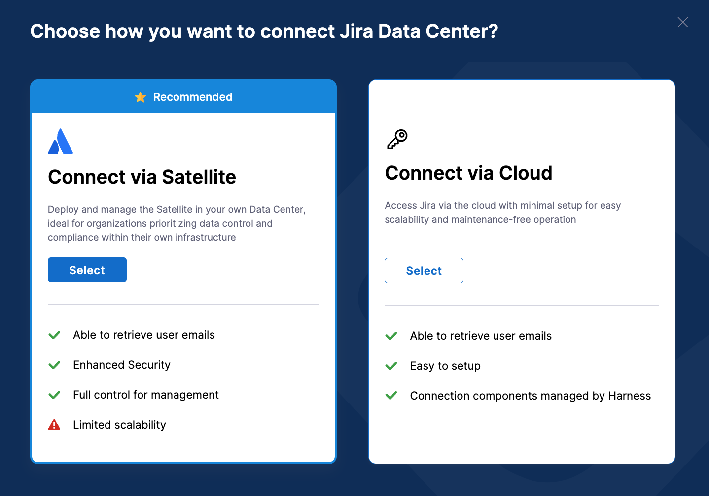

Jira Data Center is the self-managed, enterprise edition of Jira.
This topic explains how you can integrate Harness Software Engineering Insights with Jira Data Center.

### Authenticate with Jira

Before you configure the SEI Jira integration, you must generate an Atlassian API token.

:::tip Use a service account

The user creating the token must have read access to all projects that you want SEI to track, and the user must be able to search issues within the SEI-relevant projects.

Due to the scope of visibility required, consider using a managed service account, rather than a personal user account, to create the token.

:::

1. Create an Atlassian API token. For instructions, go to the Atlassian documentation on [Managing API tokens for your Atlassian account](https://support.atlassian.com/atlassian-account/docs/manage-api-tokens-for-your-atlassian-account/).
2. Make sure to copy the token somewhere that you can retrieve it when you configure the integration.


:::info
If you have enabled an allow list in your Atlassian account, certain Harness IP addresses must be added to it in order to allow communication between the Harness Platform and Atlassian. If the necessary IPs are not whitelisted, the integration may fail to authenticate or sync data properly.

To ensure your integration can work correctly, please refer to the list of [Harness Platform IPs](/docs/platform/references/allowlist-harness-domains-and-ips) that may need to be whitelisted in your firewall.
:::

### Add the Jira integration

To integrate SEI with Jira Data Center, choose your Jira type as Jira Data Center.


import Tabs from '@theme/Tabs';
import TabItem from '@theme/TabItem';

<Tabs>
<TabItem value="satellite" label="Connect via Ingestion Satellite" default>

To connect with the on-prem instances of **Jira Software Data Center**, you can use the [Ingestion Satellite](/docs/software-engineering-insights/sei-ingestion-satellite/run-the-satellite-container). The configuration process for the integration is similar to setting up the integration in the cloud but instead uses the ingestion satellite to communicate with the Atlassian server.

To set up the integration for the Jira Data Center:

1. In your **Harness Project**, go to the **SEI Module**, and select **Account**.
2. Select **Integrations** under **Data Settings**.
3. Select **Available Integrations**, locate the **Jira integration**, and select **Install**.
4. Select **Jira Software Data Center** as the integration type.
5. Choose the **Connect via Satellite** option.



6. Define the integration settings:
   * **Integration Name:** Name for your integration.
   * **Description (optional):** Add a description for the integration.
   * **Tags (optional):** Add tags for the integration if required.
7. Configure the integration settings and authentication:
   * Enter the URL of your Jira On-prem instance, for example, `<https://JIRA.ORGANIZATION-DOMAIN>`. Ensure it's a valid URL.
   * Select the authentication method. You can choose between **Using Jira Personal Access Token** (recommended) or **Jira Username** and **Password**.
   * If using a personal access token, enter the token.
   * If using a username and password, enter the username and associated password.


6. Configure advanced integration settings as needed:
   * Select your preferred time zone from the available options.
   * Choose which fields you want to exclude from ingestion. 
     
     You may want to exclude fields containing sensitive information like summary, description, and comments. Excluded fields won't be evaluated for hygiene or best practices compliance.
7. Once you've configured the integration, click on **Download YAML File** to download the satellite.yml file.


Once you have downloaded the `satellite.yml` file update it following the instructions [here](/docs/software-engineering-insights/sei-ingestion-satellite/run-the-satellite-container).

Here’s a sample `satellite.yml` file which uses username and password for authentication.

```yaml
satellite:
  tenant: <ACCOUNT_NAME>
  api_key: <SEI_API_KEY>
  url: "https://app.harness.io/gratis/sei/api" 
  # Note that this URL is relative to the Environment of your Harness Account.

integrations:
  - id: '<INTEGRATION_ID>'
    url: '<ATLASSIAN_ORGANIZATION_URL>'
    username: <ATLASSIAN_USERNAME>
    application: jira
    api_key: <ATLASSIAN_PASSWORD>
    metadata:
      timezone: '<TIMEZONE>'
      sensitive_fields:
        - description
        - userDetails
jira:
  allow_unsafe_ssl: true
```

Here’s a sample `satellite.yml` file which uses a Personal Access Token for authentication.

```yaml
satellite:
  tenant: <ACCOUNT_NAME>
  api_key: <SEI_API_KEY>
  url: "https://app.harness.io/gratis/sei/api" 
  # Note that this URL is relative to the Environment of your Harness Account.

integrations:
  - id: '<INTEGRATION_ID>'
    url: '<ATLASSIAN_ORGANIZATION_URL>'
    application: jira
    api_key: <ATLASSIAN_API_KEY>
    metadata:
      timezone: <ATLASSIAN_ACCOUNT_TIMEZONE>
      sensitive_fields:
        - summary
        - description
jira:
  allow_unsafe_ssl: true
```

:::info
The timezone field within the metadata should be in the Atlassian standard version.

To find the correct timezone, go to `https://<ORGANIZATION_ATLASSIAN_URL>/rest/api/2/myself`
:::

</TabItem>

<TabItem value="cloud-data-center" label="Connect via Cloud">

To set up the integration for the cloud instance of Jira Data Center follow the steps below:

1. In your **Harness Project**, go to the **SEI Module**, and select **Account**.
2. Select **Integrations** under **Data Settings**.
3. Select **Available Integrations**, locate the **Jira integration**, and select **Install**.
4. Select **Jira Software Data Center** as the integration type.
5. Choose the **Connect via Cloud** option.


6. Define the integration settings:
   * **Integration Name:** Name for your integration.
   * **Description (optional):** Add a description for the integration.
   * **Tags (optional):** Add tags for the integration if required.
7. Configure the integration settings and authentication:
   * Enter the URL of your Jira On-prem instance, for example, `<https://JIRA.ORGANIZATION-DOMAIN>`. Ensure it's a valid URL.
   * Select the authentication method. You can choose between **Using Jira Personal Access Token** (recommended) or **Jira Username** and **Password**.
   * If using a personal access token, enter the token.
   * If using a username and password, enter the username and associated password.


6. Configure advanced integration settings as needed:
   * Select your preferred time zone from the available options.
   * Choose which fields you want to exclude from ingestion. 
     
     You may want to exclude fields containing sensitive information like summary, description, and comments. Excluded fields won't be evaluated for hygiene or best practices compliance.
7. Click on **Validate Connection** to run the pre-flight checks and validate the connection. Once successful, you'll have the integration set up under the **Your Integrations** tab.

</TabItem>
</Tabs>

### Troubleshooting

Here are some troubleshooting suggestions for Jira integrations.

* While using a username and password for authentication if the satellite fails to set up the connection, edit the generated `satellite.yml` file and use your Jira password as a value for `api_key` in the YAML and keep the `user_name` as is.

Test with the following curl command:

```bash
curl -u "USERNAME:PASSWORD" -X GET "https://host:port/context/rest/api/search?jql=key-<JIRA_KEY>"
```

* While using the generated managed token (Bearer token) for authentication leave the `user_name` blank and use the managed token that you are generating for `api_key`.

Test with the following curl command:

```bash
curl -H "Authorization: Bearer MANAGED_TOKEN" -X GET "https://host:port/context/rest/api/search?jql=key=<JIRA_KEY>
```

<details>
<summary> ADFS-based authentication for JIRA using Satellite</summary>

ADFS (Active Directory Federation Services) is a Microsoft service that provides single sign-on authentication to users across multiple applications or systems. When integrating with Jira using ADFS-based authentication via Satellite, specific fields need to be configured in the `satellite.yml` file.

Update the `satellite.yml` file:

Remove:

```yaml
username:
api_key:
```

Replace with:

```yaml
authentication: adfs
adfs_url: <ADFS_SERVER_ENDPOINT>
adfs_client_id: <CLIENT_IDENTIFIER> / <APPLICATION_ID>
adfs_resource: <RESOURCE_IDENTIFIER>
adfs_username: <ADFS_USERNAME>
adfs_password: <ADFS_PASSWORD>
```

Replace `<ADFS_PASSWORD>` with the actual password for the specified ADFS username. Ensure the rest of the file remains unchanged.

| Field | Description |
| - | - |
| `authentication` | This field specifies the authentication method to be used, in this case, ADFS. |
| `adfs_url` | The URL of the ADFS server endpoint where authentication requests will be sent. |
| `adfs_client_id` | The client identifier or application ID assigned to your application in the ADFS configuration. It uniquely identifies your application to the ADFS server. |
| `adfs_resource` | The identifier of the resource for which the access token is being requested. In the context of Jira integration, it specifies the URI of the Jira OAuth API on the ADFS server. |
| `adfs_username` | The username used for authentication. This could be a service account or a specific user account authorized to access Jira via ADFS. |
| `adfs_password` | The password associated with the specified ADFS username. It is important to keep this information secure. |

</details>

If you encounter issues with configuring the Ingestion Satellite, refer to the [Troubleshooting and FAQs](/docs/software-engineering-insights/sei-ingestion-satellite/satellite-troubleshooting-and-faqs).

### See also

* [Connect with Jira Data Center](/docs/software-engineering-insights/sei-integrations/jira/jira-data-center)
* [Add custom hygiene misses](/docs/software-engineering-insights/sei-integrations/jira/custom-hygiene-misses)
* [Add salesforce mapping](/docs/software-engineering-insights/sei-integrations/jira/jira-salesforce-mapping)
* [Reauthenticate](/docs/software-engineering-insights/sei-integrations/reauthenticate-integration)
* [Ingested data](/docs/software-engineering-insights/sei-integrations/jira/sei-jira-datasheet)