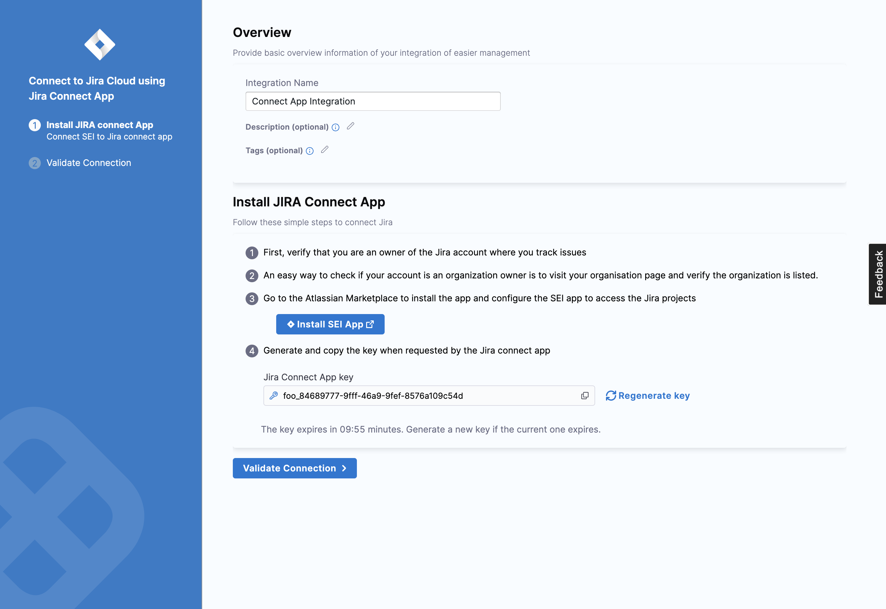

Jira is a proprietary issue-tracking product that allows bug tracking and agile project management. You can connect Harness SEI to Jira using a Harness Jira integration.

### Authenticate with Jira

Before you configure the SEI Jira integration, you must generate an Atlassian API token.

:::tip Use a service account

The user creating the token must have read access to all projects that you want SEI to track, and the user must be able to search issues within the SEI-relevant projects.

Due to the scope of visibility required, consider using a managed service account, rather than a personal user account, to create the token.

:::

1. Create an Atlassian API token. For instructions, go to the Atlassian documentation on [Managing API tokens for your Atlassian account](https://support.atlassian.com/atlassian-account/docs/manage-api-tokens-for-your-atlassian-account/).
2. Make sure to copy the token somewhere that you can retrieve it when you configure the integration.

:::info
If you have enabled an allow list in your Atlassian account, certain Harness IP addresses must be added to it in order to allow communication between the Harness Platform and Atlassian. If the necessary IPs are not whitelisted, the integration may fail to authenticate or sync data properly.

To ensure your integration can work correctly, please refer to the list of [Harness Platform IPs](/docs/platform/references/allowlist-harness-domains-and-ips) that may need to be whitelisted in your firewall.
:::

### Add the Jira integration

To integrate SEI with Jira, you must choose your Jira type:

* [Jira Cloud](#add-the-jira-integration)
* [Jira Data Center](/docs/software-engineering-insights/sei-integrations/jira/jira-data-center)

For the Jira type as Cloud, you can choose how you want to connect Jira i.e.

* Jira Connect App
* Jira API Token

import Tabs from '@theme/Tabs';
import TabItem from '@theme/TabItem';

<Tabs>
  <TabItem value="jira-connect-app" label="Using Jira Connect App" default>

The Jira Connect App facilitates a seamless connection to Jira projects with minimal user intervention, requiring Jira admin configuration for the app.
   Using the Jira Connect App allows you to retrieve all user emails from Jira, making it faster and easier to connect and manage the integration.

The following permissions are required to configure the **Jira Connect App** integration:

* **View email addresses of users:** This permission allows the integration to access and view the email addresses of users within the Atlassian account.
* **Read data from the application:** This permission allows the integration to read data from the Atlassian account, such as data from Jira tickets, Jira projects etc.

To set up the integration using the **Jira Connect App**:

1. Select **Integrations** under **Data Settings**.
2. Select **Available Integrations**, locate the **Jira integration**, and select **Install**.
3. Select **Jira Software Cloud** as the integration type.
4. Select the **Jira Connect App** tile to set up the connection with Jira.
5. In the Jira Connect App settings page add the basic overview information:
   * **Integration Name:** Name for your integration.
   * **Description (optional):** Add a description for the integration.
   * **Tags (optional):** Add tags for the integration if required.

6. Install the Jira Connect App. To do this, follow these simple steps:
   * Verify that you are an owner of the Jira account where you track issues. An easy way to check is to visit your organization page and verify that the organization is listed.
   * Go to the **Atlassian Marketplace** to install the app and configure the [SEI app](https://marketplace.atlassian.com/apps/1231375/harness-software-engineering-insights-sei?tab=overview\&hosting=cloud) to access the Jira projects.
   * **Install** the App.
   * Generate and copy the **Jira Connect App key**, then paste it when requested by the Jira Connect app.

:::info
Note that the key expires after 10 minutes, so generate a new key if the current one expires.
:::

7. Click on **Validate Connection** to validate the connection, and once successful, you'll have the integration set up under the **Your Integrations** tab.

</TabItem>

<TabItem value="api-key" label="Using API Key">

Before you configure the SEI Jira integration, you must generate an Atlassian API token.

To set up the integration using the Jira API Key:

1. Select **Integrations** under **Data Settings**.
2. Select **Available Integrations**, locate the **Jira integration**, and select **Install**.
3. Select Jira Software Cloud as the integration type.
4. Select the Using Jira API Token tile to set up the connection with Jira.
5. Configure the integration settings and authentication: 
   * Integration Name: Name for your integration.
   * Description (optional): Add a description for the integration.
   * Tags (optional): Add tags for the integration if required.
   * Add the **URL** of your **Jira** integration instance, for example, `"https://organization.atlassian.net"`. Make sure it's a valid URL.
   * Enter your Email address for the Atlassian account
   * Provide the **API Key** that you previously generated for your Atlassian account.

7. Configure the advanced integration settings if required:
   * Select your preferred **Time Zone** from the available options.
   * Choose the fields you wish to exclude from ingestion.
     
     You might exclude fields containing sensitive information such as **Summary**, **Description**, and **Comments**. Excluded fields will not be evaluated for hygiene or adherence to best practices.

8. Click on **Validate Connection** to validate the connection, and once successful, you'll have the integration set up under the **Your Integrations** tab.

</TabItem>
</Tabs>

:::info
Please note that after adding an integration, it may take up to 24 hours for the data to reflect on SEI. This means that any widgets you configure on Insights using this integration may not display data until the synchronization is completed.
:::

### See also

* [Connect with Jira Data Center](/docs/software-engineering-insights/sei-integrations/jira/jira-data-center)
* [Add custom hygiene misses](/docs/software-engineering-insights/sei-integrations/jira/custom-hygiene-misses)
* [Configure custom field mapping](/docs/software-engineering-insights/sei-integrations/jira/custom-fields)
* [Reauthenticate](/docs/software-engineering-insights/sei-integrations/reauthenticate-integration)
* [Ingested data](/docs/software-engineering-insights/sei-integrations/jira/sei-jira-datasheet)