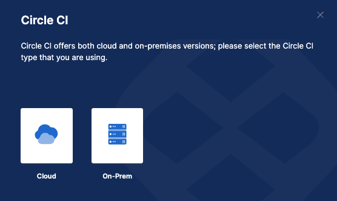
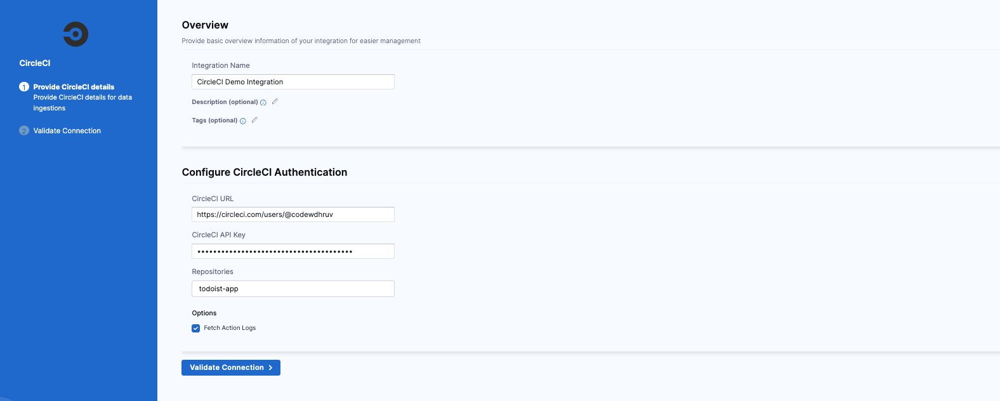

CircleCI lets teams build fully-automated pipelines, from testing to deployment.

Use the SEI CircleCI integration to integrate SEI with CircleCI.

## Requirements

To use the SEI CircleCI integration, you need a **CircleCI Personal API Token**. Copy the token somewhere that you can retrieve it when you configure the integration. For instructions, go to the CircleCI documentation on [Creating a personal API token](https://circleci.com/docs/managing-api-tokens/#creating-a-personal-api-token).

import Tabs from '@theme/Tabs';
import TabItem from '@theme/TabItem';

## Configure the integration

<Tabs>
  <TabItem value="cloud" label="Cloud" default>

1. In your **Harness Project**, go to the **SEI module**, and select **Account**.
2. Select **Integrations** under **Data Settings**.
3. Select **Available Integrations**, locate the **CircleCI** integration, and select **Install**.
4. Select the type of your **CircleCI account** as **Cloud**.



5. Configure and save the integration.

   * **URL:** Enter the URL for your CircleCI platform.
   * **Authorization Token:** Enter your [CircleCI personal API token](https://circleci.com/docs/managing-api-tokens/#creating-a-personal-api-token).
   * **Repositories:** You can specify repositories to associate with the integration. If unspecified, the integration associates all available repositories.
   * **Fetch Action Logs:** Select this option if you want SEI to ingest action logs from CircleCI.
   * **Name:** Enter a name for the integration.
   * **Description**, **Tags**, and **Timezone** are optional.



6. Click on **Validate Connection** to run the pre-flight checks and validate the connection. Once successful, you'll have the integration set up under the **Your Integrations** tab.

</TabItem>
  <TabItem value="on-prem" label="On-Prem">

The steps for configuring the integration using **Satellite** is similar to configuring the integration on cloud, with the exception of using the Ingestion Satellite to communicate with the Circle CI server.

1. In your **Harness Project**, go to the **SEI module**, and select **Account**.
2. Select **Integrations** under **Data Settings**.
3. Select **Available Integrations**, locate the **CircleCI** integration, and select **Install**.
4. Select the type of your **CircleCI account** as **On-Prem**.


5. Add the integration details and download the `satellite.yaml` file:

   * **URL:** Enter the URL for your CircleCI platform.
   * **Authorization Token:** Enter your [CircleCI personal API token](https://circleci.com/docs/managing-api-tokens/#creating-a-personal-api-token).
   * **Repositories:** You can specify repositories to associate with the integration. If unspecified, the integration associates all available repositories.
   * **Fetch Action Logs:** Select this option if you want SEI to ingest action logs from CircleCI.
   * **Name:** Enter a name for the integration.
   * **Description**, **Tags**, and **Timezone** are optional.
   * Click on the **Download YAML File** button and update it following the instructions [here](/docs/software-engineering-insights/sei-ingestion-satellite/satellite-overview).

If you experience any issues while configuring the integration using the Ingestion Satellite, refer to the [Ingestion Satellite Troubleshooting and FAQs](/docs/software-engineering-insights/sei-ingestion-satellite/satellite-troubleshooting-and-faqs).

Here’s a sample `satellite.yml` file:

```yaml
satellite:
  tenant: <ACCOUNT_ID>
  api_key: <ACCOUNT_API_KEY>
  url: 'https://app.harness.io/gratis/sei/api' 
  # Note that this URL is relative to the Environment of your Harness Account.
integrations:
  - id: '<INTEGRATION_ID>'
    application: circleci
    url: '<CIRCLECI_URL>' 
    # For example: https://app.circleci.com/pipelines/github/codewdhruv
    apikey: <CIRCLECI_API_KEY>
    metadata:
      repos: <REPOSITORY>
      fetch_action_logs: true
      timezone: '<TIMEZONE>'
      is_push_based: false

```

</TabItem>
</Tabs>
