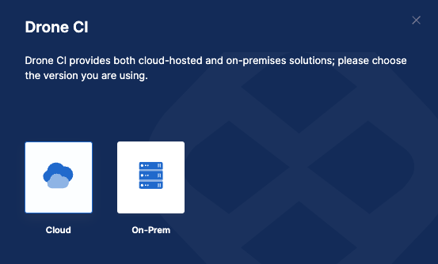
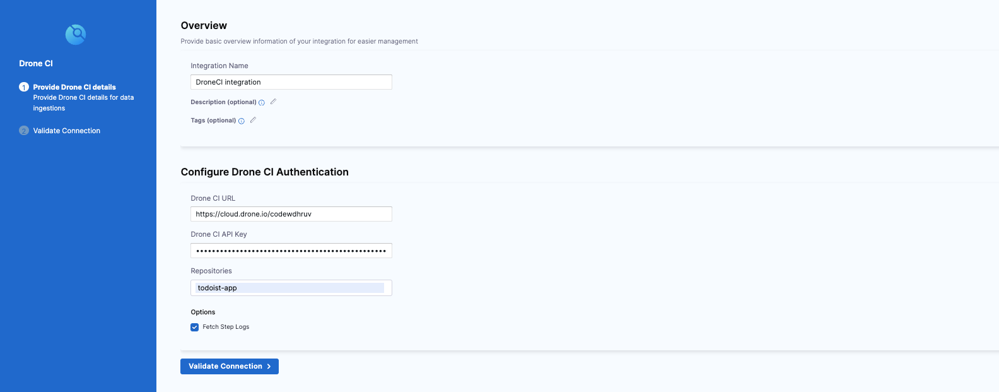

Drone is a self-service CI platform for busy development teams.

Use the SEI Drone CI integration to integrate SEI with Drone.

To integrate with Harness CI, use the [SEI Harness NG integration](./sei-integration-harnessng).

## Requirements

The following permissions and settings are required to use the SEI Drone CI integration:

* You have set up the Drone platform for your CI pipelines.
* You need your **Drone Personal API Token**. To find your token in Drone, select your avatar to go to your **Account Settings**. Either keep the Drone **Account Settings** page open or copy the token somewhere that you can retrieve it when you configure the integration.

import Tabs from '@theme/Tabs';
import TabItem from '@theme/TabItem';

## Configure the integration

<Tabs>
  <TabItem value="cloud" label="Cloud" default>

1. In your **Harness Project**, select the **SEI Module**, and go to your **Account Scope**.
2. Select **Integrations** under **Data Settings**.
3. Select **Available Integrations**, locate the **Drone CI** integration, and select **Install**.
4. Select the type of your **DroneCI account** as **Cloud**.



5. Configure and save the integration.

   * **URL:** Enter the URL for your Drone platform.
   * **Authorization Token:** Enter your Drone personal API token.
   * **Repositories:** You can specify repositories to associate with the integration. If unspecified, the integration associates all available repositories. Available repositories are repositories that the user associated with the **Authorization Token** can access.
   * **Fetch Step Logs:** Select this option if you want SEI to ingest step logs from Drone.
   * **Name:** Enter a name for the integration.
   * **Description** and **Tags** are optional.



6. Click on **Validate Connection** to run the pre-flight checks and validate the connection. Once successful, you'll have the integration set up under the **Your Integrations** tab.

</TabItem>
  <TabItem value="on-prem" label="On-Prem">

The steps for configuring the integration using **Satellite** is similar to configuring the integration on cloud, with the exception of using satellite to communicate with the Drone CI server.

1. In your **Harness Project**, select the **SEI Module**, and go to your **Account Scope**.
2. Select **Integrations** under **Data Settings**.
3. Select **Available Integrations**, locate the **Drone CI** integration, and select **Install**.
4. Select the type of your **DroneCI account** as **On-Prem**.


5. Add the integration details and download the `satellite.yaml` file:

   * **URL:** Enter the URL for your Drone platform.
   * **Authorization Token:** Enter your Drone personal API token.
   * **Repositories:** You can specify repositories to associate with the integration. If unspecified, the integration associates all available repositories. Available repositories are repositories that the user associated with the **Authorization Token** can access.
   * **Fetch Step Logs:** Select this option if you want SEI to ingest step logs from Drone.
   * **Name:** Enter a name for the integration.
   * **Description** and **Tags** are optional.
   * Click on the **Download YAML File** button and update it following the instructions [here](/docs/software-engineering-insights/sei-ingestion-satellite/satellite-overview).

If you experience any issues while configuring the integration using the Ingestion Satellite, refer to the [Ingestion Satellite Troubleshooting and FAQs](/docs/software-engineering-insights/sei-ingestion-satellite/satellite-troubleshooting-and-faqs).

Here’s a sample `satellite.yml` file:

```yaml
satellite:
  tenant: <ACCCOUNT_ID>
  api_key: <ACCOUNT_API_KEY>
  url: 'https://app.harness.io/gratis/sei/api' # Note that this URL is relative to the Environment of your Harness Account.
integrations:
  - id: '<INTEGRATION_ID>'
    application: droneci
    url: '<DRONE_APP_URL>'
    api_key: <DRONE_API_KEY>
    metadata:
      repos: <REPOSITORIES>
      fetch_steplogs: true
      is_push_based: false
```

</TabItem>
</Tabs>
