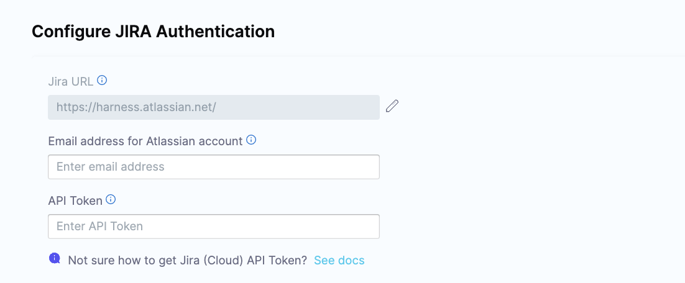
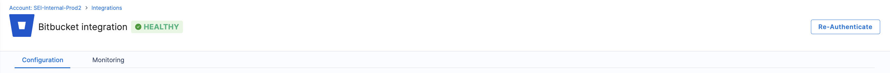

import Tabs from '@theme/Tabs';
import TabItem from '@theme/TabItem';

If your integration health is failing due to expired credentials, you can easily re-authenticate by following these steps to update your access token:

<Tabs>
<TabItem value="jira" label="Jira" default>

* Go to the **Integrations**, and select your integration from the **Your Integrations** tab.

* Click on **Monitoring**.

* Click on the **Re-Authenticate** button at the top right corner.

* Follow the prompts and enter your email and the new **API Key**. Note that you cannot switch authentication type or update any existing configuration settings apart from the new token.

* Click **Validate Connection** to complete the re-authentication process.
 
By following these steps, you'll successfully re-authenticate with the Jira platform using your new access token, resolving any issues caused by expired credentials.

</TabItem>

<TabItem value="github" label="GitHub">

* Go to the **Integrations**, and select your integration from the **Your Integrations** tab.

* Click on **Monitoring**.

* Click on the **Re-Authenticate** button at the top right corner.

* Follow the prompts and enter your email and the new **PAT Token**. Note that you cannot switch authentication type or update any existing configuration settings apart from the new token.

* Click **Validate Connection** to complete the re-authentication process.
 
By following these steps, you'll successfully re-authenticate with the Jira platform using your new access token, resolving any issues caused by expired credentials.

</TabItem>

<TabItem value="bitbucket" label="Bitbucket">

* Go to the **Integrations**, and select your integration from the **Your Integrations** tab.

* Click on **Monitoring**.

* Click on the **Re-Authenticate** button at the top right corner.

* Follow the authentication steps based on your setup:
  * For OAuth authentication, you’ll be redirected to Bitbucket, where you can grant permissions for the integration. Bitbucket will confirm authorization, returning you to the re-authentication setup page.
  * If the integration was set up using the Atlassian API, follow the prompts to enter your email and the new API Key. Please note that you cannot switch the authentication type or modify existing configuration settings aside from entering the updated token.

* Click **Validate Connection** to complete the re-authentication process.
 
By following these steps, you'll successfully re-authenticate with the Jira platform using your new access token, resolving any issues caused by expired credentials.

</TabItem>

<TabItem value="ado" label="Azure DevOps">

To set up re-authentication for Azure Devops, you'll need to reauthenticate the Azure Boards integration. Once the reauthentication is completed

* Go to the **Integrations**, and select your integration from the **Your Integrations** tab.

* Click on **Monitoring**.

* Click on the **Re-Authenticate** button at the top right corner.

* Follow the prompts and enter your email and the new **API Key**. Note that you cannot switch authentication type or update any existing configuration settings apart from the new token.

* Click **Validate Connection** to complete the re-authentication process.
 
By following these steps, you'll successfully re-authenticate with the Jira platform using your new access token, resolving any issues caused by expired credentials.

</TabItem>

<TabItem value="harness" label="Harness CI/CD">

* Go to the **Integrations**, and select your integration from the **Your Integrations** tab.

* Click on **Monitoring**.

* Click on the **Re-Authenticate** button at the top right corner.

* Follow the prompts and enter your email and the new **API Key**. Note that you cannot switch authentication type or update any existing configuration settings apart from the new token.

* Click **Validate Connection** to complete the re-authentication process.
 
By following these steps, you'll successfully re-authenticate with the Jira platform using your new access token, resolving any issues caused by expired credentials.

</TabItem>

<TabItem value="gitlab" label="GitLab">

* Go to the **Integrations**, and select your integration from the **Your Integrations** tab.

* Click on **Monitoring**.

* Click on the **Re-Authenticate** button at the top right corner.

* Follow the prompts and enter your email and the new **API Key**. Note that you cannot switch authentication type or update any existing configuration settings apart from the new token.

* Click **Validate Connection** to complete the re-authentication process.
 
By following these steps, you'll successfully re-authenticate with the Jira platform using your new access token, resolving any issues caused by expired credentials.

</TabItem>
</Tabs>