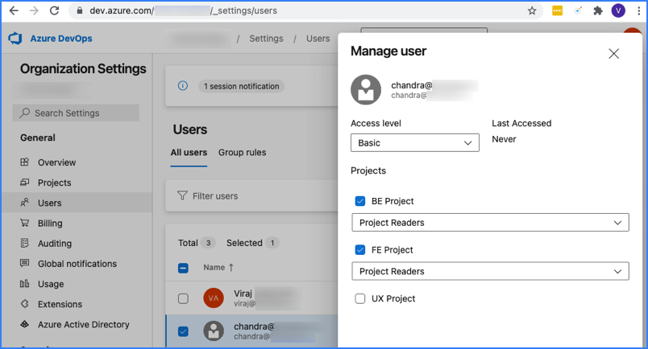

Azure DevOps is a Microsoft product that provides version control, reporting, requirements management, project management, automated builds, testing and release management capabilities. It covers the entire application lifecycle, and enables DevOps capabilities.

Use the SEI Azure DevOps Services connector to integrate SEI with Azure DevOps Services. SEI ingests pipelines, Git repos, Team Foundation Version Control (TFVC), and Azure Boards data from Azure DevOps Services.

Azure DevOps Services is a cloud offering. To integrate with the on-premises offering, Azure DevOps Server, you must use the [generic SEI connector](./sei-connector-generic.md).

## Requirements

The following permissions and settings are required to use the SEI Azure DevOps Services connector:

* You have registered for Azure DevOps Services, created organizations and projects in Azure DevOps, and all SEI-relevant projects use **Git** for version control.
* Your Azure DevOps account has one of the following access levels: **Basic**, **Basic + Test Plans**, or **Visual Studio Professional/Enterprise**. For more information, go to the Microsoft documentation on [Azure DevOps Access Levels](https://docs.microsoft.com/en-us/azure/devops/organizations/security/access-levels?view=azure-devops#supported-access-levels).
* You have **Reader** permission (or higher) for all SEI-relevant Azure DevOps projects. For more information, go to the Microsoft documentation on [Azure DevOps Permissions](https://docs.microsoft.com/en-us/azure/devops/organizations/security/permissions-access?view=azure-devops).

<figure>

<figcaption>Permissions for an Azure DevOps user who can access two projects and can't access a third project.</figcaption>
</figure>

## Configure the connector

1. In your Harness project, go to the SEI module, and select **Account**.
2. Select **SEI Connectors** under **Data Settings**.
3. Select **Available Connectors**, locate the **Azure DevOps Services** connector, and select **Install**.
4. Configure and save the connector.

   * If you are redirected to Azure DevOps, sign in with your user credentials. Azure DevOps uses OAuth authentication.
   * Enter a **Name** for the connector.
   * The **Description** and **Tags** are optional.
   * Identify Azure DevOps **Organizations** to associate with the connector. If unspecified, the connector associates all available organizations. Available organizations are organizations that the authenticated user can access.
