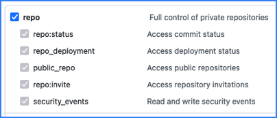
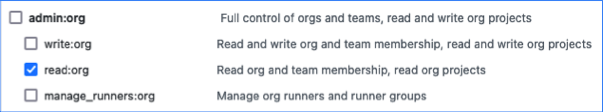

GitHub provides hosting for software development and version control using Git.

Use the SEI GitHub connector to integrate SEI with GitHub.

:::info Personal and organization repositories

SEI only ingests repositories from organizations. SEI doesn't ingest your personal repos or repos where you are a collaborator but not a member of the affiliated organization.

In other words, the owner of the [GitHub personal access token](#create-a-github-personal-access-token) that is associated with the connector must be a direct member of an organization for a repo to be ingested by SEI.

:::

## Configure authentication

The SEI GitHub connector can use either OAuth or personal access token authentication.

If you can't use OAuth, you must create a GitHub personal access token to configure the SEI GitHub connector.

1. Log in to your GitHub account and create a personal access token. For instructions, go to the GitHub documentation on [Managing your personal access tokens](https://docs.github.com/en/authentication/keeping-your-account-and-data-secure/managing-your-personal-access-tokens).
2. Select the following permissions for your personal access token:

   * All `repo` scopes, including the parent `repo` scope. The top-level `repo` scope is required for SEI to have the required visibility into your repos.

   

   * The `read:org` scope under `admin:org`.

   

   * The `admin:org_hook` scope is required to track issue cycle time (for the [SCM Issue Time Across Stages Report](../sei-metrics-and-reports/velocity-metrics-reports/scm-reports.md#scm-issues-reports)). If you don't want to track issue cycle time, you don't need to select this permission.

   

3. Copy the token somewhere that you can retrieve it when you configure the connector.
4. If your GitHub organization uses SAML SSO, enable SSO for your personal access token. For instructions, go to the GitHub documentation on [Authorizing a personal access token for use with SAML SSO](https://docs.github.com/en/enterprise-cloud@latest/authentication/authenticating-with-saml-single-sign-on/authorizing-a-personal-access-token-for-use-with-saml-single-sign-on).

## Configure the connector

1. In your Harness project, go to the SEI module, and select **Account**.
2. Select **SEI Connectors** under **Data Settings**.
3. Select **Available Connectors**, locate the **GitHub Enterprise** or **GitHub Cloud** connector, depending on your GitHub configuration.
4. Select **Install**.
5. Select an authentication method for the connector:

   * To use OAuth, select **Authorize** and follow the prompts to grant access to GitHub.
   * To use a personal access token, paste the token in **Enter the Access Token**.

6. In **Integration Name**, enter a name for the connector.
7. Select repositories to associate with the connector or select **Ingest All Repos** to associate all current and future repos in your GitHub organization.
8. If applicable, configure **Additional Options**:

   * **Fetch PRs:** Allow SEI to ingest PR data from GitHub.
   * **Fetch Issues:** Allow SEI to ingest data from GitHub Issues.
   * **Fetch Projects:** Allow SEI to ingest data from GitHub Projects.
   * **Fetch Commits:** Allow SEI to ingest commit metadata from GitHub.
   * **Fetch Commit Files:** Allow SEI to ingest data within commits from GitHub.
   * **Connect via GitHub webhook:** Select this option if you want GitHub to *push data to SEI* through a webhook, rather than SEI *pulling data from GitHub*. This is an advanced configuration and only recommended if you are confident about using this configuration.

9. Finish configuration and save the connector.

:::info Issue Cycle Time webhook

If you created a personal access token and allowed the `admin:org_hook` permission, SEI creates a user webhook to receive issue cycle time data for the [SCM Issue Time Across Stages Report](../sei-metrics-and-reports/velocity-metrics-reports/scm-reports.md#scm-issues-reports).

If you used OAuth, SEI creates an organization webhook instead.

:::
