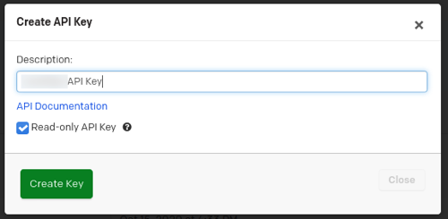

PagerDuty specializes in a SaaS incident response platform for IT departments.

Use the SEI PagerDuty connector to integrate SEI with any Cloud-based PagerDuty account/plan.

To integrate with an on-premises PagerDuty offering, you must use the [generic SEI connector](./sei-connector-generic.md).

## Requirements

To use the SEI PagerDuty connector, you need a **read-only PagerDuty API key**. Copy the key somewhere that you can retrieve it when you configure the connector. For instructions, go to the PagerDuty documentation on [API Access Keys](https://support.pagerduty.com/docs/api-access-keys).

<figure>

<figcaption>Figure 1: Creating a read-only PagerDuty API key.</figcaption>
</figure>

## Configure the connector

1. In your Harness project, go to the SEI module, and select **Account**.
2. Select **SEI Connectors** under **Data Settings**.
3. Select **Available Connectors**, locate the **PagerDuty** connector, and select **Install**.
4. Configure and save the connector.

   * **URL:** Enter `https://api.pagerduty.com`, unless you have a special use case that requires a different URL.
   * **Username:** The email address of the user that created the API key in PagerDuty.
   * **API Key:** Enter your PagerDuty API key.
   * **Name:** Enter a name for the connector.
   * **Description** and **Tags** are optional.
