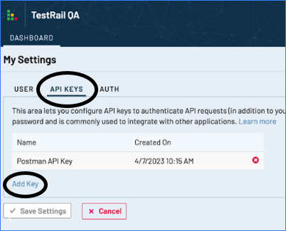
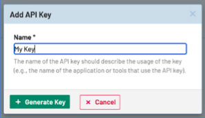
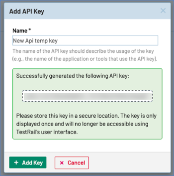

TestRail is a test management platform that helps you streamline your software testing processes, get visibility into QA, and release high-quality software.

Use the SEI TestRail connector to integrate SEI with TestRail.

## Requirements

To use the SEI TestRail connector you need a TestRail API Key.

1. In TestRail, go to **My Settings**, select the **API Keys** tab, and then select **Add Key**.

   <!--  -->

   <docimage path={require('./static/testrail-api-key1.png')} />

2. Enter a name for the key and select **Generate Key**.

   <!--  -->

   <docimage path={require('./static/testrail-api-key2.png')} />

3. Copy the key somewhere that you can retrieve it when you configure the connector.

   <!--  -->

   <docimage path={require('./static/testrail-api-key3.png')} />

## Configure the connector

1. In your Harness project, go to the SEI module, and select **Account**.
2. Select **SEI Connectors** under **Data Settings**.
3. Select **Available Connectors**, locate the **TestRail** connector, and select **Install**.
4. Configure and save the connector.

   * **URL:** Enter the URL for your TestRail instance.
   * **Username:** The user name for the TestRail user that created the API key.
   * **API Key:** Enter the TestRail API key.
   * **Name:** Enter a name for the connector.
   * **Description** and **Tags** are optional.
