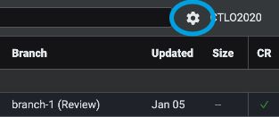
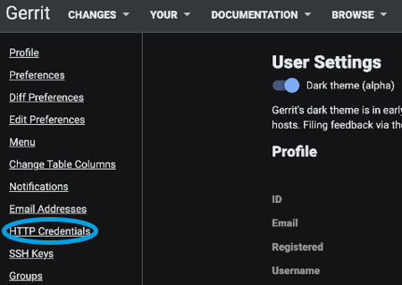
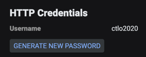

Gerrit is a free, web-based team code collaboration tool.

Use the SEI Gerrit integration to integrate SEI with Gerrit.

## Generate the API key

You must create HTTP credentials in Gerrit that you will use as an API key when you configure the integration.

1. Launch Gerrit and log in.
2. Select the **Settings** icon near your user name.

   

3. Select **HTTP Credentials**.

   

4. Select **Generate New Password**.

   

5. Copy the password somewhere that you can retrieve it when you configure the integration.

## Configure the integration

1. In your Harness project, go to the SEI module, and select **Account**.
2. Select **SEI Integrations** under **Data Settings**.
3. Select **Available Integrations**, locate the **Gerrit** integration, and select **Install**.
4. Configure and save the integration.

   * **URL:** Enter the URL for your Gerrit instance with a slash at the end, such as `https://gerrit.example.com/`.
   * **User Name:** Enter your Gerrit account user name.
   * **API Key:** Enter your Gerrit HTTP credentials.
   * **Name:** Enter a name for the integration.
   * **Description** and **Tags** are optional.
