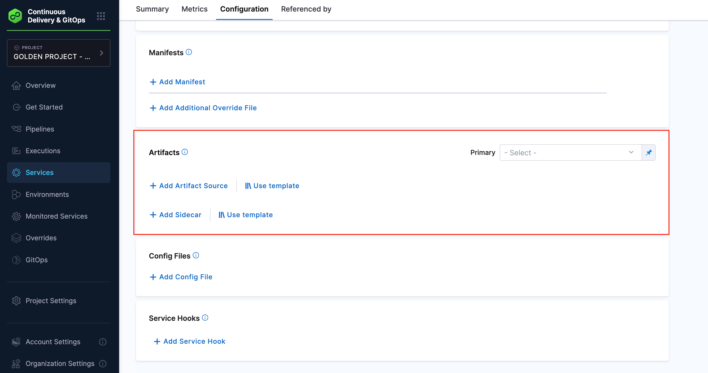

SEI can connect to one or more CI/CD integrations. The jobs and executions are normalized and can be correlated across multiple sources. For example, you could be using Jenkins as your CI platform and Harness as the CD.

This topic explains how SEI correlates CI and CD stages in the Lead Time workflow for different tool combinations.

The correlation between CI & CD execution is built on **generated artifacts (by CI execution)** and **consumed artifacts (by CD execution)**. At this time, only container image-type artifacts are supported.

## Requirements

The CI/CD correlation on SEI completely depends upon the artifact information. It is important to ensure SEI receives the artifact data as part of the CI/CD pipeline executions in your software delivery lifecycle. SEI primarily supports correlation for container image-based artifacts. For other artifact types, ensure unique creation of artifact names.

To set up correct correlation between CI and CD stages in SEI when measuring Lead Time, the following information is needed:

* **Artifact Location ->** Where the artifact is stored (e.g., a Docker repository) (Repository Name)
* **Artifact Name ->** The name or path of the artifact (Artifact Path) 
* **Artifact Qualifier ->** A unique identifier for the artifact (often a tag or version number)

:::info
Note that for accurate correlation, every CI and CD execution must have a unique combination of artifact name and qualifier.
:::

## Supported integrations mapping

Please refer to the table below for the complete list of CI/CD mapping across different tools that are currently supported in the Lead Time workflow.

<table>
  <thead>
    <tr>
      <th width="300px">CI Tool</th>
      <th width="300px">CD Tool</th>
      <th width="300px">Effort Involved by User</th>
    </tr>
  </thead>
  <tbody>
    <tr>
      <td width="300px">Jenkins</td>
      <td width="300px">Jenkins</td>
      <td width="300px">Requires Custom Scripts in all Jenkins Pipelines</td>
    </tr>
    <tr>
      <td width="300px">Jenkins</td>
      <td width="300px">Harness CD</td>
      <td width="300px">Requires Custom Scripts in all Jenkins Pipelines + Harness CD artifact configuration</td>
    </tr>
    <tr>
      <td width="300px">Harness CI</td>
      <td width="300px">Harness CD</td>
      <td width="300px">Harness CD artifact configuration</td>
    </tr>
    <tr>
      <td width="300px">Github Actions</td>
      <td width="300px">Harness CD</td>
      <td width="300px">GHA workflow configuration + Harness CD artifact configuration</td>
    </tr>
    <tr>
      <td width="300px">Custom CI</td>
      <td width="300px">Harness CD</td>
      <td width="300px">Requires the Custom CI tool to send artifact information using the custom CI/CD integration + Harness CD artifact configuration</td>
    </tr>
    <tr>
      <td width="300px">Custom CI</td>
      <td width="300px">Custom CD</td>
      <td width="300px">Requires the Custom CI tool to send artifact information using the custom CI/CD integration + Custom CD tool to send the same artifact information that is being deployed</td>
    </tr>
  </tbody>
</table>

## Jenkins CI with Jenkins CD

This section explains how SEI correlates CI and CD stages in the Lead Time workflow when both the CI and CD tool used is Jenkins.

SEI offers two primary methods for integrating Jenkins into your DORA CI/CD correlation workflow:

* [SEI Jenkins Plugin](/docs/software-engineering-insights/sei-integrations/semi-automated-integrations/jenkins-plugin) 
* [Jenkins plugin with a Custom CI/CD API](#jenkins-ci-with-harness-cd)

Understanding when and how to use each method is crucial for effective implementation of DORA metrics in your development process.

### SEI Jenkins Plugin

The SEI Jenkins Plugin is designed for straightforward integration when Jenkins serves as your primary CI/CD tool. It supports Lead Time, Deployment Frequency and Change Failure Rate configuration. It's ideal for teams who are comfortable with a single-stage configuration for both CI and CD processes and don't require separate metrics for these stages.

To use the plugin, simply install it from the [Jenkins plugin store](/docs/software-engineering-insights/sei-integrations/semi-automated-integrations/jenkins-plugin) and configure it within your Jenkins environment. Once set up, the plugin automatically sends pipeline execution data for all CI/CD pipelines to SEI. In your SEI workflow profile, you'll need to configure a single stage that represents both CI and CD.

While the plugin offers ease of use, it comes with limitations.

* It doesn't differentiate between CI and CD stages, which may not fit all workflow needs.
* It's best suited for setups where Jenkins handles both CI and CD and where granular separation of these stages in the Lead Time metric isn't a priority.

### Custom CI/CD API

The Jenkins plugin does not natively capture data for CI and CD executions, which means that artifact information—used as the correlation pointer for Lead Time—is not automatically sent to SEI.

To measure CI and CD data separately for Lead Time, it's recommended to configure your Jenkins pipelines to send artifact details for both CI and CD stages using the [Custom CI/CD API endpoint](#using-custom-cicd-api).

For detailed instructions on how to use this endpoint, refer to [Using Custom CI/CD API](#using-custom-cicd-api).

## Jenkins CI with Harness CD

This section explains how SEI correlates CI and CD stages in the Lead Time workflow when the CI tool is Jenkins and CD tool used is Harness CD.

### Jenkins with Custom CI/CD API

For more complex setups, particularly those involving multiple tools or requiring distinct CI and CD metrics, the custom integration approach is the way to go. This approach is especially useful when you're using Jenkins for CI but a different tool, such as Harness, for CD.

Implementing this involves creating a [Custom CI/CD integration](/docs/software-engineering-insights/sei-integrations/semi-automated-integrations/sei-custom-cicd-integrations) in SEI and adding custom script logic to your Jenkins pipeline. This script sends build artifact information to SEI via a POST request.

Here's an example of how you might implement this in your Jenkins pipeline:

```bash
pipeline {
    agent any

    tools {
        // Reference the Docker installation configured in Jenkins Global Tool Configuration
        dockerTool 'docker-latest'
    }
    stages {
        stage ('Git checkout') {
            steps {
                script {
                    git branch: 'main', credentialsId: 'github_pass', url: 'https://github.com/levelops/GHA-Test'
                    echo 'checkout jenkins-rnd repo'
                }
            }
        }
        stage ('Login to Docker Image') {
            steps {
                sh "docker login -u ${DOCKER_USER} -p ${DOCKER_PASS}"
                echo 'Logged into docker successfully'
            }
        }
        stage ('Build Docker Image') {
            steps {
                echo 'Building docker image...'
                sh "docker build -f python-jenkins/Dockerfile -t py-sample-image-dp ."
                echo 'Docker image is built'
            }
        }
        stage ('Run Docker Image') {
            steps {
                echo 'Running docker image...'
                sh "docker run py-sample-image-dp"
            }
        }
        stage ('Tag Docker Image') {
            steps {
                echo 'Tagging docker image...'
                sh "docker tag py-sample-image-dp:latest ${DOCKER_USER}/jenkins-poc-declarative-pipeline:${BUILD_NUMBER}"
                echo 'Provided tag to docker image'
            }
        }
        stage ('Publish Docker image') {
            steps {
                echo 'Publishing docker image to hub...'
                sh "docker push ${DOCKER_USER}/jenkins-poc-declarative-pipeline:${BUILD_NUMBER}"
                echo 'Docker image is successfully published to docker hub'
            }
        }
        
        stage ('List Shas') {
            steps {
                 script {
                    def GIT_COMMIT_HASH = sh (script: "git log -n 1 --pretty=format:'%H'", returnStdout: true)
                    echo  GIT_COMMIT_HASH  
                 }
            }
        }
        
        stage ('Submit Execution to SEI') {
            steps {
                script {
                    def apiUrl = "https://app.harness.io/gratis/sei/api/v1/custom-cicd"
                    def repoUrl = "<SCM_REPOSITORY_URL>"
                    def instanceUrl = "<JENKINS_INSTANCE_URL>"
                    def location = "registry.hub.docker.com/<DOCKER_HUB_REPOSITORY>"
                    def instanceId = '<SEI_CICD_INSTANCE_ID>'
                    def apiKey = 'Apikey <YOUR_OWN_SEI_API_KEY>'
                    def buildNumber = env.BUILD_NUMBER
                    def b_number = buildNumber.toLong()
                    def GIT_COMMIT_SHAS = <LIST_OF_COMMIT_SHAS_BETWEEN_CURRENT_AND_LAST_SUCCESSFULL_BUILD>
                    def startTime = <BUILD_START_TIME>
                    
                    def payload = '{ \"pipeline\": \"jenkins-declarative-pipeline\", \"user_id\": \"nishith\", \"repo_url\": \"'+repoUrl+'\", \"start_time\": '+ startTime +', \"result\": \"success\", \"duration\": 77000, \"build_number\": '+b_number+', \"instance_guid\": \"'+instanceId+'\", \"instance_name\": \"jenkins-integration-13\", \"instance_url\": \"'+inUrl+'\", \"job_run\": null, \"job_full_name\": \"jenkins-declarative-pipeline\", \"qualified_name\": \"jenkins-declarative-pipeline\", \"branch_name\": \"main\", \"module_name\": null, \"scm_commit_ids\": [ <GIT_COMMIT_SHAS_AS_LIST> ], \"job_run_params\": [ { \"type\": \"StringParameterValue\", \"name\": \"version\", \"value\": 1 }, { \"type\": \"StringParameterValue\", \"name\": \"revision\", \"value\": 1 } ], \"ci\": true, \"cd\": false, \"artifacts\": [ { \"input\": false, \"output\": true, \"type\": \"container\", \"location\": \"'+location+'\", \"name\": \"jenkins-poc-declarative-pipeline\", \"qualifier\": \"'+b_number+'\" } ] }'
                    
                    sh "curl -X POST ${apiUrl} --header 'Accept: application/json, text/plain, */*' --header 'Referer: https://app.harness.io/gratis/sei/api' --header 'sec-ch-ua-mobile: ?0' --header 'authorization: ${apiKey}' --header 'Content-Type: application/json' --data '${payload}'"
                
                    echo 'Pushed execution detail to SEI...'
                }
            }
        }
    }
}
```

After setting up this custom integration, you'll need to configure Harness CD to consume the artifact information you've sent to SEI. The following details are required to be met in order to set the correlation between Harness CI and Harness CD.

* In your pipeline ensure that you’re using the **Deploy Stage** in Harness CD for artifact deployment.


* Configure the correct [**Artifact Source**](/docs/continuous-delivery/x-platform-cd-features/services/artifact-sources) for the service.



* Refer to the same **Artifact Source** that is configured in the pipeline service while deploying the artifact. Deploying an artifact for which the Artifact Source is not configured will result in failure while correlating the CI/CD stage in SEI

Note that SEI natively supports correlation for container image based artifacts. For other artifact types some changes might be required in the Jenkins shell script to ensure unique creation of artifact names.

In your [SEI workflow profile](/docs/software-engineering-insights/sei-profiles/workflow-profile#configure-the-dora-profile), you can then set up separate stages for CI and CD, ensuring correct correlation between the two.

The primary advantage of this approach is flexibility. It allows for distinct CI and CD stages to be configured in the workflow profile allowing you to measure CI and CD lead time separately. However, it does require more setup and maintenance compared to the plugin approach.

:::info
Note that for correct correlation of CI and CD it is important to for every CI and CD execution to have unique combination of artifact name and qualifier.
:::

## Harness CI with Harness CD

This section explains how SEI correlates CI and CD stages in the Lead Time workflow when the CI tool is Harness CI and CD tool used is Harness CD.

In this scenario it is important to ensure both pipelines are using the same artifact source. The following details are required to be met in order to set the correlation between Harness CI and Harness CD.

* In your pipeline ensure that you’re using the **Deploy Stage** in Harness CD for artifact deployment.


* Configure the correct [**Artifact Source**](/docs/continuous-delivery/x-platform-cd-features/services/artifact-sources) for the service.


* Refer to the same **Artifact Source** that is configured in the pipeline service while deploying the artifact. Deploying an artifact for which the Artifact Source is not configured will result in failure while correlating the CI/CD stage in SEI

:::info
Note that SEI natively supports correlation for container image based artifacts. For other artifact types some changes might be required to ensure unique creation of artifact names.
:::

## Github Actions with Harness CD

This section explains how SEI correlates CI and CD stages in the Lead Time workflow when the CI tool is Github Actions and CD tool used is Harness CD.

You can set up a [GitHub Actions workflow](/docs/software-engineering-insights/sei-integrations/automated-integrations/sei-github-actions#ingest-artifacts-and-environment-variable-data)to allow SEI to ingest the data for the artifacts and environment variables from GitHub Actions. To learn more, go to [Github Actions integration](/docs/software-engineering-insights/sei-integrations/automated-integrations/sei-github-actions).

In this scenario it is important to ensure both pipelines are using the same artifact source. The following details are required to be met in order to set the correlation between Harness CI and Harness CD.

* In your pipeline ensure that you’re using the **Deploy Stage** in Harness CD for artifact deployment.


* Configure the correct [**Artifact Source**](/docs/continuous-delivery/x-platform-cd-features/services/artifact-sources) for the service.


* Refer to the same **Artifact Source** that is configured in the pipeline service while deploying the artifact. Deploying an artifact for which the Artifact Source is not configured will result in failure while correlating the CI/CD stage in SEI

:::note
Note that SEI natively supports correlation for container image based artifacts. For other artifact types some changes might be required to ensure unique creation of artifact names.
:::

## Using Custom CI/CD API

If you use custom CI/CD tools or Jenkins as both your CI and CD tool but want to track CI and CD metrics separately, you can use the Custom CI/CD API. This API allows you to send detailed artifact and pipeline execution data to SEI, allowing accurate correlation between CI and CD stages. This is particularly useful when you're using tools that are not natively supported by SEI.

This API can be used to send information related to the artifacts generated during the CI process and those deployed during the CD process. Artifacts act as the mandatory reference point to correlate CI and CD stages when measuring Lead Time.

### Send CI pipeline data to SEI

Here's an example request on how you can send the CD pipeline data i.e. the artifact deployed as part of the CD deployment pipeline execution to SEI.

```bash
curl --location 'https://app.harness.io/gratis/sei/api/v1/custom-cicd' \
--header 'Authorization: ApiKey <HARNESS_SEI_API_KEY>' \
--header 'Content-Type: application/json' \
--data '{
    "instance_guid": "<INSTANCE_GUID>",
    "job_full_name": "<JOB_FULL_NAME>",
    "build_number": "<BUILD_NUMBER>",
    "pipeline": "<PIPELINE_NAME>",
    "project_name": "<PROJECT_NAME>",
    "user_id": "<USER_ID>",
    "repo_url": "<REPO_URL>",
    "start_time": <START_TIME>,
    "result": "<RESULT_STATUS>",
    "duration": <DURATION_IN_MS>,
    "instance_name": "<INSTANCE_NAME>",
    "instance_url": "<INSTANCE_URL>",
    "job_run": null,
    "qualified_name": "<QUALIFIED_NAME>",
    "branch_name": "<BRANCH_NAME>",
    "module_name": null,
    "scm_commit_ids": [
        "<COMMIT_ID_1>", "<COMMIT_ID_2>"
    ],
    "ci": true,
    "cd": false,
    "artifacts": [
        {
            "input": false,
            "output": true,
            "type": "container",
            "location": "<ARTIFACT_LOCATION>",
            "name": "<ARTIFACT_NAME>",
            "qualifier": "<ARTIFACT_QUALIFIER>"
        }
    ],
    "web_url": "<WEB_URL>"
}'
```

### Send CD pipeline data to SEI

Here's an example request on how you can send the CD pipeline data i.e. the artifact information deployed as part of the CD pipeline execution to SEI.

```bash
curl --location 'https://app.harness.io/gratis/sei/api/v1/custom-cicd' \
--header 'Authorization: ApiKey <HARNESS_SEI_API_KEY>' \
--header 'Content-Type: application/json' \
--data '{
    "instance_guid": "<INSTANCE_GUID>",
    "job_full_name": "<JOB_FULL_NAME>",
    "build_number": "<BUILD_NUMBER>",
    "pipeline": "<PIPELINE_NAME>",
    "project_name": "<PROJECT_NAME>",
    "user_id": "<USER_ID>",
    "repo_url": "<REPO_URL>",
    "start_time": <START_TIME>,
    "result": "<RESULT_STATUS>",
    "duration": <DURATION_IN_MS>,
    "instance_name": "<INSTANCE_NAME>",
    "instance_url": "<INSTANCE_URL>",
    "job_run": null,
    "qualified_name": "<QUALIFIED_NAME>",
    "branch_name": "<BRANCH_NAME>",
    "module_name": null,
    "scm_commit_ids": [
        "<COMMIT_ID_1>", "<COMMIT_ID_2>"
    ],
    "ci": false,
    "cd": true,
    "artifacts": [
        {
            "input": true,
            "output": false,
            "type": "container",
            "location": "<ARTIFACT_LOCATION>",
            "name": "<ARTIFACT_NAME>",
            "qualifier": "<ARTIFACT_QUALIFIER>"
        }
    ],
    "web_url": "<WEB_URL>"
}'
```

### Payload

The payload for both CI and CD data submissions contains several required fields. Here’s a breakdown:

| Field | Data Type | Description |
| - | - | - |
| `instance_guid` | string | [UUID (Universally Unique Identifier)](/docs/software-engineering-insights/sei-integrations/semi-automated-integrations/sei-custom-cicd-integrations#step-2-generate-a-cicd-instance-guid-associated-with-that-integration) for the CI/CD instance. |
| `job_full_name` | string | A human-readable identifier for the job, often the same as the pipeline name. |
| `build_number` | integer | The build number associated with the job execution. |
| `pipeline` | string | The name of the CI/CD job. |
| `project_name` | string | Name of the project in which the pipeline is running. |
| `user_id` | integer | User identifier in string |
| `repo_url` | string | The URL of the repository related to the job. |
| `start_time` | integer | Job start time in epoch milliseconds. |
| `result` | string | The result of the job, either `SUCCESS` or `FAILURE`. |
| `duration` | integer | Job duration in milliseconds. |
| `instance_name` | string | The identifier for the CI/CD instance (not the UUID). |
| `instance_url` | string | URL of the CI/CD tool instance. |
| `job_run` | object | Information about the job run, including stages, steps, and their results. |
| `qualified_name` | string | A qualified name for the job, typically the same as the pipeline name. |
| `branch_name` | string | The branch where the build is triggered |
| `module_name` | string | Only applicable to Jenkins |
| `scm_commit_ids` | array of strings | An array of commit ids related to the deployment |
| `ci` and `cd` | boolean | One is true and the other is false, depending on whether this is for a CI job or a CD job. |
| `artifacts` | array of objects | An array of information about the job run, including input, output, type, location, name, qualifier, hash, and metadata. |
| `input` | boolean | False for CI and True for CD |
| `output` | boolean | True for CI and False for CD |
| `type` | string | Type of the artifact |
| `location` | string | URL/location of the output artifact. |
| `name` | string | Name of the artifact (unique) |
| `qualifier` | string | Unique version or qualifier for the artifact. (name and qualifier are usually same for non-container based artifacts) |
| `web_url` | string | Contains the pipeline execution URL |

For more information refer to the documentation on setting up [Custom CI/CD integration](/docs/software-engineering-insights/sei-integrations/semi-automated-integrations/sei-custom-cicd-integrations). It is recommended to configure the custom CI/CD integration with assistance from [Harness Support](mailto:support@harness.io) to ensure the configuration meets the requirements for CI/CD correlation in lead time.

:::info IMPORTANT NOTE
* SEI natively supports correlation for container image-based artifacts. For other artifact types, modifications may be necessary to ensure unique creation of artifact names.
* For correct correlation of CI and CD, it is crucial that every CI and CD execution has a unique combination of artifact name and qualifier.
:::
