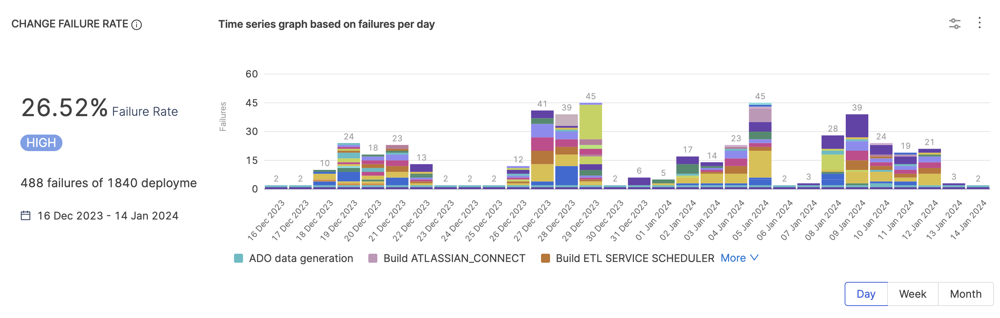
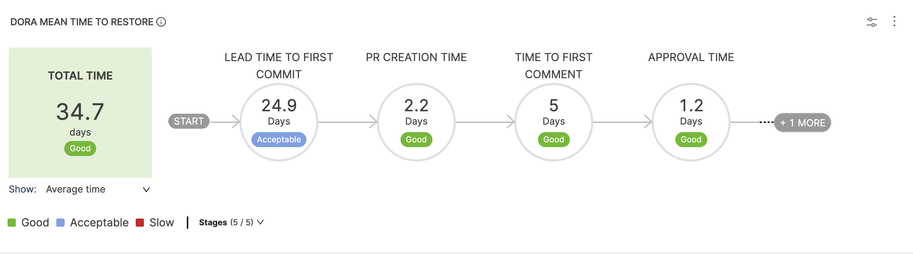

DORA (DevOps Research Assessment) identified the following key metrics that describe a software development team's performance: Deployment Frequency, Lead Time for Changes, Change Failure Rate, Time to Restore service (MTTR), and Reliability (MTBF).

With SEI, you can use [DORA Metrics Insights](/docs/software-engineering-insights/insights/sei-insights/#dora-metrics) to examine your organization's DORA metrics. This helps you understand how your organization or team is performing and helps you get an overview of daily, weekly, and monthly trends.

Furthermore, SEI gives you the flexibility to choose the [integrations](/docs/category/sei-integrations) from which you want to derive data, such as issue management, SCM, incident management, and CI/CD tools, as well as the ability to select filters to refine the data used to generate your metrics.

## DORA Metrics Reports

Harness SEI provides the following reports for DORA metrics reporting:

* [Deployment Frequency](#deployment-frequency)
* [DORA Lead Time for Changes](#lead-time-for-changes)
* [Change Failure Rate](#change-failure-rate)
* [DORA Mean Time to Restore (MTTR)](#mean-time-to-restore-mttr)

## Deployment Frequency

### Definition

The Deployment Frequency report represents how often an organization successfully releases software to production.

To monitor Deployment Frequency, you must create a [DORA type Workflow profile](/docs/software-engineering-insights/sei-profiles/workflow-profile#configure-the-dora-profile) and add the **Deployment Frequency** widget to your Insights.

Workflow profiles determine the integrations to track, the events that mark deployments (such as merged PRs or CI/CD jobs), and the associated Collections. You can modify Workflow profiles according to your team's SDLC process and the parts of the SDLC process you want to monitor (such as only SCM or combined issue management, SCM, and CI/CD). For more information, go to [Workflow profile](/docs/software-engineering-insights/sei-profiles/workflow-profile).


### Add the Deployment Frequency report

To add the **Deployment Frequency** widget to Insights:

#### Step 1: Add the widget

* Go to the Insight where you want to add the widget. Make sure you are in the correct project.
* Select **Settings**, and then select **Add Widget**.
* Select the **Deployment Frequency** widget.


#### Step 2: Configure the widget settings

* Configure the widget settings as desired, such as the enable/disable **DORA grading** and **Collection Level Filters**.


:::info
Editing the Collection Level Filters will reflect the changes in the Collection Settings.
:::

#### Step 3: Save the widget

* Select **Next: Place Widget**, place the widget on the Insight, and then select **Save Layout**.


The widget automatically detects the Workflow profile associated with the Collection under which the Insight is created and adds the widget to the Insight.

### Deployment Frequency calculation

Deployment Frequency performance is ranked on the following grading scale:

* **Elite:** More than one deployment per day.
* **High:** Deployments occur anywhere from once per day to once per week.
* **Medium:** Deployments occur anywhere from once per week to once per month.
* **Low:** Deployment occur less than once per month.

The Deployment Frequency formula depends on whether you are tracking issue management, SCM, or CI/CD. The following factors can contribute to Deployment Frequency calculations:

* The SEI integration chosen in the Workflow profile.
  * For Issue Management SEI integrations, SEI counts the number of issues deployed.
  * For SCM SEI integrations, SEI counts the number of PRs deployed.
  * For CI/CD SEI integrations, SEI counts the number of jobs deployed.
* Filters applied to the Workflow profile.
* Collection-level filters.
* Widget-level filters.
* Insight time range, which is the time range selected by the user when viewing the Insight.

To learn more, go to [Deployment Frequency calculation](/docs/software-engineering-insights/sei-technical-reference/dora-metrics-calculation/dora-deployment-frequency-calculation).

:::info
SEI fetches the history for both the builds jobs and triggers jobs for each pipeline from GitLab. The list of all jobs is available in the job selection tab under Deployment Frequency when configuring the DORA profile.
:::

<details>
<summary>Deployment Frequency calculation example</summary>

Consider the following Deployment Frequency configuration:

* SEI integration: `Jira`
* Filter: Status Category Equals Done
* Calculation parameter: Ticket resolved in Insight time range
* Time Range selected on the dashboard: Last 3 months

With this configuration, the Deployment Frequency widget shows the total number of tickets with a status of **Done** in the given time range.

```
Daily Deployment Frequency = ( Tickets in Done status ) / ( Days in Time Range )
Weekly Deployment Frequency = ( Tickets in Done status ) / ( Days in Time Range / 7 )
```

Assuming there are 24 tickets in **Done** status in the last 91 days, then the Deployment Frequency is 0.263 deployments per day and 1.846 deployments per week.

```
24 / 91 = 0.263
24 / 13 = 1.846
```

</details>

## Lead Time for Changes

### Definition

This report displays the time taken by an issue to go from code committed to code successfully running in production. DORA calculation for Lead Time is similar to how lead time, in general, is calculated, with the difference being the ability to associate a Collection while defining the DORA profile, i.e., at the profile level.

This report represents the amount of time it takes a commit to get into production.

The overall lead time is the sum of the average time spent in each stage configured in the workflow. This metric can help identify where the team is spending time and if the amount of time spent in each stage falls in an acceptable range.


Note that for lead time metrics you can define stages based on either of the following events:

* **Ticket Created:** This event ensures that lead time tracking starts in issue management.
* **Commit Created:** This event ensures that lead time tracking starts when the first commit is committed.
* **API Event:** This This event triggers the lead time calculation based on a custom API event.

The default configuration for a Ticket-based workflow profile has five stages where as PR-based Workflow profile has four stages. To find more information, go to [Workflow profiles for lead time](/docs/software-engineering-insights/sei-profiles/workflow-profile#lead-time-profile).

For information about other Lead Time reports, go to [Lead time reports](/docs/software-engineering-insights/sei-metrics-and-reports/velocity-metrics-reports/lead-time-reports).

### Add the DORA Lead Time for Changes report

The **Lead Time for Changes** widget aggregates lead time across your issue management system, SCM, and CI/CD tools.

To add the **Lead Time for Changes** widget to Insights:

#### Step 1: Add the widget

* Go to the **Insight** where you want to add the widget. Make sure you are in the correct project.
* Select **Settings**, and then select **Add Widget**.
* Select the **Lead Time for Changes** widget.


#### Step 2: Configure the widget settings

* Configure the **Filters** for the widget (e.g., `Issue Resolved In` for the Last Quarter)
* Select the metric you want to measure under the **Metrics** tab. For example: `Average Time in the Stage` measures the average time spent in each stage.
* Under the **Settings** tab, specify the associated **Workflow profile**.

#### Step 3: Save the widget

* Select **Next: Place Widget**, place the widget on the Insight and then select **Save Layout**.

For information about other Lead Time reports, go to [Lead time reports](/docs/software-engineering-insights/sei-metrics-and-reports/velocity-metrics-reports/lead-time-reports).

### Development Stages

#### Lead Time to First Commit

This metric refers to the amount of time that passes from the beginning of a development cycle (like the start of a sprint or when a feature is first planned) to the first commit in the SCM. Essentially, it measures how long it takes to start actual coding work after a task is defined.


#### PR Creation Time

This is the duration between the first commit in a repository and the creation of the first pull request that includes this commit. It reflects how promptly changes are proposed for review after initial development.


<!--

This metric can be defined as either:

* Time from Commit to First PR Creation: This is the duration between the first commit in a repository and the creation of the first pull request that includes this commit. It reflects how promptly changes are proposed for review after initial development.
* Time from Commit to Last PR Creation: This measures the time from the first commit to the creation of the last pull request that includes this commit. This could be longer, especially in cases where commits are made early but the PR is created much later after further development. -->

#### Time to Comment

This metric measures the duration from the moment a pull request is created to the time the first comment is made on it. It's an indicator of the engagement and response time of the team or reviewers.


<!-- Users can choose to calculate this as either:
  
* Time from PR Creation to First Comment: This metric measures the duration from the moment a pull request is created to the time the first comment is made on it. It's an indicator of the engagement and response time of the team or reviewers.
* Time from PR Creation to Last Comment: This is the time taken from the creation of the PR to the last comment made. It could indicate the overall duration of discussion or review on the PR.
-->

#### Approval Time

This measures the time taken from the creation of a pull request to its first approval. It's a gauge of how quickly a PR is reviewed and approved by the team.


<!--

This metric can be defined as either:
  
* Time from the PR Creation to the First Approval: This measures the time taken from the creation of a pull request to its first approval. It's a gauge of how quickly a PR is reviewed and approved by the team.
* Time from the PR Creation to the Last Approval: This is the duration from the PR creation to the last approval it receives. In workflows requiring multiple approvals, this metric indicates the total time taken for all necessary reviews. -->

#### Merge Time

This is the time taken to merge the first pull request after it has been created. It indicates the speed at which changes are integrated into the main branch.


<!--

This metric can be defined as either:

* Time to Merge the First PR: This is the time taken to merge the first pull request after it has been created. It indicates the speed at which changes are integrated into the main branch.
* Time to Merge for the Last PR Merge: This measures the time taken to merge the last pull request. In scenarios with multiple PRs, this metric can show how long it takes to integrate all changes from various PRs into the main branch.

-->

:::info
Note that for Lead Time For Changes Report you can choose to enable or disable the Development Stages based on your requirements.
:::

### Lead Time for Changes calculation

Overall lead time is the sum of the time spent in each stage in a workflow, such as commit-to-deployment time for a change, open-to-merge time for PRs, or the issue workflow for issues in your issue management system. Lead time can help identify where a team is spending time and if the amount of time spent in each stage falls in an acceptable range.

The specific events or stages considered in a lead time calculation depend on the report and the stages defined in the associated [Workflow profile](/docs/software-engineering-insights/sei-profiles/workflow-profile#workflow-profiles-for-lead-time). The lead time ultimately depends on the stages that a PR or issue actually goes through. For example, if there are no comments on the a, then the *time to comment* is zero.

### Average

When configured to calculate the Lead Time as the **Average time in stage**, the individual lead time for each stage is calculated as the average across all the tickets or commits or both depending on the profile configuration, The overall lead time is then calculated as the sum of all the stages.

### Median

The [median lead time](/docs/software-engineering-insights/sei-technical-reference/dora-metrics-calculation/dora-lead-time-calculation#median) is the duration by which half of the tasks or tickets are completed. It gives you idea about the typical completion time by showing the point where half of the tickets are resolved faster and the other half take longer.

### 90th Percentile

The [90th percentile lead time](/docs/software-engineering-insights/sei-technical-reference/dora-metrics-calculation/dora-lead-time-calculation#90th-percentile) is the duration within which 90% of tasks or tickets are completed, representing an upper bound for typical completion times while excluding the most extreme delays.

### 95th Percentile

The [95th percentile lead time](/docs/software-engineering-insights/sei-technical-reference/dora-metrics-calculation/dora-lead-time-calculation#95th-percentile) is the duration within which 95% of tasks or tickets are completed, representing an upper bound for typical completion times while excluding the most extreme delays. The calculation of the 95th percentile lead time follows the same steps as the 90th percentile, with the only difference being the percentile value used.

If you want to learn more about the calculations behind these metrics, you can check out the [DORA Lead Time calculations](/docs/software-engineering-insights/sei-technical-reference/dora-metrics-calculation/dora-lead-time-calculation).

### Lead Time Scoring

The overall lead time can be categorized into three labels: Good, Acceptable, and Low.

**Total Ideal Time:** The sum of all ideal times for each stage in the workflow.
**Total Acceptable Time:** The sum of all acceptable times for each stage in the workflow.

The lead time performance is ranked on the following grading scale:

* **Good:** The lead time is less than or equal to the Total Ideal Time.
* **Acceptable:** The lead time is greater than the Total Ideal Time but less than or equal to the Total Acceptable Time.
* **Low:** The lead time exceeds the Total Acceptable Time.

### Example

The following example demonstrate how PR lead time would be calculated in different scenarios. These examples are based on the default configuration for a PR-based DORA type Workflow profile, which has four stages: PR Creation Time, Time to Comment, Approval Time, and Merge Time.

When reviewing these examples, consider the following:

* *Time to Comment* helps you understand the lead time between PR creation time and the associated review.
* There are two ways to track the time taken for a PR approval:
  * Default *Approval Time* configuration: The overall approval time, starting from PR creation.
  * *Approval Time* minus *Time to Comment*: Time spent in the review cycle when an active reviewer is involved.
* The *overall Lead Time* is the sum of the average time spent in each stage. This is where you can determine where teams are spending their time and whether this is an acceptable range.

<details>
<summary>PR Lead Time calculation example #1</summary>

For this example, assume the following series of events occurs:

1. Contributor makes a commit (`Commit created event`).
2. Contributor creates a Pull Request (`Pull Request created event`).
3. The Pull Request is approved by an approver (`Pull Request approval event`).
4. The Pull Request is merged to the repository (`Pull Request Merged event`).

As a result the following calculations are made:

```
PR creation time = Time to First PR creation - Time to Commit (Default)
Time to Comment = Time to first comment - Time to PR creation (Default)
Approval Time = Time to first PR Approval - PR Creation Time (Default)
Merge Time = Time for the first approval - Time to the PR creation (Default)
```

</details>

## Change Failure Rate

### Definition

Change Failure Rate represents the percentage of deployments that cause a failure in production.

To monitor Change Failure Rate in SEI, you must set up a [Workflow profile](/docs/software-engineering-insights/sei-profiles/workflow-profile#configure-the-dora-profile), and then add the **Change Failure Rate** widget to Insights.

To measure the Change Failure Rate accurately, define your workflow profile configuration to choose a set of pipelines that are responsible for deploying to Production environments and have specific `Failure` statuses or have specific run parameters configured. It is recommended for the denominator i.e. **Total Deployments** to have an identical configuration as the Deployment Frequency definition.

### Add the Change Failure Rate report

#### Step 1: Define the Change Failure Rate on the DORA profile

* Go to **Settings** and select **Workflow Profiles**.
* Select **Add Profile** or select an existing profile to modify.
* If this is a new profile, on the **Workflow Profile Configuration** page, enter a name for the profile.
* Select **Change Failure Rate**, and select the [SEI integration](/docs/category/sei-integrations) to use. Configuration details vary by SEI integration type. Default values are pre-populated, and you can change them, if desired. For example:
  * Select factors to use to calculate failed deployments.
  * Select factors to use to calculate total deployments.
  * Select whether the failed deployment calculation should be based on items that were *updated/ended* or *created/started* within the Insight time range. *Insight time* is the time range selected by the user when viewing the Insight. <br /><br />Here you can also select **Show absolute value** if you would rather get the absolute value than the rate (percentage).

* If you want to view or change the projects and Collections associated with the profile, select **Associations**. Projects and Collections are automatically derived from the SEI integration you chose for **Change Failure Rate**. For more information, go to [Collections](/docs/category/projects-and-collections).
* Select **Save** to save the profile.

#### Step 2: Add the widget

* Go to the Insight where you want to add the Change Failure Rate widget. Make sure you are in the correct project.
* Select **Settings**, and then select **Add Widget**.
* Select the **Change Failure Rate** widget.

#### Step 3: Save the widget

* Select **Next: Place Widget**, select where you want to place the widget on the Insight, and then select **Save Layout**.

The Change Failure Rate widget is now part of your Insight.



### Change Failure Rate Calculation and Scoring

Change Failure Rate performance is ranked on the following grading scale:

* **Elite:** Failure rate under 15 percent.
* **High:** Failure rate of 16 to 30 percent.
* **Medium:** Failure rate of 31 to 45 percent.
* **Low:** Failure rate above 45 percent.

The Change Failure Rate is calculated by dividing the number of failed deployments by the total number of deployments. The actual values included in this calculation are based on the following factors:

* The SEI integration chosen in the Workflow profile.
  * For issue management SEI integrations, SEI counts the number of issues deployed.
  * For SCM SEI integrations, SEI counts the number of PRs deployed.
  * For CI/CD SEI integrations, SEI counts the number of jobs deployed.
* Filters applied to the Workflow profile.
* Collection-level filters.
* Widget-level filters.
* Insight time range, which is the time range selected by the user when viewing the Insight.

To learn more, go to [Change Failure Rate calculation](/docs/software-engineering-insights/sei-technical-reference/dora-metrics-calculation/dora-change-failure-rate-calculation).

<details>
<summary>Change Failure Rate calculation example</summary>

Consider the following Change Failure Rate configuration:

* SEI integration: Jira
* Filter for Failed Deployment: Status Category Equals Done
* Filter for Total Deployment: Status Category Equals Done, To do, In Progress
* Calculation parameter: Ticket resolved in Insight time range
* Time Range selected on the dashboard: Last 3 months

With this configuration, the Change Failure Rate widget shows the total number of tickets with a status of **Done** divided by the total number of tickets with a status of **Done**, **In Progress**, or **To Do**.

```
Change Failure Rate = ( Tickets in Done status ) / (Tickets in Done status + Ticket in In Progress status + Tickets in To Do status )
```

Assuming there are 45 tickets in **Done** status and 90 tickets in **Done**, **In Progress**, or **To Do** status, then the Change Failure Rate is 45 divided by 90, or 0.5 (50 percent).

```
45 / 90 = 0.5
Change Failure Rate = 50%
```

</details>

## Mean Time To Restore (MTTR)

### Definition

Mean Time To Restore/Recover (MTTR), or Time to Restore Service, indicates how long it takes an organization to recover from a failure in production.

MTTR is a good metric for assessing the speed of your recovery process across several areas of technology. The overall time can be analyzed stage by stage over the organization's failure recovery workflow.



There are several ways to present MTTR in SEI Insights, including:

* **DORA Mean Time To Restore**
* **Time To Restore Service**
* **[Issue Resolution Time reports](/docs/software-engineering-insights/sei-metrics-and-reports/velocity-metrics-reports/issues-reports)**

To learn more, go to [DORA MTTR calculation](/docs/software-engineering-insights/sei-technical-reference/dora-metrics-calculation/dora-mttr-calculation).

### Add the DORA Mean Time To Restore report

To add the **DORA Mean Time To Restore** report to the Insight:

#### Step 1: Add the widget

* Select **Settings**, and then select **Add Widget**.
* Select the **Mean Time To Restore** widget.

#### Step 2: Configure the widget settings

* Customize the widget by configuring **Filters**. This step allows you to specify conditions (such as `Issue Created In`/`Resolved In`) that contribute to the overall calculations.
* Select the metric you want to measure under the **Metrics** tab. For example: `Average Time in the Stage` measures the average time spent in each stage.
* On the **Settings** tab, select the relevant [Workflow profile](/docs/software-engineering-insights/sei-profiles/workflow-profile#configure-the-dora-profile).

#### Step 3: Save the widget

* Select **Next: Place Widget**, place the widget on the Insight, and then select **Save Layout**.
