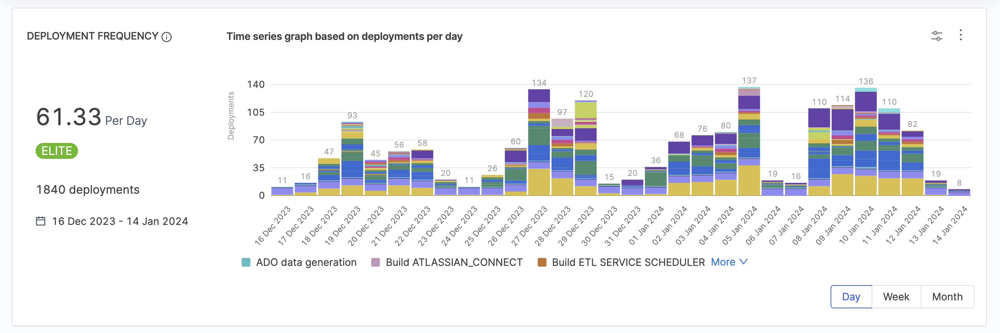
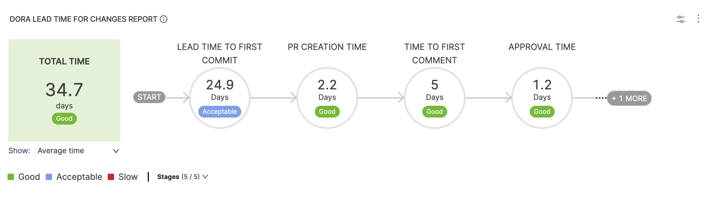
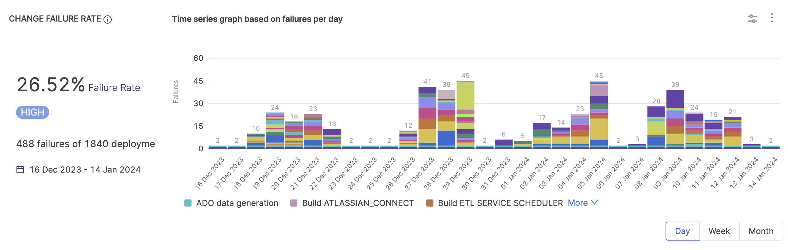
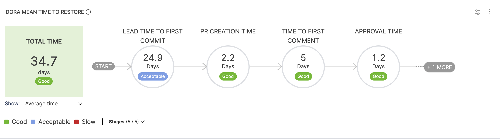

## What is DORA

DORA (DevOps Research Assessment) identified the following key metrics that describe a software development team's performance: Deployment Frequency, Lead Time for Changes, Change Failure Rate, and Time to Restore (MTTR).

With SEI, you can use [DORA Metrics Insights](/docs/software-engineering-insights/insights/sei-insights/#dora-metrics) to examine your organization's DORA metrics. This helps you understand how your organization or team is performing and helps you get an overview of daily, weekly, and monthly trends.

Furthermore, SEI gives you the flexibility to choose the [integrations](/docs/category/sei-integrations) from which you want to derive data, such as issue management, SCM, incident management, and CI/CD tools, as well as the ability to select filters to refine the data used to generate your metrics.

### <a href="#"> DORA Onboarding Path </a>

| **Step** | **Details** | **Documentation** |
| - | - | - | 
| <a href="/docs/software-engineering-insights/sei-metrics-and-reports/dora-metrics">Key Concepts in DORA metrics</a> | Learn about the basic concepts of DORA Metrics on Harness SEI | [Click here](/docs/software-engineering-insights/sei-metrics-and-reports/dora-metrics) |
| <a href="#engineering-team-use-cases-for-measuring-dora-metrics">Engineering Team Use Cases for Measuring DORA Metrics</a> | Learn how engineering teams can utilize DORA metrics | [Click here](#engineering-team-use-cases-for-measuring-dora-metrics) |
| <a href="#dora-under-the-hood">DORA under-the-hood</a> | Learn how Harness SEI correlates data across different tools and services | [Click here](#dora-under-the-hood) |
| <a href="/docs/software-engineering-insights/sei-profiles/workflow-profiles/workflow-profile-overview">Create DORA Profile</a> | Learn how you can create a workflow profile to measure the DORA Metrics | [Click here](/docs/software-engineering-insights/sei-profiles/workflow-profiles/workflow-profile-overview) |
| <a href="/docs/software-engineering-insights/insights/dora-insight">Create DORA Insight</a> | Step by Step guide to create a DORA Insight | [Click here](/docs/software-engineering-insights/insights/dora-insight) |
| <a href="/docs/category/dora-calculations">DORA Metrics Calculation</a> | How are the different DORA metrics calculated on Harness SEI | [Click here](/docs/category/dora-calculations) |
| <a href="#best-practices--recommendations">Best Practices & Recommendations for measuring DORA Metrics</a> | Recommendations to improve your DORA Metrics reporting | [Click here](#best-practices--recommendations) |
| <a href="#roadmap">DORA Roadmap</a> | List of enhancements and improvements for DORA Metrics | [Click here](#roadmap) |

## List of all DORA Metrics

### Deployment Frequency

**Deployment Frequency** is key to understanding the pace of software releases. It is categorized into four levels – Elite, High, Medium, and Low – based on the frequency of deployments.

* **Elite:** More than one deployment per day.
* **High:** Deployments occur anywhere from once per day to once per week.
* **Medium:** Deployments occur anywhere from once per week to once per month.
* **Low:** Deployment occurs less than once per month.

To learn more, go to [Deployment Frequency](/docs/software-engineering-insights/sei-metrics-and-reports/dora-metrics)

### Lead Time

**Lead Time for Changes** measures the duration from commit to production. The overall lead time is the sum of time spent in each workflow stage, with the specific stages depending on your Workflow profile.

To learn more, go to [Lead Time in DORA](/docs/software-engineering-insights/sei-metrics-and-reports/dora-metrics#lead-time-for-changes)

### Change Failure Rate

The **Change Failure Rate** indicates the percentage of deployments causing production failures. It is categorized into Elite, High, Medium, and Low, based on the percentage of failures.

* **Elite:** Failure rate under 15 percent.
* **High:** Failure rate of 16 to 30 percent.
* **Medium:** Failure rate of 31 to 45 percent.

To learn more, go to [Change Failure Rate](/docs/software-engineering-insights/sei-metrics-and-reports/dora-metrics#change-failure-rate)

### Mean Time to Restore (MTTR)

**Mean Time To Restore/Recover (MTTR)** indicates how long it takes an organization to recover from a failure in production. MTTR is a good metric for assessing the speed of your recovery process across several areas of technology.

To learn more, go to [Mean Time to Restore](/docs/software-engineering-insights/sei-metrics-and-reports/dora-metrics#mean-time-to-restore-mttr)

With SEI, you can generate insights by measuring the DORA Metrics to understand how your organization or team is performing and help you get an overview of daily, weekly, and monthly trends.

Furthermore, SEI gives you the flexibility to choose the integrations from which you want to derive data, such as Issue Management, SCM, Incident Management, and CI/CD tools, as well as the ability to select filters to refine the data used to generate your metrics.

## Engineering Team Use Cases for Measuring DORA Metrics

Here are some specific use cases for how engineering teams can utilize these metrics:

### Identifying Bottlenecks and Improving Workflow

#### Monitoring Lead Time for Changes

Engineers can identify areas causing delays in the development lifecycle by analyzing the time it takes for code to reach production. This might reveal inefficiencies in code review, testing, or deployment processes.

#### Analyzing Deployment Frequency

Observing changes in deployment frequency can help determine if teams are releasing updates frequently and iteratively, potentially leading to faster innovation.

### Evaluating the Effectiveness of Process Changes

#### Measuring Change Failure Rate

Comparing CFR before and after implementing a new deployment pipeline or testing strategy can assess its effectiveness in catching bugs before they reach production.

#### Tracking Mean Time to Restore

Analyzing MTTR trends can reveal the efficiency of incident response procedures and identify areas for improvement in disaster recovery plans.

### Setting Team Goals and Tracking Progress

#### Establishing Deployment Frequency Targets

Teams can set achievable goals for increasing deployment frequency, encouraging a culture of continuous integration and delivery (CI/CD).

#### Monitoring Lead Time Reduction

Tracking the decrease in lead time over time can demonstrate the team's progress in streamlining development processes and improving efficiency.

### Comparing Performance with Industry Benchmarks

#### Benchmarking DORA Metrics

While using DORA metrics for direct team comparison can be misleading, comparing them with industry benchmarks within a similar context can provide a general sense of how the team is performing relative to others.

### Facilitating Open Communication and Collaboration

#### Sharing DORA Metrics

Using DORA metrics as a starting point for open discussions can foster collaboration between developers, operations, and management. Teams can work together to identify areas for improvement and implement solutions.

It's important to remember that DORA metrics should not be used solely for individual performance evaluation. Instead, they are valuable tools for continuous improvement, enabling teams to identify areas for growth, track progress, and ultimately deliver software faster and more reliably.

## DORA under-the-hood

### Issue Management to SCM Correlations

* **JIRA to Source Code Manager:** This correlation is done by matching issue IDs from JIRA tickets with commit messages in SCM. The calculation of lead time here starts from the ticket's creation date to the first commit in SCM related to that ticket.
* **Source Code Manager to CI:** The correlation is established through commit SHAs, which are used to identify the specific build in CI that corresponds to the change made in SCM. The calculation here involves the time from the first commit to the first successful build in CI.
* **CI to CD:** This step involves correlating the artifact (or build) from CI to deployment in CD using artifact identifiers (like tags or digests). The calculation of lead time considers the duration from the first successful CI build to the deployment in CD.

### How is data correlated between the Tickets, Commits and Pull Requests?​

To ensure the accuracy of SEI calculations, it is necessary to maintain Issue Hygiene throughout the development lifecycle.

* **Tickets and Pull Requests:** To correlate data between the ticketing system and pull request (PR) information in SEI, the PR title must include the ticket key from the ticketing system. By doing so, SEI can associate the relevant data from both systems and provide a comprehensive view of each issue's progression.
* **Commits and Default Branch:** SEI captures all commits made to the default branch, typically named main or master. These commits serve as the basis for calculating various metrics within SEI.
* **Commits and Pull Requests:** SEI collects commit data related to pull requests (PRs), irrespective of the target branch. This information is vital for measuring lead time metrics during the PR process.

It's important to note that certain use cases like the Lead Time calculations, offer valuable insights only after the work has been completed and merged. Consequently, when assessing these metrics in SEI, configure the Workflow Profile based on the final code changes rather than individual contributions before merging.

:::info
Note that by default, a new Jira integration ingests data for the past 365 days, while the GitHub integration ingests data for the past 14 days. In this scenario if the PRs or commits are older than 14 days, the correlation will fail when calculating the DORA metrics.
SEI has the capability to ingest historical data. Once your integration is successfully configured, you can contact [Harness Support](mailto:support@harness.io) and specify the time duration for the historical data you may need.
:::

### CI to CD Correlations

SEI can connect to one or more CI/CD integrations. The jobs and executions are normalized and can be correlated across multiple sources. For example, you could be using GitHub Actions as your CI platform, and Harness as the CD.

The correlation between CI & CD execution is built on generated artifacts (by CI execution) and consumed artifacts (by CD execution). At this time, only container image-type artifacts are supported.

You can set up a GitHub Actions workflow to allow SEI to ingest the data for the artifacts and environment variables from GitHub Actions. To learn more, go to [Github Actions integration](/docs/software-engineering-insights/sei-integrations/github%20actions/sei-github-actions#ingest-artifacts-and-environment-variable-data).

:::info
SEI currently supports only [HarnessNG integration](/docs/software-engineering-insights/sei-integrations/harness-cicd/sei-integration-harnesscicd) as the CD tool for configuring stages in the Lead Time workflow.
:::

### Commits we fetch

SEI facilitates the retrieval of commit data in two ways, each catering to different aspects of version control and collaborative development.

1. Default Branch Commits
2. Pull Request-Related Commits

#### Scope of Measurement

#### Default Branch Commits

The system captures all commits that find their way onto the default branch, commonly denoted as main or master. This approach ensures a comprehensive overview of the primary codebase, providing insights into the evolution of the project's core.

#### Pull Request-Related Commits

SEI also ingests the data for commits associated with pull requests (PRs), regardless of the target branch. This data is utilized for the calculation. Deviations from this practice are recognized as potential anti-patterns, signalling lapses in developer hygiene. This data is utilized in the calculation for metrics such as Coding Days and Lines of Code.

The ingestion logic within SEI rests on the assumption that important code additions go through a careful review process before being approved. At the same time, it expects that all important code changes will eventually be merged into the main branch, creating a unified and up-to-date codebase.

To learn more, go to [SCM Commits Calculation on Harness SEI](/docs/software-engineering-insights/sei-technical-reference/scm-calculation/scm-metrics-calculation/scm-commits)

## DORA Insights & Profile

A **DORA Insight** can essentially be defined as a dashboard with a combination of reports i.e. widgets displaying essential information on various DORA metrics such as [DORA Lead Time for Changes](/docs/software-engineering-insights/sei-metrics-and-reports/dora-metrics#lead-time-for-changes), [Deployment Frequency](/docs/software-engineering-insights/sei-metrics-and-reports/dora-metrics#deployment-frequency) etc configured on the profile level related to your developer's activity.

DORA Reports are available for configuration only of you already have an associated profile [DORA profile](/docs/software-engineering-insights/sei-profiles/workflow-profiles/dora-profile) (i.e. DORA type Workflow Profile) configuration associated with the **Collection** under which the **Insight** is created. 

Review the following resources to learn more about defining and managing DORA Profiles and DORA Insight on Harness SEI:

* [Configure and Manage a DORA Profile]/docs/software-engineering-insights/sei-profiles/workflow-profiles/dora-profile)
* [Create and Manage a DORA Insight](/docs/software-engineering-insights/insights/dora-insight)

## Best Practices & Recommendations

### Improve your Deployment Frequency reporting

* **Measure using CI/CD integrations:** To receive accurate results for Deployment Frequency metrics it is recommended to configure the profile to utilize CI/CD tool for deployment tracking.
* **Identify Production Deployments:** Clearly differentiate deployments specific to your production environment add define the DORA profile configuration wrt that.
* **Team-based Insights:** Implement a team-level collection structure to categorize deployments by team for deeper analysis.

By following these recommendations, you can effectively track your deployment frequency and gain valuable insights into your team's software release process.

#### Configuration Examples for DORA Profile Setup

* **Pipline Configuration:** Configure the profile to analyze pipelines with all statuses, paying special attention to Continuous Delivery pipelines if applicable. Set a specific timeframe to capture recent deployment activities accurately.
* **Golden / Production Pipeline Standardization:** If you have established a standard "production" pipeline template, utilize Stage Variables for precise control. Associate services with each pipeline execution for accurate tracking and analysis.
* **Production Environment Monitoring:** Monitor deployments to production environments by capturing data on all pipeline executions linked to a specific production deployment stage, such as `deploy-prod`.
* **Alignment with Jira Releases (Not Recommended):** Although aligning deployment activities with Jira releases may provide insights into deployment frequency concerning software release cycles, it's not recommended due to potential complexities and overhead.

These configurations will help streamline your deployment frequency reporting process and provide valuable insights into your team's release activities.

### Improve your Lead Time tracking

* **Maintain One-to-One PR Ticket Relationship:** It is recommended to maintain one pull request (PR) corresponding to one associated ticket in your issue management system (e.g., Jira). This creates a clear link between requested changes and deployed code.
* **Complete the CI/CD Cycle:** Every step in your continuous integration and continuous delivery (CI/CD) pipeline should be mapped with the stages in the workflow profile. This ensures all stages are covered as part of the metric calculation.
* **Jira Releases for Tracking:** Use the Jira Release stage only when tracking Jira releases.

Following these recommendations can refine your Lead Time for Changes report and provide more accurate insights into your development workflow's efficiency.

### Improve your Change Failure Rate tracking

* Choose a set of pipelines that are responsible for deploying to Production environments and have specific `Failure` statuses or have specific run parameters configured.
* Pick out a list of pipeline runs that meet specific execution filters indicating a **Rollback**, **Hotfix** and so on.
* It is recommended for the denominator i.e. Total deployments to have an identical configuration as the **Deployment Frequency** definition.
* Calculating the **Change Failure Rate** metric for large teams can be challenging due to the sheer volume of changes. It is recommended to use **Collection Level Filters** and view reports at the individual team or **Project Level** (Sub Collection) instead of the entire parent **Collection**. This provides a more granular view of change failures and allows for targeted improvements.

### Improve your DORA Insights

* Ensure that the added DORA Reports align with your organization's engineering goals and objectives.
* Create a standard template for the workflow profiles across teams to maintain consistency in metric tracking.
* Define workflow profile at a granular level to capture the entire software delivery lifecycle. This includes specifying events such as the exclusion of PRs and commits, events defining what constitutes a deployment or a failure for CI/CD jobs, and other crucial items to provide a comprehensive view of the deployment process.
* Customize **Collection Filters** within reports carefully. These filters impact not only the widget but the collection as a whole. Optimize filters to focus on the specific aspects of your software development process that you want to analyze.
* To get accurate data for **Deployment Frequency** and **Change Failure Rate** report it is recommended to configure the DORA profile to calculate the metrics using CI/CD integrations i.e. receive data for production-level deployments from the relevant CI/CD platform.

## Roadmap

While DORA metrics provide valuable insights, it's important to consider some limitations, particularly for larger teams and complex workflows. This section covers the enhancements that SEI is currently working on and will include in future releases.

### DORA Reports

* Currently, the ability to associate a DORA profile with a Collection is disabled if the collection lacks the necessary integration. This is an enhancement under consideration for the future Roadmap where support will be added for enabling the association of any Collection with the DORA profile, regardless of existing integration.
* Existing [Propels](/docs/software-engineering-insights/sei-propels-scripts/propels-overview) in some cases do not accurately reflect trends for the DORA metrics after the profile is customized or modified. This is an enhancement under consideration for the future Roadmap where support will be added to implement the ability to add trend graphs across various timeframes within DORA widgets which would provide valuable insights into changes over time and the effectiveness of implemented improvements.

### DORA Calculation Requirements

#### Artifact Information Unavailability for Jenkins

Due to the limitations of the [Jenkins Harness SEI plugin](/docs/software-engineering-insights/sei-integrations/jenkins/jenkins-plugin), if there is no artifact information available, the calculation of CI/CD Lead Time cannot be performed accurately since artifact generation and deployment times are essential for these metrics.

#### CI/CD Job Configuration for Jenkins

It is crucial to understand whether Jenkins has separate or combined jobs for CI and CD. The Lead Time calculations differ based on these configurations:

* If a single job is used for both CI and CD, the Lead Time between CI and CD can be calculated.
* If separate jobs are used for CI and CD, the Lead Time can only be accurately calculated up to the CI stage.

#### Deployment Strategy

Knowledge of Deployment Strategy is vital:

* If Staging and Production deployments are managed through the same Jenkins job, the Lead Time can be extended to include Production
* If different jobs handle Staging and Production deployments, then Lead Time is limited to the Staging stage.

#### Branch Deployment Practices

The adoption of various branching strategies has a direct impact on Lead Time calculation:

* In the case of using a feature branch strategy and carrying out deployment from the main branch, Lead Time can be computed up to the stage where the PR is merged into the main/master branch.
* If a release branch is created from the main branch and production deployment is performed manually, it is not feasible to calculate Lead Time beyond the merge into the main/master branch.

#### Correlation Prerequisite

Ensuring an accurate correlation between JIRA and SCM depends on including the `JIRA ticket ID` in the **SCM commit message** and **PR title**. If this information is missing, the correlation, and consequently, the Lead Time calculation will be inaccurate.

#### Multiple Stages in CI/CD

When there are several stages within the CI and CD pipelines (such as Unit Test, Vulnerability Check, Image Building, Staging Deployment, Pre-Prod Approval, Production Deployment), SEI considers the entire pipeline as a single stage. While this approach may simplify the process, it could also obscure the time spent in each individual stage.

### Integrations we support

#### Issue Management Platform

The following Issue Management Platforms are supported for calculating the DORA metrics on Harness SEI:

  * [JIRA](/docs/software-engineering-insights/sei-integrations/jira/sei-jira-integration)
  * [Azure Boards](/docs/software-engineering-insights/sei-integrations/azure-devops/sei-integration-azure-devops)

#### Source Code Manager

The following SCM Platforms are supported for calculating the DORA metrics on Harness SEI:

  * [GitHub](/docs/software-engineering-insights/sei-integrations/github/sei-github-integration)
  * [BitBucket](/docs/software-engineering-insights/sei-integrations/bitbucket/sei-bitbucket-cloud)
  * [GitLab](/docs/software-engineering-insights/sei-integrations/gitlab/sei-integration-gitlab)
  * [Azure Repos](/docs/software-engineering-insights/sei-integrations/azure-devops/sei-integration-azure-devops)

#### CI and CD Platforms

The following Issue Management Platforms are supported for calculating the DORA metrics on Harness SEI:

  * [Jenkins (via Harness SEI Plugin or WebHooks)](/docs/software-engineering-insights/sei-integrations/jenkins/jenkins-plugin)
    * If integrated using the Plugin, combined CI/CD Lead Time will be obtained.
    * If integrated using Webhooks, CI and CD Lead Time will be obtained separately.
  * [Harness NG](/docs/software-engineering-insights/sei-integrations/harness-cicd/sei-integration-harnesscicd)
    * By Default, the ability to split CI and CD is available
  * [GitHub Actions](/docs/software-engineering-insights/sei-integrations/github%20actions/sei-github-actions)
    * By Default, the ability to split CI and CD is available
  * [Custom CICD](/docs/software-engineering-insights/sei-integrations/custom-cicd/sei-custom-cicd-integration)
    * Integration can be set up by using your own custom implementation through webhooks.

To learn more about all the supported integrations on SEI, go to [What's Supported](/docs/software-engineering-insights/sei-supported-platforms)