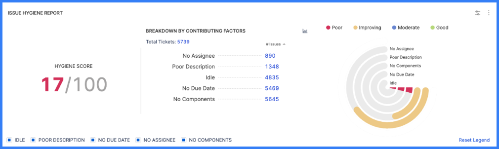

Use hygiene reports to understand hygiene in your issue management and support systems, such as Jira or Zendesk. Hygiene measures adherence to issue management best practices, such as issue classification and responsiveness, based on hygiene categories. Hygiene reports can help you measure overall process adherence and identify gaps in issues that resulted in delayed deployments.

## Issue hygiene reports

You can measure sprint hygiene scores with the **Issue Hygiene Report** and the **Issue Hygiene Trend Report**.

The **Issue Hygiene Report** shows your overall hygiene score and individual scores for each [hygiene category](#issue-hygiene-categories). Scores represent _hygiene misses_ in the designated time frame. A hygiene miss means that a ticket in your issue management system was missing an important field, failed to change status in a timely manner, or was assigned to an inactive user.

<figure>



<figcaption>Figure 1: The Issue Hygiene Report widget. The hygiene score can help you understand how well your tickets are organized in your issue management system.</figcaption>
</figure>

Each hygiene miss is tallied against a score of 100. A score of 100 indicates that no tickets were submitted with missing hygiene points.

```
Hygiene Category Score = ( Number of Tickets Missing Hygiene / Total Number of Tickets in Time Frame ) * Weight

Total Hygiene Score = Sum of Category Scores
```

You can use the **Issue Hygiene Trend Report** to analyze changes in hygiene scores over time.

### Issue hygiene categories

Hygiene misses are based on hygiene categories. The built-in categories are:

* **Idle:** The ticket had no activity for a certain period of time.
* **Poor Description:** The **Description** field was empty or contained little content.
* **No Due Date:** The ticket had no due date populated.
* **No Assignee:** The ticket had no assignee populated.
* **No Components:** The **Components** field was empty.
* **Missed Response Time:** The ticket failed to change status before the goal response time expired.
* **Missed Resolution Time:** The ticket wasn't in a resolved status before the goal resolution time expired.
* **Inactive Assignees:** The ticket was assigned to an inactive user.

Data for hygiene categories are derived from your [integrations](/docs/category/connectors-and-integrations).

You can add custom hygiene categories by configuring **Custom Hygiene Misses** in your issue management [SEI connectors](../sei-integrations/sei-integrations-overview.md). You can have up to ten categories.

You can modify the importance of each category when you [configure the Issue Hygiene Report](#configure-the-issue-hygiene-report).

### Configure the Issue Hygiene Report

1. Go to the [Insight](../sei-insights.md) where you want to add the widget, select **Settings**, and select **Add Widget**.
2. Select the **Issue Hygiene Report** widget.
3. Configure the widget's **Filters**. Filters can be blank or filtered down to a desired ticket type or time frame. If you include multiple filters, they are inherently combined with an `AND` operator.
4. Configure the **Weights** for each hygiene category.

   A lower weight causes a category to have a lower impact on the overall score, and a higher weight causes a category to have a larger impact on the overall score. A weight of zero excludes that category from the hygiene score calculation. Make sure the total of all weights equals 100.

   In addition to the built-in categories, you can add custom hygiene categories by configuring **Custom Hygiene Misses** in your issue management [SEI connectors](../sei-integrations/sei-integrations-overview.md).

<!--image - .gitbook/assets/image (71).png -- Issue Hygiene Report widget config - Weights tab-->

5. On the **Settings** tab, select the issue management system to use for this widget. Available options are based on your configured [SEI connectors](/docs/category/connectors-and-integrations).

:::tip

The Issue Hygiene Report is often used in conjunction with the **Issue Hygiene Trend Report** to show a history of hygiene scores.

:::

#### Issue Hygiene Report use cases

Here are some examples of configurations for the Issue Hygiene Report widget.

<details>
<summary>Active sprint hygiene</summary>

You can configure the widget to show your team's current sprint only. To do this, go to the **Filter** tab, select **Sprint**, and then select **Includes Active Sprints Only**.

<!--img .gitbook/assets/image (55).png - Configure issue hygiene report -- filters tab - include active sprints only-->

</details>

<details>
<summary>Insight time hygiene</summary>

_Insight time_ is the time range selected by the user when viewing Insights. You can configure the widget to show the hygiene score for all tickets created in the user-selected Insight time. To do this, go to the **Filter** tab, select **Issue Created In**, and then select **Use Insight Time**.

<!--img .gitbook/assets/image (33).png - Configure issue hygiene report -- filters tab - use Insight time-->

</details>

<details>
<summary>Issues in progress hygiene</summary>

You can configure the widget to show the hygiene score for all in-progress tickets. To do this, go to the **Filter** tab, select **Status**, and then select the statuses that correspond to in-progress tickets.

<!--img .gitbook/assets/image (64).png - Configure issue hygiene report -- filters tab - filter by in progress tickets-->

</details>

<details>
<summary>Issues in backlog hygiene</summary>

You can configure the widget to show the hygiene score for all tickets in your backlog. To do this, go to the **Filter** tab, select **Status**, and then select the statuses that correspond to backlog tickets.

<!--img .gitbook/assets/image (47).png - Configure issue hygiene report -- filters tab - filter by status "to do"-->

</details>

## Support hygiene reports

Use these reports to analyze hygiene in your support tickets.

* **Support Hygiene Report:** Measure overall quality of the support backlog along multiple dimensions (hygiene factors/categories), such as poor description, missing contact information, and idle time.
* **Support Hygiene Trend Report:** Observe changes in support hygiene scores over time.

These reports are similar in functionality and configuration to the [issue hygiene reports](#issue-hygiene-reports).
