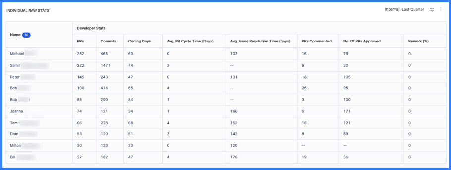

## Individual Raw Stats

The Individual Raw Stats widget shows a table of base values that might be used in calculating other metrics, such as [Trellis Scores](./trellis-score.md).

By default, the widget shows the following raw, pre-calculation values for each developer:

* PRs
* Commits
* Coding days
* Average PR cycle time (in days)
* Average issue resolution time (in days)
* PRs commented on
* PRs approved
* Percentage of rework

You can edit the widget to show different values (add/remove columns) or apply filtering.

<figure>

<figcaption>Figure 1: The Individual Raw Stats widget.</figcaption>
</figure>

You can also use the **Download** icon to download the raw stats report.

<figure>

<figcaption>Figure 2: The icon to download the Individual Raw Stats report.</figcaption>
</figure>
