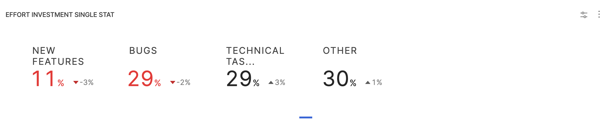
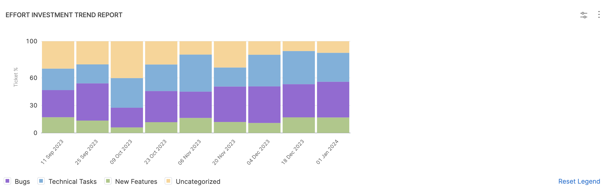

The Effort Investment (Business Alignment) reports can help visualize where your teams expend the most effort and help your teams prioritize their time. This Insight includes the following four widgets, which provide an overview of the categories or projects where engineers are allocating the most time:

* [**Effort Investment Single Stat**](#effort-investment-single-stat)
* [**Effort Investment Trend Report**](#effort-investment-trend-report)
* [**Effort Investment By Engineer**](#effort-investment-by-engineer)
* [**Business Alignment Report**](#business-alignment-report)

These reports analyze effort investment into task categories, and strategic initiatives.

It helps visually analyze how the work is trending across different categories, where the resources are allocated and how it is varying over different periods.

## Business Alignment Report

This is a new report that describes your investment efforts across the categories defined in the associated Business Alignment profile as a pie chart and a bar chart. You can configure this report to calculate data by ticket count or by engineer.

:::info
This feature is behind the Feature Flag `<SEI_NEW_BA_COMBINED_REPORT>`.  To learn more, go to [Business Alignment Report](/docs/software-engineering-insights/early-access/metrics-reports/sei-business-alignment-report). Contact [Harness Support](mailto:support@harness.io) to enable this feature.
:::

## Effort Investment Single Stat

### Definition

This widget displays the effort investment of different categories defined in the associated investment profile as a **numeric value (percentages)** but does not support drill-down. The data is represented as **Single stats**.

The single stat is based on the complete time range selected for analysis. If you've chosen a 3-month period, the data will be split across different weeks or months based on the interval selected within this time frame.



### Add the report

#### Step 1: Add the widget

* Go to the **Insight**, select the settings icon and click on **Add widget**
* In the widget explorer, search for and select **Effort Investment Single Stat**

#### **Step 2: Configure the Filters on the widget**

* Choose whether to enable or disable the **Top-Level Insight Filters**. Enabling this option means that the widget's data will be affected by the top-level insight filters.
* **Add filters** from the available options. For example, you can select the `"project"` filter to narrow down the data displayed in the widget to a specific project.
* You can enable the **Insight Time** by default if needed. If disabled you can choose between `“Relative”` or `“Absolute”` time ranges to define the period for which you want to display data.

#### Step 3: Configure the Settings

* Select the respective **Effort Investment Profile** for which you wish to see data.
* Select the **Issue Management System** you’re using.
* Choose the appropriate effort unit from the available options. (`Commit Count`, `Story Count`, `Ticket Count` and `Ticket Time Spent`)
* Configure if you want to only use the **Current Assignee** or use the **Current and Previous Assignee** for effort attribution.
* You can also configure the widget to use specific statuses for completed issues if needed. By default, all statuses in the `“Done”` category will be used.
* If your organization uses a different field for Collection-based aggregations in JIRA, override the Collection fields as necessary. <br />
  <br />
  For example, you can select `"assignee"` or `"reporter"`

#### Step 4: Save the widget

* Select the **Place Widget** button and place the widget in the **Insight** by dragging it to the desired location within the dashboard. Click on the **Save Layout** button to save your configuration.

### Calculation

```bash
Effort Allocation = (Contributor's Effort / Total Effort) \ 100%
```

* **Effort Allocation:** This is the calculated percentage of effort allocated to a specific contributor and investment category within the chosen effort unit. It represents how the effort is distributed.

* **Contributor's Effort:** This parameter refers to the total effort contributed by a particular contributor (e.g., Dev 1, Dev 2, Dev 3) to a specific investment category (e.g., New Feature, KTLO, Other) within the selected effort unit (e.g., Ticket count, Story Points, Ticket time).

* **Total Effort:** Total Effort represents the sum of efforts for all contributors and investment categories within the specified effort unit. It displays the cumulative effort on the entire data for the chosen effort unit.

## Effort Investment Trend Report

### Definition

This report provides the trend of effort investment over time. The data representation is in the **Stacked Bar chart** format. It displays the trend of effort investment based on defined allocations of categories in the associated Investment Profile over time.

To correlate the single stat report and the Trend Report, it's important to ensure that the time periods selected should match.



### Add the report

#### Step 1: Add the widget

1. Select **Settings**, then **Add Widget**.
2. In the widget explorer, search for and select **Effort Investment Trend Report**

#### Step 2: Configure the Filters on the widget

* Choose whether to enable or disable the **top-level dashboard filters**. Enabling this option means that the widget's data will be affected by the top-level dashboard filters.
* **Add filters** from the available options. For example, you can select the `"project"` filter to narrow down the data displayed in the widget to a specific project.
* You can enable the **dashboard time** by default if needed. If disabled you can choose between `“Relative”` or `“Absolute”` time ranges to define the period for which you want to display data.

#### Step 3: Configure the widget settings

* Select the respective associated **Investment Profile**
* Select the **Issue Manage Platform** 
* Choose the appropriate work unit between **Ticket Count** or **Story Count**.
* Choose the appropriate effort unit from the available options. (`Commit Count`, `Story Count`, `Ticket Count` and `Ticket Time Spent`)
* Configure if you want to only use the **Current Assignee** or use the **Current and Previous Assignee** for effort attribution.
* You can also configure the widget to use specific statuses for completed issues if needed. By default, all statuses in the `Done` category will be used.
* Select the sample interval over time to display the data.

#### Step 4: Save the widget

Select the **Place Widget** button and place the widget in the **Insight** by dragging it to the desired location within the dashboard. Click on the **Save Layout** button to save your configuration.

## Effort Investment by Engineer

### Definition

This report provides the data on total completed effort and current allocation for every engineer individually based on the ticket count. The data is represented in tabular format. The widget displays effort investment in **Numeric Values (Total and Percentage)** across all the categories defined in the associated investment profile.

### Add the report

#### Step 1: Add the widget

* Go to the **Insight**, select the settings icon and click on **Add widget**
* In the widget explorer, search for and select **Effort Investment by Engineer**

#### Step 2: Configure the Settings

* Configure the widget settings. The configuration for the Effort Investment by Engineer report is identical to the configuration of the [Effort Investment Single Stat](#effort-investment-single-stat).

#### Step 3: Save the widget

* Select the **Place Widget** button and place the widget in the Insight by dragging it to the desired location within the Insight. Click on the **Save Layout** button to save your configuration.

### Calculation

The widget displays the effort investment across all categories. The percentage value here indicates the proportion of effort allocated to each category relative to the engineer's total effort.

Here’s the breakdown of the Effort Allocation:

* **Effort Calculation by Current Assignee:** The calculation of effort for engineers is assessed based on their current assignments within various investment categories. This provides data on how engineers are currently contributing to these specific categories.

* **Effort Calculation by Current & Previous assignee:** Effort calculations are evaluated considering both their current and previous assignments across different categories. This provides data on how engineer’s contributions have evolved.

* **Effort Calculation with Story Points:** Effort calculation is determined based on Story Points. The percentage highlights the significance of engineers in the categories based on story points.

* **Effort Calculation with Ticket Time:** Calculation of effort is calculated using Ticket Time, providing data into how engineers distribute their time within the categories.

* **Effort Calculation with Ticket Count:** Effort calculation is determined based on Ticket Count. This provides data on how engineer’s contributions vary in terms of the number of tickets they are assigned.

### Remaining Allocation

Remaining Allocation is a metric used to determine the available work capacity for a user, based on the allocation of different task categories. It indicates the percentage of a user's work capacity that remains unallocated after considering the percentage of work assigned to various task categories.

```bash
Remaining Allocation = 100 - (Percentage of Category A + Percentage of Category B + ... + Percentage of Category N)
```

#### Key Factors

* **Categories:** Pre-defined task categories or work types in the associated investment profile that contribute to allocation. Common categories might include `New Feature`, `Technical Task`, `Uncategorized`, and so on.
* **Engineer Contribution:** The engineer’s contribution to each category is based on the total effort spent on tasks within that category. The contribution is expressed as a percentage of their total effort.

<details>

<summary>Calculation Example</summary>

Let's consider a scenario where a user, User X, is assigned tasks in two categories, "Category A" and "Category B"

User X has a total of 50 tasks assigned in "Category A" with a total effort of 40 hours.

User X has a total of 20 tasks assigned in "Category B" with a total effort of 10 hours.

Calculation:

Calculate the percentage of User X's contribution to "Category A": Percentage for "Category A" = (Effort in "Category A" / Total Effort) \* 100

In this case, it's (40 / (40 + 10)) \* 100 = 80%.

Calculate the percentage of User X's contribution to "Category B": Percentage for "Category B" = (Effort in "Category B" / Total Effort) \* 100

In this case, it's (10 / (40 + 10)) \* 100 = 20%.

Calculate Remaining Allocation: Remaining Allocation = 100 - (Percentage of Category A + Percentage of Category B)

Remaining Allocation = 100 - (80% + 20%) = 100 - 100% = 0%

In this example, User X's "Remaining Allocation" is 0%, indicating that their entire work capacity has been allocated across "Category A" and "Category B." There is no unallocated work capacity.

</details>
