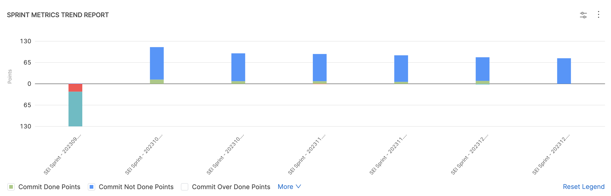
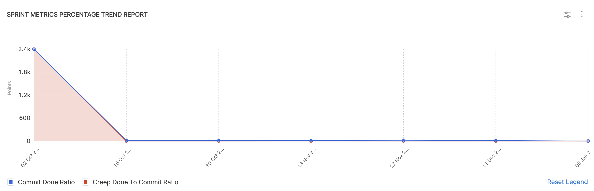
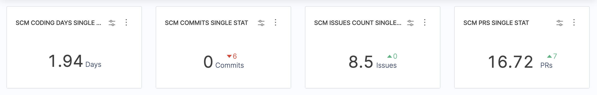

You can use the sprint metrics reports to analyze sprint and planning metrics.

These reports provide you with the analysis of tasks and tickets within a sprint.

It allows you to look at what was planned to do (committed), what was completed (done/delivered), what was not completed (missed), and any new tasks added after the sprint started (creep).

## Sprint Metrics Trend Report

### Definition

Engineering managers usually use these three key sprint metrics to get a holistic picture of the sprint productivity:

1. [Commit Points](/docs/software-engineering-insights/sei-metrics-and-reports/planning/sprint-metrics/sei-sprints-metrics#commit-points) (The number of story points you plan to complete during the sprint)
2. [Commit Done Points](/docs/software-engineering-insights/sei-metrics-and-reports/planning/sprint-metrics/sei-sprints-metrics#commit-done-points) (The number of story points actually finished at the end of the sprint)
3. [Creep Points](/docs/software-engineering-insights/sei-metrics-and-reports/planning/sprint-metrics/sei-sprints-metrics#creep-points) (The difference between the initially planned story points and those actually delivered).

The **Sprint Metrics Trend Report** is recommended for visualizing a time series trend of these metrics to help engineering managers understand how the respective sprint metrics has evolved throughout various sprint cycles.

### Add the report

To add the **Sprint Metrics Trend Report** widget to Insight:

#### Step 1: Add the widget

* Select **Settings**, then **Add Widget**.
* Choose the **Sprint Metrics Trend Report** widget.

#### Step 2: Configure the Filters for the widget

* Add conditions to specify what data feeds into the widget by creating inclusive and exclusive filters (e.g., `Issue Resolved In` for the last quarter)
* If you include multiple filters, they are inherently combined with an `AND` operator.
* Define the **Sprint Completed Date** as either a `relative` or `absolute` time frame. You can also enable the **Use Insight Time** option to define the data as the configured Insight date.

#### Step 3: Select the Metrics to measure on the widget

* Choose how you want to calculate sprint metrics, such as by `Story Points` or `Tickets`.
* Select all the metrics you want to calculate for this report.

#### Step 4: Configure the Aggregations for the widget

On the **X-Axis** select how you want to view the sprint metrics. You can select either of the following options:

* **By-weekly by Sprint end date:** Aggregates the metrics by bi-weekly periods based on the sprint end dates.
* **Monthly:** Aggregates the metrics by calendar months.
* **Sprint:** Displays the metrics for each individual sprint.
* **Weekly by Sprint end date:** Aggregates the metrics by weekly periods based on the sprint end dates.

#### **Step 5: Configure the Settings**

* Select the **Sprint Creep Grace Period** if needed. The Sprint Creep Grace Period is the number of days after a sprint starts where new work added will not be counted as `"creep"` or `unplanned` work.
* Add the **Additional Done Statuses** from your **Issue Management System**. This allows you to include other status values beyond the default `"Done"` status when calculating completed work.
* Select the checkbox under the **Settings** tab if you choose to include all tickets that were committed at the start of the sprint to be included in the metric calculation, even if they were later removed from the sprint.
  
#### Step 6: Save the widget

Complete the widget settings and select **Next: Place Widget**, place the widget on Insight and then select **Save Layout**.

### Calculation

This report displays the trend over the metrics that are selected under the widget settings. To learn about what each of these metrics calculates, go to [Sprint Metrics](/docs/software-engineering-insights/sei-metrics-and-reports/planning/sprint-metrics/sei-sprints-metrics).

In this example, we consider a use case for a single **Sprint** with a total of **20 tickets planned** at the **beginning of the Sprint**. The widget in this scenario is configured to consider all tickets that were committed at the start of the sprint for the metric calculation.

| Sprint Name | Sprint 1 |
| - | - |
| Total Number of Committed Tickets | 20 |
| Total Number of Story Points | 100 points (5 points per ticket x 20 tickets) |
| New tickets added after the sprint started | 5 |
| Total story points of the new tickets added after the sprint started | 25 points (5 points per ticket x 5 tickets) |
| Total Number of Tickets Resolved | 15 (12 committed + 3 added after sprint start) |

Based on the given example, here are the calculated metric values:

* **Commit points** = Total Number of Story Points = **100 points**
* **Creep points** = Total story points of the new tickets added after the sprint started = **25 points**
* **Commit done points** = Sum of story points for the 12 committed and completed tickets = **12 x 5 = 60 points**
* **Creep done points** = Sum of story points for the 3 creep tickets that were completed = **3 x 5 = 15 points**
* **Sprint velocity (delivered points)** = Commit done points + Creep done points = **60 + 15 = 75 points**
* **Commit missed points** = Commit points - Commit done points = **100 - 60 = 40 points**
* **Creep missed points** = Creep points - Creep done points = **25 - 15 = 10 points**
* **Delivered to commit ratio** = Delivered points / Commit points = **75 / 100 = 0.75 or 75%**

:::info
Note that if you have selected the checkbox for **Include all tickets committed at the start of the sprint** the calculation will consider all the tickets that were initially planned for the sprint, even if some of them were later removed during the sprint.   
For example, let's say your team planned a sprint with 10 tickets. During the sprint, you decided to remove 2 tickets from the scope. If the **Include all tickets committed at the start of the sprint** option is selected, the sprint metrics calculation will still consider all 10 tickets, including the 2 that were removed.
:::

## Sprint Metrics Percentage Trend Report 

### Definition

The **Sprint Metrics Percentage Trend Report** is used to examine a time series trend of selected sprint metrics ratios. This report is recommended for visualizing changes in the commit done ratio, done to commit ratio, and creep to commit ratio.

It provides insights into key performance areas, such as:

1. **Meeting Sprint Commitments:** The report can be used to visualize the trend of the **Commit Done ratio** and **Done to Commit ratio**, helping teams assess their ability to complete the work they committed to during sprint planning.
2. **Managing Scope Creep:** The report can be used to track the **Creep to Commit Ratio**, helping teams understand the impact of unplanned work added to sprints and identify potential issues with scope management.

### Add the report

#### Step 1: Add the widget

* Select **Settings**, then **Add Widget**.
* Choose the **Sprint Metrics Percentage Trend Report** widget.

#### Step 2: Configure the Filters for the widget

* Add conditions to specify what data feeds into the widget by creating inclusive and exclusive filters (e.g., `Issue Resolved In` for the last quarter)
* If you include multiple filters, they are inherently combined with an `AND` operator.
* Define the **Sprint Completed Date** as either a `relative` or `absolute` time frame. You can also enable the **Use Insight Time** option to define the data as the configured Insight date.

#### Step 3: Select the Metrics to measure on the widget

* Choose how you want to calculate sprint metrics, such as by `Story Points` or `Tickets`.
* Select all the sprint metrics ratios you want to measure for this report.

#### Step 4: Configure the Aggregations for the widget

On the **X-Axis** select how you want to view the sprint metrics. You can select either of the following options:

* **By-weekly by Sprint end date:** Aggregates the metrics by bi-weekly periods based on the sprint end dates.
* **Monthly:** Aggregates the metrics by calendar months.
* **Sprint:** Displays the metrics for each individual sprint.
* **Weekly by Sprint end date:** Aggregates the metrics by weekly periods based on the sprint end dates.

#### **Step 5: Configure the Settings**

* Select the **Sprint Creep Grace Period** if needed. The Sprint Creep Grace Period is the number of days after a sprint starts where new work added will not be counted as `"creep"` or `unplanned` work.
* Add the **Additional Done Statuses** from your **Issue Management System**. This allows you to include other status values beyond the default `"Done"` status when calculating completed work.
* Select the checkbox under the **Settings** tab if you choose to include all tickets that were committed at the start of the sprint to be included in the metric calculation, even if they were later removed from the sprint.

#### Step 6: Save the widget

Complete the widget settings and select **Next: Place Widget**, place the widget on Insight and then select **Save Layout**.

### Calculation

The widget calculates and displays the time series trend of the selected sprint metrics ratios. Find complete the list of the [Sprint Metrics ratios here](/docs/software-engineering-insights/sei-metrics-and-reports/planning/sprint-metrics/sei-sprint-metrics-ratios).

## Sprint Metrics Single Stat

### Definition

The **Sprint Metrics Single Stat** widget presents a single sprint metric averaged over the selected time interval. This widget can [help you use historical metrics for sprint prediction and performance assessment.](/docs/software-engineering-insights/sei-metrics-and-reports/planning/sprint-metrics/sei-sprints-metrics-overview#sprint-metrics-use-cases)

### Add the report

#### Step 1: Add the widget

* Select **Settings**, then **Add Widget**.
* Choose the **Sprint Metrics Single Stat** widget.

#### Step 2: Configure the Filters for the widget

* Add conditions to specify what data feeds into the widget by creating inclusive and exclusive filters (e.g., `Issue Resolved In` for the last quarter)
* If you include multiple filters, they are inherently combined with an `AND` operator.
* Define the **Sprint Completed Date** as either a `relative` or `absolute` time frame. You can also enable the **Use Insight Time** option to define the data as the configured Insight date.

#### Step 3: Select the Metrics to measure on the widget

* Select the sprint metric that you want to measure for this report. To learn more, go to Sprint Metrics.

#### **Step 5: Configure the Settings**

* Define the **Ideal Range** by adding Inner and Outer bound values.
* Select the **Sprint Creep Grace Period** if needed. The Sprint Creep Grace Period is the number of days after a sprint starts where new work added will not be counted as `"creep"` or `unplanned` work.
* Add the **Additional Done Statuses** from your **Issue Management System**. This allows you to include other status values beyond the default `"Done"` status when calculating completed work.
* Select the checkbox under the **Settings** tab if you choose to include all tickets that were committed at the start of the sprint to be included in the metric calculation, even if they were later removed from the sprint.

#### Step 6: Save the widget

Complete the widget settings and select **Next: Place Widget**, place the widget on Insight and then select **Save Layout**.

### Sprint Metrics Single Stat use cases

Measure Total Velocity

To configure the Sprint Metrics Single Stat widget to display the total velocity:

1. For the time range, either **Use Insight time** or set the **Issue Created In** filter to the desired time range. The **Use Insight time** option allows the user to select a desired time range when viewing the Insight.
2. On the **Metrics** tab, select **Velocity Points**.
3. Customize the widget **Settings** if required.
4. Set the widget **Name** to **Total Velocity**
5. Select **Next: Place Widget**, place the widget on Insight and then select **Save Layout**.

Predictability Range

To configure the Sprint Metrics Single Stat widget to display the extent to which sprint commitments were not met:

1. For the time range, either **Use Insight time** or set the **Issue Created In** filter to the desired time range. The **Use Insight time** option allows the user to select a desired time range when viewing the Insight.
2. On the **Metrics** tab, select **Commit Missed Ratio**.
3. Customize the widget **Settings** if required.
4. Set the widget **Name** to **Predictability Range**
5. Select **Next: Place Widget**, place the widget on Insight and then select **Save Layout**.

Measure the Churn Rate in your Sprint

To configure the Sprint Metrics Single Stat widget to display the Churn Rate metric:

1. For the time range, either **Use Insight time** or set the **Issue Created In** filter to the desired time range. The **Use Insight time** option allows the user to select a desired time range when viewing the Insight.
2. On the **Metrics** tab, select **Average Churn Rate**.
3. Customize the widget **Settings** if required.
4. Set the widget **Name** to **Churn Rate**
5. Select **Next: Place Widget**, place the widget on Insight and then select **Save Layout**.

Measure the percentage of tickets added in the middle of the sprint

To configure the Sprint Metrics Single Stat widget to display the percentage of tickets added in the middle of the sprint:

1. For the time range, either **Use Insight time** or set the **Issue Created In** filter to the desired time range. The **Use Insight time** option allows the user to select a desired time range when viewing the Insight.
2. On the **Metrics** tab, select **Creep Done Ratio**.
3. Customize the widget **Settings** if required. For example: You can define the **Sprint Creep Grace Period**
4. Set the widget **Name** to **% of tickets added mid-Sprint**
5. Select **Next: Place Widget**, place the widget on Insight and then select **Save Layout**.

## Other sprint metrics reports

* **Sprint Impact of Unestimated Tickets Report**
* **Sprint Goal Report**
* **Sprint Distribution Retrospective Report**