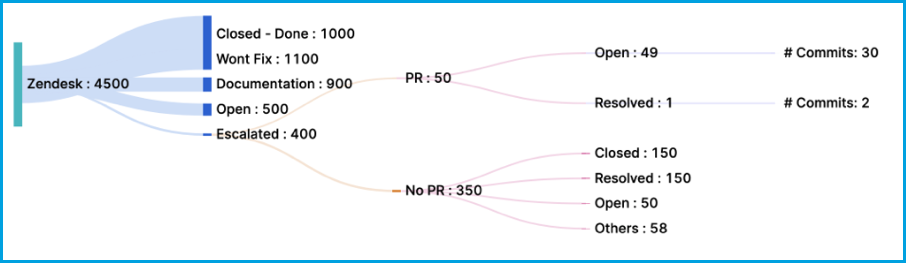
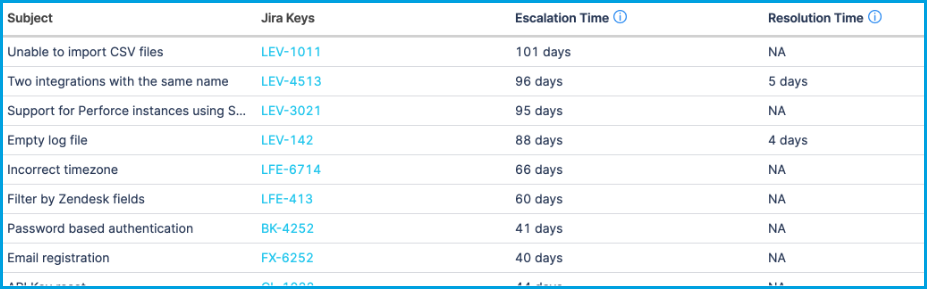

This topic describes metrics and reports related to customer support, such as issues in Zendesk or SalesForce.

## Hygiene reports

[Support hygiene reports](./hygiene-metrics.md#support-hygiene-reports) include the **Support Hygiene Report** and the **Support Hygiene Trend Report**.

## Issue and ticket count reports

Use these reports to examine the volume of issues/tickets. You can create filters based on any field in your support ticketing system, such as ticket type, status, reporter (customer/organization/user), agent, priority, and so on.

* **Issues Report:** Examine metrics related to various tickets/work items in your support ticketing system. The report aggregates data based on selected attributes, such as priority, status, labels, components, or any other field. This report helps you create comparisons based on various fields and draw conclusions to make decisions.
* **Issues Trend Report:** Examine changes over time in support tickets, such as the number of tickets closed each day or week.
* **Issues Single Stat (Ticket Counts Single Stat):** Present a single stat for a given time range, such as how many tickets were created, resolved, or updated in a given time period.
* **Support Tickets Report:** Analyze the number of tickets by customer/organization, priority, time, status, or other fields. This can help you identify support areas where you might need to allocate more resources.
* **Support Tickets Trend Report:** Analyze changes over time in ticket counts.
* **Support Top Customers Report:** Total tickets by customer.

For information about issues reports, go to [Issues reports](./velocity-metrics-reports/issues-reports.md).

## Reopen and reassignment reports

These reports help you analyze metrics about tickets being reopened or reassigned.

### Bounce

_Bounce_ describes tickets that are reassigned to a previous assignee. Bounce can occur if a ticket isn't triaged correctly initially, or if the ticket doesn't have enough information to be assigned correctly. Excessive bounce can imply problems with the triage process, and it can potentially cause missed SLAs or unnecessary resource utilization. Depending on the scope of your support system, anything above three to five bounces can be considered high.

* **Support Bounce Report:** Shows the number of times tickets "bounced" between assignees. This report is usually configured to observe the median number of bounces by component, project, or initiative. It can highlight tickets that are being bounced around to different resources. Instances of reassignment to *new* assignees are captured by the **Support Hops Report**.
* **Support Bounce Trend Report:** Shows changes over time in bounce.

### Hops

_Hops_ describes the number of times a ticket is reassigned to a new assignee (someone who has never been assigned to that ticket before). Hops can occur if a ticket isn't triaged correctly initially, or if the ticket doesn't have enough information to be assigned correctly. Excessive hops can imply problems with the triage process or lack of clear owners for support areas, and it can potentially cause missed SLAs or unnecessary resource utilization. Depending on the scope of your support system, anything above three to five hops can be considered high.

* **Support Hops Report:** Shows the number of times a ticket "hopped" to new assignees. This report is usually configured to observe the median number of hops by component, project, or initiative. It can highlight tickets that are reassigned multiple times. Instances of reassignment to a *previous* assignee are captured by the **Support Bounce Report**.
* **Support Hops Trend Report:** Shows changes over time in hops.

### Reopened tickets

* **Support Ticket Reopens Report:** Analyze the number of times tickets are reopened.
* **Support Ticket Reopens Trend Report:** Analyze changes over time in tickets being reopened.

## Reply reports

* **Support Replies Report:** Analyze the number of replies from the support team on support tickets.
* **Support Replies Trend Report:** Analyze changes over time in the volume of support team replies.

## Wait time reports

* **Support Agent Wait Time Report:** Time spent by support agents awaiting for responses from customers or other internal users.
* **Support Agent Wait Time Trend Report:** Observe changes over time in agent wait time.
* **Support Requester Wait Time Report:** Time spent by customers or internal requesters waiting for a response from an agent.
* **Support Requester Wait Time Trend Report:** Observe changes over time in requester wait time.

## Response time reports

* **Support Response Time Report:** Analyze lead time to first response to support tickets. Lead time to first response is the time elapsed between when a ticket is opened and the first reply by someone other than the creator.
* **Support Response Time Trend Report:** Analyze changes over time in lead time to first response.

## Resolution time reports

* **Support Resolution Time Report:** Analyze cycle time to resolve support tickets. Cycle time is the elapsed time for an iteration of the support ticket lifecycle, from open to close. This report can help you validate SLA compliance. Reducing cycle time can help you improve velocity in your support teams.
* **Support Resolution Time Trend Report:** Analyze changes over time in support cycle time.
* **Issue Resolution Time Report:** Presents a bar graph showing the number of tickets closed along with the average time it took to close those tickets, based on the time the tickets were created. This report is useful for understanding whether your team is getting faster at delivering features or fixing issues, whether average resolution time is decreasing, and whether you're meeting SLA timelines.
* **Issue Resolution Time Trend Report:** Track changes over time in issue resolution time.
* **Issue Resolution Time Single Stat:** Present the number of issues marked as resolved in a given time period.

For information about issue resolution time reports, go to [Issue reports](./velocity-metrics-reports/issues-reports.md).

:::tip Use Issue Resolution Time to monitor MTTR and MTBF

Mean Time To Recover (MTTR) and Mean Time Between Failures (MTBF) are [DORA metrics](./dora-metrics.md).

You can use the **Issue Resolution Time Report** and **Issue Resolution Time Single Stat** widgets to monitor MTTR and MTBF. You'll need to configure the filters and settings for these widgets so that they only track issues related to failure recovery.

:::

## Escalation and code change reports

* **Support Config-To-Fix Trends:** Measure the config-to-fix ratio. When support tickets are escalated to engineering, some require code changes, known as *fixes*, and some require non-code *config changes*, such as user-initiated changes or documentation changes. By measuring the ratio of tickets that require a fix to tickets that require a config change, you can understand bottlenecks between support and engineering teams. Ideally, most support tickets, 80 percent or greater, should be config changes.
* **Support Escalation Report:** Understand how many engineering issues (ex. Jira issues) and code changes result from support tickets.
* **Support Hotspots Report (Support Files Report):** Identify code areas that lead to the most support tickets.
* **Support Themes Report:** Explore top themes and escalation time.
* **Support Time Across Stages:** Measure efficacy across support and engineering teams by understanding how long issues are open (across support and issue management tools) and how soon issues are acted upon.

### Support Escalation Report

The **Support Escalation Report** helps you understand how many engineering issues and code changes result from support tickets. This is a graphical report that progressively digests the ticket volume according to the following workflow:

* Support tickets are broken down by status.
* Support tickets that are escalated to issue management (ex. Jira) are broken down into those that result in a PR and those that don't result in a PR.
* Escalated tickets without a PR are broken into their final statuses.
* Escalated tickets with a PR are broken into their final statuses along with the number of associated commits.

<!--  -->

<docimage path={require('./static/support-escalation-report.png')} />

### Support Time Across Stages

The **Support Time Across Stages** widget helps you understand the full lifecycle for escalated issues, including:

* Total time from when a support ticket is opened until it is closed (including or excluding issue management)
* Time elapsed from when a support ticket is opened until it is escalated to issue management (when an engineering issue is opened).
* Time elapsed from when an engineering issue is opened until the engineering issue is closed.

<!--  -->

<docimage path={require('./static/support-time-across-stages.png')} />
