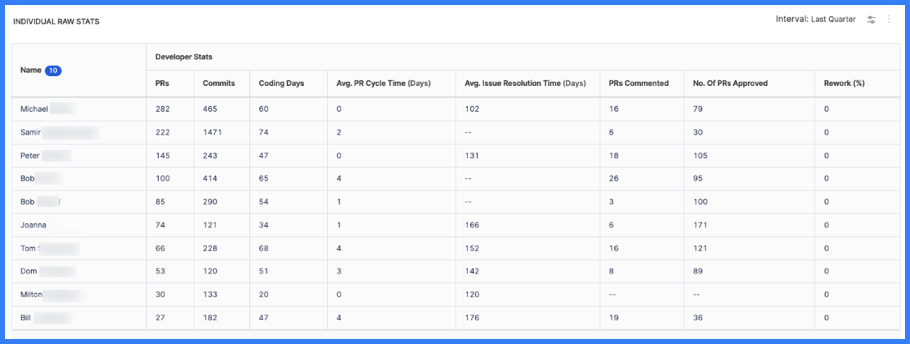
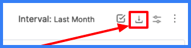

Trellis Scores are a proprietary scoring mechanism from SEI. Your Trellis Score helps you understand your team's productivity. Trellis Scores are calculated from factors such as code quality, code volume, speed, impact, proficiency, and collaboration. You can adjust the weight given to each factor.

## Quality

Quality is defined by two metrics: Percentage of rework and percentage of legacy rework.

* **Percentage of Rework:** This measure reflects changes to recently-written code in the past 30 days. A lower percentage of change is associated with a better Trellis Score. Industry standards recommend that an acceptable percentage is between 7.5 and 37.5 percent.
* **Percentage of Legacy Rework:** This measure reflects changes to old code and changes added more than 30 days ago. A lower percentage of change is associated with a better Trellis Score. Industry standards recommend that an acceptable percentage is between between 7.5 and 37.5 percent.

By default, all changes to code written in the last 30 days are considered rework.

## Impact

:::info

The Impact factor depends on the [Investment profile](../sei-profiles/investment-profile.md). The metrics that contribute to the Impact factor require categories from the Investment profile as input parameters.

To configure this, go to [Configure the Impact Factor in a Trellis profile](../sei-profiles/trellis-profile.md#enable-the-impact-factor).

:::

Impact is defined by two metrics: High impact bugs worked on per month and high impact stories worked on per month.

* **High Impact bugs worked on per month:** This measure represents the number of resolved, high impact bug tickets that the developer was assigned to in the past 30 days. If more than one developer worked on the same ticket, developers are credited proportionately. The average number of bugs worked on per month is between 2 and 3.
* **High Impact stories worked on per month:** This measure represents the number of resolved, high impact story tickets that the developer was assigned to in the past 30 days. If more than one developer worked on the same ticket, developers are credited proportionately. The average number of stories worked on per month is between 3 and 7.5.

## Volume

Volume measures the quantity of code that the developer is working on. The default volume score is calculated using the following six metrics:

* **Number of PRs per month:** This is the number of Pull Requests a developer submitted in the last 30 days. It is recommended that developers submit between 5 and 7.5 PRs each month.
* **Number of Commits per month:** This is the number of commits a developer has submitted in the last 30 days. The industry standard for the number of commits per month is between 10 and 15.
* **Lines of Code per month:** This is the number of lines of code a developer has submitted in the last 30 days. The industry standard recommends between 125 and 185 lines of code each month.
* **Number of bugs worked on per month:** This is the number of resolved bug tickets assigned to a developer in the past 30 days. If more than one developer worked on the same ticket, developers are credited proportionately. The average number of bugs worked on per month is between 2 and 3.
* **Number of Stories worked on per month:** This is the number of resolved story tickets assigned to a developer in the past 30 days. If more than one developer worked on the same ticket, developers are credited proportionately. The average number of stories worked on per month is between 5 and 7.
* **Number of Story Points worked on per month:** This is the number of resolved story points assigned to a developer in the past 30 days. If more than one developer worked on the same ticket, developers are credited proportionately.

## Speed

Speed measures the pace at which developers are writing and submitting code. Speed is determined by the following three metrics:

* **Average Coding Days per Week:** A coding day is any day where a developer commits code. The recommended goal for coding days per week is 3.2 days.
* **Average PR Cycle Time:** This represents the time elapsed from PR creation to closing. The average PR cycle time should be less than 7 days.
* **Average Time Spent Working On Issues:** This is the average time spent on each issue resolved in the last 30 days. This typically doesn't include time spent in the **Done** status. Time is counted only when the developer is assigned to an issue. The average time spent working on issues should be between 3 and 5 days.

:::caution

It is not recommended to change these metrics from their default values, because they are based on industry standards.

:::

## Proficiency

Proficiency measures how many projects are currently being worked on. It is based on two metrics: Technical breadth and repo breadth.

* **Technical Breadth:** This is the number of unique files that were worked on in the last 30 days. It is recommended that technical breadth average between 2 and 3 unique files per month.
* **Repo Breadth:** This is the number of unique repositories with successful code commits. It is recommended that a developer works on between 2 and 3 unique repos per month.

## Leadership and Collaboration

Leadership and collaboration measures developer teamwork and contribution to peer reviews. This is calculated from the following four metrics:

* **Number of PRs approved per month:** This number represents how many PRs a developer approved within the last 30 days. The recommended number of approved PRs is between 2 and 7.
* **Number of PRs commented on per month:** This number represents how many PRs a developer commented on in the last 30 days. The typical range for this value is between 2 and 7 PRs per month.
* **Average Response Time for PR approvals:** This is the average time taken to approve another developer's PR. The industry standard for an PR approval time is between 0.75 and 2 days.
* **Average Response Time for PR comments:** This is the average time taken for a developer to add review comments on a PR. The industry standard for a responding to a PR comment is between 0.75 and 1.5 days.

## Modify factors and weights

A [Trellis profile](../sei-profiles/trellis-profile.md) is required to calculate your Trellis Score and to modify the factors and weights that contribute to your score.

In the **Factors and Weights** section of your Trellis profile, you can enable and disable individual [factors] to include or exclude them from your Trellis Score calculation.

<!-- image: factors and weights section of trellis profile -->

You can also adjust the weight of each factor. Assign a low weight (1-5) to make less important factors have a lower impact on your score. Assign a higher weight (5-10) to make more important factors have a higher impact on your score.

Weights are relative. For example, if all factors are weighted 5, then all factors are still equal.

## Trellis Score widgets and reports

Add these widgets to your Insights to analyze Trellis Scores.

* **Trellis Score Report:** Trellis Scores by developer.
* **Trellis Scores by Collection:** Trellis Scores organized by [Collection](../sei-collections/manage-collections.md).
* **Individual Raw Stats:** A table of base values that contribute to Trellis Scores.
* **Raw Stats by Collection:** Base values organized by [Collection](../sei-collections/manage-collections.md).

### Raw stats

The **Individual Raw Stats** and **Raw Stats by Collection** widgets shows tables of base values that contribute to Trellis Scores.

By default, the **Individual Raw Stats** widget shows the following raw, pre-calculation values for each developer:

* PRs
* Commits
* Coding days
* Average PR cycle time (in days)
* Average issue resolution time (in days)
* PRs commented on
* PRs approved
* Percentage of rework

You can edit the widget to show different values (add/remove columns) or apply filtering.

<figure>

<figcaption>Individual Raw Stats</figcaption>
</figure>

You can also use the **Download** icon to download the raw stats report.

<figure>

<figcaption>Use the <b>Download</b> icon to download the Individual Raw Stats data.</figcaption>
</figure>

## Trellis Score visibility

You can [limit access to Trellis Scores](../sei-collections/collection-admin.md#limit-trellis-score-visibility).
