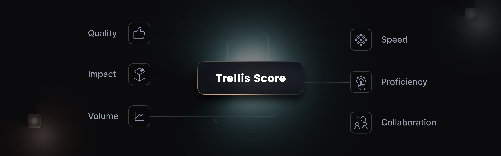

**Trellis Scores** are a proprietary productivity metric developed by SEI that provides a holistic understanding of software development team and individual performance. These scores are calculated based on a combination of key factors, including **Code Quality**, **Code Volume**, **Speed**, **Impact**, **Proficiency**, and **Collaboration**.

## Onboarding Path

<table>
    <tr>
        <td><b>Step</b></td>
        <td><b>Details</b></td>
        <td><b>Documentation</b></td>
    </tr>
    <tr>
        <td>Trellis Factors</td>
        <td>Factors that impact the Trellis score calculations </td>
        <td>[Click Here](#trellis-factors)</td>
    </tr>
    <tr>
        <td>Trellis Profile</td>
        <td>Create/Edit a Trellis profile</td>
        <td>[Click Here](/docs/software-engineering-insights/sei-profiles/trellis-profile)</td>
    </tr>
    <tr>
        <td>Trellis Reports</td>
        <td>Use Trellis reports to analyze the Trellis scores for your engineering team</td>
        <td>[Click Here](/docs/software-engineering-insights/sei-metrics-and-reports/trellis-scores/trellis-score-reports)</td>
    </tr>
    <tr>
        <td>Trellis Insight</td>
        <td>Step by step guide to create a Trellis Insight</td>
        <td>[Click Here](/docs/software-engineering-insights/insights/trellis-insight)</td>    
        </tr>
    <tr>
        <td>Trellis Calculations</td>
        <td>How are the Trellis metrics calculated</td>
        <td>[Click Here](/docs/category/trellis-calculations)</td>
    </tr>
</table>

## Trellis Factors

The **Trellis Score** is calculated based on the specific factors enabled and the associated weights configured in the Trellis Profile, which serves as the single source of truth for these calculations. This allows organizations to customize the Trellis metric calculations to align with their unique priorities and objectives.

By enabling or disabling specific factors, teams can calculate the Trellis Scores to focus on the metrics that are most relevant to their development process and goals. This flexibility ensures that the scores provide accurate and meaningful insights to drive continuous improvement and optimize team and individual productivity.

### Quality

The quality of work is measured using two key metrics: the **Percentage of Rework** and the **Percentage of Legacy Rework**. 

* **Percentage of Rework:** This measures the changes made to code commits within the last 30 days. A lower percentage of rework indicates a higher level of quality, as it means fewer modifications were required to the recently written code. By default, any changes to the code created in the last 30 days are categorized as rework.
* **Percentage of Legacy Rework:** This measures the changes made to code commits that are older than 30 days. A lower percentage of legacy rework indicates a higher level of quality, as it means fewer modifications were required to the older codebase.

By default, all changes to code written in the last 30 days are considered rework.

:::info
**What is Rework?**

**Rework** is the process of making changes or modifications to existing code. This can include: Alterations, Code Fixes, Feature Enhancements, Code Optimizations etc.

The purpose of measuring rework is to evaluate the stability of the code, the frequency of necessary changes, and the efficiency of the development efforts.

By default, any changes made to code written in the last 30 days are considered rework. To learn more, go to [SCM Rework](/docs/software-engineering-insights/sei-technical-reference/scm-calculation/scm-reports-calculation/scm-rework-report ).
:::

### Impact

The Impact of an engineer's work is defined and measured by two key metrics: **High Impact Bugs Worked On Per Month** and **High Impact Stories Worked On Per Month**. High Impact refers to the classification of bug or story tickets, based on their perceived significance or priority. This classification can vary depending on your configuration in the **Issue Management Platform**.

* **High-Impact Bugs Worked On Per Month**: This metric tracks the number of resolved, high-impact bug tickets that an engineer was assigned to within the selected time frame.
  * The metric value in the Trellis report is normalized to show the average number of resolved, high-impact bug tickets per month. 
  * If more than one developer worked on the same ticket, developers are credited proportionately.
* **High-Impact Stories Worked On Per Month**: This measure represents the number of resolved, high-impact story tickets that the developer was assigned to within the selected time frame.
  * The metric value in the report is normalized to show the average number of resolved, high-impact story tickets per month.
  * If more than one developer worked on the same ticket, developers are credited proportionately.

:::info
It's important to note that the definition of **High Impact** can vary depending on the Investment profile and user preferences. The metrics that contribute to the **Impact Factor** require categories from the Investment profile as input parameters.   
To configure this, go to [Configure the Impact Factor in a Trellis profile](/docs/software-engineering-insights/sei-profiles/trellis-profile#enable-the-impact-factor).
:::

### Volume

Volume measures the quantity of code that the developer is working on. The default volume score is calculated using the following six metrics:

* **Number of PRs merged per month:** This metric represents the number of Pull Requests created by a developer that have been merged within the selected time frame.
  * The metric value in the report is normalized to show the average number of merged pull requests per month for a developer.
  * It is recommended that developers should have at least between 5 and 7.5 PRs merged each month.
* **Number of Commits per month:** This is the average number of commits a developer has submitted within the selected time frame.
  * The metric value in the report is normalized to show the average number of commits a developer contributes per month.
  * The industry standard for the number of commits per month is between 10 and 15.
* **Lines of Code per month:** The Lines of Code metric calculates the total number of lines of code contributed by an engineer within the selected time frame.
  * The metric value in the trellis report is normalized to show the average number of lines of code contributed per month.
  * The industry standard recommends between 125 and 185 lines of code each month.
* **Number of bugs worked on per month:** This is the number of resolved bug tickets assigned to a developer within the selected time frame.
  * The metric value in the report is normalized to show the average number of resolved bug tickets assigned to a developer per month.
  * If more than one developer worked on the same ticket, developers are credited proportionately.
  * The average number of bugs worked on per month is between 2 and 3.
* **Number of Stories worked on per month:** This is the number of resolved story tickets assigned to a developer within the selected time frame.
  * The metric value in the report is normalized to show the average number of resolved story tickets assigned to a developer per month.
  * If more than one developer worked on the same ticket, developers are credited proportionately.
  * The average number of stories worked on per month is between 5 and 7.
* **Number of Story Points worked on per month:** This is the number of resolved story points assigned to a developer within the selected time frame.
  * The metric value in the report is normalized to show the average number of resolved story points assigned to a developer per month.
  * If more than one developer worked on the same ticket, developers are credited proportionately.

### Speed

Speed measures the pace at which engineers successfully resolve or close the tickets assigned to them. Speed is determined by the following three metrics:

* **Average Coding Days per Week:** A coding day is any day when a developer commits code. This metric is calculated by dividing the number of coding days by a specified number of weeks.
  * This metric quantifies how consistently developers actively contribute code to the codebase.
  * Higher values indicate frequent code commits, which can indicate faster development.
  * The recommended goal for coding days per week is 3.2 days.
* **Average PR Cycle Time:** This represents the time elapsed from PR creation to closing. The average PR cycle time should be less than 7 days. This metric is calculated as the elapsed time between PR creation and closure.
* **Average Time Spent Working On Issues:** This is the average time spent on each issue resolved in the last 30 days or any specified time period.
  * This typically doesn't include time spent in the **Done** status. Time is counted only when the developer is assigned to an issue.
  * The average time spent working on issues should be between 3 and 5 days.
  * This metric is calculated by dividing the total time by the total number of issues recorded in the period.

:::info
It is not recommended to change these metrics from their default values, because they are based on industry standards.
:::

### Proficiency

Proficiency measures how many projects are currently being worked on. It is based on two metrics: Technical breadth and repo breadth.

* **Technical Breadth:** This is the number of unique files that were worked on in the last 30 days. It is recommended that technical breadth average between 2 and 3 unique files per month.
* **Repo Breadth:** This is the number of unique repositories with successful code commits. It is recommended that a developer works on between 2 and 3 unique repos per month.

### Leadership and Collaboration

Leadership and collaboration measure developer teamwork and contribution to peer reviews. This is calculated from the following four metrics:

* **Number of PRs approved per month:** This number represents how many PRs a developer approved within the selected time frame. The metric value in the report is normalized to show the average number of PRs a developer approved per month. The recommended number of approved PRs is between 2 and 7.
* **Number of PRs commented on per month:** This number represents how many PRs a developer commented on within the selected time frame. The metric value in the report is normalized to show the average number of PRs a developer commented on per month. The typical range for this value is between 2 and 7 PRs per month.
* **Average Response Time for PR approvals:** This is the average time taken to approve another developer's PR. The industry standard for a PR approval time is between 0.75 and 2 days.
* **Average Response Time for PR comments:** This is the average time taken for a developer to add review comments on a PR. The industry standard for responding to a PR comment is between 0.75 and 1.5 days.

## Trellis Profile

A Trellis profile is required to calculate your Trellis Score and to modify the factors and weights that contribute to your score. To create a new profile, go to [Trellis Profiles](/docs/software-engineering-insights/sei-profiles/trellis-profile).

### Modifying Factors

In the Factors and Weights section of the Trellis profile, individual factors can be enabled or disabled. Enabling a factor includes it in the Trellis Score calculation while disabling it excludes it from the calculation. You can typically set benchmarks or thresholds at the factor level. These benchmarks define specific performance levels that need to be met or exceeded for a given factor to positively impact the overall score.

### Customizing Weights

Each factor's weight can be adjusted to assign varying levels of importance. Weights are assigned on a scale of 1 to 10, with 1 indicating low importance and 10 indicating high importance. Relative weights determine the significance of factors in relation to each other.

For example, if all factors are assigned a weight of 5, they contribute equally to the Trellis Score. Adjusting weights allows developers to prioritize certain factors over others based on their organizational goals.

### Associations & Advanced Options

SEI allows you to associate Trellis profiles with specific Collections within an Project. This helps in managing and applying profiles effectively.

* **Projects:** Contributors can select a project to view available **Collections** and assign **Trellis profiles** to specific projects. This feature helps in organizing and categorizing teams under different projects, allowing for a more granular management of Trellis profiles.
* **Collections:** **Contributors** can select **Collections** that may apply to a **Trellis profile**. By associating Collection with Trellis profiles, contributors can ensure that the right profiles are applied to the appropriate teams or units within the organization. This facilitates customized score calculations.

### Exclusions

Exclusions allow users to exclude specific Pull Requests (PRs) and commit from the current Trellis profile, potentially impacting score calculations.

* **Excluding Pull Requests:** Users can specify PRs to be excluded from the current Trellis profile. Exclusions are helpful when certain PRs or commits should not be considered in score calculations, such as those related to experimental or non-standard work.
* **Excluding Commits:** Users can list commits to be excluded from the current Trellis profile. Excluded commits are not factored into score calculations.

### Development Stages Mapping

Development Stages Mapping allows users to map a Trellis profile with development stages from an Issue Management Platform. Mapping development stages is useful when organizations want to attribute scores to developers based on their contributions at different stages of a project's life cycle.

## Trellis reports

Trellis Score reports provide valuable insights into developer performance and facilitate data-driven decision-making. Add these widgets to your Insights to analyze Trellis Scores.

* [Trellis Score Report](/docs/software-engineering-insights/sei-metrics-and-reports/trellis-scores/trellis-score-reports#trellis-score-report): Trellis Scores by developer.
* [Trellis Scores by Collection](/docs/software-engineering-insights/sei-metrics-and-reports/trellis-scores/trellis-score-reports#trellis-score-by-collection): Trellis Scores organized by [Collection](/docs/software-engineering-insights/sei-projects-and-collections/manage-collections).
* [Individual Raw Stats](/docs/software-engineering-insights/sei-metrics-and-reports/trellis-scores/trellis-score-reports#individual-raw-stats): A table of base values that contribute to Trellis Scores.
* [Raw Stats by Collection](/docs/software-engineering-insights/sei-metrics-and-reports/trellis-scores/trellis-score-reports#raw-stats-by-collection): Base values organized by [Collection](/docs/software-engineering-insights/sei-projects-and-collections/manage-collections).