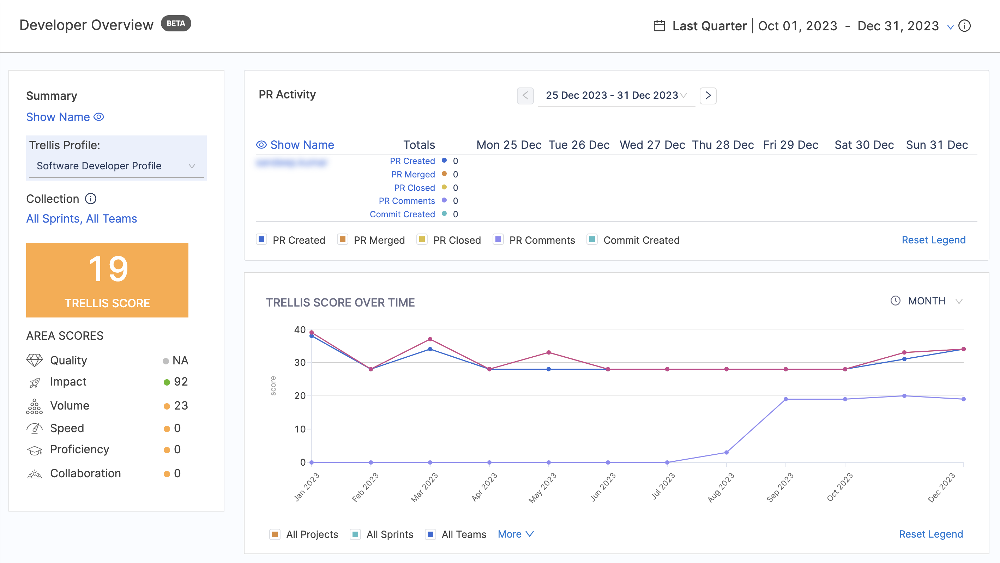

Trellis Score reports provide valuable insights into developer performance and facilitate data-driven decision-making. Add these widgets to your Insights to analyze Trellis Scores.

* [**Trellis Score report:**](#trellis-score-report) Trellis Scores by developer.
* [**Trellis Scores by Collection:**](#trellis-score-by-collection) Trellis Scores organized by [Collection](/docs/software-engineering-insights/sei-projects-and-collections/manage-collections).
* [**Individual Raw Stats:**](#individual-raw-stats) A table of base values that contribute to Trellis Scores.
* [**Raw Stats by Collection:**](#raw-stats-by-collection) Base values organized by [Collection](/docs/software-engineering-insights/sei-projects-and-collections/manage-collections).

## Trellis Score report

### Definition

The Trellis Score report calculates and displays the Trellis Scores by individual developers. The trellis score can be further divided into the following categories:

* **Quality:** Quality is defined by two metrics: Percentage of rework and percentage of legacy rework.
* **Impact:** Impact is defined by two metrics: High-impact bugs worked on per month and high-impact stories worked on per month. Impact refers to the ticket's perceived significance or priority.
* **Volume:** Volume measures the quantity of code that the developer is working on.
* **Speed:** Speed measures the pace at which developers are writing and submitting code.
* **Proficiency:** Proficiency measures how many projects are currently being worked on. It is based on two metrics: Technical breadth and repo breadth.
* **Leadership and Collaboration:** Leadership and collaboration measures developer teamwork and contribution to peer reviews.

The factors and weight associated with the Trellis Score are essentially defined at the profile level. To learn more, go to [Trellis Profile](/docs/software-engineering-insights/sei-profiles/trellis-profile).



### Add the report

To add the **Trellis Score report** widget to the Insight:

#### Step 1: Add the widget

* Select **Settings**, then **Add Widget**.
* Choose the **Trellis Score report** widget.

#### Step 2: Configure the Filters on the widget

Define the **Time Interval** for the data to be displayed in the widget

The **Factors** and their associated **Weights** associated with the **Trellis Score** are defined at the **Profile level**. You can adjust the weight given to each factor in the associated [Trellis Profile](/docs/software-engineering-insights/sei-profiles/trellis-profile), which acts as the single source of truth for your Trellis Score calculations.

#### Step 3: Save the widget

Complete the widget settings and select **Next: Place Widget**, place the widget on Insight and then select **Save Layout**.

### Calculation

Trellis Scores are calculated from the factors mentioned above: **Code Quality**, **Code Volume**, **Speed**, **Impact**, **Proficiency**, and **Collaboration**. You can adjust the weight given to each factor, allowing for granular-level assessments based on individual profiles.

The report calculates the score for every Contributor and presents the overall Trellis score, along with a breakdown of the score for each factor. For more information, refer to the [Trellis Calculation Guide](/docs/category/trellis-calculations).

## Trellis Score by Collection

### Definition

The Trellis Score by Collection report calculates and displays the Trellis Scores organized by Collection. This report provides a high-level view of the performance of different teams or groups within an organization.

### Add the report

To add the **Trellis Score by Collection report** widget to the Insight:

#### Step 1: Add the widget

* Select **Settings**, then **Add Widget**.
* Choose the **Trellis Score by Collection report** widget.

The following settings are available to configure this report:

#### Step 2: Configure the Filters for the widget

* Define the **Time Interval** for the data to be displayed in the widget. For example: Last Quarter. This means that the widget will calculate and display data for the Last Quarter.
* You can choose to display the scores of the immediate child Collections only, providing a more focused view of the performance of specific teams or groups.

#### Step 3: Save the widget

Complete the widget settings and select **Next: Place Widget**, place the widget on Insight and then select **Save Layout**.

### Calculation

The factors and associated metrics used in the **Trellis Score by Collection** report are identical to the general Trellis Score calculation. The key difference is that the score for each Collection is calculated as the average Trellis score across all users in that Collection.

The formula for the Trellis Score by Collection is:

```
Trellis Score by Collection = (Sum of Trellis Scores of all the users in the Collection) / (Number of users in the Collection)
```

This allows you to quickly identify the top-performing Collections, as well as those that may need more attention or support.

## Individual Raw Stats

### Definition

The Individual Raw Stats report displays a detailed breakdown of the base values that contribute to the Trellis Scores at the individual contributor level. This report provides granular insights into the performance and contribution of each developer within your organization.

### Add the report

To add the **Individual Raw Stats report** widget to the Insight:

#### Step 1: Add the widget

* Select **Settings**, then **Add Widget**.
* Choose the **Individual Raw Stats report** widget.

The following settings are available to configure this report:

#### Step 2: Configure the Filters for the widget

* Define the **Time Interval** for the data to be displayed in the widget. For example: Last Quarter. This means that the widget will calculate and display data for the Last Quarter.
* Select the **User Attributes** from the Contributor's list to display alongside Trellis metric data.

#### Step 3: Save the widget

Complete the widget settings and select **Next: Place Widget**, place the widget on Insight and then select **Save Layout**.

### Calculation

The report displays the breakdown of the base values that contribute to the Trellis Score calculation. The following metrics are included:

<table>
<thead>
<tr>
<th width="185">Column</th>
<th>Description</th>
</tr>
</thead>
<tbody>
<tr>
<td>PRs Merged</td>
<td>Total number of Pull Requests created by a developer that has been merged within the selected time frame.</td>
</tr>
<tr>
<td>Commits</td>
<td>Total number of commits contributed by the contributor in the selected time range.</td>
</tr>
<tr>
<td>Bug Fixed</td>
<td>Total number of issues with the "BUG" type that were resolved by the contributor in the selected time range.</td>
</tr>
<tr>
<td>PRs commented</td>
<td>Total number of pull requests to which the contributor added comments in the selected time range.</td>
</tr>
<tr>
<td>No. of PRs approved</td>
<td>Total number of pull requests that were approved by the contributor in the selected time range.</td>
</tr>
<tr>
<td>Rework</td>
<td>The number of lines changed by a contributor in the last 30 days or configured time for legacy code.</td>
</tr>
<tr>
<td>Legacy Rework</td>
<td>Lines of code changed that are older than 30 days (or the configured time duration for legacy code) by the contributor.</td>
</tr>
<tr>
<td>Lines of Code</td>
<td>Total number of lines of code contributed by the contributor within the selected time range.</td>
</tr>
<tr>
<td>Story points</td>
<td>Total number of story points for tickets that were resolved (completed) by the contributor in the selected time range.</td>
</tr>
<tr>
<td>Unique File Extension</td>
<td>Total number of unique file types the contributor worked on in the selected time range.</td>
</tr>
<tr>
<td>Unique Repos</td>
<td>Total number of unique repositories the contributor contributed to in the selected time range.</td>
</tr>
<tr>
<td>Coding Days</td>
<td>Number of unique days within the specified time range during which the contributor has committed code changes.</td>
</tr>
<tr>
<td>Ticket Portion</td>
<td>This displays how much time each user has contributed to the overall resolution of a ticket. It represents the proportion of time a particular user worked on a ticket relative to the total amount of time the ticket was open.</td>
</tr>
</tbody>
</table>

You can edit the widget to show different values (add/remove columns) or apply filtering. To learn more, refer to the [Trellis Calculations Guide](/docs/category/trellis-calculations)

You can also use the **Download** icon to download the Raw Stats report.

## Raw Stats by Collection

### Definition

The **Raw Stats by Collection** report presents a detailed breakdown of the **Average Base Values** that contribute to the **Trellis Scores** at the Collection level. These metrics are calculated by taking the average across all contributors within each respective Collection. The report provides insights into the overall average performance and contribution of each Collection within your organization.

### Add the report

To add the **Raw Stats by Collection report** widget to the Insight:

#### Step 1: Add the widget

* Select **Settings**, then **Add Widget**.
* Choose the **Raw Stats by Collection report** widget.

The following settings are available to configure this report:

#### Step 2: Configure the Filters for the widget

* Define the **Time Interval** for the data to be displayed in the widget. For example: Last Quarter. This means that the widget will calculate and display data for the Last Quarter.

#### Step 3: Save the widget

Complete the widget settings and select **Next: Place Widget**, place the widget on Insight and then select **Save Layout**.

### Calculation

The report displays the breakdown of the base values as average that contribute to the Trellis Score calculation for each Collection. The following metrics are included:

<table>
<tr>
<td width="185"><b>Column</b></td>
<td><b>Description</b></td>
</tr>
<tr>
<td>PRs Merged</td>
<td>The average number of pull requests merged by all the contributors under the respective Collection in the selected time range.</td>
</tr>
<tr>
<td>Commits</td>
<td>Average number of commits contributed by all the contributors under the respective Collection in the selected time range.</td>
</tr>
<tr>
<td>Bug Fixed</td>
<td>Average number of issues with the "BUG" type that were resolved by all the contributors under the respective Collection in the selected time range.</td>
</tr>
<tr>
<td>PRs commented</td>
<td>Average number of pull requests to which comments were added by all the contributors under the respective Collection in the selected time range.</td>
</tr>
<tr>
<td>No. of PRs approved</td>
<td>Average number of pull requests that were approved by all the contributors under the respective Collection in the selected time range.</td>
</tr>
<tr>
<td>Rework</td>
<td>Average lines of code changed that were made within the last 30 days (or the configured time duration for legacy code) by all the contributors under the respective Collection.</td>
</tr>
<tr>
<td>Legacy Rework</td>
<td>Average lines of code changed that are older than 30 days (or the configured time duration for legacy code) by all the contributors under the respective Collection.</td>
</tr>
<tr>
<td>Lines of Code</td>
<td>Average number of lines of code contributed by all the contributors under the respective Collection in the selected time range.</td>
</tr>
<tr>
<td>Story points</td>
<td>Average number of story points for tickets that were resolved (completed) by all the contributors under the respective Collection in the selected time range.</td>
</tr>
<tr>
<td>Unique File Extension</td>
<td>Average number of unique file types the contributors under the respective Collection worked on in the selected time range.</td>
</tr>
<tr>
<td>Unique Repos</td>
<td>Average number of unique repositories the contributors under the respective Collection contributed to in the selected time range.</td>
</tr>
<tr>
<td>Coding Days</td>
<td>Average number of unique days within the specified time range during which the contributors under the respective Collection have committed code changes.</td>
</tr>
</table>

You can edit the widget to show different values (add/remove columns) or apply filtering. To learn more, refer to the [Trellis Calculation guide](/docs/category/trellis-calculations)