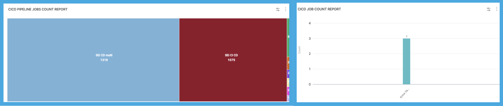
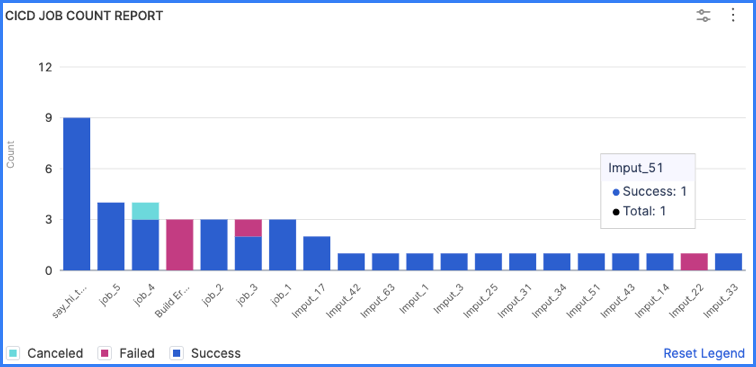
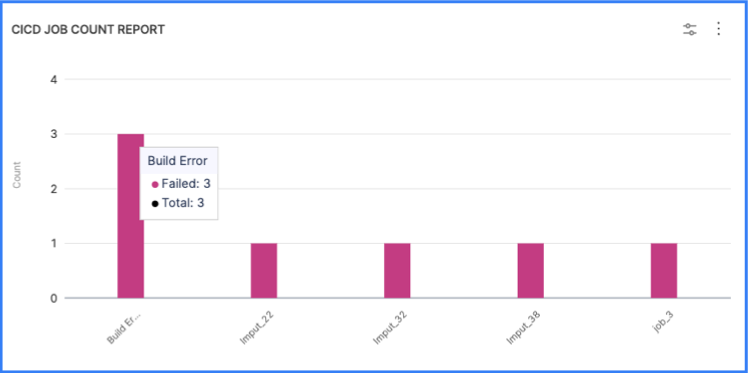

Use CI/CD job reports to analyze metrics and trends related to CI/CD job runs. This data helps you achieve a comprehensive understanding of how CI/CD practices have been adopted and utilized within your organization, including:

* **Growth analysis:** Discover the overall growth rate of CI/CD job counts, which indicates increasing adoption of automated software development practices.
* **Seasonal patterns:** Identify any cyclical or seasonal patterns in CI/CD job counts, which enables you to anticipate resource allocation and workload fluctuations.
* **Adoption rates:** Gain a deeper understanding of the adoption rate of CI/CD practices across different teams or departments, which helps identify areas of success and potential improvement.
* **Pipeline performance analysis:** By tracking job counts over time, you can analyze a pipeline's performance. Changes in the job count, such as an increase in queued jobs or a decrease in completed jobs, can provide insights into the pipeline's efficiency, resource utilization, or potential issues affecting its execution.

These widgets can be configured based on various CI/CD attributes, such as pipelines, projects, and statuses, depending on your CI/CD [integrations](../../sei-integrations/sei-integrations-overview.md).

## Job count reports

Use the CI/CD job count reports to understand how often your CI/CD jobs run and whether they succeed or fail. You can analyze CI/CD job counts over a specific period, and shed light on the trends and patterns observed during that time.

* **CI/CD Job Count Report:** A bar chart visualizing the number of CI/CD jobs run in a given time frame.
* **CI/CD Job Count Single Stat:** This report provides a single stat, such as the total number of jobs that ran in a given period of time, a summary of the job count at a given moment, or the number of jobs or stages within the CI/CD pipeline.
* **CI/CD Job Count Trend Report:** Daily, weekly, and monthly trends for CI/CD job runs.

When you add a CI/CD Job Count report to an Insight, the **Job End Date** filter is set to a relative time frame by default. The widget is ready to use with the default configuration or you can modify it. For some useful configuration options, go to [Configuration techniques](#configure-cicd-job-reports).

## Job duration reports

Job duration reports can help you optimize build times by analyzing the total time it takes for jobs to run.

* **CI/CD Job Duration Report:** Overview of elapsed time for job runs.
* **CI/CD Job Duration Single Stat:** Report a single job duration stat.
* **CI/CD Job Duration Trend Report:** Daily, weekly, and monthly trends in job duration.

## Pipeline job reports

Use the CI/CD pipeline job reports to analyze CI/CD job counts over a specific period, and shed light on the trends and patterns observed during that time.

* **CI/CD Pipeline Jobs Count Report:** A heatmap visualizing the number of CI/CD jobs run in a given time frame.
* **CI/CD Pipeline Jobs Count Trend Report:** Daily, weekly, and monthly trends for CI/CD job runs.
* **CI/CD Pipeline Jobs Duration Report:** Total time taken by a job and its children. Use this report to optimize build times.
* **CI/CD Pipeline Jobs Duration Trend Report:** Daily, weekly, and monthly trends in job duration.

:::info

Pipeline job reports are functionally identical to [job count reports](#job-count-reports) and [job duration reports](#job-duration-reports). However, pipeline job reports present heatmap visualizations by default, whereas job count and duration reports present bar charts.

<!--  -->

<docimage path={require('../static/velocity-cicd-job-count-comparison.png')} />

:::

## Job configuration change reports

Use the CI/CD job configuration change reports to understand how often job configuration updates happen, and which users maintain or make the most job configuration changes.

* **CI/CD Job Config Change Count Report:** Overview of job config changes.
* **CI/CD Job Config Change Count Single Stat:** Report a single stat related to job config changes.
* **CI/CD Job Config Change Count Trend Report:** Daily, weekly, and monthly trends for job config changes.

## SCM to CI/CD jobs reports

For information about SCM to CI/CD jobs reports, such as the **SCM Commit to CI/CD Job Lead Time Trend Report**, go to [SCM reports](./scm-reports.md).

## Configure CI/CD job reports

These are some popular or useful ways to configure your CI/CD job report widgets.

:::tip Single stat widgets

Single stats are often used as key visual elements on Insights. For example, the **CI/CD Job Count Single Stat** widget provides a concise and easily understood representation of a CI/CD pipeline's job count, which enables stakeholders and team members to quickly assess the pipeline's status and progress.

:::

### Report all jobs in Insight time

_Insight time_ is the time range selected by the user when viewing Insights. If you want a more interactive widget that reports all jobs run in the user-selected Insight time, set **Job End Date** to **Insight time**.

If you want the widget to report the status (success or failure) of all jobs in Insight time, configure the widget as follows:

* Job End Date: Insight time
* Metrics: Job Status
* Aggregations: Job Name

<figure>

<figcaption>A CI/CD Job Count Report set to all jobs in Insight time.</figcaption>
</figure>

### Filter by failed jobs

If you want the widget to highlight failed jobs, add a **Job Status** filter and set it to **Failed**. You can use this configuration in combination with Insight time, such as:

* Job End Date: Insight time
* Metrics: Job Status
* Aggregations: Job Name
* Filter, Job Status: Failed

<figure>

<figcaption>A CI/CD Job Count Report showing only failed jobs.</figcaption>
</figure>
