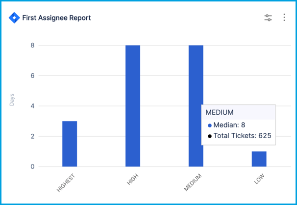
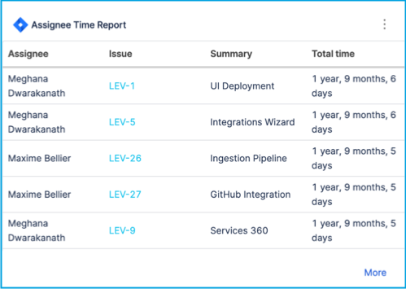
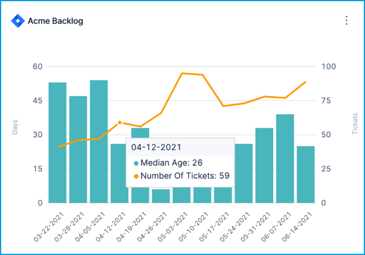
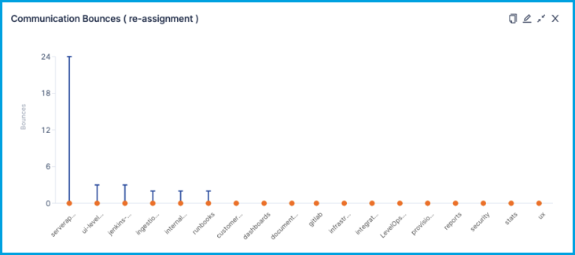
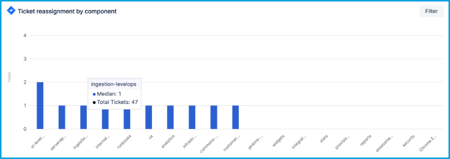

Use these issues reports to analyze data related to issues in issue management systems, such as Jira. Some reports can also be used for support tickets and tickets or issues that cover multiple systems (support, issue management, SCM, and CI/CD).

## Issue count reports

Issue count reports are versatile reports that you can use to examine metrics related to tickets or work items (epics, stories, bugs, tasks, story points, and so on) in your issue management system. You can examine any measurable aspect of your issue management data, such as type, priority, status, labels, components, or any other field, including custom fields.

* **Issues Report:** Analyze issues by priority, status, or any other field.
* **Issues Trend Report:** Examine changes over time in issues.
* **Issues Single Stat:** Show a [single stat](#issue-single-stats).
* **Issue First Assignee Report:** This is an [initial response and assignment time report](#initial-response-and-assignment-time-reports).

### Configure the Issues Report

Use the **Issues Report** to examine metrics related to issues in your issue management system. The report aggregates data based on selected attributes, such as priority, status, labels, components, or any other field. This report helps you create comparisons based on various fields and draw conclusions to make decisions.

The following settings are available to configure the Issues Report:

* **Filters:** Select attributes from the **Add filter** dropdown menu that you want to use to filter the data, and then select filter values and operators. Depending on the selected attribute, you can select one or more filter values, select values to exclude, or use pattern matching rather than strict values. If you add multiple filters, they are inherently combined by `AND` operators.
* **Metrics:** Select a metric to use for the Y-axis. You can select either **Number of Tickets** or **Sum of Story Points**.
* **Aggregations:**
   * **X-axis:** Select the attribute to use for the X-axis. For example, if you selected the **Number of Tickets** metric for the Y-axis, you could select **Issues Resolved by week** for the X-axis. Additional examples of X-axis dimensional attributes include **Project**, **Assignee**, **Labels**, **Priority**, and so on.
   * **Stacks:** Select how you want to group data in each X-axis dimension. For example, if you select **Priority** for the X-axis and stack by **Status Category**, then data in each X-axis column are grouped by status.
* **Settings:**
   * Select the issue management system to use for this widget. Available options are based on your [SEI integrations](/docs/category/integrations).
   * Select how you want to sort X-axis data, such as ascending or descending.
   * Select the maximum number of values to show on the X-axis.
   * Select the visualization style for the widget, such as bar chart, donut chart, multi-line chart, or percentage-stacked bar chart.
   * Select the date format.

<figure>

<figcaption>An Issues Report configured to show <b>Ticket count</b> on the Y-axis and <b>Assignee</b> across the X-axis. For each Assignee, the issues are stacked by <b>Priority</b>.</figcaption>
</figure>

### Issues Report use cases

Here are some examples of configurations for the Issues Report.

Defects raised weekly

To configure the Issues Report to show bug tickets created weekly:

1. On the **Filter** tab, add an **Issue Type** filter set to **Bug/Defect**.
2. For the time range, either **Use Insight time** or set **Issue Created In** to the desired time range. **Use Insight time** allows the user to select a desired time range when viewing the Insight.
3. On the **Metrics** tab, select **Number of Tickets**.
4. On the **Aggregations** tab, set **X-axis** to **Issue created by week**.
5. On the **Settings** tab, set the **Visualization** to **Bar Chart**.
6. Set the widget **Name** to **Defects raised weekly**.

Stories resolved weekly

To configure the Issues Report to show stories resolved weekly:

1. On the **Filter** tab, add an **Issue Type** filter set to **Story**.
2. For the time range, either **Use Insight time** or set **Issue Created In** to the desired time range. **Use Insight time** allows the user to select a desired time range when viewing the Insight.
3. On the **Metrics** tab, select **Number of Tickets**.
4. On the **Aggregations** tab, set **Stacks** to **Priority**, and set **X-axis** to **Issue resolved by week**.
5. On the **Settings** tab, set the **Visualization** to **Bar Chart**.
6. Set the widget **Name** to **Stories resolved weekly**.

Distribution of tickets in an active sprint

To configure the Issues Report to show the distribution of tickets in the active sprint:

1. On the **Filter** tab, add a **Sprint** filter set to **Select Active Sprints only**.
2. On the **Metrics** tab, select **Number of Tickets**.
3. On the **Aggregations** tab, set **Stacks** to **Issue Type**, and set **X-axis** to **Sprint**.
4. On the **Settings** tab, set the **Visualization** to **Bar Chart**.
5. Set the widget **Name** to **Active sprint tickets distribution**.

Team workload (in stories)

To configure the Issues Report to show the number of stories associated with each team member for a given time period:

1. On the **Filter** tab, add a **Status** filter, set the value to all closed statuses (Done, Closed, Resolved, Won't Do, and so on), and select **Exclude**.

   This ensures the widget only shows active or not-started work.

2. On the **Metrics** tab, select **Number of Tickets**.
3. On the **Aggregations** tab, set **Stacks** to **Issue Type**, and set **X-axis** to **Assignee**.
4. On the **Settings** tab, set the **Visualization** to **Bar Chart**.
5. Set the widget **Name** to **Team workload**.

## Issue resolution time reports

Issue resolution time reports help you understand how long tickets remain open, including cycle time and lead time metrics.

* **[Issue Resolution Time Report](#configure-the-issue-resolution-time-report):** A configurable bar graph showing the number of tickets closed along with the average time it took to close those tickets, based on the time the tickets were created.
* **Issue Resolution Time Trend Report:** Monitor changes over time in issue resolution time.
* **Issue Resolution Time Single Stat:** A [single stat widget](#issue-single-stats) showing the number of issues marked as resolved in a given time period.
* **Issue Time Across Stages:** Analyze cycle time by status. Cycle time is the elapsed time for an iteration of the issue workflow, from open to close.
* **[Issue Lead Time by Stage Report](./lead-time-reports.md)**
* **[Issue Lead Time By Type Report](./lead-time-reports.md)**
* **[Jira Releases Report](#configure-the-jira-releases-report):** Analyze your team's release pattern by understanding the average time elapsed between issue creation and release.

:::tip Use Issue Resolution Time to monitor MTTR and MTBF

Mean Time To Recover (MTTR) and Mean Time Between Failures (MTBF) are [DORA metrics](../dora-metrics.md). You can use the **Issue Resolution Time Report** and **Issue Resolution Time Single Stat** widgets to monitor MTTR and MTBF. To do this, configure the filters and settings for these widgets so that they only track issues related to failure recovery.

:::

### Configure the Issue Resolution Time Report

The **Issue Resolution Time Report** can help answer questions like:

* Is my team getting faster at delivering features or fixing issues?
* Is the resolution times for a project or component decreasing over time?
* On average, how long does it take fix customer issues? Are we able to meet the SLA timeline?

<figure>

<figcaption>An Issue Resolution Time Report grouped by quarter.</figcaption>
</figure>

By default, the Issue Resolution Time Report is filtered by issues closed (**Last Closed Date**) within a selected time range. Usually, the time range is set to **Use Insight time**, which allows the user to select a time range when viewing Insights.

<!-- img .gitbook/assets/image (56).png - issue resolution time report widget config - filters tab - last closed date and Insight time -->

On the **Aggregations** tab, you can select the dimension, from your issue management system, to use for the X-axis, such as **Assignee**, **Story Points**, **Ticket Category**, **Issue Closed Last Time Period**, and so on. This determines what you want the widget to focus on. For example, focusing on **Category** or **Component** can show you the issue resolution time for different work areas; whereas, focusing on **Assignee** can show you issue resolution time by developer.

<!-- img .gitbook/assets/image (59).png - issue resolution time report widget config - aggregations tab - x axis dropdown -->

On the **Settings** tab, you can:

* Select the issue management system to use for this widget. Available options are based on your configured [SEI integrations](/docs/category/integrations).
* Select how you want to sort X-axis data, such as ascending or descending.
* Select the maximum number of unique values to show on the X-axis.

### Issue Resolution Time Report use cases

The primary way to modify the Issue Resolution Time Report is to change the X-axis dimension on the **Aggregations** tab. Here are some examples of configurations for this widget.

Average time to issue closed by assignee

This configuration produces a bar graph showing which assignees are taking the most time to close issues within the selected time frame.

1. On the **Aggregations** tab, select **Assignee** for the X-axis dimension.
2. On the **Settings** tab, set **Sort X-axis** to **By Value, High --> Low**, and set the **Max X-Axis Entries** high enough so that it can show all team members.

<!-- img /.gitbook/assets/image (53).png - Issue Resolution Time Report widget config - settings tab - sort xaxis high to low and 20 max entries -->

Median bug resolution time by priority

This configuration produces a bar graph showing the median resolution time for bugs, grouped by priority.

1. On the **Aggregations** tab, select **Issue Last Closed (Week, Month, Quarter)** for the X-axis dimension. Set the date to the desired time range, such as the last four quarters.
2. On the **Filters** tab:

   * Add a **Type** filter, and set the filter value to **Bug**.
   * Add a **Status Category** filter, and add filter values for done-equivalent statuses that you want to track, such as done, closed, resolved, and so on.

3. On the **Settings** tab, set **Sort X-axis** to **Priority**, and set the **Max X-Axis Entries** high enough so that it can show all priority levels.
4. For **Stacks**, use the **Median Resolution Time** and the **Number of Tickets**.

<!-- need to confirm this config -->

Story point estimation accuracy

This configuration produces a bar graph showing how well your story points are estimated. Good estimation is evidenced by a graph showing linear progression, with higher point issues taking longer to resolve than lower ones.

<!-- img .gitbook/assets/image (30).png - Story point estimation accuracy bar graph w linear progression -->

1. On the **Aggregations** tab, select **Story Points** for the X-axis dimension.
2. On the **Filters** tab, exclude backlog stages by adding an **Exclude Time In Status** filter, and set the filter value to your backlog status(es), such as **To Do** or **Backlog**.

<!-- img .gitbook/assets/image (29).png - exclude time in status filter example config -->

3. On the **Settings** tab, set **Sort X-axis** to **By Label, Low --> High**.

MTTR and Lead Time for Changes

This configuration produces a bar graph showing a historical record of the average time it took to close all issues within the selected time frame.

<!-- img .gitbook/assets/image (38).png - time to close issue by last time period bar graph example -->

1. On the **Aggregations** tab, select **Issue Last Closed (Week, Month, Quarter)** for the X-axis dimension.
2. On the **Filters** tab, add filters to demonstrate [MTTR](../dora-metrics.md#mean-time-to-restore-mttr) or [Lead Time For Changes](../dora-metrics.md#lead-time-for-changes) trends:

   * For MTTR: Add an **Issue Type** filter, and set the filter value to **Bugs**.
   * For Lead Time For Change: Add an **Issue Type** filter, and set the filter values to **Tasks** and **Stories**.

3. On the **Settings** tab, set **Sort X-axis** to **By Label, Low --> High**.

Median issue resolution time over time

This configuration produces a bar graph showing the median resolution time to close all issues each month in the selected time frame.

1. On the **Aggregations** tab, select **Issue Last Closed (Week, Month, Quarter)** for the X-axis dimension. Set the date to the desired time range, such as the last four months.
2. On the **Filters** tab, add a **Status Category** filter, and add filter values for all the closed-equivalent statuses that you want to track, such as done, closed, delivered, won't do, and so on.
3. On the **Settings** tab, set **Sort X-axis** to **Issue Closed Month**.
4. For **Stacks**, use the **Median Resolution Time** and the **Number of Tickets**, which will show, for each bar on the bar chart, the median resolution time for all tickets closed in that month.

<!-- need to confirm this config -->

### Configure the Jira Releases Report

Use the **Jira Releases Report** to analyze your team's release pattern by understanding the average time elapsed between issue creation and release.

#### Benefits

The benefits of the **Jira Releases Report** include:

* **In-depth analysis:** By combining Jira releases with lead time measurements, you can understand the time taken for each stage of your release process. This helps you identify areas where you can optimize and make data-driven decisions to improve efficiency.
* **Improved predictability:** By tracking lead time for each release, you can gain a better understanding of the time required to deliver features and enhancements. This improved predictability allows you to set realistic expectations with stakeholders and ensure smoother project planning and resource allocation.
* **Continuous process improvement:** The combination of Jira releases and lead time measurements facilitates a continuous improvement mindset. By analyzing lead time data, you can identify patterns, recurring issues, and areas of inefficiency.

#### Best practices

To get the most benefit from this report, the following best practices are recommended:

* Practice good Jira [hygiene](../hygiene-metrics.md), especially when changing issue statuses. Selecting the incorrect status, having an unclear status workflow, or having too many similar statuses can result in poor or inaccurate lead time measurements.
* Whenever possible, map issues to a single version, rather than multiple versions.
* Make sure all **Done** issues are eventually moved to the **Resolved** status (Ideally, moved to completion from the development and testing perspective).
* Perform releases only after all linked issues are in the **Resolved** status.

#### Configuration requirements

This widget requires both the release time and resolution time of issues as mandatory inputs. This is because the deployment process can only include tickets that have reached the **Resolved** status.

You can select any attributes, such as priority, status, labels, components, or any other field, to precisely refine this report according to your release process. Available options are based on your [SEI integrations](/docs/category/integrations). If you add multiple filters, they are inherently combined by `AND` operators.

:::tip

Use the **Jira Releases Report** along with the **[Lead Time by Time Spent in Stages Report](./lead-time-reports.md)**, which can show you a breakdown of stages that contribute to the average lead time value present in your **Jira Releases Report**.

:::

## Initial response and assignment time reports

These reports measure the first assignee or response on an issue, including who receives the most "first assignments" and how much time passes between issue creation and the first assignment or response.

* **Issue First Assignee Report:** Analyze the time taken for initial assignment of issues (from issue creation to first assignment). You can use this to confirm that high priority issues are being assigned as soon as possible.
* **Issues By First Assignee:** Analyze who receives the most "first assignments" for issues.
* **Issue Response Time Report:** Issue response time is the elapsed time between when an issue is created and the first response.
* **Issue Response Time Trends Report:** Analyze changes over time in initial response time.
* **Issue Response Time Single Stat:** Show a [single stat](#issue-single-stats) related to initial response time.

<figure>

<figcaption>Issue First Assignee Report</figcaption>
</figure>

For details about issues bouncing between assignees or being reassigned to new assignees, use the [issue bounce reports](#issue-bounce-reports) and [issue hops reports](#issue-hops-reports).

For details about issues that are in the backlog or sitting with one assignee for a long time, use the [issue backlog reports](#issue-backlog-reports).

## Issue backlog reports

* **Issue Assignee Time Report:** A table of issues that have sat with the same assignee for the longest amount of time.

<figure>

<figcaption>Issue Assignee Time Report</figcaption>
</figure>

* **Issue Backlog Trend Report:** Understand whether your issue backlog is under control. This can help answer questions about backlog growth and age. When you configure this widget, make sure the **Status Category** is set to **To Do** so that you only track open, unstarted issues. You can use a **Project** filter to limit the report to a specific project's backlog.

<figure>

<figcaption>The Issue Backlog Trend Report. The bars show the number of issues in the backlog at a specific point in time. The line tracks the median age of issues over time.</figcaption>
</figure>

## Issue bounce reports

_Bounce_ describes tickets that are reassigned to a previous assignee or return to a previous stage. Bounce can occur if an issue isn't triaged correctly initially, or if the issue doesn't have enough information to be assigned correctly. Excessive bounce can potentially cause missed SLAs and unnecessary resource utilization.

* **Issue Bounce Report:** Shows the number of times a ticket "bounced" between assignees. Instances of reassignment to new assignees are captured by the [issue hops reports](#issue-hops-reports).
* **Issue Bounce Trends Report:** Analyze changes over time in issue bounce.
* **Issue Bounce Single Stat:** Show a [single stat](#issue-single-stats) related to issue bounce.
* **Stage Bounce:** Analyze the number of times issues bounced between stages.
* **Stage Bounce Single Stat:** Show a [single stat](#issue-single-stats) related to stage bounce.

### Configure the Issue Bounce Report

The **Issue Bounce Report** can highlight issues that are being excessively bounced around to different resources. You can then inspect those issues in your issue management system and determine why they are being bounced so much.

This report is usually configured to observe the median number of bounces by component, project, or initiative. To do this, set the **X-Axis** to **Component**, **Project**, or **Initiative**.

If you only want the report to track active tickets, include a **Status** filter, and set it to exclude inactive or closed statuses, such as **Done** and **Won't Do**.

If you want to observe bounce for tickets that have been open for a long time, set **Issue Created In** to a long time range, such as 90 or 180 days. This can provide insight into why the tickets have been open so long.

<figure>

<figcaption>Issue Bounce Report</figcaption>
</figure>

## Issue hops reports

_Hops_ describes the number of times a ticket is reassigned to a new assignee (someone who has never been assigned to that issue before). Hops can occur if an issue isn't triaged correctly initially, or if the issue doesn't have enough information to be assigned correctly. Excessive hops can potentially cause missed SLAs and unnecessary resource utilization.

* **Issue Hops Report:** Shows the number of times tickets "hopped" to new assignees. Instances of reassignment to a previous assignee are captured by the [issue bounce reports](#issue-bounce-reports).
* **Issue Hops Trends Report:** Analyze changes over time in issue hops.
* **Issue Hops Single Stat:** Show a [single stat](#issue-single-stats) related to issue hops.

### Configure the Issue Hops Report

The **Issue Hops Report** can highlight issues that are being reassigned excessively. You can then inspect those issues in your issue management system and determine why they are hopping so much.

This report is usually configured to observe the median number of hops by component, project, or initiative. To do this, set the **X-Axis** to **Component**, **Project**, or **Initiative**.

If you only want the report to track active tickets, include a **Status** filter, and set it to exclude inactive or closed statuses, such as **Done** and **Won't Do**.

If you want to observe hops for tickets that have been open for a long time, set **Issue Created In** to a long time range, such as 90 or 180 days. This can provide insight into why the tickets have been open so long.

<figure>

<figcaption>Issue Hops Report</figcaption>
</figure>

## Issue hygiene reports

For information about issue hygiene reports, go to [Hygiene reports](../hygiene-metrics.md).

## Issue single stats

Single stats are versatile widgets that provide a single metric over a given time range. These are useful for tracking events (created, resolved, etc.) happening over a period of time. For example:

* **Issues Single Stat:** Show a single value such as total issues/tickets created, total issues/tickets due, total issues/tickets updated, and so on.
* **Issue Resolution Time Single Stat:** Show how many issues were resolved in a given time frame.
* **Issue Response Time Single Stat:** Show a single stat for [issue response time](#issue-response-time-reports).
* **Issue Bounce Single Stat:** Show a single stat related to [issue bounce](#issue-bounce-reports) between assignees.
* **Stage Bounce Single Stat:** Show a single stat related to [issue bounce](#issue-bounce-reports) between stages.
* **Issue Hops Single Stat:** Show a single stat related to [issue hops](#issue-hops-reports).

When you configure a single stat widget:

* You can create filters for any field that can be viewed as a single value, such as issue type, priority, status, labels, components, and so on.
* The available fields depend on your [integrations](/docs/category/integrations), and you can choose from custom fields, if they exist in your SCM, issue management, or support tool.
* If you use multiple filters to focus the widget (such as to show the total number of *bugs* in the *won't do* status for a specific project), the filters are inherently combined by `AND` operators.
* Keep in mind that single stat widgets intend to show a single value, such as the total number of tickets or the sum of story points. Determine what single stat you want to show, and then create your filters accordingly.

You might want to set the time range to **Use Insight time**, which allows the user to select a time range when viewing the Insight where this widget is present.

## Other issues reports

* **Issue Hotspots Report:** Determine code hotspots most often result in issues being created in your issue management system. This can help you identify code areas that need better test coverage.
* **Issue Progress Report:** Analyze progress on [effort investment categories](../effort-investment-metrics.md).
* **SCM issues:** For information about reports that track SCM issues, go to [SCM reports](./scm-reports.md).
