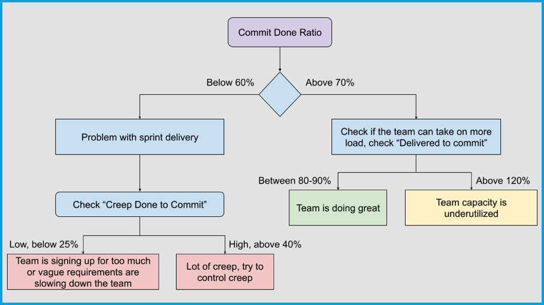
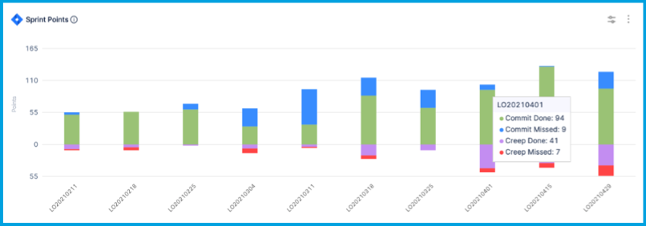
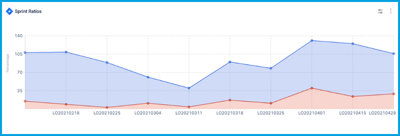

Sprint metrics can help you plan and deliver on sprints more effectively, including backlog grooming and story hygiene. These metrics can help you address business problems like:

* Do teams consistently deliver on sprint plans? If not, why?
* What is the impact of creep or un-estimated tickets on plans?
* Are teams overburdened or underutilized by the sprint plans?

## Sprint metrics use cases

These examples show how you can use sprint metrics to measure team performance.

### Measure team performance in recent sprints

Use the [commit done ratio](#commit-done-ratio) to check the team's performance on recent sprint plans. Compute this metric as an average over the last 2 months or 6 sprints.

If the average commit done ratio over a long period of time is above 70 percent, then the team is executing sprint plans well and could potentially take on more load. If the total [done to commit ratio](#done-to-commit-ratio) is above 120 percent, then the sprint plans aren't making full use of the team's capacity.

A commit done ratio below 60 percent indicates poor performance on sprint plans and room for improvement in sprint delivery. There are several reasons a team might perform poorly on sprint plans. Check for:

* The impact of creep and context switching on sprint plans. Check the [creep to commit ratio](#creep-to-commit-ratio) and the [creep done to commit ratio](#creep-done-to-commit-ratio). Creep that is consistently above 40 percent could have an impact on sprint deliverables.
* Vague requirements that cause rework and impact sprint delivery. Use an [Issue Hygiene Report](../quality-metrics-reports/quality-metrics.md#issue-hygiene-reports) to check the sprint's Hygiene Score.
* If none of the above apply, then the team may be consistently planning for more than they can deliver.

Here is a flow chart illustrating the use of sprint metrics for performance analysis:

<!--  -->

<docimage path={require('../static/diagram-sprint-metrics.png')} />

### Analyze sprint performance

This example analyzes team performance over a sprint, as represented by the following JIRA sprint report:

| Ticket ID | Points | Status      | Notes                        |
| --------- | ------ | ----------- | ---------------------------- |
| LO-1      | 2      | Done        | Completed in the sprint      |
| LO-2      | 1 -> 2 | Done        | Points changed from 1 to 2 mid-sprint, completed in the sprint |
| LO-3      | 5      | Done        | Creep, completed in the sprint |
| LO-4      | 5      | In Progress | Not completed                |
| LO-5      | 1      | In Progress | Creep, not completed         |
| LO-6      | 1      | Done        | Completed outside the sprint |
| LO-7      | 1      | To Do       | Removed from sprint          |

The following table represents how the above JIRA sprint report is interpreted by SEI:

| Issue | Status | [Commit points](#commit-points) | [Commit done points](#commit-done-points) | [Delivered points](#sprint-velocity-delivered-points) | [Creep points](#creep-points) | [Creep done points](#creep-done-points) |
| ----- | ------ | ------------------------------- | ----------------------------------------- | ----------------------------------- | ----------------------------- | --------------------------------------- |
| LO-1    | Done        | 2             | 2                  | 2                | -            | -                 |
| LO-2    | Done        | 1             | 2                  | 2                | -            | -                 |
| LO-3    | Done        | -             | -                  | 5                | 5            | 5                 |
| LO-4    | In Progress | 5             | -                  | -                | -            | -                 |
| LO-5    | In Progress | -             | -                  | -                | 1            | -                 |
| LO-6    | Done        | 1             | 1                  | 1                | -            | -                 |
| LO-7    | To Do       | 1             | -                  | -                | -            | -                 |
| Total   | -           | 10            | 5                  | 10               | 6            | 5                 |

SEI uses the above points values to calculate sprint metrics ratios, generating the following sprint performance analysis:

| Metric | Value | Analysis |
| ------ | ----- | -------- |
| [Commit done ratio](#commit-done-ratio) | `5/10 = 50%` | Indicates poor performance on the plan. |
| [Done/Delivered to commit ratio](#done-to-commit-ratio) | `10/10 = 100%` | Indicates an overall good job delivering on commitments. |
| [Creep to commit ratio](#creep-to-commit-ratio) | `6/10 = 60%` | Indicates too much creep in the plan. |
| [Creep done to commit ratio](#creep-done-to-commit-ratio) | `5/10 = 50%` | Poor performance on the plan is explained by creep. |

### Use historical metrics for sprint prediction and performance assessment

You can use historical cycle time data and key metrics to evaluate a team's performance, predict the number of items that can be completed in the next sprint, enhance sprint planning, and improve overall efficiency.

Use [Sprint Metrics Single Stat widgets](#sprint-metrics-single-stat) to present [sprint metrics](#sprint-metrics) or [sprint metrics ratios](#sprint-metrics-ratios) on your Insights, such as the [done to commit ratio](#done-to-commit-ratio), [scope creep (unplanned work) ratio](#scope-creep-ratio), [sprint velocity](#sprint-velocity-delivered-points), or [creep to commit ratio](#creep-to-commit-ratio).

After configuring the widgets, use the provided statistics to estimate the number of items for the next sprint, evaluate performance, and identify trends.

## Sprint metrics reports

Use sprint metrics reports to analyze sprint and planning metrics.

:::tip

You can use the **Sprint End Date** time range filter to limit data to the last few sprints. It is recommended to observe sprint metrics over 2 months or 6 sprints.

You can use the **Sprint Report** field to limit data to a selected _sprint stream_ or sprint names with a common prefix.

:::

### Sprint Metrics Trend Report

The **Sprint Metrics Trend Report** is recommended for visualizing a time series trend of sprint metrics, like [commit done points](#commit-done-points), [creep points](#creep-points), or [commit points](#commit-points).

<figure>



<figcaption>Sprint Metrics Trend Report</figcaption>
</figure>

### Sprint Metrics Percentage Trend Report

Use the **Sprint Metrics Percentage Trend Report** to examine a time series trend of selected [sprint metrics ratios](#sprint-metrics-ratios). This report is recommended for visualizing changes in the [commit done ratio](#commit-done-ratio), [done to commit ratio](#done-to-commit-ratio), and [creep to commit ratio](#creep-to-commit-ratio).

<figure>



<figcaption>Sprint Metrics Percentage Trend Report</figcaption>
</figure>

### Sprint Metrics Single Stat

The **Sprint Metrics Single Stat** widget presents a single sprint metric averaged over the selected time interval.

<figure>


<figcaption>Sprint Metrics Single Stat</figcaption>
</figure>

For example, the **Sprint Metrics Single Stat** widget can help you [use historical metrics for sprint prediction and performance assessment](#use-historical-metrics-for-sprint-prediction-and-performance-assessment).

#### Sprint Metrics Single Stat configuration options

* **Metric Selection:** Select the [sprint metric](#sprint-metrics) or [sprint metrics ratio](#sprint-metrics-ratios) that you want to show on this widget.
* **Ideal Range:** Define ideal ranges for metrics such as velocity points, commit ratios, and more. You can set upper and lower bounds to indicate acceptable performance ranges.
* **Sprint Creep Grace Period:** Define a grace period during which any additional work or changes introduced at the beginning of the sprint are considered part of the original commitment rather than creep.
* **Additional Done Statuses:** Specify additional ticket statuses that you want to consider equivalent to **Done** for the purpose of metrics calculation.
* **Issue Management System:** Select the issue management system from which to pull data for the widget. Available systems depend on your configured [integrations](/docs/category/integrations).

### Other sprint metrics reports

* **Sprint Impact of Unestimated Tickets Report**
* **Sprint Goal Report**
* **Sprint Distribution Retrospective Report**

## Sprint metrics

Sprint metrics measure points and tickets in a sprint. This includes work that was planned (committed), completed (done/delivered), incomplete (missed), or added after the sprint started (creep).

Sprint work is typically measured in story points, which are a relative estimation unit used to gauge the complexity and effort required for a task. Point can represent expected level of effort, complexity, or value of tickets.

:::info

Sprint metrics are not supported for sub-tasks.

:::

### Average ticket size per sprint

The **average ticket size per sprint** is the average point value assigned to tickets (tasks, user stories, bugs, and so on) completed in a sprint. It helps you understand the typical workload for the team in terms of point value (or expected effort).

### Commit points

**Commit points** is the number of story points a team planned to deliver at the beginning of the sprint. It is the sum of story points for all the tickets in the sprint backlog at the sprint start time.

For example:

* An un-estimated task at the beginning of a sprint: Adds 0 commit points.
* A task estimated as 2 story points: Adds 2 commit points.
* A task estimated as 2 points at the beginning of the sprint and later revised to 5 points during the sprint: Adds 2 commit points.
* A task estimated at 1 point is removed from the sprint while the sprint is in progress: Adds 1 commit point.
* A task estimated at 2 points is completed before the sprint start time and then added to the sprint: Adds 2 commit points and 2 [commit done points](#commit-done).

### Commit tickets

**Commit tickets** is the total number of individual work items committed to a sprint.

### Commit done points

**Commit done points** is the sum of story points for all committed *and completed* tickets in the sprint backlog at the end of the sprint.

For example:

* A completed a task estimated as 2 points: Adds 2 commit done points.
* A completed a task estimated as 3 points at the beginning of the sprint and later revised to 1 point during the sprint: Adds 1 commit done point.
* A task estimated at 1 point is removed from the sprint but still completed while the sprint was in progress: Adds 1 [commit point](#commit-points) and 1 commit done point.

### Commit done tickets

**Commit done tickets** is the total number of individual work items (tickets) that were committed and completed in a sprint.

### Commit missed points

**Commit missed points** (or **missed points**) is the sum of story points for all planned tasks that weren't completed by the end of the sprint.

### Commit missed tickets

**Commit missed tickets** (or **missed tickets**) is the total number of individual work items (tickets) that were committed but not completed in a sprint.

### Creep points

**Creep points** is the sum of points for tickets added to the sprint after the sprint started.

For example:

* An unestimated ticket added in the middle of the sprint: Adds 0 creep points.
* A ticket estimated at 2 points added in the middle of the sprint: Adds 2 creep points.
* A ticket estimated at 2 points added in the middle of the sprint and later revised to 5 points during the sprint: Adds 5 creep points.

### Creep tickets

A creep ticket is a ticket added to a sprint after the sprint starts. The **creep tickets** metric is the total number of individual work items added to a sprint after the sprint started.

### Creep done points

**Creep done points** is the sum of story points for all [creep tickets](#creep-tickets) that were completed in the sprint.

### Creep done tickets

**Creep done tickets** is the total number of individual work items (tickets) that were added after the sprint started *and* completed within the sprint.

### Creep missed points

**Creep missed points** is the sum of story points for all additional tasks that weren't completed by the end of the sprint. This represents work that was added after the sprint started and wasn't finished by the end of the sprint.

### Creep missed tickets

**Creep missed tickets** is the total number of individual work items (tickets) that were added after the sprint started *and not* completed by the end of the sprint.

### Done tickets

**Done tickets** is the total number of individual work items (tickets) that were marked as done (or an equivalent completed status) before the end of the sprint.

### Sprint velocity (delivered points)

Sprint velocity is a crucial metric for teams and organizations. By quantifying the amount of work a team completes during a sprint, you can:

* Measures a team's productivity.
* Predict future capacity for realistic sprint planning.
* Support continuous improvement by refining estimation processes.
* Accurately allocate resources based on team performance.
* Prevent overcommitments in sprint planning.
* Understand how teams should adapt and strategize in response to changing conditions.

**Sprint velocity**, also called *delivered points* or *velocity points*, is the sum of story points completed within a sprint.

Sprint velocity is calculated as the sum of [commit done points](#commit-done-points) and [creep done points](#creep-done-points), based on the number of story points assigned to completed tickets when the sprint ends.

```
Sprint velocity = Commit done points + Creep done points
```

The **velocity points STDEV** is the standard deviation of sprint velocity points. It represents the variability in a team's productivity over multiple sprints.

## Sprint metrics ratios

These ratios are calculated from sprint metrics.

### Commit done ratio

The **commit done ratio** is calculated by dividing **commit done points** by **commit points**. It is the ratio of completed points to committed points, and it indicates how well the team is meeting their commitments in terms of work effort. You can use this ratio to [measure team performance in recent sprints](#measure-team-performance-in-recent-sprints).

The **commit done ratio STDEV** is the standard deviation of the **commit done ratio**. It represents the variability in commit done ratios over multiple sprints.

### Commit missed ratio

The **commit missed ratio** is the ratio of incomplete points compared to committed points. It highlights the extent to which sprint commitments were not met. The calculation is:

`Commit missed ratio = MAX(0, 1 - Commit done ratio)`

### Creep done ratio

The **creep done ratio** is calculated by dividing **creep done points** by **creep points**. It is the ratio of creep points of completed compared to the total creep points committed. It represents how well the team completes additional work that was not in the original sprint plan (scope creep).

### Creep done to commit ratio

The **creep done to commit ratio** is calculated by dividing **creep done points** by **commit points**. It is the ratio of creep points completed compared with the original commitment at the beginning of the sprint.

### Creep missed ratio

The **creep missed ratio** is the ratio of incomplete creep points compared to total committed creep points. It highlights the extent to which creep commitments were not met. The calculation is:

`Creep missed ratio = MAX(0, 1 - Creep done ratio)`

### Creep to commit ratio

Use the **creep to commit ratio** ratio to compare unplanned work (known as *creep*) added to a sprint to the original commitment made at the beginning of the sprint. This ratio is calculated by dividing **creep points** by **commit points**, and it helps you understand the impact of unplanned work on sprint commitments and overall capacity.

`Creep to commit ratio = (Unplanned points added to sprint after start) / (Committed points at the beginning of the sprint)`

Ideally, this ratio should be below 20%. Higher ratios can indicate that unplanned work is ineffectively managed. Use these benchmarks to analyze your creep to commit ratios:

* **Low (below 20%):** A low ratio indicates that a team is generally successful in managing unplanned work. The majority of the work completed aligns with the initial sprint commitment and unplanned work is minimized.
* **Moderate (20% to 40%):** A moderate ratio suggests that some unplanned work has been introduced, but it is still within acceptable limits. The team is accommodating some level of unplanned work without compromising their main commitments.
* **High (above 40%):** A high ratio indicates that a significant portion of the work completed during the sprint was unplanned. This can signal challenges in managing unplanned work or ineffective sprint planning, potentially leading to difficulties in meeting planned commitments.

The **creep to commit ratio STDEV** is the standard deviation of the **creep to commit ratio**. It represents the variability in creep to commit ratios over multiple sprints.

### Delivered to commit ratio

The **delivered to commit ratio** is calculated by dividing **delivered points** by **commit points**. It is the ratio of points delivered (completed) to the points committed for the sprint.

The **delivered to commit ratio STDEV** is the standard deviation of the **delivered to commit ratio**. It represents the variability in delivered points to commit points over multiple sprints.

### Done to commit ratio

Use the **done to commit ratio** to assess a team's ability to meet their commitments and effectively manage their workload within a sprint. By comparing total completed work to the initial sprint commitment, this ratio provides insight into the alignment of a team's actual capacity with planned commitments for a sprint. It is calculated by dividing the **delivered points** by the **commit points**.

`Done to commit ratio = (Points completed at sprint end) / (Points committed at sprint start)`

Use these benchmarks to analyze your done to commit ratios:

* **Balanced (around 80%):** A ratio around 80% suggests that a team is challenging themselves while remaining realistic about what can be achieved within a sprint. The team has struck a balance between pushing their capabilities and avoiding overcommitment.
* **Undercommitted (above 95%):** Ratios above 95% indicate that the sprint plan might not be fully leveraging the team's capacity, the team isn't pushing themselves enough, or that their sprint commitments are conservative. This may lead to underutilization of the team's potential.
* **Overcommitted (below 65%):** Ratios below 65% indicate possible overload. Teams might be stretching themselves too thin, and sprint commitments might be unrealistic given the available capacity. Low ratios could lead to reduced quality, burnout, and difficulties in meeting sprint goals.

### Scope creep ratio

Scope creep refers to unplanned work or changes that are introduced to a sprint after initial planning and commitment. These unplanned additions can impact a team's capacity and ability to deliver on their commitments. In this context, *creep* refers to the points associated with unplanned work or changes, and *commit* refers to the planned points that the team committed to deliver during sprint planning.

The **scope creep ratio** provides valuable insights into the impact of unplanned work on the sprint plan and the team's capacity. A high scope creep ratio indicates that a significant portion of the team's effort is being diverted to tasks that were not originally planned for.

It is calculated as the average **creep to commit** ratio for all sprints in the selected duration, excluding sprints with 0% creep.

`Scope creep ratio = (Sum of all creep to commit ratios for all sprints in the specified duration) / (Number of sprints)`

It's important to consider that while zero creep points is a positive outcome that indicates a sprint had no unplanned work,  zero *commit* points is a negative outcome that indicates that no work was committed despite the sprint's existence.
